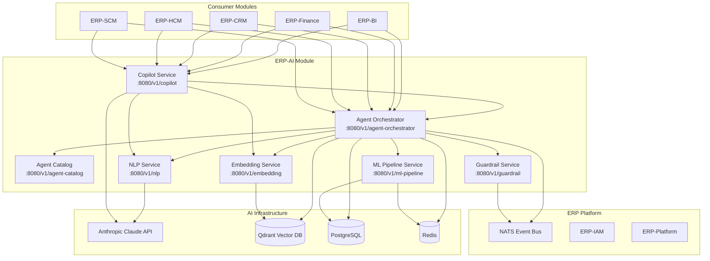

# ERP-AI Product Requirements Document (PRD)

| Field | Value |
|---|---|
| Module | ERP-AI (AI Intelligence Layer) |
| Version | 1.0.0 |
| Status | Approved |
| Owner | AI Product Team |
| Last Updated | 2026-02-23 |

---

## 1. Executive Summary

ERP-AI is the centralized AI Intelligence Layer for the entire ERP platform. It consolidates the former ERP-AI-Agents and AI-Agents repositories into a single, unified module providing agent orchestration, a catalog of 1,500+ specialized agents, natural language processing, machine learning pipelines, embedding/vector search, AI guardrails (AIDD enforcement), and module-embedded copilot capabilities. ERP-AI is benchmarked against Microsoft Copilot, Zoho Zia, SAP Joule, and Salesforce Einstein across every relevant enterprise AI capability dimension.

---

## 2. Problem Statement

Enterprise customers adopting AI across ERP workflows face critical challenges:

- **Fragmented AI**: Each module builds its own AI capabilities, leading to inconsistency and duplication
- **Agent sprawl**: AI agents deployed without lifecycle management, monitoring, or governance
- **Guardrail gaps**: No unified framework for controlling autonomous AI actions in business-critical workflows
- **Integration cost**: External AI services (OpenAI, Claude) integrated independently per module
- **Observability deficit**: No centralized monitoring of AI accuracy, bias, or drift across the platform

ERP-AI eliminates all of these by providing a unified AI intelligence layer that every ERP module consumes.

---

## 3. Competitive Analysis

### 3.1 Feature Comparison Matrix

| Capability | ERP-AI | Microsoft Copilot | Zoho Zia | SAP Joule | Salesforce Einstein |
|---|---|---|---|---|---|
| Agent orchestrator | Full lifecycle | Limited | No | No | No |
| Multi-agent collaboration | Yes (spawn/route/chain/parallelize) | Limited | No | No | No |
| Agent catalog size | 1,500+ across 29 categories | ~50 | ~30 | ~20 | ~40 |
| Agent memory (vector) | Qdrant | Azure AI Search | No | SAP HANA Cloud | Data Cloud |
| Agent versioning | Full (canary, blue-green) | No | No | No | No |
| Intent classification | Custom NLP pipeline | Azure OpenAI | Zia NLP | Joule NLP | Einstein NLP |
| Entity extraction | Multi-model ensemble | GPT-4 | Zia NLP | Joule NLP | Einstein NLP |
| Sentiment analysis | Real-time, per-message | Basic | Yes | Limited | Yes |
| Language support | 100+ (translation) | 40+ | 20+ | 30+ | 20+ |
| Summarization | Document/conversation/thread | Yes | Limited | Yes | Limited |
| Text generation | Claude-powered | GPT-4 | Zia AI | Joule AI | Einstein GPT |
| ML pipeline management | Full (train/eval/deploy/monitor) | Azure ML | Limited | SAP AI Core | Einstein Studio |
| Feature store | Built-in | Azure ML | No | SAP HANA | No |
| Model registry | Versioned with A/B testing | Azure ML | No | SAP AI Core | No |
| Retraining automation | Event-driven + scheduled | Manual | No | Manual | No |
| Vector search | Qdrant (document/code/image) | Azure AI Search | No | SAP HANA | Data Cloud |
| RAG (Retrieval-Augmented Gen) | Built-in | Yes | No | Yes | Yes |
| Semantic search | Multi-modal | Yes | Basic | Yes | Yes |
| AIDD enforcement | Full (autonomous/supervised/prohibited) | No | No | No | No |
| Human-in-the-loop | Configurable per action type | Limited | No | Limited | Limited |
| Bias detection | Real-time monitoring | Responsible AI | No | SAP AI Ethics | Einstein Trust |
| Fairness monitoring | Continuous | Dashboard | No | No | No |
| Explainability (XAI) | Per-prediction | Limited | No | Limited | Limited |
| Compliance audit trail | 7-year retention | Azure audit | No | SAP audit | Salesforce audit |
| Copilot (inline suggestions) | Every ERP module | Office 365 only | Zoho apps | SAP apps | Salesforce apps |
| Auto-complete | Context-aware | Yes | Basic | Basic | Basic |
| Smart defaults | ML-based | Basic | Basic | No | No |
| Predictive actions | Full pipeline | Limited | Limited | Limited | Limited |
| Anomaly explanations | Natural language | No | No | No | No |
| ERP-native integration | Zero-config | Connector | Native (Zoho) | Native (SAP) | Native (SF) |
| Multi-tenant isolation | Per-tenant agent instances | Per-org | Per-org | Per-tenant | Per-org |
| Open model support | Claude + any model | GPT only | Zia only | Joule only | Einstein only |
| Pricing model | Included in ERP | $30/user/month | Included | Included | $50/user/month |

### 3.2 Key Differentiators

**vs. Microsoft Copilot**: ERP-AI provides 30x more specialized agents (1,500+ vs ~50). Full agent lifecycle management (spawn/route/chain/parallelize/terminate) has no Copilot equivalent. AIDD guardrails with human-in-the-loop are architecturally superior to Copilot's limited content filtering. ERP-AI works across all ERP modules, not just Office.

**vs. Zoho Zia**: ERP-AI provides full ML pipeline management, vector search, agent orchestration, and AIDD guardrails -- none of which Zia offers. Agent catalog is 50x larger. Language support covers 100+ languages vs 20+.

**vs. SAP Joule**: ERP-AI's agent orchestration with multi-agent collaboration far exceeds Joule's single-agent model. Qdrant vector search outperforms SAP HANA Cloud for embedding workloads. AIDD framework is more comprehensive than SAP AI Ethics. Agent versioning and A/B testing have no Joule equivalent.

**vs. Salesforce Einstein**: ERP-AI provides a feature store, model registry with A/B testing, and bias/fairness monitoring that Einstein lacks. Agent catalog covers 29 business categories vs Einstein's sales/service focus. AIDD guardrails are more granular than Einstein Trust Layer.

---

## 4. User Personas

| Persona | Role | Needs |
|---|---|---|
| **ERP User** | Any module user | Inline suggestions, auto-complete, smart defaults, natural language queries |
| **AI Developer** | Agent/ML developer | Agent creation, model training, pipeline management, debugging |
| **AI Admin** | Platform administrator | Agent catalog management, guardrails configuration, monitoring |
| **Business Analyst** | Data analyst | NLP queries, sentiment analysis, trend detection, summarization |
| **Compliance Officer** | Risk/compliance | AIDD audit trail, bias reports, fairness monitoring, explainability |

---

## 5. Core Services Architecture

---

## 6. Functional Requirements

### 6.1 Agent Orchestrator (FR-ORCH)

| ID | Requirement | Priority |
|---|---|---|
| FR-ORCH-01 | Agent lifecycle: spawn, route, chain, parallelize, terminate | P0 |
| FR-ORCH-02 | Multi-agent collaboration with message passing | P0 |
| FR-ORCH-03 | Agent memory via Qdrant (short-term and long-term) | P0 |
| FR-ORCH-04 | Agent versioning with canary and blue-green deployment | P1 |
| FR-ORCH-05 | Agent health monitoring and auto-restart | P0 |
| FR-ORCH-06 | Performance metrics per agent (latency, success, cost) | P0 |
| FR-ORCH-07 | Agent chain DAG execution with error handling | P0 |
| FR-ORCH-08 | Parallel agent execution with result aggregation | P1 |

### 6.2 Agent Catalog (FR-CAT)

| ID | Requirement | Priority |
|---|---|---|
| FR-CAT-01 | Catalog of 1,500+ agents across 29 business categories | P0 |
| FR-CAT-02 | Discovery by capability, domain, and task | P0 |
| FR-CAT-03 | Agent health monitoring dashboard | P0 |
| FR-CAT-04 | Performance metrics per agent | P0 |
| FR-CAT-05 | Agent marketplace for custom agents | P2 |

### 6.3 NLP Service (FR-NLP)

| ID | Requirement | Priority |
|---|---|---|
| FR-NLP-01 | Intent classification with confidence scoring | P0 |
| FR-NLP-02 | Named entity extraction (custom + standard) | P0 |
| FR-NLP-03 | Sentiment analysis (per-message and aggregate) | P0 |
| FR-NLP-04 | Language detection (100+ languages) | P0 |
| FR-NLP-05 | Translation (100+ language pairs) | P1 |
| FR-NLP-06 | Text summarization (document, conversation, thread) | P0 |
| FR-NLP-07 | Text generation via Claude | P0 |

### 6.4 ML Pipeline (FR-ML)

| ID | Requirement | Priority |
|---|---|---|
| FR-ML-01 | Model training with configurable hyperparameters | P0 |
| FR-ML-02 | Model evaluation with standard metrics | P0 |
| FR-ML-03 | Model deployment (shadow, canary, full) | P0 |
| FR-ML-04 | Model monitoring (accuracy, drift, latency) | P0 |
| FR-ML-05 | Automated retraining (scheduled + event-driven) | P1 |
| FR-ML-06 | Feature store with versioning | P1 |
| FR-ML-07 | Model registry with A/B testing | P0 |

### 6.5 Embedding Service (FR-EMB)

| ID | Requirement | Priority |
|---|---|---|
| FR-EMB-01 | Vector generation for documents, code, and images | P0 |
| FR-EMB-02 | Qdrant vector storage and indexing | P0 |
| FR-EMB-03 | Semantic search with relevance scoring | P0 |
| FR-EMB-04 | RAG pipeline (retrieve + augment + generate) | P0 |
| FR-EMB-05 | Multi-modal embedding support | P2 |

### 6.6 Guardrail Service (FR-GUARD)

| ID | Requirement | Priority |
|---|---|---|
| FR-GUARD-01 | AIDD policy evaluation per action | P0 |
| FR-GUARD-02 | Action classification: autonomous/supervised/prohibited | P0 |
| FR-GUARD-03 | Human-in-the-loop workflow for supervised actions | P0 |
| FR-GUARD-04 | Bias detection across model outputs | P0 |
| FR-GUARD-05 | Fairness monitoring with demographic parity | P1 |
| FR-GUARD-06 | Explainability reports per prediction | P1 |
| FR-GUARD-07 | Compliance audit trail with 7-year retention | P0 |

### 6.7 Copilot Service (FR-COP)

| ID | Requirement | Priority |
|---|---|---|
| FR-COP-01 | Inline suggestions in every ERP module | P0 |
| FR-COP-02 | Context-aware auto-complete | P0 |
| FR-COP-03 | Smart defaults based on historical patterns | P0 |
| FR-COP-04 | Predictive actions (next-best-action) | P1 |
| FR-COP-05 | Anomaly explanations in natural language | P1 |

---

## 7. Non-Functional Requirements

| Category | Requirement | Target |
|---|---|---|
| Performance | Copilot suggestion latency | < 500ms (p95) |
| Performance | NLP intent classification | < 100ms (p95) |
| Performance | Agent spawn time | < 2 seconds |
| Performance | Vector search | < 50ms (p95) |
| Availability | Uptime SLA | 99.95% |
| Scalability | Concurrent agents | 10,000+ |
| Scalability | Embeddings stored | 100M+ vectors |
| Security | Model isolation | Per-tenant |
| Compliance | AIDD audit retention | 7 years |

---

## 8. Success Metrics

| Metric | Target |
|---|---|
| Copilot adoption | > 70% of ERP users using copilot within 90 days |
| NLP accuracy (intent) | > 95% |
| Agent success rate | > 99% |
| AIDD compliance rate | 100% of AI actions classified |
| Model accuracy (average) | > 90% |
| User satisfaction (CSAT) | > 4.5/5 |

---

## 9. Dependencies

- **ERP-Platform**: Entitlements, tenant management
- **ERP-IAM**: Authentication, authorization
- **Anthropic Claude**: LLM backbone for NLP, copilot, text generation
- **Qdrant**: Vector database for embeddings and agent memory
- **NATS**: Event backbone for agent coordination and audit
- **PostgreSQL**: Metadata, model registry, feature store
- **Redis**: Caching, rate limiting, agent state
- **Kubernetes**: Agent container orchestration
- **Docker**: Agent packaging and isolation
