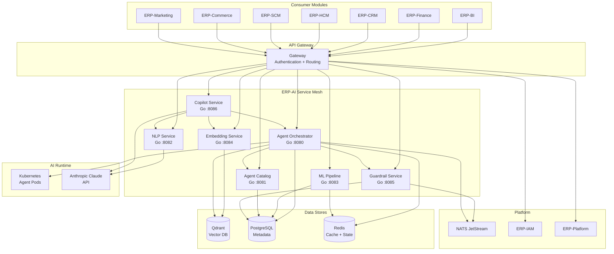
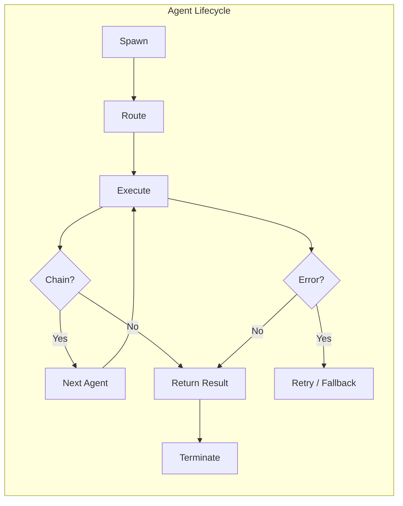
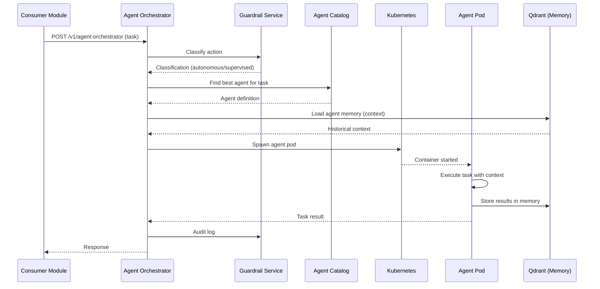
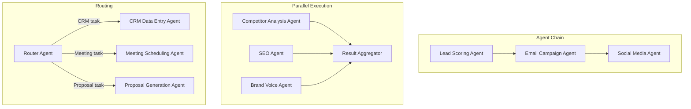
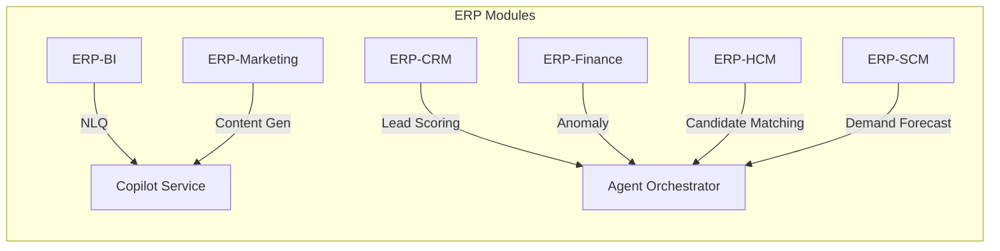
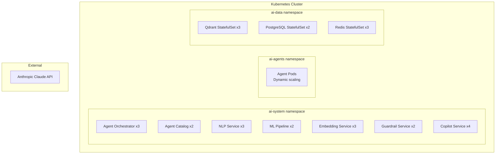

# ERP-AI Architecture Document

| Field | Value |
|---|---|
| Module | ERP-AI (AI Intelligence Layer) |
| Version | 1.0.0 |
| Last Updated | 2026-02-23 |

---

## 1. Architecture Overview

ERP-AI follows a microservices architecture with seven core services, integrating Anthropic Claude as the primary LLM, Qdrant for vector storage, and Kubernetes for agent container orchestration. The module serves as the AI backbone for all ERP modules.

---

## 2. Service Decomposition

### 2.1 Agent Orchestrator

| Attribute | Value |
|---|---|
| Language | Go 1.22 |
| Base Path | `/v1/agent-orchestrator` |
| Port | 8080 |
| Health Check | `/healthz` |
| Event Topics | `erp.ai.agent-orchestrator.*` |

**Responsibilities**: Agent lifecycle management (spawn/route/chain/parallelize/terminate), multi-agent collaboration, DAG execution, agent memory management via Qdrant, agent versioning, health monitoring, performance metrics.

### 2.2 Agent Catalog

| Attribute | Value |
|---|---|
| Language | Go 1.22 |
| Base Path | `/v1/agent-catalog` |
| Port | 8081 |

**Responsibilities**: Agent registration, discovery by capability/domain/task, health dashboard, performance metrics aggregation, category management (29 business categories).

**Agent Categories**: Finance, CRM, HCM, SCM, Commerce, Marketing, Healthcare, Education, Legal, Compliance, Project Management, Customer Support, Sales, Procurement, Manufacturing, Quality, Logistics, Warehouse, IT Operations, Security, Data Analytics, Content, Communication, Scheduling, Document Processing, Risk Assessment, Forecasting, Reporting, Administration.

### 2.3 NLP Service

| Attribute | Value |
|---|---|
| Language | Go 1.22 |
| Base Path | `/v1/nlp` |
| Port | 8082 |

**Responsibilities**: Intent classification, named entity extraction, sentiment analysis, language detection (100+ languages), translation, summarization, text generation via Claude.

### 2.4 ML Pipeline Service

| Attribute | Value |
|---|---|
| Language | Go 1.22 |
| Base Path | `/v1/ml-pipeline` |
| Port | 8083 |

**Responsibilities**: Model training orchestration, evaluation (precision/recall/F1/AUC), deployment (shadow/canary/full), monitoring (accuracy/drift/latency), automated retraining, feature store, model registry with A/B testing.

### 2.5 Embedding Service

| Attribute | Value |
|---|---|
| Language | Go 1.22 |
| Base Path | `/v1/embedding` |
| Port | 8084 |

**Responsibilities**: Vector generation (document/code/image), Qdrant index management, semantic search, RAG pipeline, embedding model management.

### 2.6 Guardrail Service

| Attribute | Value |
|---|---|
| Language | Go 1.22 |
| Base Path | `/v1/guardrail` |
| Port | 8085 |

**Responsibilities**: AIDD policy evaluation, action classification (autonomous/supervised/prohibited), human-in-the-loop workflow, bias detection, fairness monitoring, explainability report generation, compliance audit trail.

### 2.7 Copilot Service

| Attribute | Value |
|---|---|
| Language | Go 1.22 |
| Base Path | `/v1/copilot` |
| Port | 8086 |

**Responsibilities**: Module-embedded AI assistance, inline suggestions, context-aware auto-complete, smart defaults, predictive actions (next-best-action), anomaly explanations, conversation management.

---

## 3. Agent Architecture

### 3.1 Agent Execution Model

### 3.2 Multi-Agent Collaboration

---

## 4. Data Architecture

### 4.1 Vector Storage (Qdrant)

| Collection | Content | Dimensions | Index |
|---|---|---|---|
| agent_memory | Agent conversation history | 1536 | HNSW |
| document_embeddings | ERP document vectors | 1536 | HNSW |
| code_embeddings | Source code vectors | 768 | HNSW |
| image_embeddings | Image/diagram vectors | 512 | HNSW |

### 4.2 PostgreSQL Schema

| Table | Purpose |
|---|---|
| agents | Agent definitions and metadata |
| agent_versions | Version history per agent |
| agent_executions | Execution log with metrics |
| models | ML model registry |
| model_versions | Model version history |
| model_metrics | Training/evaluation metrics |
| features | Feature store definitions |
| feature_values | Feature value snapshots |
| guardrail_policies | AIDD policy definitions |
| audit_log | Compliance audit trail |

---

## 5. Integration Architecture

---

## 6. Deployment Architecture

---

## 7. Security Architecture

| Layer | Mechanism |
|---|---|
| Authentication | JWT from ERP-IAM, X-Tenant-ID |
| Authorization | RBAC per agent category |
| Agent isolation | Per-tenant Kubernetes namespaces |
| Model isolation | Separate model artifacts per tenant |
| Data isolation | Qdrant collection partitioning |
| LLM safety | Guardrail Service pre/post filtering |
| Audit | Full trail via NATS events |
| Compliance | AIDD guardrails enforcement |
