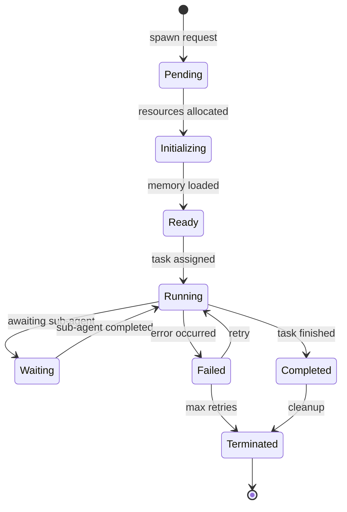
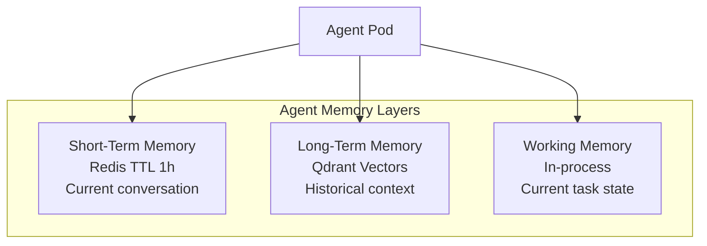
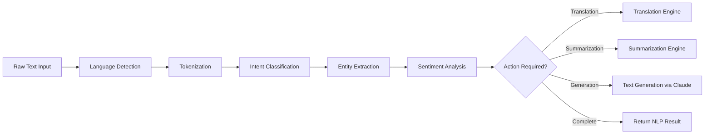
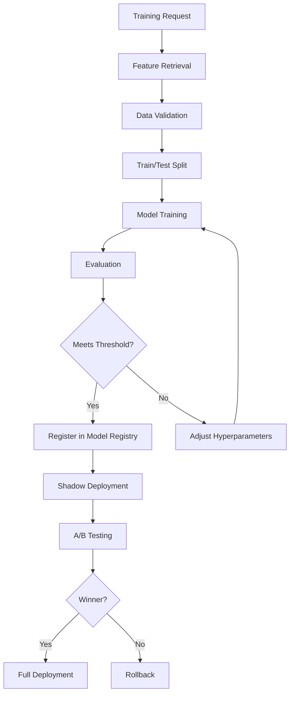
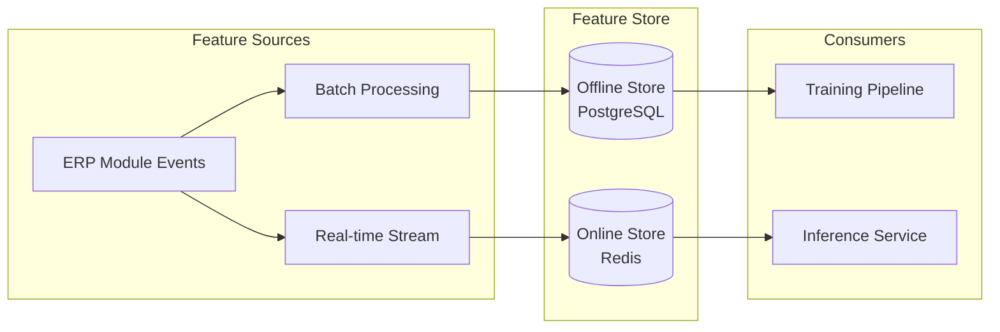
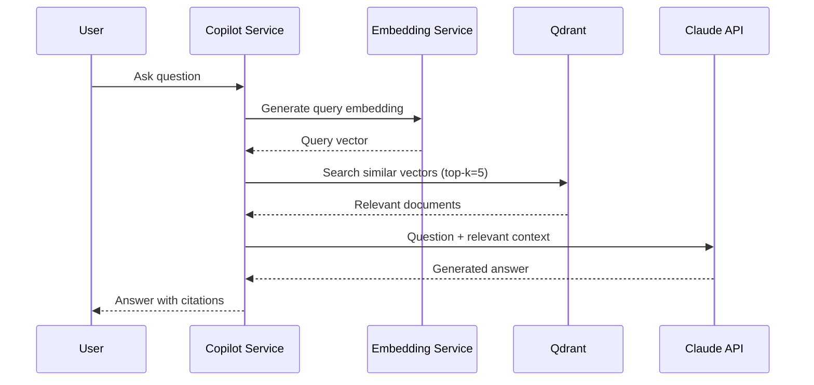
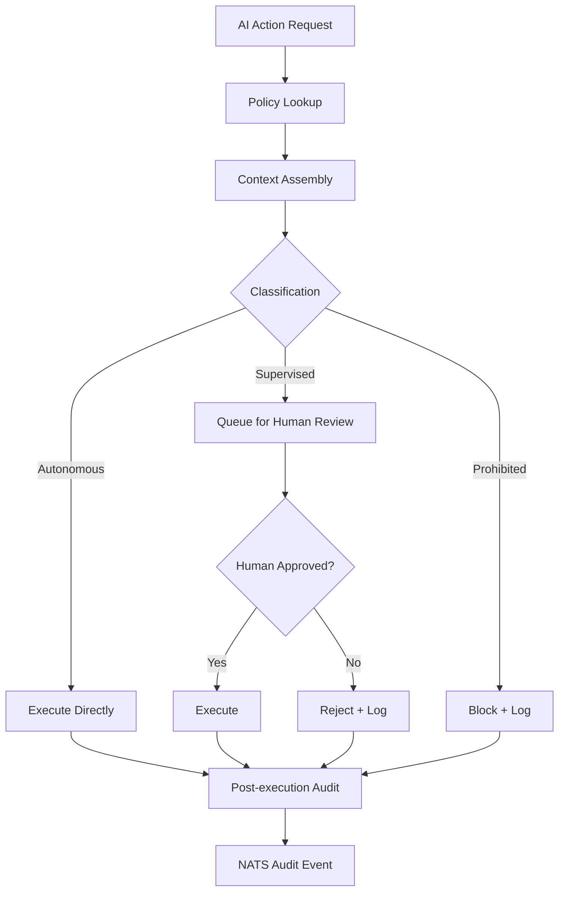

# ERP-AI Technical Design Document

| Field | Value |
|---|---|
| Module | ERP-AI |
| Version | 1.0.0 |
| Last Updated | 2026-02-23 |

---

## 1. Agent Orchestrator Design

### 1.1 Agent Lifecycle State Machine



### 1.2 DAG Execution Engine

Agent chains are defined as Directed Acyclic Graphs (DAGs):

```typescript
interface AgentDAG {
  id: string;
  nodes: AgentNode[];
  edges: AgentEdge[];
  errorPolicy: 'fail_fast' | 'continue' | 'retry';
  timeout: number;
}

interface AgentNode {
  id: string;
  agentId: string;
  version: string;
  input: Record<string, any>;
  timeout: number;
  retryPolicy: { maxRetries: number; backoff: 'exponential' | 'linear' };
}

interface AgentEdge {
  from: string;
  to: string;
  condition?: string; // Expression to evaluate
  dataMapping?: Record<string, string>; // Output->Input mapping
}
```

### 1.3 Agent Memory Architecture



---

## 2. NLP Pipeline Design

### 2.1 Processing Pipeline



### 2.2 Intent Classification

Multi-class classification across ERP domains:

| Domain | Example Intents |
|---|---|
| Finance | create_invoice, approve_expense, forecast_revenue |
| CRM | log_interaction, score_lead, schedule_followup |
| HCM | request_leave, submit_timesheet, find_candidate |
| SCM | create_po, check_inventory, track_shipment |
| General | search, summarize, translate, explain |

### 2.3 Entity Extraction

| Entity Type | Examples |
|---|---|
| PERSON | Employee names, customer names |
| ORG | Company names, department names |
| DATE | Absolute/relative dates, ranges |
| MONEY | Currency amounts with codes |
| PRODUCT | Product names, SKUs |
| LOCATION | Addresses, regions, countries |
| CUSTOM | Domain-specific entities per module |

---

## 3. ML Pipeline Design

### 3.1 Training Pipeline



### 3.2 Model Registry Schema

```sql
CREATE TABLE models (
    id UUID PRIMARY KEY,
    name VARCHAR(255) NOT NULL,
    type VARCHAR(50) NOT NULL,  -- classification, regression, embedding, etc.
    domain VARCHAR(50),          -- finance, crm, hcm, etc.
    tenant_id VARCHAR(50),
    created_at TIMESTAMP DEFAULT NOW()
);

CREATE TABLE model_versions (
    id UUID PRIMARY KEY,
    model_id UUID REFERENCES models(id),
    version VARCHAR(20) NOT NULL,
    status VARCHAR(20) DEFAULT 'draft', -- draft, staging, production, archived
    metrics JSONB,           -- {accuracy: 0.95, f1: 0.92, ...}
    hyperparameters JSONB,
    artifact_url VARCHAR(500),
    created_at TIMESTAMP DEFAULT NOW()
);
```

### 3.3 Feature Store Design



---

## 4. Embedding Service Design

### 4.1 RAG Pipeline



### 4.2 Embedding Models

| Content Type | Model | Dimensions | Metric |
|---|---|---|---|
| Documents | text-embedding-3-large | 1536 | Cosine |
| Code | code-search-ada-002 | 768 | Cosine |
| Images | CLIP ViT-L/14 | 512 | Cosine |

---

## 5. Guardrail Service Design

### 5.1 Policy Evaluation Engine



### 5.2 Bias Detection

| Metric | Definition | Threshold |
|---|---|---|
| Demographic Parity | P(positive \| group_A) == P(positive \| group_B) | < 0.1 difference |
| Equal Opportunity | True positive rate equal across groups | < 0.05 difference |
| Predictive Parity | Precision equal across groups | < 0.05 difference |
| Disparate Impact | Ratio of selection rates | 0.8 - 1.25 |

---

## 6. Copilot Service Design

### 6.1 Context Assembly


### 6.2 Suggestion Types

| Type | Trigger | Latency Target |
|---|---|---|
| Inline suggestion | Keystroke + 300ms debounce | < 500ms |
| Auto-complete | Field focus | < 200ms |
| Smart default | Form open | < 100ms |
| Next-best-action | Page load | < 1s |
| Anomaly explanation | Anomaly detected | < 2s |

---

## 7. Error Handling

| Error | Service | Handling |
|---|---|---|
| Claude API timeout | NLP, Copilot | Retry 1x, return cached/fallback |
| Qdrant unreachable | Embedding, Orchestrator | Degrade gracefully, skip memory |
| Agent pod crash | Orchestrator | Auto-restart, retry task |
| Model serving failure | ML Pipeline | Fallback to previous version |
| Guardrail service down | All | Default to supervised mode |
