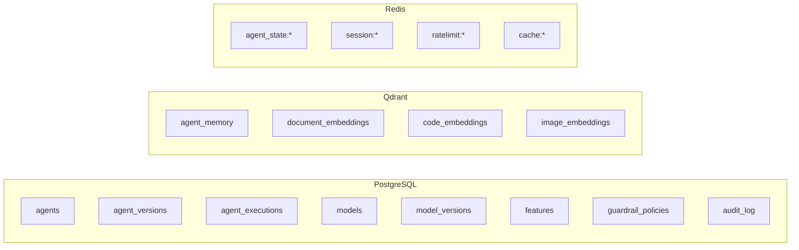
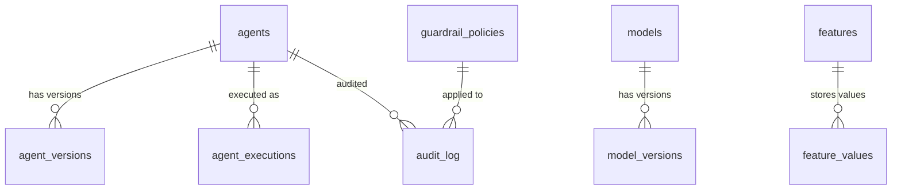

# ERP-AI Database Schema Documentation

| Field | Value |
|---|---|
| Module | ERP-AI |
| Databases | PostgreSQL (metadata), Qdrant (vectors), Redis (cache/state) |
| Last Updated | 2026-02-23 |

---

## 1. Overview

ERP-AI uses a three-database architecture:
- **PostgreSQL**: Agent catalog, model registry, feature store, audit logs, guardrail policies
- **Qdrant**: Vector embeddings for agent memory, document search, semantic search
- **Redis**: Short-term agent memory, caching, rate limiting, real-time state



---

## 2. PostgreSQL Schema

### 2.1 Agent Tables

```sql
CREATE TABLE agents (
    id UUID PRIMARY KEY DEFAULT gen_random_uuid(),
    name VARCHAR(255) NOT NULL,
    domain VARCHAR(50) NOT NULL,
    capabilities TEXT[] NOT NULL,
    runtime VARCHAR(50) DEFAULT 'python:3.11',
    config JSONB DEFAULT '{}',
    status VARCHAR(20) DEFAULT 'active',
    tenant_id VARCHAR(50) NOT NULL,
    created_at TIMESTAMP DEFAULT NOW(),
    updated_at TIMESTAMP DEFAULT NOW()
);

CREATE TABLE agent_versions (
    id UUID PRIMARY KEY DEFAULT gen_random_uuid(),
    agent_id UUID REFERENCES agents(id) ON DELETE CASCADE,
    version VARCHAR(20) NOT NULL,
    changelog TEXT,
    artifact_url VARCHAR(500),
    status VARCHAR(20) DEFAULT 'draft',
    created_at TIMESTAMP DEFAULT NOW(),
    UNIQUE(agent_id, version)
);

CREATE TABLE agent_executions (
    id UUID PRIMARY KEY DEFAULT gen_random_uuid(),
    agent_id UUID REFERENCES agents(id),
    version VARCHAR(20),
    tenant_id VARCHAR(50) NOT NULL,
    status VARCHAR(20) DEFAULT 'pending',
    input JSONB,
    output JSONB,
    error TEXT,
    duration_ms INT,
    tokens_used INT DEFAULT 0,
    cost_usd DECIMAL(10,6) DEFAULT 0,
    started_at TIMESTAMP,
    completed_at TIMESTAMP,
    created_at TIMESTAMP DEFAULT NOW()
);
```

### 2.2 Model Registry Tables

```sql
CREATE TABLE models (
    id UUID PRIMARY KEY DEFAULT gen_random_uuid(),
    name VARCHAR(255) NOT NULL,
    type VARCHAR(50) NOT NULL,
    domain VARCHAR(50),
    description TEXT,
    tenant_id VARCHAR(50) NOT NULL,
    created_at TIMESTAMP DEFAULT NOW()
);

CREATE TABLE model_versions (
    id UUID PRIMARY KEY DEFAULT gen_random_uuid(),
    model_id UUID REFERENCES models(id) ON DELETE CASCADE,
    version VARCHAR(20) NOT NULL,
    status VARCHAR(20) DEFAULT 'draft',
    metrics JSONB,
    hyperparameters JSONB,
    artifact_url VARCHAR(500),
    training_duration_s INT,
    dataset_size INT,
    created_at TIMESTAMP DEFAULT NOW()
);
```

### 2.3 Feature Store Tables

```sql
CREATE TABLE features (
    id UUID PRIMARY KEY DEFAULT gen_random_uuid(),
    name VARCHAR(255) NOT NULL,
    entity_type VARCHAR(50) NOT NULL,
    value_type VARCHAR(20) NOT NULL,
    description TEXT,
    source VARCHAR(100),
    tenant_id VARCHAR(50) NOT NULL,
    created_at TIMESTAMP DEFAULT NOW()
);

CREATE TABLE feature_values (
    id BIGSERIAL PRIMARY KEY,
    feature_id UUID REFERENCES features(id),
    entity_id VARCHAR(100) NOT NULL,
    value JSONB NOT NULL,
    event_time TIMESTAMP NOT NULL,
    created_at TIMESTAMP DEFAULT NOW()
);
```

### 2.4 Guardrail Tables

```sql
CREATE TABLE guardrail_policies (
    id UUID PRIMARY KEY DEFAULT gen_random_uuid(),
    name VARCHAR(255) NOT NULL,
    domain VARCHAR(50),
    rules JSONB NOT NULL,
    priority INT DEFAULT 0,
    tenant_id VARCHAR(50) NOT NULL,
    is_active BOOLEAN DEFAULT true,
    created_at TIMESTAMP DEFAULT NOW()
);

CREATE TABLE audit_log (
    id UUID PRIMARY KEY DEFAULT gen_random_uuid(),
    action VARCHAR(100) NOT NULL,
    classification VARCHAR(20) NOT NULL,
    agent_id UUID,
    user_id VARCHAR(50),
    tenant_id VARCHAR(50) NOT NULL,
    input JSONB,
    output JSONB,
    policy_id UUID REFERENCES guardrail_policies(id),
    approved BOOLEAN,
    approver_id VARCHAR(50),
    created_at TIMESTAMP DEFAULT NOW()
);
```

---

## 3. Qdrant Collections

### 3.1 Agent Memory Collection

```json
{
  "collection_name": "agent_memory",
  "vectors": {
    "size": 1536,
    "distance": "Cosine"
  },
  "payload_schema": {
    "agent_id": "keyword",
    "tenant_id": "keyword",
    "session_id": "keyword",
    "role": "keyword",
    "content": "text",
    "timestamp": "datetime"
  }
}
```

### 3.2 Document Embeddings Collection

```json
{
  "collection_name": "document_embeddings",
  "vectors": {
    "size": 1536,
    "distance": "Cosine"
  },
  "payload_schema": {
    "tenant_id": "keyword",
    "document_id": "keyword",
    "chunk_index": "integer",
    "module": "keyword",
    "content": "text",
    "metadata": "json"
  }
}
```

---

## 4. Entity Relationship Diagram



---

## 5. Redis Key Patterns

| Pattern | Purpose | TTL |
|---|---|---|
| `agent_state:{tenant}:{exec_id}` | Agent execution state | 1 hour |
| `session:{tenant}:{session_id}` | Copilot conversation session | 30 min |
| `ratelimit:{tenant}:{service}` | Rate limit counters | 1 min |
| `cache:{tenant}:{key}` | General cache | 5 min |
| `feature:{tenant}:{entity}:{feature}` | Online feature store | 15 min |
