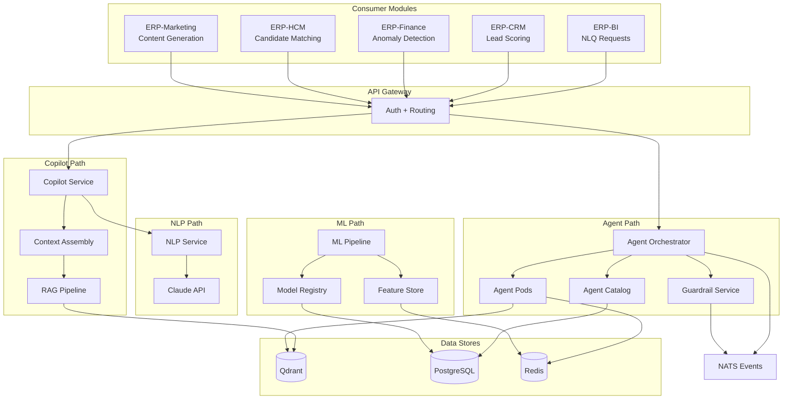
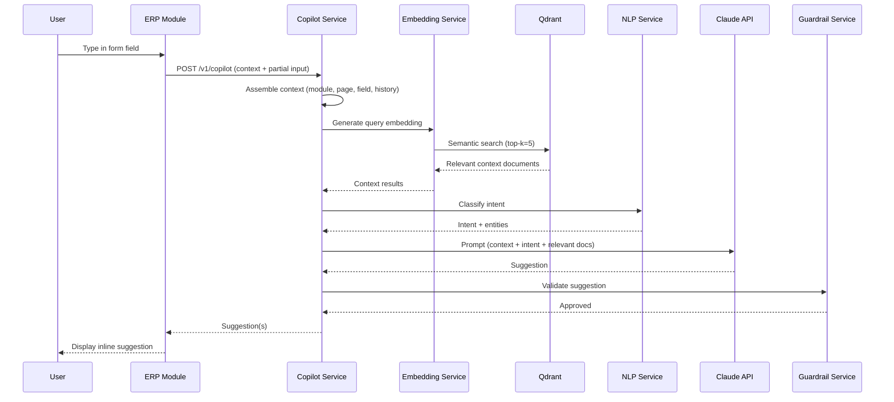
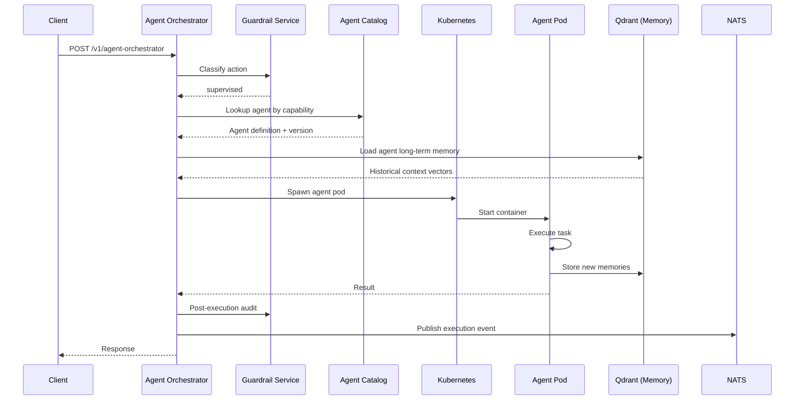
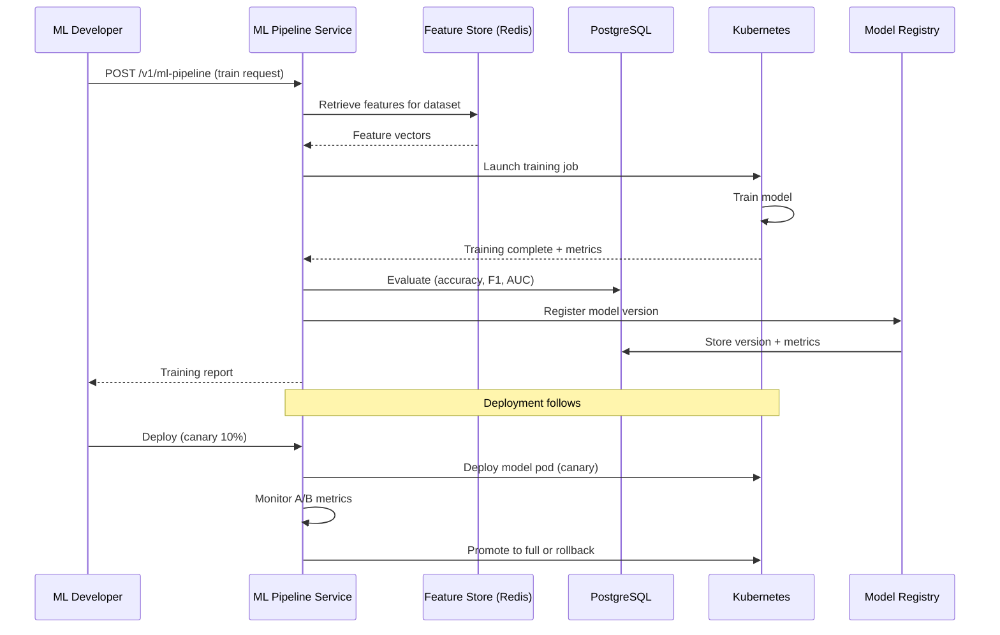
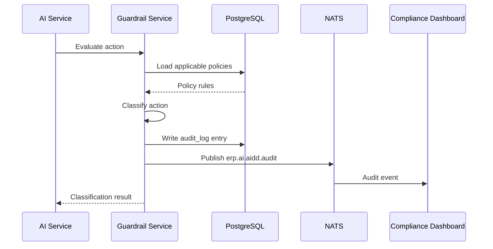
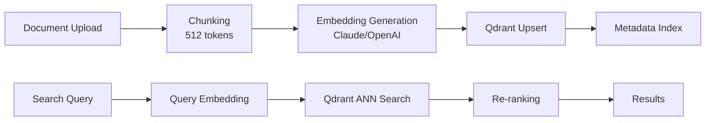

# ERP-AI Data Flow Documentation

| Field | Value |
|---|---|
| Module | ERP-AI |
| Version | 1.0.0 |
| Last Updated | 2026-02-23 |

---

## 1. End-to-End Data Flow

---

## 2. Copilot Request Flow

---

## 3. Agent Execution Flow

---

## 4. ML Training Flow

---

## 5. Guardrail Audit Flow

---

## 6. Embedding Indexing Flow

