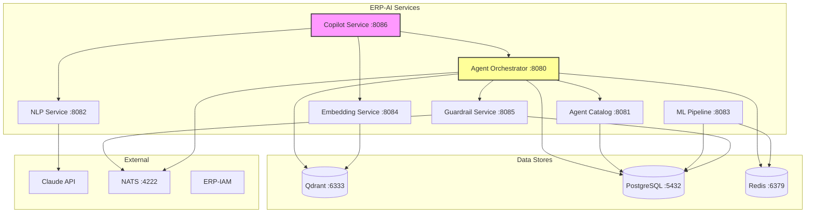

# ERP-AI Service Map

| Field | Value |
|---|---|
| Module | ERP-AI |
| Version | 1.0.0 |
| Last Updated | 2026-02-23 |

---

## 1. Service Registry

| Service | Port | Base Path | Health | Language | Replicas |
|---|---|---|---|---|---|
| agent-orchestrator | 8080 | /v1/agent-orchestrator | /healthz | Go 1.22 | 3 |
| agent-catalog | 8081 | /v1/agent-catalog | /healthz | Go 1.22 | 2 |
| nlp-service | 8082 | /v1/nlp | /healthz | Go 1.22 | 3 |
| ml-pipeline-service | 8083 | /v1/ml-pipeline | /healthz | Go 1.22 | 2 |
| embedding-service | 8084 | /v1/embedding | /healthz | Go 1.22 | 3 |
| guardrail-service | 8085 | /v1/guardrail | /healthz | Go 1.22 | 2 |
| copilot-service | 8086 | /v1/copilot | /healthz | Go 1.22 | 4 |

---

## 2. Service Topology

---

## 3. Inter-Service Communication

| From | To | Protocol | Pattern |
|---|---|---|---|
| Copilot | Agent Orchestrator | HTTP/REST | Synchronous |
| Copilot | NLP Service | HTTP/REST | Synchronous |
| Copilot | Embedding Service | HTTP/REST | Synchronous |
| Copilot | Claude API | HTTPS | Synchronous |
| Agent Orchestrator | Agent Catalog | HTTP/REST | Synchronous |
| Agent Orchestrator | Guardrail Service | HTTP/REST | Synchronous |
| Agent Orchestrator | Qdrant | gRPC | Synchronous |
| Agent Orchestrator | Kubernetes API | HTTPS | Async (pod mgmt) |
| Agent Orchestrator | NATS | NATS protocol | Async (events) |
| ML Pipeline | Kubernetes API | HTTPS | Async (training jobs) |
| Guardrail Service | NATS | NATS protocol | Async (audit) |
| All | ERP-IAM | HTTP/REST | Synchronous (auth) |

---

## 4. Critical Path Analysis

**Copilot Service** is the highest-traffic service (every keystroke in any ERP module). Its critical dependencies:
1. Claude API (latency-sensitive, external)
2. Qdrant (RAG retrieval)
3. NLP Service (intent classification)

**Agent Orchestrator** is the central coordination point. All agent executions flow through it. Its critical dependencies:
1. Guardrail Service (every action must be classified)
2. Kubernetes API (agent pod lifecycle)
3. Qdrant (agent memory)

---

## 5. Failure Domains

| Domain | Services | Impact | Mitigation |
|---|---|---|---|
| Claude API outage | NLP, Copilot | No text generation, degraded NLP | Cache frequent responses, fallback models |
| Qdrant outage | Embedding, Orchestrator | No semantic search, no agent memory | Stateless agent mode, skip RAG |
| PostgreSQL outage | All (metadata) | No agent catalog, no model registry | Read replicas, cache hot data |
| Redis outage | Orchestrator, ML | No short-term memory, no features | Direct PostgreSQL fallback |
| Kubernetes API outage | Orchestrator, ML | No new agent spawns, no training | Queue requests, retry |
