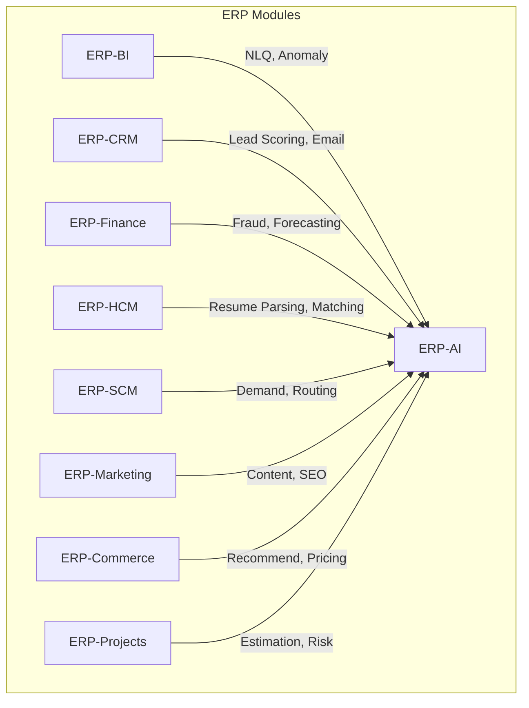

# ERP-AI Integration Guide

| Field | Value |
|---|---|
| Module | ERP-AI |
| Version | 1.0.0 |
| Last Updated | 2026-02-23 |

---

## 1. Overview

ERP-AI is designed as a shared service consumed by every ERP module. This guide covers how modules integrate with each AI capability.

---

## 2. Integration Architecture



---

## 3. Copilot Integration

### 3.1 Embedding the Copilot Widget

Every ERP module embeds the copilot by calling the Copilot Service API:

```typescript
// In any ERP module frontend
const response = await fetch('/ai/v1/copilot', {
  method: 'POST',
  headers: {
    'Authorization': `Bearer ${token}`,
    'X-Tenant-ID': tenantId,
    'Content-Type': 'application/json'
  },
  body: JSON.stringify({
    module: 'erp-finance',
    context: {
      page: 'invoice_form',
      field: 'vendor_name',
      partial_input: userInput,
      form_data: currentFormState
    },
    type: 'autocomplete'
  })
});
```

### 3.2 Suggestion Types by Module

| Module | Suggestion Type | Example |
|---|---|---|
| ERP-Finance | Smart defaults | Auto-fill payment terms based on vendor history |
| ERP-CRM | Next-best-action | "This lead scored 92, suggest scheduling a demo" |
| ERP-HCM | Auto-complete | Employee name, department, job title suggestions |
| ERP-SCM | Predictive | "Based on trends, reorder point for SKU-123 should be 500" |
| ERP-BI | NLQ | "Show me top products by revenue" -> SQL + Chart |
| ERP-Marketing | Content gen | Generate email subject lines, social media posts |

---

## 4. Agent Integration

### 4.1 Triggering an Agent from a Module

```python
# Example: ERP-CRM triggering lead scoring
import httpx

response = httpx.post(
    "https://api.erp.example.com/ai/v1/agent-orchestrator",
    headers={
        "Authorization": f"Bearer {token}",
        "X-Tenant-ID": tenant_id
    },
    json={
        "task": "Score all new leads from campaign XYZ",
        "domain": "crm",
        "agents": ["lead-scoring-agent"],
        "context": {
            "campaign_id": "camp_xyz",
            "scoring_model": "lead_score_v2"
        }
    }
)
```

### 4.2 Agent Categories by Module

| Module | Agent Categories | Example Agents |
|---|---|---|
| CRM | Sales, Customer Support | lead-scoring, email-campaign, meeting-scheduling |
| Finance | Compliance, Risk | invoice-anomaly, expense-approval, fraud-detection |
| HCM | HR, Recruitment | resume-parser, candidate-matcher, onboarding-assistant |
| SCM | Logistics, Procurement | demand-forecast, supplier-evaluation, route-optimizer |
| Marketing | Content, SEO | content-generator, seo-optimizer, brand-voice-checker |
| Commerce | Recommendation | product-recommender, dynamic-pricer, review-analyzer |

---

## 5. NLP Integration

### 5.1 Using NLP from Any Module

```json
POST /ai/v1/nlp
{
  "text": "Customer complaint about delayed shipment order #5678",
  "operations": ["intent", "entities", "sentiment"]
}
```

**Use Cases by Module**:
- **CRM**: Classify support ticket intent, extract customer info
- **HCM**: Parse resume text, extract skills and experience
- **Finance**: Classify invoice descriptions, extract amounts and dates
- **Marketing**: Analyze campaign feedback sentiment

---

## 6. ML Pipeline Integration

### 6.1 Training a Custom Model

Modules can train domain-specific models:

```json
POST /ai/v1/ml-pipeline
{
  "action": "train",
  "model_name": "churn_predictor",
  "type": "classification",
  "domain": "crm",
  "dataset": "crm_customer_features",
  "hyperparameters": {"epochs": 50}
}
```

### 6.2 Inference

```json
POST /ai/v1/ml-pipeline/{model_id}/predict
{
  "features": {
    "days_since_last_purchase": 90,
    "total_purchases": 5,
    "support_tickets": 3
  }
}
```

---

## 7. Module Manifest

```yaml
api_version: v1
module_id: erp_ai
repository: ERP-AI
sku: erp.ai
subscription:
  standalone: true
  suite: true
integration:
  control_plane: ERP-Platform
  identity_provider: ERP-Directory
  event_backbone: NATS
aidd:
  guardrails_file: erp/aidd.guardrails.yaml
```

---

## 8. Capabilities

From `configs/capabilities.json`:
```json
{
  "module": "ERP-AI",
  "capabilities": ["agent_orchestration", "copilot", "nlq", "workflow_automation", "risk_scoring"]
}
```
