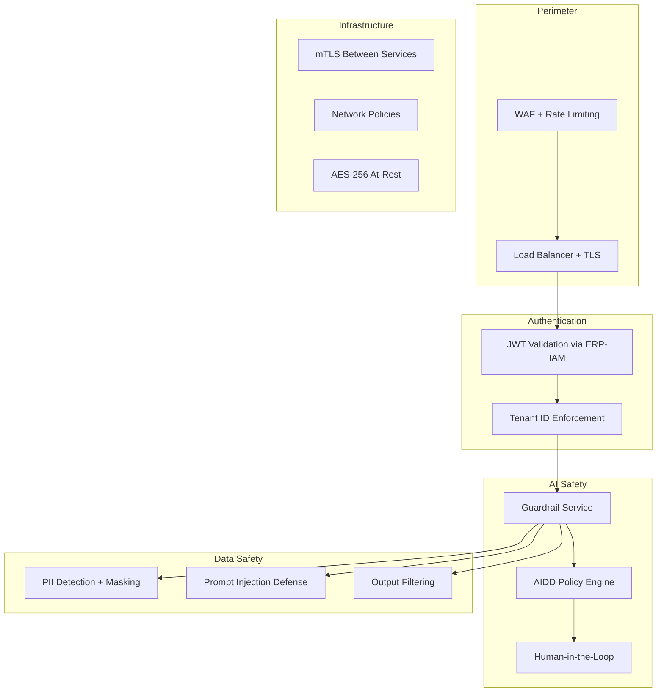
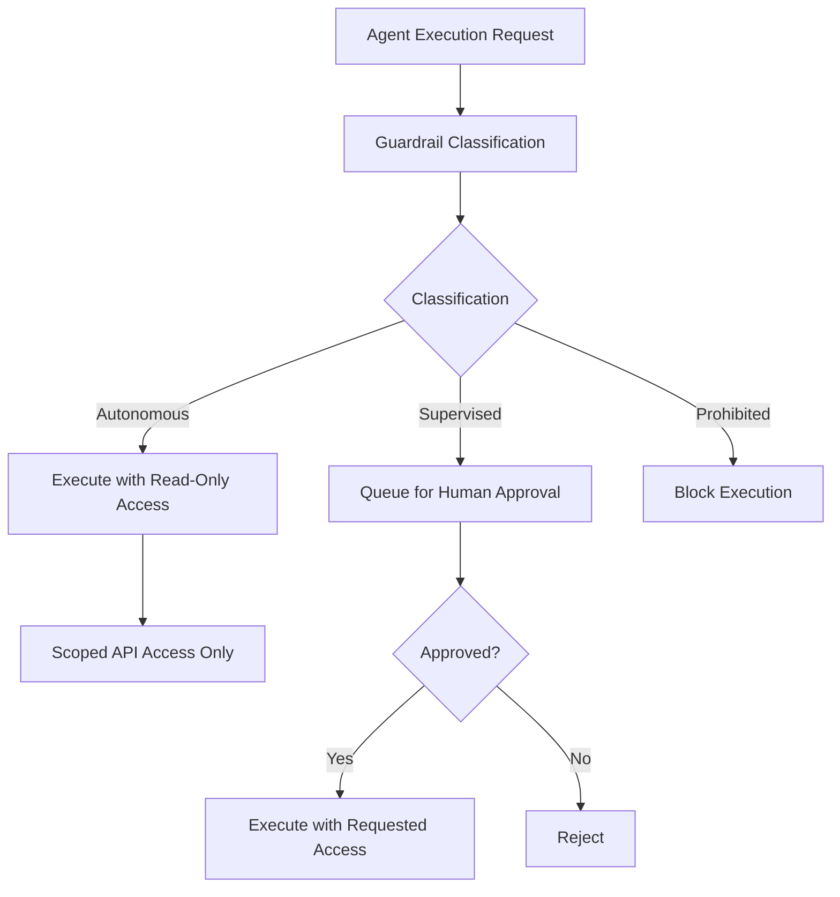

# ERP-AI Security Architecture

| Field | Value |
|---|---|
| Module | ERP-AI |
| Version | 1.0.0 |
| Last Updated | 2026-02-23 |

---

## 1. Security Model Overview



---

## 2. LLM Security

### 2.1 Prompt Injection Prevention
- System prompts are hardcoded, never user-modifiable
- User input is sanitized and placed in designated user message blocks
- Output is validated against expected format before returning
- Content filtering blocks harmful/toxic outputs

### 2.2 PII Protection
- PII is detected and redacted before sending to Claude API
- Redacted PII is re-injected after response generation
- PII patterns: SSN, credit card, email, phone, address

### 2.3 Data Leakage Prevention
- Tenant data never sent to LLM without explicit policy approval
- Cross-tenant context mixing is architecturally impossible
- All LLM interactions logged in audit trail

---

## 3. Agent Security

### 3.1 Agent Isolation
- Each agent runs in its own Kubernetes pod
- Network policies restrict agent-to-agent communication
- Agents only access their designated Qdrant collections
- Agent credentials are injected via Kubernetes secrets

### 3.2 Agent Permissions


---

## 4. Audit Trail

All AI actions are logged with 7-year retention:

```json
{
  "event_type": "erp.ai.aidd.audit",
  "action": "agent_execution",
  "classification": "supervised",
  "agent_id": "lead-scoring-agent",
  "user_id": "user_123",
  "tenant_id": "tenant_001",
  "input_hash": "sha256:abc...",
  "output_hash": "sha256:def...",
  "approved": true,
  "approver_id": "manager_456",
  "duration_ms": 2340,
  "tokens_used": 1500,
  "timestamp": "2026-02-23T10:00:00Z"
}
```

---

## 5. Model Security

| Concern | Mitigation |
|---|---|
| Model theft | Encrypted artifact storage, access logging |
| Training data poisoning | Data validation, provenance tracking |
| Adversarial inputs | Input validation, anomaly detection |
| Model bias | Bias detection, fairness monitoring |
| Model drift | Continuous monitoring, auto-retraining triggers |
