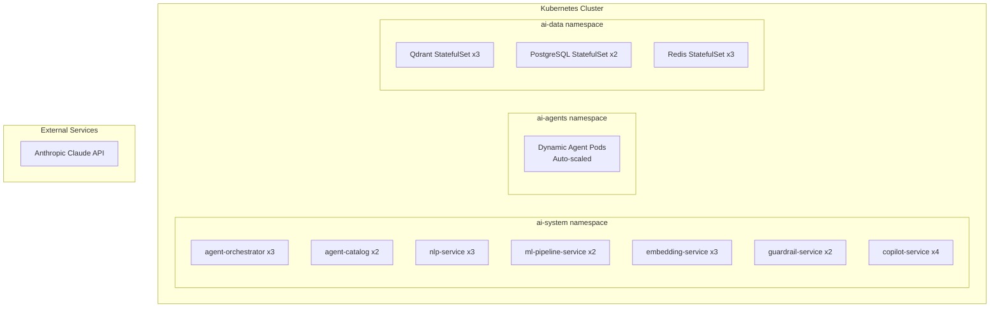
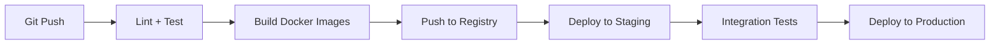

# ERP-AI Deployment Guide

| Field | Value |
|---|---|
| Module | ERP-AI |
| Version | 1.0.0 |
| Last Updated | 2026-02-23 |

---

## 1. Deployment Architecture



---

## 2. Prerequisites

| Component | Version | Purpose |
|---|---|---|
| Kubernetes | >= 1.28 | Container orchestration |
| Go | >= 1.22 | Service runtime |
| Python | >= 3.11 | Agent runtime (legacy agents) |
| Docker | >= 24.0 | Container builds |
| Qdrant | >= 1.8 | Vector database |
| PostgreSQL | >= 16 | Metadata store |
| Redis | >= 7.2 | Cache and state |
| NATS | >= 2.10 | Event backbone |

---

## 3. Environment Variables

| Variable | Service | Required | Description |
|---|---|---|---|
| PORT | All | No | Service port (default: 8080) |
| MODULE_NAME | All | No | Module identifier (default: ERP-AI) |
| ANTHROPIC_API_KEY | NLP, Copilot | Yes | Claude API key |
| QDRANT_URL | Embedding, Orchestrator | Yes | Qdrant connection URL |
| DATABASE_URL | All | Yes | PostgreSQL connection string |
| REDIS_URL | Orchestrator, ML | Yes | Redis connection URL |
| NATS_URL | Orchestrator, Guardrail | Yes | NATS connection URL |
| IAM_URL | All | Yes | ERP-IAM base URL |

---

## 4. Docker Build

```bash
# Build services
for svc in agent-orchestrator agent-catalog nlp-service ml-pipeline-service embedding-service guardrail-service copilot-service; do
  docker build -t erp-ai/$svc:latest -f services/$svc/Dockerfile .
done
```

---

## 5. Kubernetes Deployment

### 5.1 Namespace Setup
```bash
kubectl create namespace ai-system
kubectl create namespace ai-agents
kubectl create namespace ai-data
```

### 5.2 Resource Configuration

```yaml
copilotService:
  replicas: 4
  resources:
    requests: {cpu: 1000m, memory: 2Gi}
    limits: {cpu: 4000m, memory: 8Gi}

agentOrchestrator:
  replicas: 3
  resources:
    requests: {cpu: 500m, memory: 1Gi}
    limits: {cpu: 2000m, memory: 4Gi}

nlpService:
  replicas: 3
  resources:
    requests: {cpu: 500m, memory: 1Gi}
    limits: {cpu: 2000m, memory: 4Gi}

embeddingService:
  replicas: 3
  resources:
    requests: {cpu: 500m, memory: 2Gi}
    limits: {cpu: 2000m, memory: 8Gi}
```

---

## 6. Qdrant Initialization

```bash
# Create collections
curl -X PUT "http://qdrant:6333/collections/agent_memory" -H "Content-Type: application/json" -d '{
  "vectors": {"size": 1536, "distance": "Cosine"},
  "optimizers_config": {"indexing_threshold": 20000}
}'

curl -X PUT "http://qdrant:6333/collections/document_embeddings" -H "Content-Type: application/json" -d '{
  "vectors": {"size": 1536, "distance": "Cosine"}
}'
```

---

## 7. CI/CD Pipeline



---

## 8. Scaling

| Service | Scale Trigger | Strategy |
|---|---|---|
| Copilot Service | Request latency > 500ms | HPA: scale to 8 |
| NLP Service | Queue depth > 100 | HPA: scale to 6 |
| Embedding Service | Vector indexing backlog | HPA: scale to 6 |
| Agent Pods | Orchestrator demand | Dynamic pod creation |
| Qdrant | Storage > 80% | Add shards |
