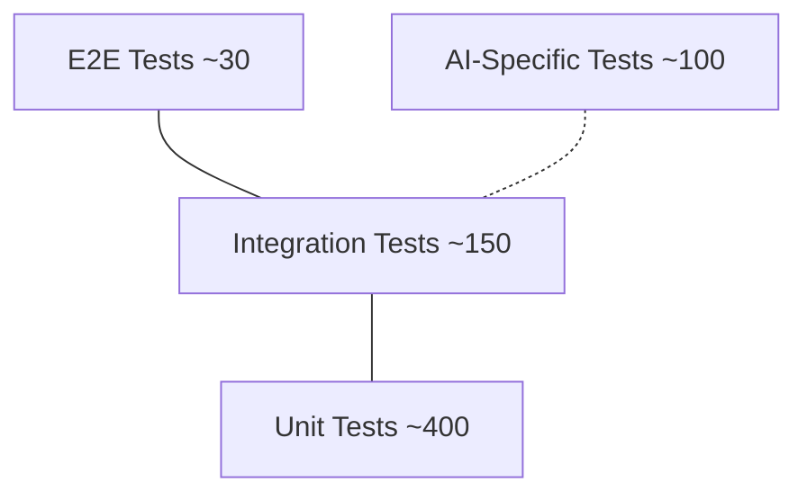
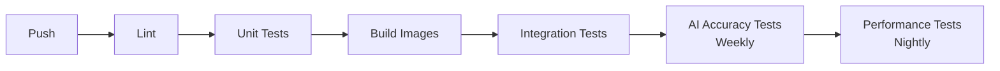

# ERP-AI Testing Strategy

| Field | Value |
|---|---|
| Module | ERP-AI |
| Version | 1.0.0 |
| Last Updated | 2026-02-23 |

---

## 1. Testing Pyramid

---

## 2. Unit Tests

| Service | Test Areas | Framework |
|---|---|---|
| Agent Orchestrator | DAG execution, lifecycle state machine, memory loading | Go test |
| Agent Catalog | CRUD operations, search/filter, health aggregation | Go test |
| NLP Service | Intent parsing, entity extraction, language detection | Go test |
| ML Pipeline | Feature retrieval, metric calculation, version management | Go test |
| Embedding Service | Vector generation, search ranking, chunking | Go test |
| Guardrail Service | Policy evaluation, classification logic, bias detection | Go test |
| Copilot Service | Context assembly, suggestion ranking, session management | Go test |

---

## 3. Integration Tests

| Scenario | Services | Dependencies |
|---|---|---|
| Agent lifecycle (spawn to terminate) | Orchestrator, Catalog | PostgreSQL, Kubernetes |
| NLP with Claude | NLP Service | Claude API (mock) |
| RAG pipeline | Embedding, Copilot | Qdrant |
| Model training end-to-end | ML Pipeline | PostgreSQL, Kubernetes |
| Guardrail enforcement | Guardrail, Orchestrator | PostgreSQL, NATS |
| Copilot suggestion flow | Copilot, NLP, Embedding | Qdrant, Claude (mock) |

---

## 4. AI-Specific Tests

### 4.1 NLP Accuracy Tests
| Test | Dataset | Target |
|---|---|---|
| Intent classification accuracy | 500 labeled examples | > 95% |
| Entity extraction F1 score | 300 annotated texts | > 90% |
| Sentiment analysis accuracy | 200 labeled reviews | > 88% |
| Language detection accuracy | 100 multi-language samples | > 99% |

### 4.2 Agent Tests
| Test | Metric | Target |
|---|---|---|
| Agent task completion rate | Success / Total | > 99% |
| Agent response quality (human eval) | 1-5 rating | > 4.0 |
| Agent chain execution correctness | DAG output validation | 100% |
| Multi-agent collaboration | Result accuracy | > 95% |

### 4.3 Guardrail Tests
| Test | Method | Target |
|---|---|---|
| Prohibited action blocking | Attempt prohibited actions | 100% blocked |
| Classification accuracy | Known action set | > 99% |
| Bias detection sensitivity | Injected bias in model output | > 90% detected |
| Human-in-the-loop workflow | End-to-end approval flow | Functional |

### 4.4 Embedding Tests
| Test | Metric | Target |
|---|---|---|
| Semantic search relevance | MRR@10 | > 0.85 |
| RAG answer quality | Human evaluation | > 4.0/5 |
| Cross-lingual retrieval | Recall@10 | > 0.75 |

---

## 5. Performance Tests

| Metric | Tool | Target |
|---|---|---|
| Copilot suggestion latency | k6 | < 500ms (p95) |
| NLP intent classification | k6 | < 100ms (p95) |
| Vector search latency | k6 | < 50ms (p95) |
| Agent spawn time | k6 | < 2s |
| Concurrent copilot users | k6 | 10,000 |

---

## 6. CI Pipeline

