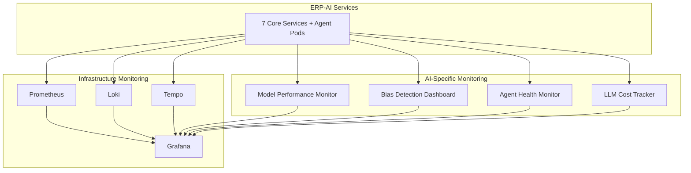

# ERP-AI Monitoring & Observability

| Field | Value |
|---|---|
| Module | ERP-AI |
| Version | 1.0.0 |
| Last Updated | 2026-02-23 |

---

## 1. Observability Stack

---

## 2. AI-Specific Metrics

### 2.1 Model Metrics

| Metric | Description | Alert Threshold |
|---|---|---|
| model_accuracy | Current production accuracy | < 0.85 |
| model_drift_score | Feature/concept drift magnitude | > 0.2 |
| model_latency_ms | Inference latency | > 100ms p95 |
| model_prediction_volume | Predictions per minute | Anomaly detection |
| model_error_rate | Failed predictions / total | > 1% |

### 2.2 Agent Metrics

| Metric | Description | Alert Threshold |
|---|---|---|
| agent_spawn_time_ms | Time to start agent pod | > 3000ms p95 |
| agent_success_rate | Completed / Total executions | < 98% |
| agent_duration_ms | Task execution time | > 60000ms |
| agent_concurrent_count | Currently running agents | > 500 |
| agent_memory_size_bytes | Memory vectors per agent | > 100MB |

### 2.3 LLM Metrics

| Metric | Description | Alert Threshold |
|---|---|---|
| claude_request_count | Requests to Claude API | Budget threshold |
| claude_token_usage | Input + output tokens | Budget threshold |
| claude_latency_ms | Claude API response time | > 5000ms p95 |
| claude_error_rate | Failed API calls | > 2% |
| claude_cost_usd | Daily API cost | Budget alert |

### 2.4 Guardrail Metrics

| Metric | Description |
|---|---|
| guardrail_evaluations_total | Total policy evaluations |
| guardrail_classifications | Count by autonomous/supervised/prohibited |
| guardrail_blocked_count | Prohibited actions blocked |
| guardrail_human_review_pending | Awaiting human approval |
| guardrail_bias_alerts | Bias detection triggers |

---

## 3. Grafana Dashboards

| Dashboard | Key Panels |
|---|---|
| AI Overview | Service health, request rate, Claude usage, agent count |
| Agent Monitor | Spawn rate, success rate, duration histogram, active agents |
| Model Performance | Accuracy trends, drift detection, A/B test results |
| LLM Cost Tracker | Daily/weekly/monthly spend, cost per module, token efficiency |
| Guardrail Compliance | Classification breakdown, blocked actions, bias alerts |
| Copilot Analytics | Suggestion acceptance rate, latency, popular modules |
| NLP Performance | Intent accuracy, entity F1, sentiment distribution |
| Embedding Health | Index size, search latency, collection stats |

---

## 4. Alerting Rules

| Alert | Condition | Severity |
|---|---|---|
| Claude API down | Error rate > 10% for 2 min | Critical |
| Model accuracy drop | Accuracy < 85% | Warning |
| Agent failure spike | Success rate < 95% for 5 min | Critical |
| Guardrail bypass attempt | Prohibited action detected | Critical |
| LLM cost overrun | Daily cost > budget | Warning |
| Qdrant unreachable | Health check fails 2 min | Critical |
| Bias detected | Fairness metric breached | Warning |
