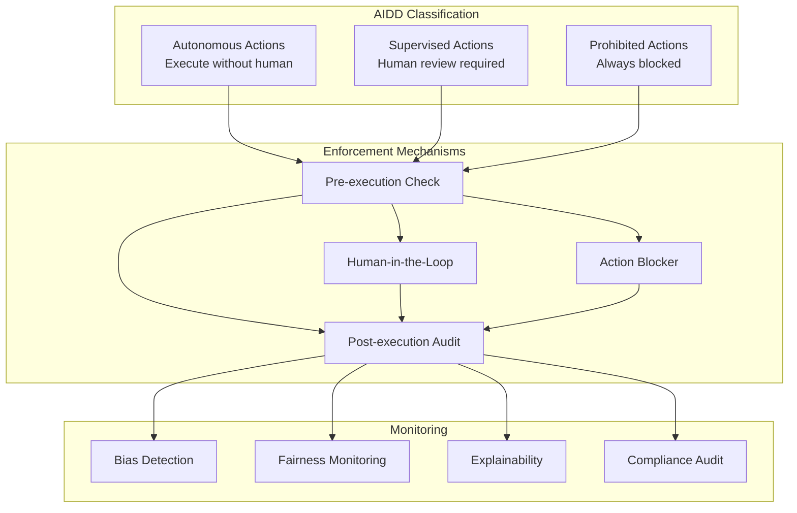
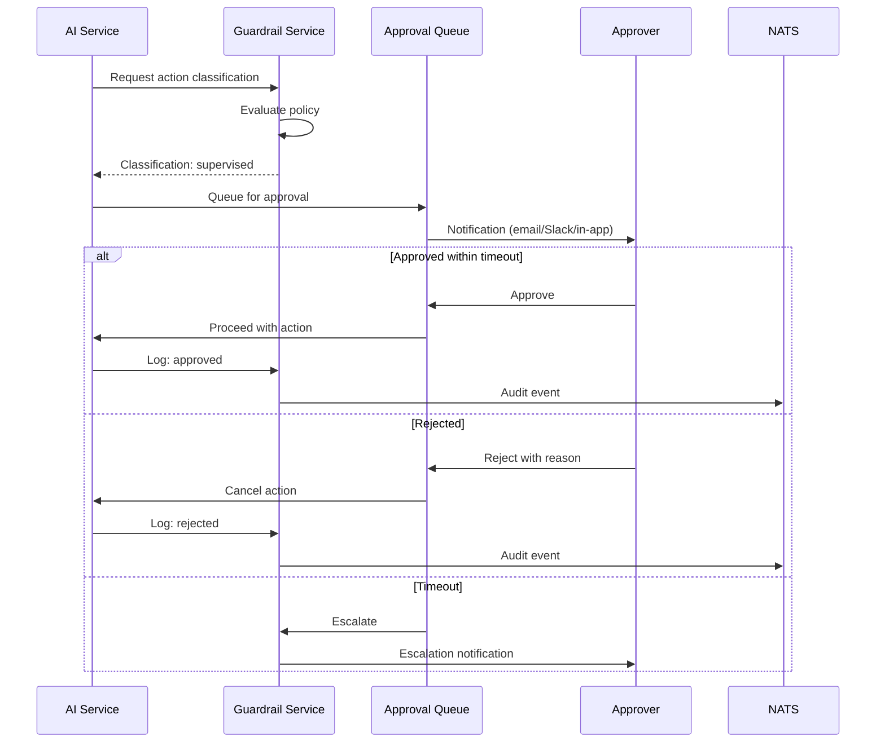
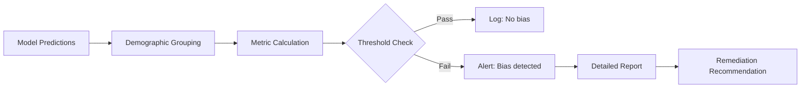

# ERP-AI AIDD Guardrails

| Field | Value |
|---|---|
| Module | ERP-AI |
| Version | 1.0.0 |
| Policy File | erp/aidd.guardrails.yaml |
| Last Updated | 2026-02-23 |

---

## 1. AIDD Framework

The AI-Driven Development (AIDD) framework is the core governance system for all AI operations across the ERP platform. ERP-AI's Guardrail Service is the central enforcement point.



---

## 2. Action Classification by Service

### 2.1 Agent Orchestrator

| Action | Classification | Rationale |
|---|---|---|
| Read-only data retrieval | Autonomous | No data modification |
| Generate report/summary | Autonomous | Output only |
| Send notification | Supervised | External side effect |
| Create/modify records | Supervised | Data modification |
| Approve financial transaction | Supervised | Financial impact |
| Delete production data | Prohibited | Irreversible |
| Access cross-tenant data | Prohibited | Security violation |

### 2.2 Copilot Service

| Action | Classification | Rationale |
|---|---|---|
| Autocomplete suggestion | Autonomous | User chooses to accept |
| Smart default population | Autonomous | User can override |
| Form auto-fill | Supervised | May populate sensitive fields |
| Automatic email sending | Supervised | External communication |
| Data deletion suggestion | Prohibited | Must be manual |

### 2.3 NLP Service

| Action | Classification | Rationale |
|---|---|---|
| Intent classification | Autonomous | Read-only analysis |
| Sentiment analysis | Autonomous | Read-only analysis |
| Translation | Autonomous | Content transformation |
| Text generation (public) | Supervised | Generated content review |
| Text generation (internal) | Autonomous | Low-risk |

### 2.4 ML Pipeline

| Action | Classification | Rationale |
|---|---|---|
| Model training | Supervised | Resource consumption |
| Shadow deployment | Autonomous | No production impact |
| Canary deployment | Supervised | Partial production impact |
| Full deployment | Supervised | Full production impact |
| Model rollback | Supervised | Service change |

---

## 3. Human-in-the-Loop Workflow



---

## 4. Bias Detection System



### 4.1 Protected Attributes

| Attribute | Monitoring Level |
|---|---|
| Gender | Continuous |
| Age group | Continuous |
| Ethnicity | Continuous |
| Geographic region | Continuous |
| Department | Periodic |
| Tenure | Periodic |

### 4.2 Fairness Metrics

| Metric | Formula | Threshold |
|---|---|---|
| Demographic Parity | \|P(Y=1\|A=a) - P(Y=1\|A=b)\| | < 0.1 |
| Equal Opportunity | \|TPR_a - TPR_b\| | < 0.05 |
| Predictive Parity | \|PPV_a - PPV_b\| | < 0.05 |
| Disparate Impact | min(rate_a/rate_b, rate_b/rate_a) | > 0.8 |

---

## 5. Explainability (XAI)

Every prediction includes an explanation:

```json
{
  "prediction": {"label": "high_risk", "confidence": 0.92},
  "explanation": {
    "method": "SHAP",
    "top_features": [
      {"feature": "days_overdue", "contribution": 0.35, "direction": "positive"},
      {"feature": "payment_history", "contribution": 0.28, "direction": "positive"},
      {"feature": "credit_score", "contribution": -0.15, "direction": "negative"}
    ],
    "natural_language": "This invoice is classified as high risk primarily due to being 45 days overdue and a pattern of late payments, partially offset by a reasonable credit score."
  }
}
```

---

## 6. Compliance Audit

### 6.1 Audit Event Schema

```json
{
  "event_type": "erp.ai.aidd.audit",
  "classification": "supervised",
  "action": "approve_expense",
  "agent_id": "expense-approval-agent",
  "user_id": "user_123",
  "tenant_id": "tenant_001",
  "policy_id": "pol_expense_001",
  "input_hash": "sha256:...",
  "output_hash": "sha256:...",
  "approved": true,
  "approver_id": "manager_456",
  "bias_check": {"passed": true, "metrics": {}},
  "timestamp": "2026-02-23T10:00:00Z"
}
```

### 6.2 Retention Policy

| Data Type | Retention |
|---|---|
| AIDD audit events | 7 years |
| Bias detection reports | 5 years |
| Model training logs | 3 years |
| Agent execution logs | 1 year |
| Guardrail policy versions | Indefinite |
