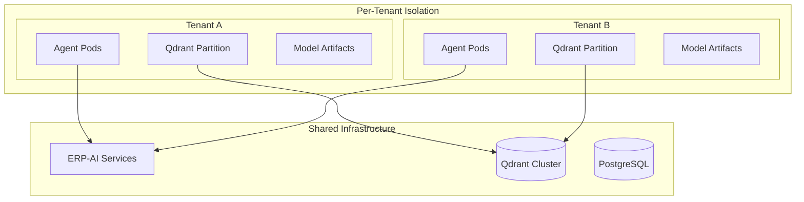
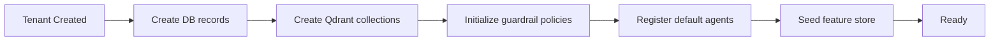

# ERP-AI Multi-Tenancy Architecture

| Field | Value |
|---|---|
| Module | ERP-AI |
| Version | 1.0.0 |
| Last Updated | 2026-02-23 |

---

## 1. Tenant Isolation Model

---

## 2. Isolation by Layer

| Layer | Mechanism |
|---|---|
| API | X-Tenant-ID header validated against JWT |
| Agent Pods | Kubernetes labels + network policies per tenant |
| Qdrant | Collection partitioning by tenant_id payload field |
| PostgreSQL | tenant_id column on all tables |
| Redis | Key prefix `{tenant_id}:` |
| Model Artifacts | Tenant-prefixed storage paths |
| Claude API | Separate API keys per enterprise tenant |
| Audit | Tenant-scoped audit trail |

---

## 3. Resource Limits

| Resource | Free | Professional | Enterprise |
|---|---|---|---|
| Concurrent agents | 5 | 50 | 500 |
| Agent executions/day | 100 | 5,000 | Unlimited |
| Copilot requests/min | 30 | 300 | 1,000 |
| NLP requests/min | 20 | 200 | 1,000 |
| Embeddings stored | 10,000 | 1,000,000 | 100,000,000 |
| ML models | 2 | 20 | Unlimited |
| Claude tokens/month | 100K | 5M | Unlimited |

---

## 4. Tenant Onboarding

---

## 5. Tenant Data Deletion

1. Terminate all running agent pods
2. Delete Qdrant vectors (filter by tenant_id)
3. Delete PostgreSQL records (CASCADE)
4. Purge Redis keys
5. Delete model artifacts from storage
6. Retain audit logs per compliance policy
7. Publish `erp.ai.tenant.decommissioned`
