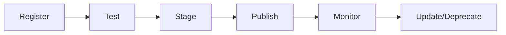
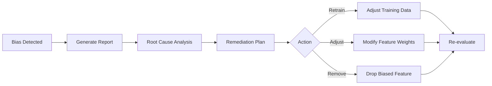

# ERP-AI Administration Guide

| Field | Value |
|---|---|
| Module | ERP-AI |
| Audience | AI Administrators |
| Version | 1.0.0 |
| Last Updated | 2026-02-23 |

---

## 1. Agent Catalog Management

### 1.1 Agent Lifecycle



### 1.2 Agent Health Dashboard

Monitor across 29 business categories:
- Agent availability (uptime %)
- Average response time
- Success rate
- Error rate and types
- Token consumption and cost

### 1.3 Adding Custom Agents

1. Define agent specification (name, domain, capabilities, runtime)
2. Package agent as Docker container
3. Register via Agent Catalog API
4. Test in staging environment
5. Publish to production

---

## 2. Guardrail Policy Management

### 2.1 Creating Policies

```json
{
  "name": "Expense Approval Threshold",
  "domain": "finance",
  "rules": [
    {
      "condition": "amount > 10000",
      "classification": "supervised",
      "required_role": "finance_manager"
    },
    {
      "condition": "amount > 50000",
      "classification": "supervised",
      "required_role": "cfo"
    },
    {
      "condition": "vendor in blocked_list",
      "classification": "prohibited"
    }
  ]
}
```

### 2.2 Policy Testing

Use the policy simulator to test before deployment:
- Simulate various action contexts
- Verify classification results
- Check escalation paths

---

## 3. Model Management

### 3.1 Model Registry Dashboard

| View | Content |
|---|---|
| Models list | All registered models with status |
| Version history | Versions, metrics, deployment status |
| A/B test results | Comparison metrics per version |
| Drift monitoring | Accuracy trend, feature drift scores |

### 3.2 Retraining Schedule

| Trigger | Action |
|---|---|
| Scheduled (weekly) | Retrain with latest data |
| Drift detected (>0.2) | Auto-trigger retraining |
| Manual request | On-demand training job |
| New data threshold | After N new samples |

---

## 4. LLM Cost Management

### 4.1 Cost Controls

| Control | Configuration |
|---|---|
| Daily budget per tenant | Configurable limit |
| Monthly budget cap | Hard limit with auto-disable |
| Token optimization | Prompt caching, response caching |
| Model selection | Route simple tasks to cheaper models |

### 4.2 Cost Dashboard

Track Claude API costs by:
- Tenant
- Module
- Service (Copilot, NLP, Agents)
- Agent type
- Time period

---

## 5. Bias and Fairness Administration

### 5.1 Monitoring Schedule

| Check | Frequency | Action on Failure |
|---|---|---|
| Demographic parity | Daily | Alert + report |
| Equal opportunity | Daily | Alert + report |
| Disparate impact | Weekly | Alert + review meeting |
| Full fairness audit | Monthly | Comprehensive report |

### 5.2 Remediation Workflow



---

## 6. Troubleshooting

| Issue | Diagnosis | Resolution |
|---|---|---|
| Copilot slow | Check Claude API latency, Qdrant health | Scale services, optimize prompts |
| Agent failures | Check pod logs, memory status | Restart pods, reset memory |
| Low NLP accuracy | Review intent examples, check model | Retrain with more examples |
| High LLM cost | Analyze token usage by module | Optimize prompts, add caching |
| Guardrail false positives | Review policy rules | Adjust thresholds |
