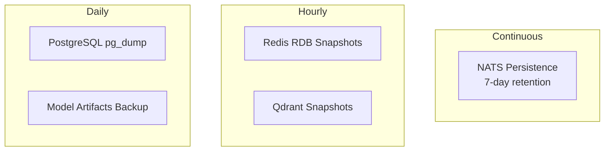

# ERP-AI Disaster Recovery Plan

| Field | Value |
|---|---|
| Module | ERP-AI |
| RPO | 1 hour |
| RTO | 2 hours |
| Last Updated | 2026-02-23 |

---

## 1. Recovery Objectives

| Metric | Target |
|---|---|
| RPO | 1 hour (max data loss) |
| RTO | 2 hours (time to restore) |
| Minimum Service | Copilot with cached responses |

---

## 2. Backup Strategy

---

## 3. Recovery Procedures

### 3.1 Qdrant Recovery
1. Restore from latest snapshot
2. Replay embedding events from NATS
3. Verify vector counts per collection
4. Resume services

### 3.2 PostgreSQL Recovery
1. Restore from daily backup
2. Replay audit events from NATS
3. Verify agent catalog integrity
4. Resume services

### 3.3 Full Recovery
1. Restore all data stores
2. Redeploy services from container registry
3. Verify health checks pass
4. Test copilot, agents, NLP
5. Re-enable traffic

---

## 4. Testing Schedule

| Test | Frequency |
|---|---|
| Backup verification | Weekly |
| Service failover | Monthly |
| Full DR drill | Annually |
