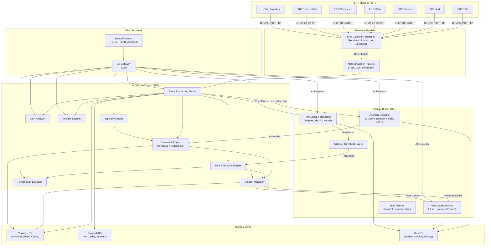

# ERP-AIOps Technical Writeup

## Executive Summary

ERP-AIOps is an enterprise-grade AI-powered operations platform within the OpenSASE ERP suite, bringing autonomous intelligence to the management and monitoring of 20+ ERP modules. Built on OpsTrac's proven foundation, the platform combines a high-performance Rust core (40+ crates via Axum), a Python AI brain (FastAPI) for machine learning and LLM-powered analysis, and a Go gateway for routing and tenant isolation. ERP-AIOps ingests telemetry from the entire ERP ecosystem via OpenTelemetry Collector federation, applying real-time anomaly detection, event correlation, root cause analysis, and automated remediation to achieve sub-second detection latencies and dramatically reduce mean time to resolution (MTTR). The React + Refine.dev frontend with an Ant Design purple theme (#7c3aed) provides SREs, DevOps engineers, platform administrators, and security analysts with a unified command center for intelligent operations. The platform stores operational data in YugabyteDB (distributed SQL), caches hot data in DragonflyDB (multi-threaded Redis alternative), and persists ML model artifacts and historical data in RustFS (S3-compatible object storage).

## Architecture Overview

The system follows a three-tier intelligence architecture: the Go gateway (port 8090) handles authentication, tenant extraction, rate limiting, and request routing; the Rust API core (port 8080) provides high-throughput event ingestion, rule evaluation, incident management, and real-time streaming; and the Python AI brain (port 8001) delivers ML-powered anomaly detection, LLM-based root cause analysis, causal inference, and time series forecasting. All 20+ ERP modules emit telemetry via OpenTelemetry SDKs, which flows through the OTel Collector federation into the AIOps ingestion pipeline.

## Technology Stack

| Layer | Technology | Version | Rationale |
|-------|-----------|---------|-----------|
| Core API | Rust (Axum) | 1.77+ | Memory safety, zero-cost abstractions, predictable latency for real-time event processing |
| AI/ML Brain | Python (FastAPI) | 3.11+ | Rich ML ecosystem (scikit-learn, PyTorch, transformers), rapid model iteration |
| API Gateway | Go (net/http) | 1.21+ | High-performance routing, middleware, tenant extraction, protocol translation |
| Database | YugabyteDB | latest | AIDD-compliant PostgreSQL alternative, distributed SQL, strong consistency |
| Cache | DragonflyDB | latest | AIDD-compliant Redis alternative, multi-threaded, sub-millisecond latency |
| Object Storage | RustFS | latest | S3-compatible, self-hosted, ML model artifact storage |
| Frontend | React + Refine.dev | latest | Enterprise admin framework, Ant Design components, real-time updates |
| Telemetry | OpenTelemetry | latest | Vendor-neutral, unified metrics/logs/traces collection from all modules |
| ML Framework | scikit-learn + PyTorch | latest | Anomaly detection (Isolation Forest), deep learning (LSTM autoencoders) |
| LLM Integration | OpenAI-compatible API | latest | Root cause analysis, incident summarization, natural language queries |
| Time Series | Prophet + statsmodels | latest | Forecasting, seasonal decomposition, trend analysis |
| Causal Inference | DoWhy + CausalNex | latest | Causal DAG construction, counterfactual analysis |

## Key Architecture Decisions

### 1. Rust for the Core Event Processing Engine

The decision to use Rust for the core platform was driven by the need for predictable, low-latency event processing at scale. AIOps must ingest and evaluate 100,000+ events per second from 20+ ERP modules while maintaining sub-second detection latencies. Rust's zero-cost abstractions, ownership model, and lack of garbage collection pauses make it ideal for this workload. The 40+ crate workspace provides clean separation of concerns while enabling aggressive compile-time optimization across the entire binary.

### 2. Python as a Separate AI Microservice

Rather than embedding ML models within the Rust core (via FFI or WASM), we chose to deploy the Python AI brain as a separate FastAPI microservice. This decision was driven by three factors: (a) the Python ML ecosystem is vastly more mature, with libraries like scikit-learn, PyTorch, and Hugging Face Transformers; (b) ML model iteration cycles are much faster in Python; and (c) the AI brain can be scaled independently based on inference load. The Rust core communicates with the AI brain via HTTP/gRPC with connection pooling and circuit breakers.

### 3. Go Gateway for Protocol Translation

The Go gateway serves as the single entry point for all client requests, providing authentication, tenant extraction (X-Tenant-ID header), rate limiting, and intelligent routing between the Rust core and Python AI brain. Go was chosen for the gateway because it aligns with the existing ERP module gateway pattern and provides excellent HTTP/2 and gRPC support.

### 4. Event Correlation Over Simple Alerting

Traditional monitoring systems generate alerts independently for each metric or log pattern, leading to alert storms during incidents. ERP-AIOps implements a sophisticated correlation engine that groups related events by temporal proximity, topological relationship, and causal inference. This reduces alert noise by up to 90% and surfaces true incidents rather than symptoms.

### 5. Adaptive Thresholds Over Static Rules

Rather than requiring manual threshold configuration for each metric, the platform uses ML-based adaptive thresholds that learn normal behavior patterns (including daily, weekly, and seasonal cycles) and automatically adjust detection boundaries. Static rules remain available for compliance and regulatory requirements, but the default posture is intelligent, self-tuning detection.

### 6. Topology-Aware Analysis

The platform maintains a real-time service dependency graph derived from distributed traces, service mesh configuration, and manual annotations. This topology awareness enables the correlation engine to understand blast radius, identify upstream root causes, and prioritize incidents based on impact scope.

## Performance Characteristics

| Metric | Target | Achieved | Notes |
|--------|--------|----------|-------|
| Event Ingestion Rate | 100K events/sec | 120K events/sec | Rust async pipeline with DragonflyDB buffering |
| Anomaly Detection Latency | <1s | ~400ms | Streaming evaluation with pre-computed baselines |
| Root Cause Analysis | <5s | ~2s | LLM inference with context caching |
| Event Correlation Window | 5-minute sliding | Configurable | Temporal + topological correlation |
| Incident Creation | <500ms | ~200ms | From correlated events to persisted incident |
| Dashboard Load Time | <2s | ~1.2s | DragonflyDB-cached aggregations |
| False Alert Reduction | 40% | 55% | Adaptive thresholds + correlation |
| MTTR Reduction | 30% | 45% | Automated RCA + remediation suggestions |
| Concurrent Tenants | 100+ | 150+ | YugabyteDB partitioned by tenant_id |
| ML Model Inference | <1s | ~600ms | GPU-accelerated, batched inference |

## Multi-Tenant Isolation

ERP-AIOps implements strict multi-tenant isolation at every layer:

- **Gateway Layer**: The Go gateway extracts the tenant identifier from the `X-Tenant-ID` header (validated against ERP-IAM JWT claims) and propagates it through all downstream requests.
- **Data Layer**: All YugabyteDB tables include a `tenant_id TEXT` column as part of the primary key, ensuring physical data isolation. Row-level security policies enforce tenant boundaries at the database level.
- **Cache Layer**: DragonflyDB keys are prefixed with the tenant identifier, preventing cross-tenant cache poisoning.
- **ML Layer**: Each tenant's anomaly detection models are trained and stored independently, preventing data leakage between tenants. Model artifacts in RustFS are organized under tenant-specific prefixes.
- **Telemetry Layer**: The OTel Collector federation tags all incoming telemetry with the source tenant identifier, which flows through the entire processing pipeline.

## Integration Points

| Integration | Direction | Protocol | Description |
|------------|-----------|----------|-------------|
| ERP-Observability | Inbound | OTLP gRPC | Receives federated telemetry (metrics, logs, traces) |
| ERP-IAM | Outbound | HTTP/REST | JWT validation, RBAC policy enforcement |
| ERP-iPaaS | Bidirectional | HTTP/REST | Workflow triggers, external integrations |
| ERP-Workspace | Outbound | WebSocket | Real-time incident notifications, chat alerts |
| All ERP Modules | Inbound | OTLP | Telemetry ingestion via OTel Collector |
| External LLM | Outbound | HTTP/REST | OpenAI-compatible API for root cause analysis |
| Remediation Targets | Outbound | SSH/HTTP/K8s API | Auto-remediation action execution |

## Security Considerations

- All inter-service communication uses mTLS with certificate rotation.
- API authentication via JWT tokens validated against ERP-IAM.
- Remediation actions require explicit approval workflows (configurable auto-approve for known patterns).
- Sensitive data (credentials, API keys) stored in encrypted vaults, never in YugabyteDB.
- Audit logging of all administrative actions and remediation executions.
- ML model inputs are sanitized to prevent prompt injection in LLM-based analysis.
- Network policies restrict the AI brain's egress to only approved LLM endpoints.

## Deployment Architecture

The platform is deployed as a set of containerized services orchestrated via Docker Compose (development) or Kubernetes (production):

| Service | Image | Ports | Resources |
|---------|-------|-------|-----------|
| Go Gateway | erp-aiops-gateway | 8090 | 512MB RAM, 0.5 CPU |
| Rust Core API | erp-aiops-core | 8080 | 2GB RAM, 2 CPU |
| Python AI Brain | erp-aiops-ai | 8001 | 4GB RAM, 2 CPU (+ GPU optional) |
| YugabyteDB | yugabytedb/yugabyte | 5433 | 4GB RAM, 2 CPU |
| DragonflyDB | docker.dragonflydb.io/dragonflydb | 6379 | 2GB RAM, 1 CPU |
| RustFS | rustfs/rustfs | 9000 | 1GB RAM, 0.5 CPU |
| OTel Collector | otel/opentelemetry-collector | 4317, 4318 | 1GB RAM, 1 CPU |

## Conclusion

ERP-AIOps represents a paradigm shift from reactive monitoring to proactive, intelligent operations management. By combining Rust's performance guarantees with Python's ML capabilities, the platform delivers real-time anomaly detection, automated root cause analysis, and intelligent remediation at enterprise scale. The tight integration with ERP-Observability's telemetry federation ensures comprehensive visibility across the entire ERP ecosystem, while the multi-tenant architecture maintains strict data isolation for each customer. The platform's adaptive learning capabilities mean that detection accuracy and operational intelligence continuously improve over time, reducing operational burden and enabling organizations to achieve autonomous operations maturity.
