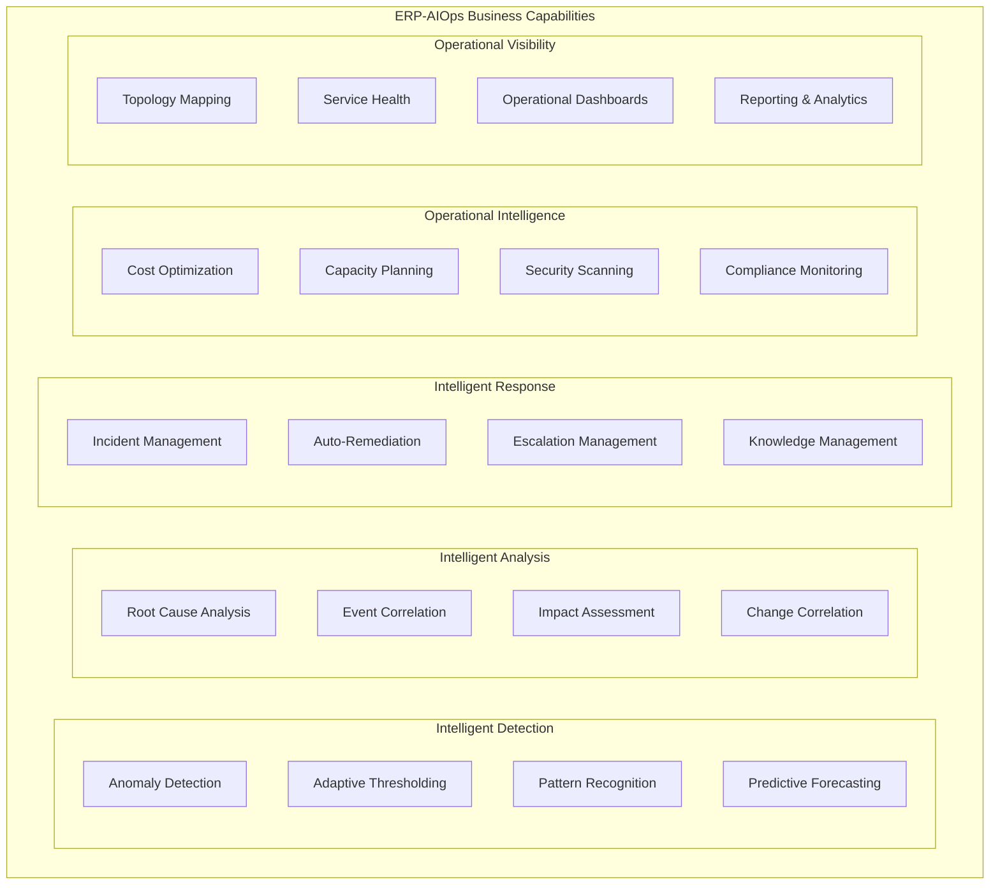
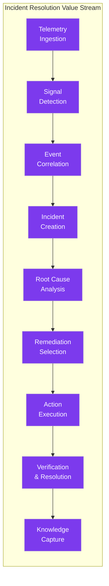
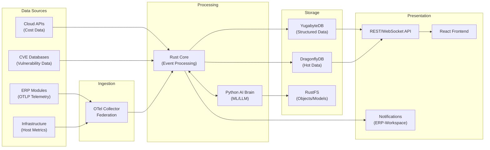
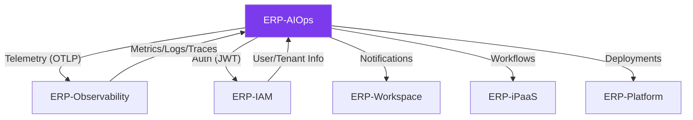

# ERP-AIOps Enterprise Architecture

## 1. Introduction

This document defines the enterprise architecture for ERP-AIOps, the AI-powered operations platform within the OpenSASE ERP suite. It establishes the business context, capability mapping, value streams, stakeholder analysis, and strategic alignment that govern the platform's design, implementation, and evolution. The enterprise architecture follows TOGAF principles and integrates with the broader OpenSASE enterprise architecture framework.

## 2. Business Context

### 2.1 Strategic Drivers

Modern enterprises operating complex ERP ecosystems face escalating operational challenges. With 20+ interconnected modules, each generating thousands of metrics, logs, and traces per second, traditional monitoring approaches create unsustainable alert volumes, long incident resolution times, and reactive operational postures. ERP-AIOps addresses these challenges by bringing artificial intelligence to operations management, transforming the operational model from reactive to predictive and ultimately autonomous.

### 2.2 Business Problem Statement

| Problem | Impact | Frequency |
|---------|--------|-----------|
| Alert fatigue from high-volume, low-signal monitoring | SRE burnout, missed critical incidents | Daily |
| Long mean time to resolution (MTTR) for complex incidents | Revenue loss, SLA breaches, customer dissatisfaction | Weekly |
| Manual root cause analysis across 20+ interconnected modules | Extended outages, incomplete postmortems | Weekly |
| Reactive incident management with no predictive capability | Preventable outages, repeated incidents | Monthly |
| Infrastructure cost opacity across modules and tenants | Budget overruns, inefficient resource allocation | Quarterly |
| Security configuration drift and vulnerability accumulation | Compliance gaps, security incidents | Ongoing |
| Knowledge loss when experienced operators leave | Increased MTTR, operational risk | Annual |

### 2.3 Strategic Objectives

| Objective | Target | Measurement |
|-----------|--------|-------------|
| Reduce MTTR for P1/P2 incidents | 60% reduction within 6 months | Average resolution time from incident detection to resolution |
| Reduce false alert volume | 80% reduction through correlation | Number of actionable incidents vs. raw alerts |
| Enable predictive operations | 30% of incidents detected before user impact | Percentage of incidents detected via forecasting/anomaly detection |
| Automate routine remediation | 40% of P3-P5 incidents auto-remediated | Percentage of incidents resolved without human intervention |
| Optimize infrastructure costs | $500K annual savings | Actual savings from right-sizing and idle resource elimination |
| Improve security posture | Zero critical unpatched vulnerabilities >30 days | Time to remediate critical findings |
| Codify operational knowledge | 100% of known failure modes documented as playbooks | Playbook coverage of historical incident patterns |

## 3. Business Capability Model

### 3.1 Level 1 Capabilities

### 3.2 Capability Maturity Assessment

| Capability | Current Maturity | Target Maturity (12 months) | Investment Priority |
|-----------|-----------------|---------------------------|-------------------|
| Anomaly Detection | Level 3 - Defined | Level 4 - Managed | High |
| Adaptive Thresholding | Level 3 - Defined | Level 4 - Managed | High |
| Pattern Recognition | Level 2 - Repeatable | Level 3 - Defined | Medium |
| Predictive Forecasting | Level 2 - Repeatable | Level 3 - Defined | Medium |
| Root Cause Analysis | Level 3 - Defined | Level 4 - Managed | Critical |
| Event Correlation | Level 3 - Defined | Level 4 - Managed | Critical |
| Impact Assessment | Level 2 - Repeatable | Level 3 - Defined | Medium |
| Incident Management | Level 4 - Managed | Level 4 - Managed | Maintenance |
| Auto-Remediation | Level 2 - Repeatable | Level 3 - Defined | High |
| Cost Optimization | Level 2 - Repeatable | Level 3 - Defined | Medium |
| Security Scanning | Level 3 - Defined | Level 4 - Managed | High |
| Topology Mapping | Level 3 - Defined | Level 3 - Defined | Maintenance |

## 4. Value Streams

### 4.1 Incident Resolution Value Stream

This is the primary value stream, transforming raw operational signals into resolved incidents with minimal human intervention.

| Stage | Capabilities Used | Value Added | Cycle Time Target |
|-------|------------------|-------------|-------------------|
| Telemetry Ingestion | Data Collection, Protocol Translation | Raw signals from all 20+ modules | <100ms |
| Signal Detection | Anomaly Detection, Adaptive Thresholding | Meaningful signals extracted from noise | <500ms |
| Event Correlation | Temporal, Topological, Causal Correlation | Related events grouped into clusters | <1s |
| Incident Creation | Incident Management, Deduplication | Single actionable incident record | <200ms |
| Root Cause Analysis | LLM Analysis, Causal Inference, Change Correlation | Probable root cause identified | <5s |
| Remediation Selection | Playbook Matching, Impact Assessment | Appropriate remediation action selected | <1s |
| Action Execution | Auto-Remediation, Approval Workflows | Issue resolved or mitigated | <60s (auto) |
| Verification & Resolution | Health Checks, SLA Validation | Confirmed resolution, incident closed | <30s |
| Knowledge Capture | Postmortem, Playbook Update | Organizational learning captured | Post-resolution |

### 4.2 Cost Optimization Value Stream

Transforms resource consumption data into actionable cost reduction recommendations.

| Stage | Activity | Value Added |
|-------|----------|-------------|
| Collection | Gather resource utilization from all modules | Comprehensive cost visibility |
| Attribution | Map costs to modules, tenants, teams | Accountability and transparency |
| Analysis | Identify waste, over-provisioning, anomalies | Optimization opportunities quantified |
| Recommendation | Generate right-sizing, shutdown, consolidation recommendations | Actionable savings plan |
| Execution | Implement approved optimizations | Realized savings |
| Tracking | Monitor savings realization and new waste | Continuous improvement |

### 4.3 Security Posture Value Stream

Transforms security scan results and configuration data into an improved security posture.

| Stage | Activity | Value Added |
|-------|----------|-------------|
| Scanning | Continuous vulnerability and configuration scanning | Comprehensive finding inventory |
| Assessment | Severity scoring, exploitability analysis | Prioritized finding list |
| Correlation | Link findings to topology and blast radius | Impact-aware prioritization |
| Remediation | Auto-remediation for known fixes, guided remediation for others | Reduced attack surface |
| Compliance | Map findings to compliance frameworks | Audit readiness |
| Reporting | Executive security posture dashboards | Stakeholder visibility |

## 5. Stakeholder Analysis

### 5.1 Stakeholder Map

| Stakeholder | Role | Primary Interests | Key Metrics |
|-------------|------|-------------------|-------------|
| Site Reliability Engineers (SREs) | Primary operators | Fast incident detection, automated RCA, reduced toil | MTTR, incident volume, auto-remediation rate |
| Platform Engineers | Infrastructure managers | Resource optimization, capacity planning, topology visibility | Infrastructure costs, utilization rates, change success rate |
| DevOps Engineers | Module operators | Deployment impact awareness, service health, quick diagnostics | Deployment success rate, rollback rate, service uptime |
| Security Analysts (CISOs) | Security governance | Vulnerability management, compliance, threat detection | Security posture score, time to patch, compliance gaps |
| Finance/CFOs | Cost governance | Cost visibility, optimization ROI, budget compliance | Total infrastructure cost, savings realized, cost per tenant |
| Engineering Managers | Team leads | Team productivity, incident workload, knowledge retention | Incidents per engineer, toil hours, playbook coverage |
| Product Managers | Product owners | Service reliability, SLA compliance, customer impact | SLA breach count, customer-facing incident count |
| Executive Leadership | Strategic oversight | Operational maturity, risk reduction, ROI | Operational efficiency score, risk score, total cost of ownership |
| External Auditors | Compliance verification | Audit trails, compliance evidence, access controls | Compliance score, audit finding count |
| Customers (Tenants) | End users | Service availability, incident transparency | Uptime percentage, incident communication timeliness |

### 5.2 RACI Matrix

| Activity | SRE | Platform Eng | DevOps | Security | Finance | Exec |
|----------|-----|-------------|--------|----------|---------|------|
| Incident Response | R/A | C | C | I | I | I |
| Root Cause Analysis | R | C | C | I | I | I |
| Auto-Remediation Config | R | A | C | C | I | I |
| Cost Optimization | C | R | C | I | A | I |
| Security Scanning | I | C | C | R/A | I | I |
| Capacity Planning | C | R/A | C | I | C | I |
| Topology Management | C | R | C | C | I | I |
| Rule Configuration | R | C | C | C | I | I |
| Compliance Reporting | I | C | I | R | I | A |
| Platform Strategy | C | C | C | C | C | R/A |

*R = Responsible, A = Accountable, C = Consulted, I = Informed*

## 6. Information Architecture

### 6.1 Data Domains

| Domain | Description | Data Classification | Retention |
|--------|-------------|-------------------|-----------|
| Telemetry | Metrics, logs, traces from ERP modules | Internal/Confidential | 90 days (hot), 1 year (warm), 3 years (cold) |
| Incidents | Incident records, timelines, RCA reports | Internal/Confidential | 3 years |
| Anomalies | Detected anomalies, baselines, scores | Internal | 1 year |
| Topology | Service dependencies, health status | Internal | Current + 90 days history |
| Cost | Resource consumption, cost attribution | Confidential | 3 years |
| Security | Vulnerability findings, compliance status | Restricted | 5 years |
| ML Models | Trained models, training data, metadata | Internal | Current + 3 previous versions |
| Configuration | Rules, playbooks, thresholds, policies | Internal | Current + audit trail |
| Audit | All administrative and operational actions | Restricted | 7 years |

### 6.2 Data Flow Architecture

## 7. Integration Architecture

### 7.1 Integration Patterns

| Pattern | Usage | Technology |
|---------|-------|-----------|
| Event Streaming | Telemetry ingestion from ERP modules | OTLP gRPC, Protocol Buffers |
| Request-Reply | API calls to/from other ERP modules | HTTP/REST, JSON |
| Publish-Subscribe | Real-time notifications to subscribers | WebSocket, Server-Sent Events |
| Batch Processing | ML model training, cost aggregation | Scheduled jobs, RustFS storage |
| Circuit Breaker | Calls to external services (LLM, CVE) | Resilience4j pattern in Rust |

### 7.2 Integration Dependencies

## 8. Technology Architecture

### 8.1 Technology Standards

| Category | Standard | Rationale |
|----------|----------|-----------|
| Programming (Core) | Rust 1.77+ | Performance, safety, predictable latency |
| Programming (AI) | Python 3.11+ | ML ecosystem maturity |
| Programming (Gateway) | Go 1.21+ | ERP gateway convention, concurrency model |
| Frontend | React 18+, Refine.dev, Ant Design | Enterprise admin framework consistency |
| Database | YugabyteDB (PostgreSQL-compatible) | Distributed SQL, AIDD-compliant |
| Cache | DragonflyDB | Multi-threaded, AIDD-compliant Redis alternative |
| Object Storage | RustFS | S3-compatible, self-hosted |
| Telemetry | OpenTelemetry | Vendor-neutral observability standard |
| Containerization | Docker, OCI images | Industry standard |
| Orchestration | Kubernetes / Docker Compose | Production / Development |
| API | REST (JSON), gRPC (Protobuf) | REST for CRUD, gRPC for high-throughput |
| Authentication | JWT (RS256) | Stateless, ERP-IAM compatible |

### 8.2 Non-Functional Requirements

| Requirement | Specification | Measurement |
|-------------|---------------|-------------|
| Availability | 99.95% uptime | Monthly uptime percentage |
| Scalability | 100K events/sec, 1000 concurrent users | Load testing benchmarks |
| Latency (P99) | <500ms API response, <1s anomaly detection | APM metrics |
| Data Durability | 99.999999% (8 nines) | Storage redundancy factor |
| Security | SOC 2 Type II, ISO 27001 compliant | Annual audit |
| Recovery | RPO <1 hour, RTO <4 hours | DR testing |
| Maintainability | <4 hours for routine patches | Change lead time |

## 9. Governance

### 9.1 Architecture Decision Records

All significant architecture decisions are documented as Architecture Decision Records (ADRs) in the repository at `ERP-AIOps/docs/adr/`. Key ADRs include:

| ADR | Title | Status | Date |
|-----|-------|--------|------|
| ADR-001 | Use Rust for core event processing | Accepted | 2025-10 |
| ADR-002 | Separate Python AI brain microservice | Accepted | 2025-10 |
| ADR-003 | Go gateway for API routing | Accepted | 2025-10 |
| ADR-004 | YugabyteDB over CockroachDB for state storage | Accepted | 2025-11 |
| ADR-005 | Adaptive thresholds as default detection mode | Accepted | 2025-11 |
| ADR-006 | OpenAI-compatible LLM API for RCA | Accepted | 2025-12 |
| ADR-007 | Topology-aware correlation engine | Accepted | 2026-01 |
| ADR-008 | Playbook-based remediation over ad-hoc actions | Accepted | 2026-01 |

### 9.2 Architecture Review Board

The ERP-AIOps architecture is reviewed quarterly by the OpenSASE Architecture Review Board (ARB), which includes representatives from the AIOps team, Observability team, Platform team, Security team, and enterprise architecture office. The ARB ensures alignment with enterprise standards, evaluates technology choices, and approves significant architecture changes.

## 10. Roadmap

### 10.1 Capability Evolution

| Quarter | Capability | Description |
|---------|-----------|-------------|
| Q1 2026 | Core Platform (v1.0) | Incident management, anomaly detection, correlation, RCA, remediation |
| Q2 2026 | Advanced ML (v1.1) | Multi-variate anomaly detection, improved forecasting, transfer learning |
| Q3 2026 | Autonomous Operations (v1.2) | Self-healing playbooks, predictive scaling, chaos engineering integration |
| Q4 2026 | Full Autonomy (v2.0) | Autonomous incident resolution for 80%+ of known patterns |

### 10.2 Investment Priorities

| Priority | Capability | Justification | Estimated Investment |
|----------|-----------|---------------|---------------------|
| 1 | Root Cause Analysis | Highest MTTR impact | High |
| 2 | Event Correlation | Highest noise reduction impact | High |
| 3 | Auto-Remediation | Highest toil reduction impact | Medium |
| 4 | Cost Optimization | Direct financial ROI | Medium |
| 5 | Security Scanning | Compliance requirement | Medium |
| 6 | Predictive Forecasting | Proactive operations enabler | Medium |
