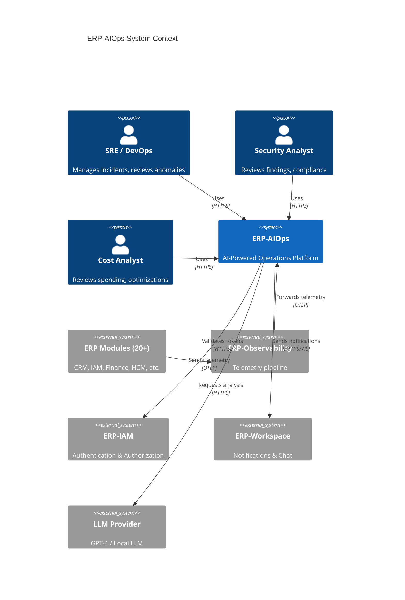
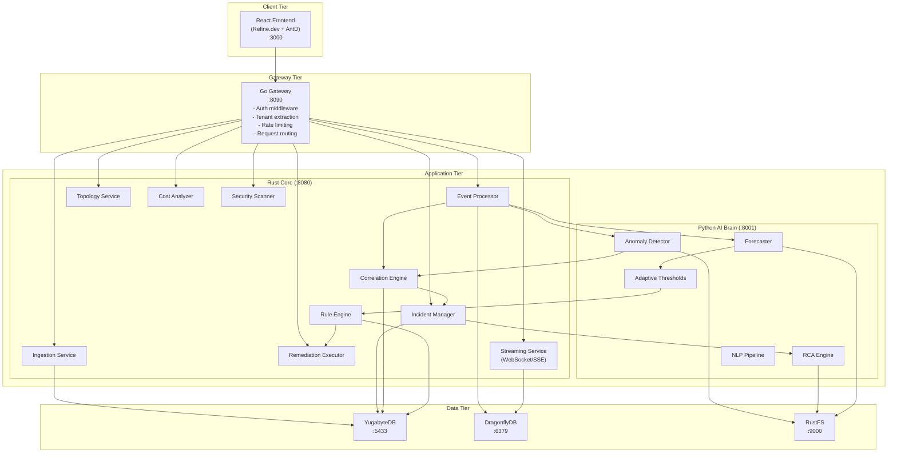
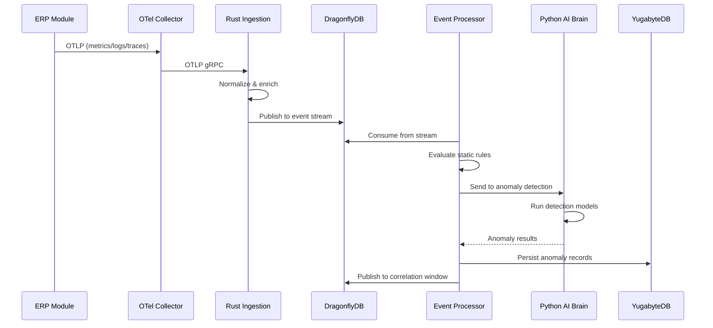
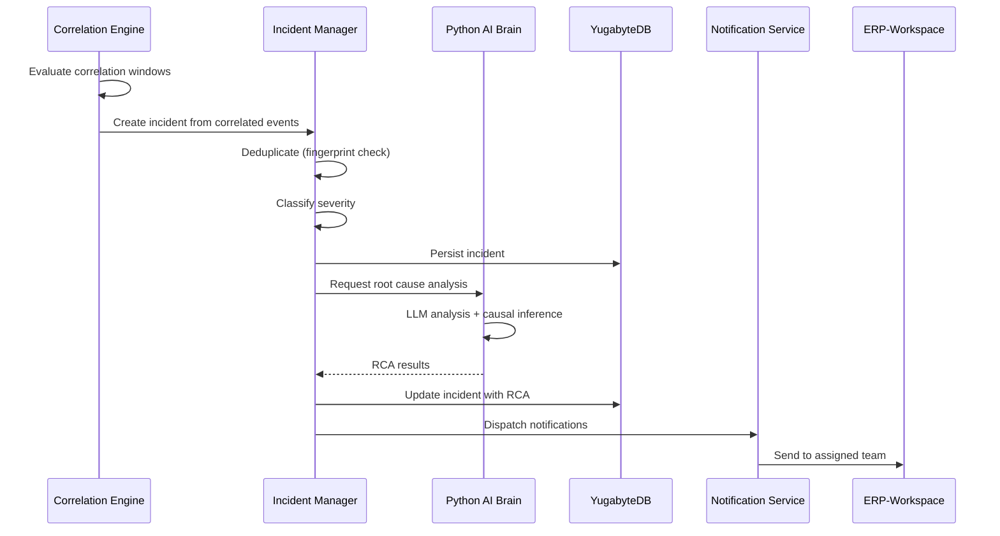
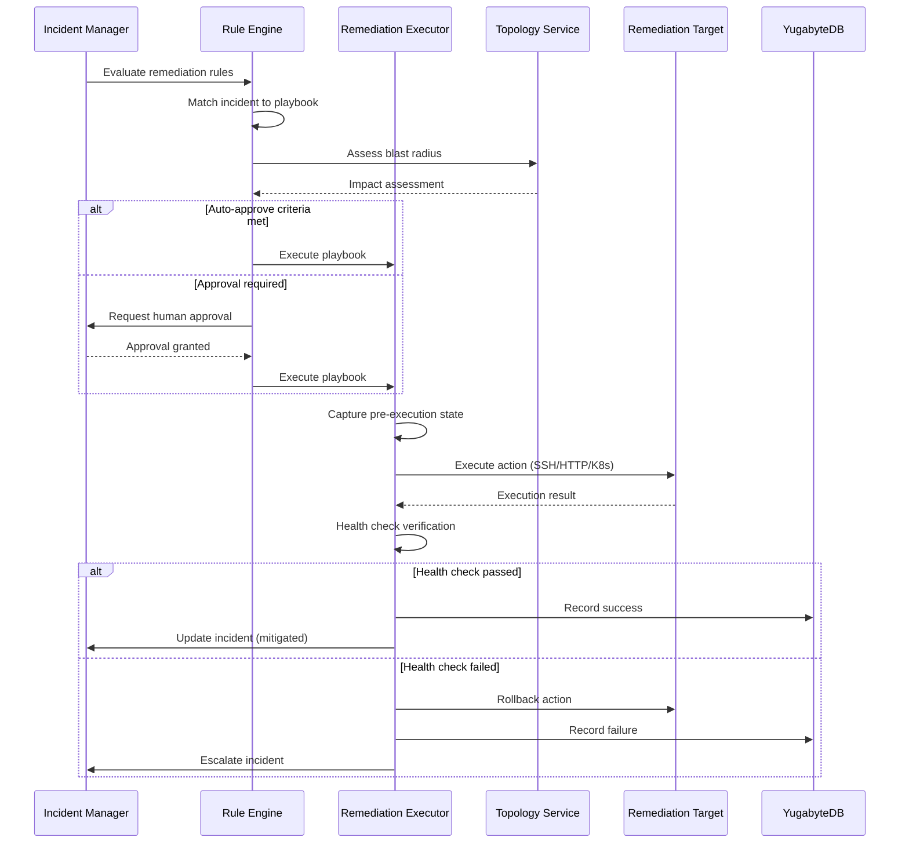

# ERP-AIOps Software Architecture

## 1. Overview

This document describes the software architecture of ERP-AIOps, detailing the system decomposition, component interactions, data flows, and design patterns that govern the platform. The architecture follows a polyglot microservice approach with three primary runtime components: a Rust core (Axum, 40+ crates), a Python AI brain (FastAPI), and a Go gateway, all backed by YugabyteDB, DragonflyDB, and RustFS.

## 2. System Context



## 3. Container Architecture



## 4. Rust Workspace Architecture

The Rust core is organized as a Cargo workspace with 40+ crates, following domain-driven design principles. Each crate has a single responsibility and well-defined public API.

### 4.1 Crate Dependency Graph

```mermaid
graph TB
    subgraph "Binary Crates"
        SERVER["aiops-server<br/>(Main Axum binary)"]
        WORKER["aiops-worker<br/>(Background job runner)"]
        CLI["aiops-cli<br/>(Admin CLI tool)"]
    end

    subgraph "Domain Crates"
        INC_DOMAIN["aiops-incidents<br/>(Incident domain logic)"]
        ANO_DOMAIN["aiops-anomalies<br/>(Anomaly domain logic)"]
        CORR_DOMAIN["aiops-correlation<br/>(Correlation domain logic)"]
        RULES_DOMAIN["aiops-rules<br/>(Rule evaluation logic)"]
        TOPO_DOMAIN["aiops-topology<br/>(Topology domain logic)"]
        COST_DOMAIN["aiops-cost<br/>(Cost analysis logic)"]
        SEC_DOMAIN["aiops-security<br/>(Security scanning logic)"]
        REMED_DOMAIN["aiops-remediation<br/>(Remediation logic)"]
    end

    subgraph "Service Crates"
        INGEST_SVC["aiops-ingestion<br/>(OTLP ingestion pipeline)"]
        EVENT_SVC["aiops-events<br/>(Event processing)"]
        AI_CLIENT["aiops-ai-client<br/>(Python AI brain client)"]
        NOTIF_SVC["aiops-notifications<br/>(Notification dispatch)"]
        STREAM_SVC["aiops-streaming<br/>(WebSocket/SSE)"]
    end

    subgraph "Infrastructure Crates"
        DB["aiops-db<br/>(YugabyteDB repository)"]
        CACHE["aiops-cache<br/>(DragonflyDB client)"]
        STORAGE["aiops-storage<br/>(RustFS S3 client)"]
        AUTH["aiops-auth<br/>(JWT validation)"]
        TENANT["aiops-tenant<br/>(Multi-tenant context)"]
        CONFIG["aiops-config<br/>(Configuration management)"]
    end

    subgraph "Foundation Crates"
        COMMON["aiops-common<br/>(Shared types, errors)"]
        MODELS["aiops-models<br/>(Domain models, DTOs)"]
        PROTO["aiops-proto<br/>(Protobuf definitions)"]
        TELEMETRY["aiops-telemetry<br/>(OTel instrumentation)"]
        UTILS["aiops-utils<br/>(Utility functions)"]
    end

    SERVER --> INC_DOMAIN & ANO_DOMAIN & CORR_DOMAIN & RULES_DOMAIN & TOPO_DOMAIN & COST_DOMAIN & SEC_DOMAIN & REMED_DOMAIN
    SERVER --> INGEST_SVC & EVENT_SVC & STREAM_SVC
    SERVER --> AUTH & TENANT & CONFIG

    WORKER --> EVENT_SVC & AI_CLIENT & NOTIF_SVC
    CLI --> DB & CONFIG

    INC_DOMAIN & ANO_DOMAIN & CORR_DOMAIN --> DB & CACHE & MODELS
    RULES_DOMAIN & TOPO_DOMAIN & COST_DOMAIN --> DB & CACHE & MODELS
    SEC_DOMAIN & REMED_DOMAIN --> DB & CACHE & MODELS

    AI_CLIENT --> MODELS & COMMON
    INGEST_SVC --> PROTO & EVENT_SVC
    EVENT_SVC --> CACHE & MODELS

    DB --> COMMON & MODELS
    CACHE --> COMMON
    STORAGE --> COMMON
    AUTH --> COMMON & TENANT
    TENANT --> COMMON

    MODELS --> COMMON
    PROTO --> COMMON
```



### 4.2 Key Crate Descriptions

| Crate | Type | Responsibility | Dependencies |
|-------|------|---------------|-------------|
| `aiops-server` | Binary | Main Axum HTTP server, route registration, middleware stack | All domain + service crates |
| `aiops-worker` | Binary | Background job processing (model training triggers, batch analysis) | Event, AI client, notification crates |
| `aiops-ingestion` | Service | OTLP receiver, event normalization, pipeline routing | Proto, event crates |
| `aiops-events` | Service | Event processing, buffering, fan-out to consumers | Cache, models crates |
| `aiops-incidents` | Domain | Incident CRUD, lifecycle state machine, deduplication | DB, cache, models crates |
| `aiops-anomalies` | Domain | Anomaly record management, scoring, grouping | DB, cache, models crates |
| `aiops-correlation` | Domain | Temporal, topological, causal correlation algorithms | DB, cache, topology crates |
| `aiops-rules` | Domain | Rule definition, evaluation engine, threshold checking | DB, cache, models crates |
| `aiops-topology` | Domain | Service graph construction, traversal, impact analysis | DB, cache, models crates |
| `aiops-cost` | Domain | Cost attribution, recommendation generation | DB, models crates |
| `aiops-security` | Domain | CVE scanning, configuration audit, compliance checks | DB, models crates |
| `aiops-remediation` | Domain | Action execution, playbook orchestration, approval workflows | DB, cache, notification crates |
| `aiops-ai-client` | Service | HTTP client for Python AI brain with circuit breaker | Models, common crates |
| `aiops-db` | Infrastructure | YugabyteDB connection pool, query builders, migrations | Common, models crates |
| `aiops-cache` | Infrastructure | DragonflyDB connection pool, key management, TTL policies | Common crates |
| `aiops-storage` | Infrastructure | RustFS S3 client for model artifacts and reports | Common crates |
| `aiops-auth` | Infrastructure | JWT validation, claim extraction, RBAC enforcement | Common, tenant crates |
| `aiops-tenant` | Infrastructure | Tenant context propagation, tenant-scoped operations | Common crate |
| `aiops-models` | Foundation | Shared domain models, DTOs, API request/response types | Common crate |
| `aiops-proto` | Foundation | Protobuf definitions for OTLP and internal protocols | Common crate |
| `aiops-common` | Foundation | Error types, result types, shared traits, constants | None |

## 5. Python AI Brain Architecture

The Python AI brain is a FastAPI application organized into distinct ML modules, each responsible for a specific AI capability.

### 5.1 Module Structure

```
aiops-ai/
  app/
    main.py                  # FastAPI application entry point
    api/
      v1/
        anomaly.py           # Anomaly detection endpoints
        rca.py               # Root cause analysis endpoints
        forecast.py          # Forecasting endpoints
        threshold.py         # Adaptive threshold endpoints
        nlp.py               # NLP analysis endpoints
    core/
      config.py              # Configuration management
      dependencies.py        # FastAPI dependency injection
      middleware.py          # Tenant extraction, logging
    models/
      anomaly/
        zscore.py            # Z-score anomaly detector
        isolation_forest.py  # Isolation Forest detector
        lstm_autoencoder.py  # LSTM autoencoder detector
        ensemble.py          # Ensemble combiner
      rca/
        llm_analyzer.py      # LLM-based root cause analysis
        causal_inference.py  # DoWhy causal inference
        change_correlator.py # Change-incident correlation
        evidence_collector.py # Automated evidence gathering
      forecast/
        prophet_model.py     # Prophet forecasting
        arima_model.py       # ARIMA forecasting
        neural_model.py      # Neural network forecasting
        ensemble.py          # Forecast ensemble
      threshold/
        adaptive_engine.py   # Adaptive threshold computation
        seasonal_decomp.py   # Seasonal pattern decomposition
        baseline_manager.py  # Baseline storage and retrieval
      nlp/
        summarizer.py        # Incident summarization
        classifier.py        # Incident classification
        query_engine.py      # Natural language query
    services/
      model_registry.py      # ML model versioning and serving
      training_pipeline.py   # Model training orchestration
      feature_store.py       # Feature computation and caching
      storage_client.py      # RustFS model artifact storage
    schemas/
      anomaly.py             # Pydantic schemas for anomaly API
      rca.py                 # Pydantic schemas for RCA API
      forecast.py            # Pydantic schemas for forecast API
```

### 5.2 AI Brain Endpoints

| Method | Path | Description | Latency Target |
|--------|------|-------------|----------------|
| POST | /api/v1/anomaly/detect | Detect anomalies in time series data | <500ms |
| POST | /api/v1/anomaly/detect/batch | Batch anomaly detection | <2s |
| GET | /api/v1/anomaly/baseline/:metric | Get computed baseline for metric | <100ms |
| POST | /api/v1/rca/analyze | Perform root cause analysis | <5s |
| POST | /api/v1/rca/causal-graph | Build causal inference DAG | <3s |
| POST | /api/v1/forecast/predict | Generate time series forecast | <2s |
| POST | /api/v1/threshold/compute | Compute adaptive thresholds | <1s |
| POST | /api/v1/nlp/summarize | Summarize incident context | <3s |
| POST | /api/v1/nlp/classify | Classify incident type | <500ms |
| GET | /api/v1/models | List registered ML models | <100ms |
| POST | /api/v1/models/train | Trigger model training job | <1s (async) |

## 6. Go Gateway Architecture

The Go gateway follows the same pattern as other ERP module gateways, providing a consistent entry point for all client requests.

### 6.1 Middleware Stack

```
Request Flow:
  Client Request
    -> Recovery Middleware (panic recovery)
      -> Request ID Middleware (X-Request-ID generation)
        -> Logging Middleware (structured request/response logging)
          -> CORS Middleware (browser cross-origin support)
            -> Auth Middleware (JWT validation via ERP-IAM)
              -> Tenant Middleware (X-Tenant-ID extraction and validation)
                -> Rate Limit Middleware (per-tenant rate limiting via DragonflyDB)
                  -> Route Handler (proxy to Rust Core or Python AI Brain)
```

### 6.2 Route Configuration

```go
// Gateway route groups
router.Group("/api/v1/events", proxyToRustCore)
router.Group("/api/v1/incidents", proxyToRustCore)
router.Group("/api/v1/anomalies", proxyToRustCore)
router.Group("/api/v1/rules", proxyToRustCore)
router.Group("/api/v1/topology", proxyToRustCore)
router.Group("/api/v1/remediation", proxyToRustCore)
router.Group("/api/v1/costs", proxyToRustCore)
router.Group("/api/v1/security", proxyToRustCore)
router.Group("/api/v1/ai", proxyToAIBrain)
router.Group("/api/v1/forecasts", proxyToAIBrain)
router.Group("/api/v1/thresholds", proxyToAIBrain)
router.Group("/ws", proxyWebSocket)
```

## 7. Data Architecture

### 7.1 YugabyteDB Schema Design

All tables follow the multi-tenant pattern with `tenant_id TEXT` as part of the composite primary key:

```sql
-- Core incident table
CREATE TABLE incidents (
    tenant_id    TEXT NOT NULL,
    id           UUID NOT NULL DEFAULT gen_random_uuid(),
    title        TEXT NOT NULL,
    description  TEXT,
    severity     TEXT NOT NULL CHECK (severity IN ('P1','P2','P3','P4','P5')),
    status       TEXT NOT NULL DEFAULT 'open'
                 CHECK (status IN ('open','investigating','mitigating','resolved','closed')),
    source       TEXT NOT NULL,
    assignee_id  TEXT,
    correlation_group_id UUID,
    rca_summary  TEXT,
    rca_root_cause TEXT,
    rca_confidence FLOAT,
    tags         JSONB DEFAULT '{}',
    metadata     JSONB DEFAULT '{}',
    detected_at  TIMESTAMPTZ NOT NULL DEFAULT NOW(),
    acknowledged_at TIMESTAMPTZ,
    resolved_at  TIMESTAMPTZ,
    created_at   TIMESTAMPTZ NOT NULL DEFAULT NOW(),
    updated_at   TIMESTAMPTZ NOT NULL DEFAULT NOW(),
    PRIMARY KEY (tenant_id, id)
);

-- Anomaly records
CREATE TABLE anomalies (
    tenant_id    TEXT NOT NULL,
    id           UUID NOT NULL DEFAULT gen_random_uuid(),
    metric_name  TEXT NOT NULL,
    metric_labels JSONB DEFAULT '{}',
    anomaly_type TEXT NOT NULL CHECK (anomaly_type IN ('point','contextual','collective')),
    detector     TEXT NOT NULL,
    score        FLOAT NOT NULL CHECK (score >= 0 AND score <= 100),
    expected_value FLOAT,
    actual_value FLOAT,
    deviation    FLOAT,
    baseline_id  UUID,
    incident_id  UUID,
    status       TEXT NOT NULL DEFAULT 'active'
                 CHECK (status IN ('active','acknowledged','resolved','false_positive')),
    detected_at  TIMESTAMPTZ NOT NULL DEFAULT NOW(),
    resolved_at  TIMESTAMPTZ,
    created_at   TIMESTAMPTZ NOT NULL DEFAULT NOW(),
    PRIMARY KEY (tenant_id, id)
);

-- Topology nodes
CREATE TABLE topology_nodes (
    tenant_id    TEXT NOT NULL,
    id           UUID NOT NULL DEFAULT gen_random_uuid(),
    service_name TEXT NOT NULL,
    service_type TEXT NOT NULL,
    namespace    TEXT,
    cluster      TEXT,
    health       TEXT DEFAULT 'unknown',
    metadata     JSONB DEFAULT '{}',
    last_seen_at TIMESTAMPTZ NOT NULL DEFAULT NOW(),
    created_at   TIMESTAMPTZ NOT NULL DEFAULT NOW(),
    PRIMARY KEY (tenant_id, id),
    UNIQUE (tenant_id, service_name, namespace)
);

-- Topology edges (dependencies)
CREATE TABLE topology_edges (
    tenant_id    TEXT NOT NULL,
    id           UUID NOT NULL DEFAULT gen_random_uuid(),
    source_id    UUID NOT NULL,
    target_id    UUID NOT NULL,
    edge_type    TEXT NOT NULL DEFAULT 'calls',
    protocol     TEXT,
    avg_latency_ms FLOAT,
    error_rate   FLOAT,
    request_rate FLOAT,
    metadata     JSONB DEFAULT '{}',
    last_seen_at TIMESTAMPTZ NOT NULL DEFAULT NOW(),
    created_at   TIMESTAMPTZ NOT NULL DEFAULT NOW(),
    PRIMARY KEY (tenant_id, id)
);

-- Remediation playbooks
CREATE TABLE remediation_playbooks (
    tenant_id    TEXT NOT NULL,
    id           UUID NOT NULL DEFAULT gen_random_uuid(),
    name         TEXT NOT NULL,
    description  TEXT,
    trigger_conditions JSONB NOT NULL,
    steps        JSONB NOT NULL,
    approval_required BOOLEAN DEFAULT true,
    auto_approve_severity TEXT[],
    cooldown_minutes INT DEFAULT 30,
    enabled      BOOLEAN DEFAULT true,
    created_by   TEXT NOT NULL,
    created_at   TIMESTAMPTZ NOT NULL DEFAULT NOW(),
    updated_at   TIMESTAMPTZ NOT NULL DEFAULT NOW(),
    PRIMARY KEY (tenant_id, id)
);
```

### 7.2 DragonflyDB Key Schema

| Key Pattern | Type | TTL | Description |
|-------------|------|-----|-------------|
| `{tenant}:events:stream` | Stream | 1h | Real-time event stream for processing |
| `{tenant}:anomaly:baseline:{metric}` | Hash | 24h | Pre-computed baselines for fast evaluation |
| `{tenant}:incident:active` | Sorted Set | - | Active incidents sorted by severity |
| `{tenant}:topology:graph` | Hash | 5m | Cached topology graph for fast traversal |
| `{tenant}:correlation:window:{id}` | List | 10m | Sliding correlation window events |
| `{tenant}:ratelimit:{client}` | String | 60s | Rate limiting counters |
| `{tenant}:session:{id}` | Hash | 30m | WebSocket session state |
| `{tenant}:cost:summary` | Hash | 1h | Cached cost summary aggregations |

### 7.3 RustFS Object Schema

| Bucket | Path Pattern | Description |
|--------|-------------|-------------|
| `models` | `{tenant}/{model_type}/{version}/model.bin` | Trained ML model artifacts |
| `models` | `{tenant}/{model_type}/{version}/metadata.json` | Model metadata and metrics |
| `reports` | `{tenant}/incidents/{id}/rca_report.json` | Generated RCA reports |
| `reports` | `{tenant}/costs/{period}/cost_report.json` | Cost analysis reports |
| `baselines` | `{tenant}/{metric}/baseline.parquet` | Historical baseline data |
| `training` | `{tenant}/{model_type}/{job_id}/training_data.parquet` | Training datasets |

## 8. Data Flow Patterns

### 8.1 Telemetry Ingestion Flow



### 8.2 Incident Creation Flow



### 8.3 Auto-Remediation Flow



## 9. Cross-Cutting Concerns

### 9.1 Error Handling

All Rust crates use a unified error type hierarchy:

```rust
#[derive(Debug, thiserror::Error)]
pub enum AiOpsError {
    #[error("Database error: {0}")]
    Database(#[from] sqlx::Error),
    #[error("Cache error: {0}")]
    Cache(#[from] redis::RedisError),
    #[error("AI brain error: {0}")]
    AiBrain(String),
    #[error("Validation error: {0}")]
    Validation(String),
    #[error("Not found: {entity} {id}")]
    NotFound { entity: String, id: String },
    #[error("Unauthorized: {0}")]
    Unauthorized(String),
    #[error("Forbidden: {0}")]
    Forbidden(String),
    #[error("Tenant isolation violation")]
    TenantViolation,
    #[error("Rate limited")]
    RateLimited,
    #[error("Internal error: {0}")]
    Internal(String),
}
```

### 9.2 Observability

The platform instruments itself using OpenTelemetry:

- **Traces**: All API endpoints, database queries, cache operations, and AI brain calls are traced with context propagation.
- **Metrics**: Request latency histograms, event processing rates, anomaly detection counters, incident lifecycle gauges, and resource utilization metrics are exported via Prometheus.
- **Logs**: Structured JSON logging with trace context correlation, tenant context, and request ID propagation.

### 9.3 Testing Strategy

| Level | Framework | Coverage Target | Scope |
|-------|-----------|----------------|-------|
| Unit | Rust: `#[test]`, Python: pytest | 80%+ | Individual functions, algorithms |
| Integration | Rust: testcontainers, Python: pytest-asyncio | 70%+ | Database, cache, API interactions |
| Contract | pact-rs | All API boundaries | Rust-Python, Gateway-Core contracts |
| End-to-End | Playwright + k6 | Critical paths | Full user workflows |
| Performance | k6, criterion (Rust) | SLA targets | Ingestion rate, detection latency |
| Chaos | Custom framework | P1 scenarios | Failure injection and recovery |

## 10. Deployment Architecture

### 10.1 Docker Compose (Development)

```yaml
services:
  gateway:
    build: ./cmd/gateway
    ports: ["8090:8090"]
    depends_on: [core, ai-brain]

  core:
    build: ./rust-core
    ports: ["8080:8080"]
    depends_on: [yugabytedb, dragonflydb]

  ai-brain:
    build: ./ai-brain
    ports: ["8001:8001"]
    depends_on: [rustfs]

  yugabytedb:
    image: yugabytedb/yugabyte:latest
    ports: ["5433:5433"]

  dragonflydb:
    image: docker.dragonflydb.io/dragonflydb/dragonfly:latest
    ports: ["6379:6379"]

  rustfs:
    image: rustfs/rustfs:latest
    ports: ["9000:9000"]

  otel-collector:
    image: otel/opentelemetry-collector-contrib:latest
    ports: ["4317:4317", "4318:4318"]
```

### 10.2 Scaling Strategy

| Component | Scaling Approach | Trigger |
|-----------|-----------------|---------|
| Go Gateway | Horizontal (stateless) | Request rate > 10K/sec per instance |
| Rust Core | Horizontal (stateless, partitioned by tenant) | Event rate > 50K/sec per instance |
| Python AI Brain | Horizontal (stateless, GPU-aware) | Inference queue depth > 100 |
| YugabyteDB | Horizontal (add tablet servers) | Storage > 80% or query latency > 100ms |
| DragonflyDB | Vertical (memory) + Horizontal (sharding) | Memory > 80% |
| OTel Collector | Horizontal (pipeline parallelism) | Telemetry rate > 100K spans/sec |
