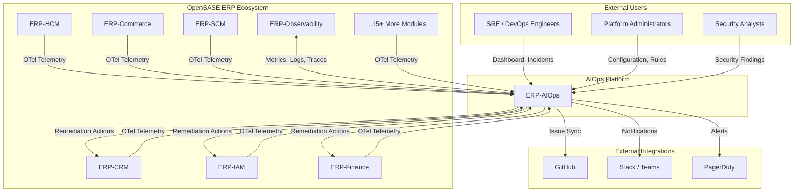
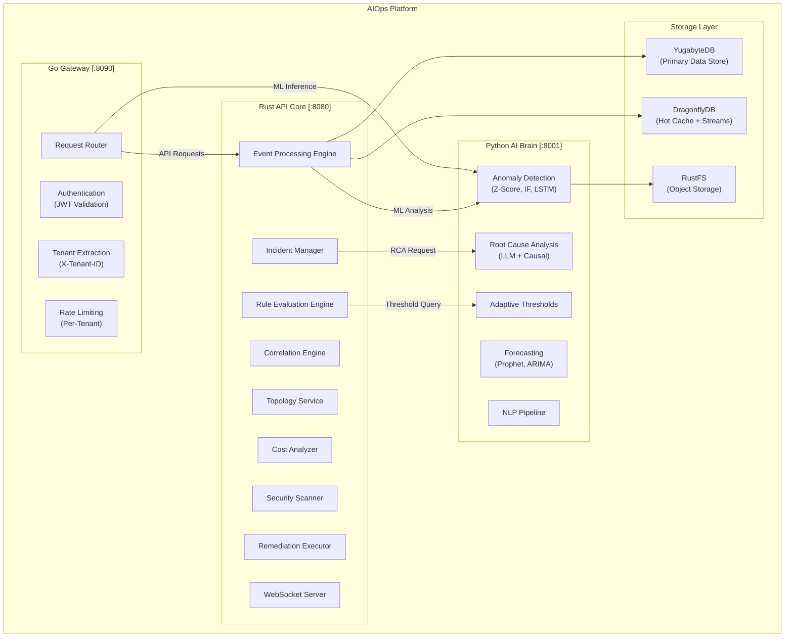
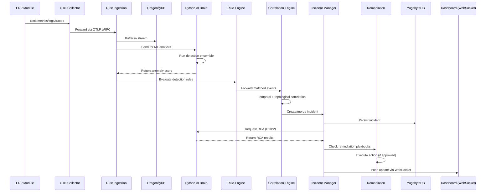

# ERP-AIOps High-Level Design

> **Document ID:** ERP-AIOPS-HLD-012
> **Version:** 1.0.0
> **Last Updated:** 2026-02-24
> **Status:** Approved
> **Related Documents:** [01-Technical-Writeup.md](./01-Technical-Writeup.md), [13-Low-Level-Design.md](./13-Low-Level-Design.md), [04-Software-Architecture.md](./04-Software-Architecture.md)

---

## 1. System Context

ERP-AIOps sits at the center of the OpenSASE ERP ecosystem, providing AI-powered operations intelligence across all 20+ modules. It ingests telemetry from every module, analyzes it using machine learning, and takes corrective action when issues are detected.

### System Context Diagram



### Key Interactions

| Integration | Direction | Protocol | Purpose |
|-------------|-----------|----------|---------|
| ERP Modules -> AIOps | Inbound | OTel gRPC/HTTP | Telemetry ingestion |
| AIOps -> ERP-Observability | Bidirectional | HTTP/gRPC | Query metrics (VictoriaMetrics), logs (Quickwit) |
| AIOps -> ERP Modules | Outbound | HTTP/gRPC | Execute remediation actions |
| AIOps -> GitHub | Outbound | REST API | Create/update issues for incidents |
| AIOps -> Slack/Teams | Outbound | Webhook | Notifications and approval requests |
| AIOps -> PagerDuty | Outbound | REST API | Incident escalation |
| Users -> AIOps | Inbound | HTTPS/WSS | Dashboard, API, WebSocket streams |

---

## 2. Container Diagram

The AIOps platform consists of five primary containers, each with distinct responsibilities.

### Container Architecture



### Container Details

| Container | Technology | Port | Responsibility |
|-----------|-----------|------|----------------|
| Go Gateway | Go 1.22 + net/http | 8090 | Authentication, tenant extraction, rate limiting, routing |
| Rust API Core | Rust + Axum | 8080 | Event processing, correlation, rules, incidents, topology, cost, security, remediation, WebSocket |
| Python AI Brain | Python 3.12 + FastAPI | 8001 | Anomaly detection, RCA, forecasting, adaptive thresholds, NLP |
| YugabyteDB | YugabyteDB 2.20 | 5433 | Persistent storage for incidents, rules, config, findings, topology |
| DragonflyDB | DragonflyDB 1.x | 6379 | Hot cache, real-time event streams, pub/sub for WebSocket |
| RustFS | MinIO-compatible | 9000 | ML model artifacts, historical data exports, report storage |

---

## 3. Data Flow: Telemetry Ingestion to Action

The end-to-end data flow from telemetry ingestion through ML analysis to corrective action follows a streaming architecture designed for sub-second latency.

### Data Flow Diagram



### Data Flow Stages

**Stage 1: Telemetry Ingestion (< 10ms)**
- All ERP modules emit telemetry via OpenTelemetry SDKs.
- OTel Collector federation receives, processes (batching, filtering, enrichment), and exports to AIOps.
- The Rust ingestion pipeline accepts up to 100,000 events per second per node.

**Stage 2: Feature Extraction and Buffering (< 5ms)**
- Raw metrics are enriched with metadata (tenant, service, environment).
- Features are computed: rolling statistics, rate of change, seasonality components.
- Events are buffered in DragonflyDB streams for downstream consumers.

**Stage 3: ML Analysis (< 100ms)**
- The Python AI brain runs the detection ensemble (Z-Score, IQR, Isolation Forest, LSTM).
- Anomaly scores are computed and returned to the Rust API.
- Adaptive thresholds are applied to determine alert/suppress decision.

**Stage 4: Rule Evaluation (< 10ms)**
- Detection rules are evaluated against the enriched event with anomaly score.
- Matching rules trigger actions (create incident, send notification, trigger remediation).
- Suppression rules prevent alerts during maintenance windows.

**Stage 5: Event Correlation (< 500ms)**
- Events are correlated using temporal proximity, topological relationships, and historical pattern matching.
- Correlated events are grouped into a single incident, reducing noise by up to 95%.

**Stage 6: Incident Management**
- Incidents are created or updated in YugabyteDB.
- Notifications are sent to configured channels (Slack, Teams, PagerDuty).
- For P1/P2 incidents, RCA is triggered automatically.

**Stage 7: Automated Remediation**
- Matching remediation playbooks are identified.
- Approval policies are checked (auto-approve, manual approve, time-based).
- Actions are executed against the target service with verification.

---

## 4. Integration with ERP-Observability

ERP-AIOps has a deep bidirectional integration with the ERP-Observability module, which provides the foundational metrics, logs, and traces infrastructure.

### Integration Architecture

```
┌─────────────────────────────────────────────────────────────┐
│                    ERP-Observability                        │
│                                                             │
│  ┌─────────────────┐  ┌──────────────┐  ┌───────────────┐ │
│  │ VictoriaMetrics │  │   Quickwit   │  │  Tempo/OTel   │ │
│  │ (Metrics Store) │  │ (Log Store)  │  │ (Trace Store) │ │
│  └────────┬────────┘  └──────┬───────┘  └───────┬───────┘ │
│           │                  │                   │         │
└───────────┼──────────────────┼───────────────────┼─────────┘
            │                  │                   │
            v                  v                   v
┌───────────────────────────────────────────────────────────────┐
│                       ERP-AIOps                               │
│                                                               │
│  ┌─────────────────┐  ┌──────────────┐  ┌───────────────┐   │
│  │ Metric Queries  │  │  Log Queries │  │ Trace Queries │   │
│  │ (PromQL via     │  │  (Quickwit   │  │ (TraceQL via  │   │
│  │  VictoriaMetrics│  │   Search API)│  │  OTel API)    │   │
│  │  API)           │  │              │  │               │   │
│  └─────────────────┘  └──────────────┘  └───────────────┘   │
│                                                               │
│  Use Cases:                                                   │
│  • RCA: Query logs around incident time window                │
│  • Anomaly Detection: Fetch historical metrics for baseline   │
│  • Forecasting: Retrieve long-range time series               │
│  • Topology: Build service map from trace data                │
└───────────────────────────────────────────────────────────────┘
```

### Query Patterns

| Use Case | Source | Query Type | Example |
|----------|--------|-----------|---------|
| Baseline computation | VictoriaMetrics | PromQL range query | `avg_over_time(cpu_usage{service="erp-crm"}[7d])` |
| RCA evidence | Quickwit | Full-text search | `service:erp-iam AND level:error AND timestamp:[now-1h TO now]` |
| Trace analysis | OTel/Tempo | TraceQL | `{resource.service.name="erp-commerce" && duration>1s}` |
| Forecasting input | VictoriaMetrics | PromQL export | `export(disk_usage{service="erp-finance"}, start=-90d)` |

---

## 5. Integration with ERP Modules via OTel

All 20+ ERP modules are instrumented with OpenTelemetry SDKs. AIOps provides a standardized telemetry pipeline that each module connects to.

### OTel Federation Architecture

```
┌────────────────────────────────────────────────────────────────────┐
│                    Module-Level OTel Collectors                    │
│                                                                    │
│  ┌───────────┐ ┌───────────┐ ┌───────────┐ ┌───────────┐        │
│  │ CRM       │ │ IAM       │ │ Finance   │ │ HCM       │  ...   │
│  │ Collector │ │ Collector │ │ Collector │ │ Collector │        │
│  └─────┬─────┘ └─────┬─────┘ └─────┬─────┘ └─────┬─────┘        │
│        │              │              │              │              │
└────────┼──────────────┼──────────────┼──────────────┼──────────────┘
         │              │              │              │
         └──────────────┴──────┬───────┴──────────────┘
                               │
                               v
                    ┌──────────────────────┐
                    │ AIOps OTel Gateway   │
                    │ Collector            │
                    │                      │
                    │ • Receive from all   │
                    │   module collectors  │
                    │ • Enrich with tenant │
                    │   and module metadata│
                    │ • Route to:          │
                    │   - AIOps Ingestion  │
                    │   - Observability    │
                    │     (VictoriaMetrics,│
                    │      Quickwit)       │
                    └──────────────────────┘
```

### Telemetry Signals

| Signal | Content | Volume (per module) | Retention |
|--------|---------|--------------------:|-----------|
| Metrics | CPU, memory, disk, network, request rate, error rate, latency | ~500 series | 90 days (raw), 1 year (downsampled) |
| Logs | Application logs, access logs, audit logs | ~10K events/min | 30 days (hot), 1 year (cold) |
| Traces | Distributed transaction traces with span context | ~5K traces/min | 14 days (hot), 90 days (sampled) |

---

## 6. Non-Functional Requirements

| Requirement | Target | Measurement |
|-------------|--------|-------------|
| Anomaly Detection Latency | < 100ms (p99) | Time from metric ingestion to anomaly score |
| Event Correlation Latency | < 500ms (p99) | Time to correlate related events |
| RCA Completion Time | < 120 seconds | Time from trigger to report delivery |
| API Response Time | < 50ms (p95) | Gateway to response for CRUD operations |
| Throughput | 100K events/sec/node | Sustained ingestion rate |
| Availability | 99.9% | Uptime SLA for the AIOps platform |
| Data Durability | 99.999% | YugabyteDB replication factor 3 |
| Tenant Isolation | 100% | Zero cross-tenant data leakage |
