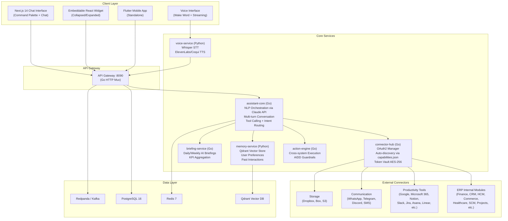

# ERP-Assistant Technical Writeup

## Executive Summary

ERP-Assistant is an enterprise-grade Personal AI Assistant module within the OpenSASE ERP platform. It serves as the intelligent conversational layer connecting every ERP module -- Finance, CRM, HCM, Commerce, Healthcare, SCM, Projects, Workspace, and more -- with external productivity tools such as Google Workspace, Microsoft 365, Slack, Jira, Notion, and 15+ additional integrations. Built on a polyglot microservices architecture (Go for orchestration, Python for ML/voice), ERP-Assistant delivers natural-language query resolution, cross-module workflow automation, daily AI-generated briefings, and a voice interface, all governed by AIDD (AI-Driven Development) guardrails that enforce human-in-the-loop confirmation for sensitive operations.

The module was previously codenamed **OpenClaw** during internal development and has been renamed to **ERP-Assistant** for alignment with the OpenSASE module naming convention. It is benchmarked against Microsoft Copilot, Google Assistant, Notion AI, and Zapier, delivering deeper ERP integration than any of these competitors while maintaining enterprise-grade security through ERP-IAM federation, AES-256 token vaults, and per-tenant conversation isolation.

## Architecture Overview

ERP-Assistant follows a hub-and-spoke microservices architecture with six core services, an API gateway, and a connector ecosystem spanning 28+ integration targets.



## Technology Stack

| Layer | Technology | Version | Rationale |
|-------|-----------|---------|-----------|
| API Gateway | Go (net/http) | 1.22 | Lightweight, low-latency, matches platform conventions |
| NLP Orchestration | Claude API (Anthropic) | Latest | Best-in-class tool calling, multi-turn reasoning |
| Microservices (Go) | Go | 1.22 | Fast compilation, simple deployment, low memory |
| Microservices (Python) | Python / FastAPI | 3.12 | ML ecosystem access for vector search and voice |
| Primary Database | PostgreSQL | 16 | JSONB for conversation logs, array types, FTS |
| Cache | Redis | 7 | Session state, rate limiting, conversation context |
| Vector Store | Qdrant | Latest | High-performance similarity search for memory |
| Event Streaming | Redpanda / Kafka | Latest | CloudEvents envelope, cross-module event bus |
| STT Engine | OpenAI Whisper | Large-v3 | Best open-source speech recognition accuracy |
| TTS Engine | ElevenLabs / Coqui | Latest | Natural voice synthesis with streaming support |
| Web Frontend | Next.js | 14.2.13 | App Router, RSC, streaming for chat UI |
| Widget | React | 18.3.1 | Embeddable, framework-agnostic |
| Mobile | Flutter | Latest | Single codebase iOS/Android, hot reload |
| Container Runtime | Docker | Compose 3.9 | Multi-service orchestration for development |
| CI/CD | GitHub Actions | v4 | Go test, lint, build on push/PR |

## Service Deep Dive

### assistant-core (Go)

The central orchestration service implementing NLP understanding through the Claude API. It manages:

- **Multi-turn conversation**: Maintains conversation state per-user per-tenant with sliding window context
- **Tool calling**: Dynamically generates tool definitions from connected module capabilities.json files
- **Intent routing**: Classifies user intents (query, action, briefing, navigation, workflow) and routes to appropriate services
- **Entity resolution**: Extracts entities (employee names, invoice IDs, project codes) from natural language and resolves against ERP data
- **Confirmation prompts**: For write/delete/bulk operations, generates human-readable confirmation dialogs before execution

### connector-hub (Go)

The OAuth2 connection manager and integration gateway:

- **Auto-discovery**: Scans `ERP-*` modules for `capabilities.json` files to automatically generate connector stubs
- **OAuth2 flow management**: Handles authorization code, PKCE, client credentials, and refresh token flows for all 28+ external services
- **Token vault**: AES-256 encrypted storage of OAuth tokens, API keys, and webhook secrets, delegating key management to ERP-IAM
- **Rate limiting**: Per-connector rate limiting to respect third-party API quotas
- **Health monitoring**: Periodic connectivity checks on all active connectors

### action-engine (Go)

Cross-system action execution with AIDD guardrails:

| Action Type | Policy | Example |
|------------|--------|---------|
| Read | Allowed (autonomous) | "Show me last month's revenue" |
| Write (non-sensitive) | Allowed with logging | "Update my Slack status" |
| Write (sensitive) | Confirm before execution | "Approve this purchase order" |
| Delete | Always confirm | "Delete the draft invoice" |
| Bulk operations | Always confirm with preview | "Mark all overdue invoices as urgent" |

### memory-service (Python / FastAPI)

Vector-based long-term memory using Qdrant:

- **User preferences**: Learned patterns like preferred report formats, favorite dashboards, timezone settings
- **Past interactions**: Semantic search over conversation history for context enrichment
- **Personalized shortcuts**: Frequently used commands are surfaced as quick actions
- **Embedding pipeline**: Text embeddings via sentence-transformers for semantic similarity

### briefing-service (Go)

AI-generated daily and weekly briefings aggregating data from all connected modules:

- **KPI dashboard**: Revenue, pipeline value, headcount, open tickets, project milestones
- **Pending approvals**: Purchase orders, leave requests, expense reports awaiting action
- **Calendar integration**: Today's meetings from Google Calendar / Microsoft 365
- **Deadline alerts**: Approaching deadlines across Projects, Commerce, and SCM
- **Anomaly detection**: Statistical outliers in financial metrics, unusual activity patterns

### voice-service (Python / FastAPI)

Speech interface with STT and TTS capabilities:

- **Whisper STT**: OpenAI Whisper Large-v3 for accurate speech-to-text
- **ElevenLabs / Coqui TTS**: Natural voice synthesis with configurable voice profiles
- **Wake word detection**: Customizable activation phrase per tenant
- **Streaming transcription**: Real-time speech processing via WebSocket

## Connector Ecosystem

### ERP Internal Connectors

Auto-generated from module capabilities.json files:

| Connector | Module | Capabilities |
|-----------|--------|-------------|
| finance.go | ERP-Finance | Invoices, payments, GL, budgets |
| crm.go | ERP-CRM | Contacts, deals, pipelines, activities |
| hcm.go | ERP-HCM | Employees, payroll, leave, attendance |
| commerce.go | ERP-Commerce | Orders, inventory, pricing |
| healthcare.go | ERP-Healthcare | Patients, appointments, records |
| school.go | ERP-School-Management | Students, courses, grades |
| church.go | ERP-Church-Management | Members, donations, events |
| bss_oss.go | ERP-BSS-OSS | Subscriptions, service orders |
| platform.go | ERP-Platform | Tenants, configuration, entitlements |
| workspace.go | ERP-Workspace | Documents, collaboration |

### External Productivity Connectors

| Connector | Protocol | Capabilities |
|-----------|---------|-------------|
| Google Workspace | OAuth2 + REST | Gmail, Calendar, Drive, Docs, Sheets |
| Microsoft 365 | OAuth2 + Graph API | Outlook, Teams, OneDrive, SharePoint |
| Notion | OAuth2 + REST | Pages, databases, blocks |
| Slack | OAuth2 + Events API | Messages, channels, reactions |
| Jira | OAuth2 + REST | Issues, sprints, boards |
| Asana | OAuth2 + REST | Tasks, projects, portfolios |
| Trello | OAuth2 + REST | Cards, boards, lists |
| Linear | OAuth2 + GraphQL | Issues, projects, cycles |
| Todoist | OAuth2 + REST | Tasks, projects, labels |
| Calendly | OAuth2 + REST | Events, scheduling links |

### Communication Connectors

| Connector | Protocol | Capabilities |
|-----------|---------|-------------|
| WhatsApp | WhatsApp Business API | Messages, templates, media |
| Telegram | Bot API | Messages, inline queries, commands |
| Discord | Bot API + OAuth2 | Messages, channels, slash commands |
| SMS | Twilio / MessageBird | Outbound messages, delivery status |

### Storage Connectors

| Connector | Protocol | Capabilities |
|-----------|---------|-------------|
| Dropbox | OAuth2 + REST | Files, folders, sharing |
| Box | OAuth2 + REST | Files, folders, metadata |
| Amazon S3 | AWS SDK | Buckets, objects, presigned URLs |

## Security Architecture

All operations flow through ERP-IAM for authentication and authorization:

- **JWT validation**: Every API request requires a valid Bearer token from ERP-IAM
- **Tenant isolation**: `X-Tenant-ID` header enforced on all business endpoints; conversation data is strictly partitioned
- **Token vault encryption**: AES-256-GCM for all stored OAuth tokens and API keys
- **AIDD guardrails**: Prohibited actions (cross-tenant access, irreversible deletes, privilege escalation) are blocked at the action-engine level
- **Decision logging**: Every AI decision and action is logged with full audit trail
- **Rollback window**: 24-hour rollback capability for supervised actions

## Event Architecture

Events follow the CloudEvents specification with topic naming convention `erp.<module>.<entity>.<action>`:

| Topic | Trigger |
|-------|---------|
| `erp.assistant.briefing.created` | New briefing generated |
| `erp.assistant.briefing.updated` | Briefing content refreshed |
| `erp.assistant.briefing.deleted` | Briefing removed |
| `erp.assistant.briefing.listed` | Briefing list queried |
| `erp.assistant.briefing.read` | Individual briefing accessed |
| `erp.assistant.voice.listed` | Voice sessions queried |
| `erp.assistant.command.executed` | User command processed |
| `erp.assistant.action.confirmed` | User confirmed an action |
| `erp.assistant.action.rejected` | User rejected an action |
| `erp.assistant.connector.connected` | New external tool connected |
| `erp.assistant.connector.disconnected` | External tool disconnected |

## Deployment

Local development via Docker Compose:

```bash
docker compose up --build
```

Services exposed:
- API Gateway: `localhost:8094` (mapped from container :8090)
- Memory Service: `localhost:8204` (mapped from container :8080)
- Voice Service: `localhost:8208` (mapped from container :8080)
- PostgreSQL: `localhost:5432`
- Redis: `localhost:6379`

## SDK Support

Three official SDKs are provided:

- **TypeScript SDK**: Type-safe client with `AssistantCommand` types for web/Node.js integration
- **Python SDK**: `AssistantClient` class for data science and automation scripts
- **Go SDK**: `Client` struct for server-side Go applications

## Conclusion

ERP-Assistant represents the intelligent layer of the OpenSASE ERP platform, transforming complex multi-module operations into simple conversational interactions. Its AIDD-governed approach ensures that AI augments human decision-making rather than replacing it, with clear guardrails on what actions can be taken autonomously versus those requiring explicit confirmation.
