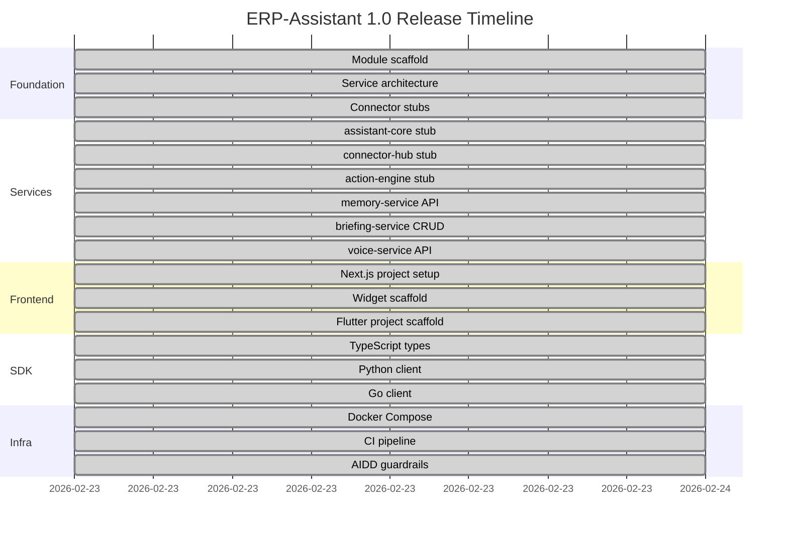

# ERP-Assistant Release Notes

## Version 1.0.0 -- Initial Release (2026-02-23)

### Overview

First public release of ERP-Assistant, the Personal AI Assistant module for the OpenSASE ERP platform. This release establishes the foundational architecture including six core services, 28+ connectors, multi-platform frontends, and comprehensive AIDD governance.

### What's New

#### Core Platform

- **assistant-core**: Go-based NLP orchestration service with Claude API integration for multi-turn conversations, tool calling, intent routing, and entity resolution
- **connector-hub**: OAuth2 connection manager with auto-discovery of ERP modules via capabilities.json, AES-256 token vault secured through ERP-IAM
- **action-engine**: Cross-system action execution with AIDD guardrails (read=allowed, write-sensitive=confirm, delete=always-confirm, bulk=always-confirm)
- **memory-service**: Python/FastAPI service with Qdrant vector store for user preferences, past interactions, and personalized shortcuts
- **briefing-service**: Go-based daily/weekly AI-generated briefing service with full CRUD API and CloudEvents integration
- **voice-service**: Python/FastAPI service with Whisper STT and ElevenLabs/Coqui TTS for voice interactions

#### Connectors

- **ERP Internal** (10 connectors): Finance, CRM, HCM, Commerce, Healthcare, School Management, Church Management, BSS-OSS, Platform, Workspace
- **Productivity** (11 connectors): Google Workspace, Microsoft 365, Notion, Slack, Jira, Asana, Trello, Linear, Todoist, Calendly, Zapier
- **Communication** (4 connectors): WhatsApp, Telegram, Discord, SMS
- **Storage** (3 connectors): Dropbox, Box, Amazon S3

#### Frontends

- **Next.js 14 Web Interface**: Chat interface with command palette (Cmd+K)
- **Embeddable React Widget**: Collapsible widget for embedding in any web application
- **Flutter Mobile App**: Standalone mobile application for iOS and Android

#### SDKs

- **TypeScript SDK**: Type-safe `AssistantCommand` interface for web and Node.js
- **Python SDK**: `AssistantClient` class for data science workflows
- **Go SDK**: `Client` struct for server-side integration

#### Infrastructure

- Docker Compose orchestration with 8 services (6 application + PostgreSQL + Redis)
- GitHub Actions CI pipeline with Go test automation
- AIDD guardrails configuration via `aidd.guardrails.yaml`

### API Endpoints

| Endpoint | Method | Description |
|----------|--------|-------------|
| `/healthz` | GET | Health check |
| `/v1/capabilities` | GET | Module capabilities discovery |
| `/v1/command` | POST | Natural language command execution |
| `/v1/briefing` | GET/POST | Briefing list and creation |
| `/v1/briefing/{id}` | GET/PUT/PATCH/DELETE | Individual briefing CRUD |
| `/v1/voice` | GET | Voice session listing |

### Architecture Decisions

- **ADR-001**: Polyglot architecture -- Go for orchestration services, Python for ML/voice services
- **ADR-002**: PostgreSQL primary datastore, Redis cache, Qdrant vectors, ClickHouse OLAP, MinIO objects

### Event Topics

```
erp.assistant.briefing.created
erp.assistant.briefing.updated
erp.assistant.briefing.deleted
erp.assistant.briefing.listed
erp.assistant.briefing.read
erp.assistant.voice.listed
```

### Breaking Changes

None -- initial release.

### Known Limitations

- Service stubs for assistant-core, connector-hub, and action-engine are scaffolded but not yet fully implemented
- Integration and E2E test suites are placeholder stubs
- Voice service supports listing only; full STT/TTS pipeline implementation pending
- Memory service health check endpoint only; vector operations pending Qdrant integration

### Migration Guide

Not applicable -- first release. For new installations, run:

```bash
docker compose up --build
```

### Security Notes

- All endpoints require ERP-IAM JWT Bearer tokens (minimum 20 characters validated)
- Tenant isolation enforced via mandatory `X-Tenant-ID` header
- OAuth token storage uses AES-256-GCM encryption
- Cross-tenant data access is a prohibited action under AIDD governance
- 24-hour rollback window for all supervised actions

### Deprecations

- The internal codename **OpenClaw** is deprecated. Use **ERP-Assistant** in all references.

### Contributors

- OpenSASE Platform Engineering Team

### Roadmap for 1.1.0

- Full Claude API integration in assistant-core with streaming responses
- OAuth2 flow implementation in connector-hub for top 5 external tools
- Qdrant vector pipeline in memory-service
- Whisper + ElevenLabs streaming pipeline in voice-service
- Daily briefing aggregation from ERP-Finance and ERP-CRM
- E2E test coverage for natural-language-to-action flow

---


