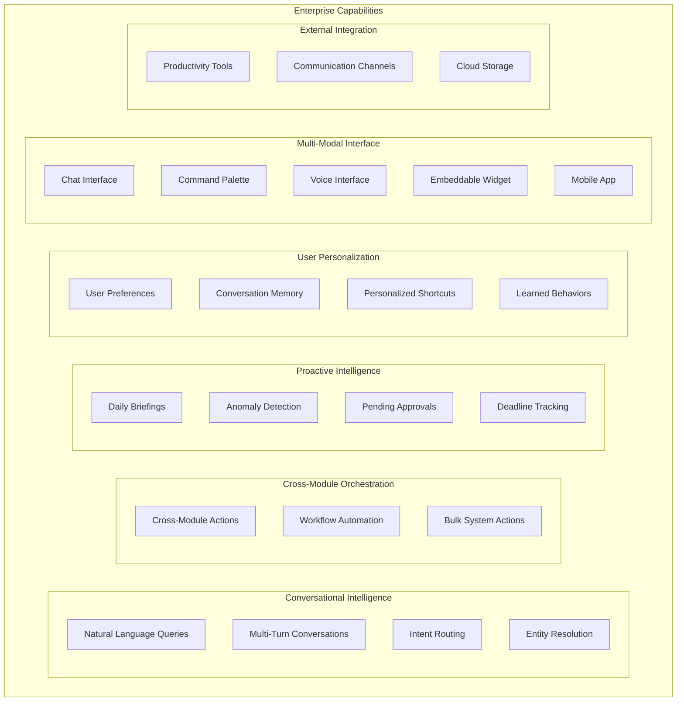
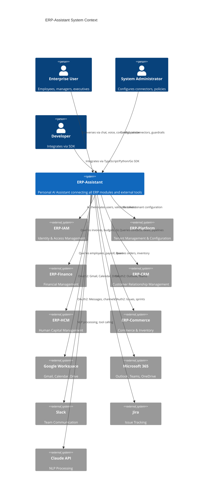
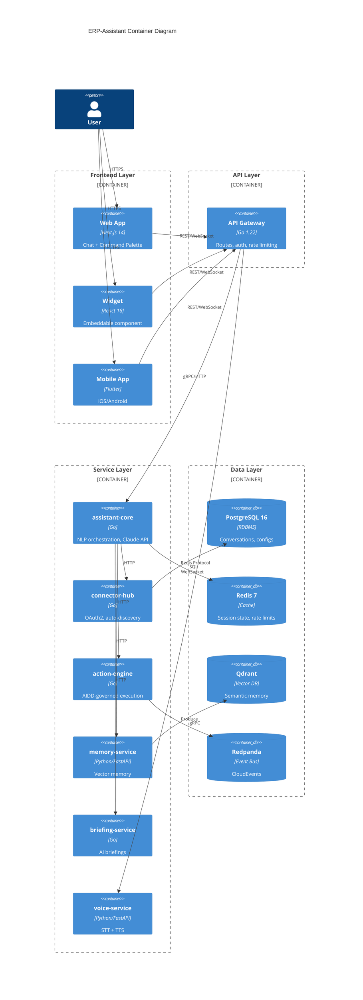
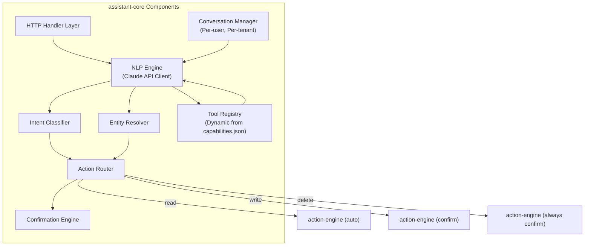
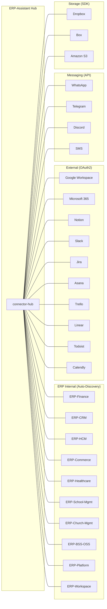
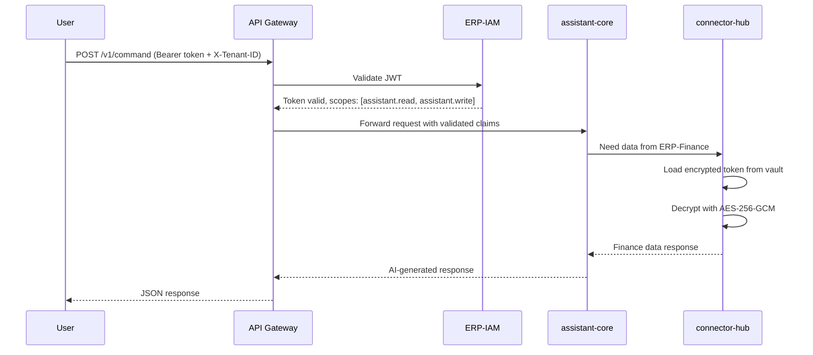
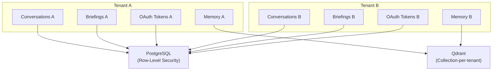

# ERP-Assistant Enterprise Architecture

## 1. Strategic Context

ERP-Assistant is the intelligent conversational layer of the OpenSASE ERP platform. It occupies a unique position in the enterprise architecture as the **only module that connects to every other module**, serving as the universal access point for users who need to query, act on, or be briefed about data across Finance, CRM, HCM, Commerce, Healthcare, SCM, Projects, Workspace, and all external productivity tools.

### Business Capability Mapping

## 2. C4 Architecture Model

### Level 1: System Context

### Level 2: Container View

### Level 3: Component View -- assistant-core

## 3. Integration Architecture

### Integration Topology

### Authentication Flow

## 4. Data Architecture

### Data Flow Matrix

| Data Domain | Source | Storage | Access Pattern |
|------------|--------|---------|----------------|
| Conversations | User input | PostgreSQL | Write-heavy, per-tenant partitioned |
| Conversation context | assistant-core | Redis | Ephemeral, TTL-based |
| User preferences | memory-service | Qdrant + PostgreSQL | Read-heavy, personalized |
| OAuth tokens | connector-hub | PostgreSQL (encrypted) | Read-heavy, cached in Redis |
| Briefing data | briefing-service | PostgreSQL | Scheduled generation, read-heavy |
| Voice transcripts | voice-service | PostgreSQL + S3 | Write-once, read-many |
| Audit logs | action-engine | PostgreSQL + Redpanda | Append-only, compliance |
| Module capabilities | ERP-* modules | Redis (cached) | Periodic refresh |

### Tenant Isolation Model

## 5. Governance & Compliance

### AIDD Guardrails Integration

The Enterprise Architecture enforces AIDD governance at every layer:

1. **API Gateway**: Validates that requests include tenant context and valid authentication
2. **assistant-core**: Classifies intent risk level before routing
3. **action-engine**: Enforces guardrail policies from `aidd.guardrails.yaml`
4. **Audit trail**: Every decision and action is logged to Redpanda for compliance

### Risk Classification Matrix

| Risk Level | Actions | Governance |
|-----------|---------|-----------|
| Low | Read queries, list operations | Autonomous execution |
| Medium | Non-sensitive writes, notifications | Logged, autonomous |
| High | Sensitive writes, workflow automation | Human confirmation required |
| Critical | Delete operations, bulk mutations | Always confirm with preview |
| Prohibited | Cross-tenant access, privilege escalation | Blocked, alert raised |

## 6. Disaster Recovery & Business Continuity

| Component | RPO | RTO | Strategy |
|-----------|-----|-----|----------|
| PostgreSQL | 1 minute | 15 minutes | Streaming replication + WAL archiving |
| Redis | 5 minutes | 5 minutes | Redis Sentinel + AOF persistence |
| Qdrant | 1 hour | 30 minutes | Snapshot + restore from S3 |
| Redpanda | 0 (replicated) | 5 minutes | Multi-broker replication |
| Services | N/A | 2 minutes | Kubernetes rolling deployment |

## 7. Technology Radar

| Technology | Status | Rationale |
|-----------|--------|-----------|
| Claude API | Adopt | Best tool-calling accuracy for ERP use cases |
| Qdrant | Adopt | Purpose-built vector search, gRPC native |
| Whisper Large-v3 | Adopt | Best open-source STT accuracy |
| ElevenLabs TTS | Trial | Natural voice quality, evaluate cost at scale |
| Coqui TTS | Assess | Open-source alternative for self-hosted deployments |
| WebSocket streaming | Adopt | Required for real-time voice and chat |
| Flutter | Adopt | Single codebase mobile with native performance |
