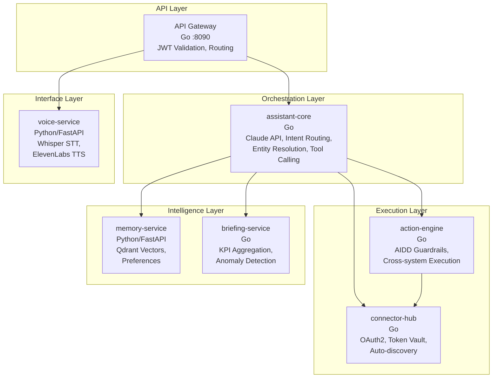
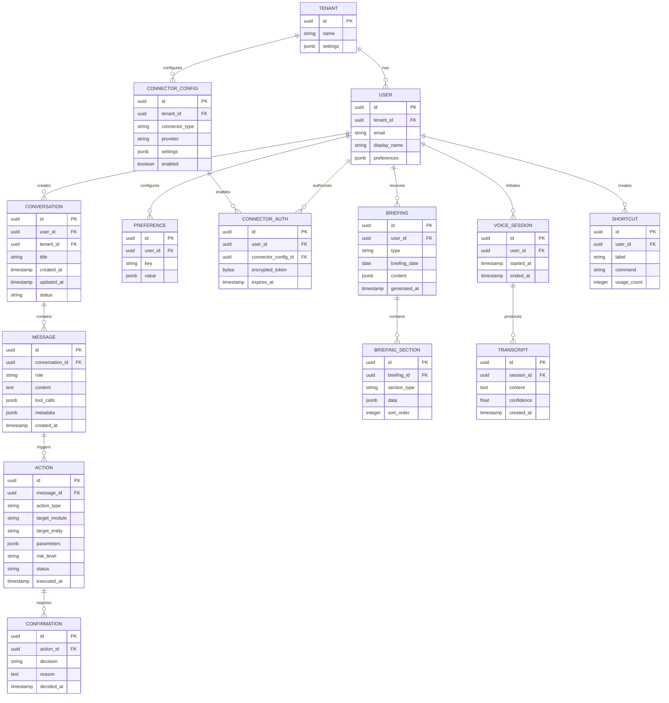
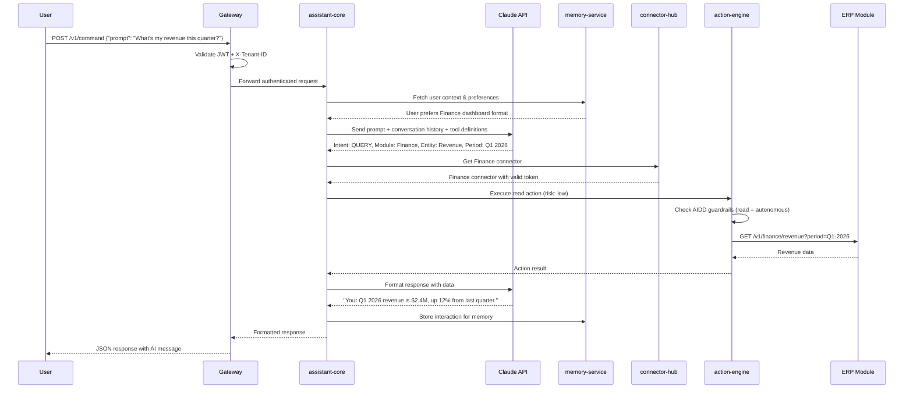
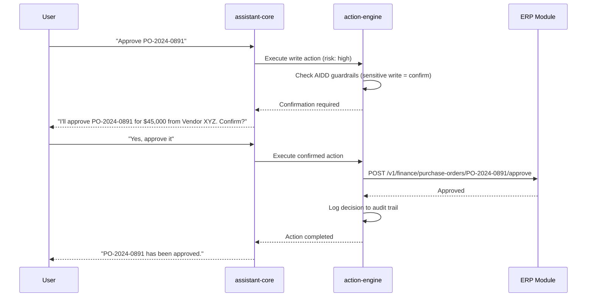
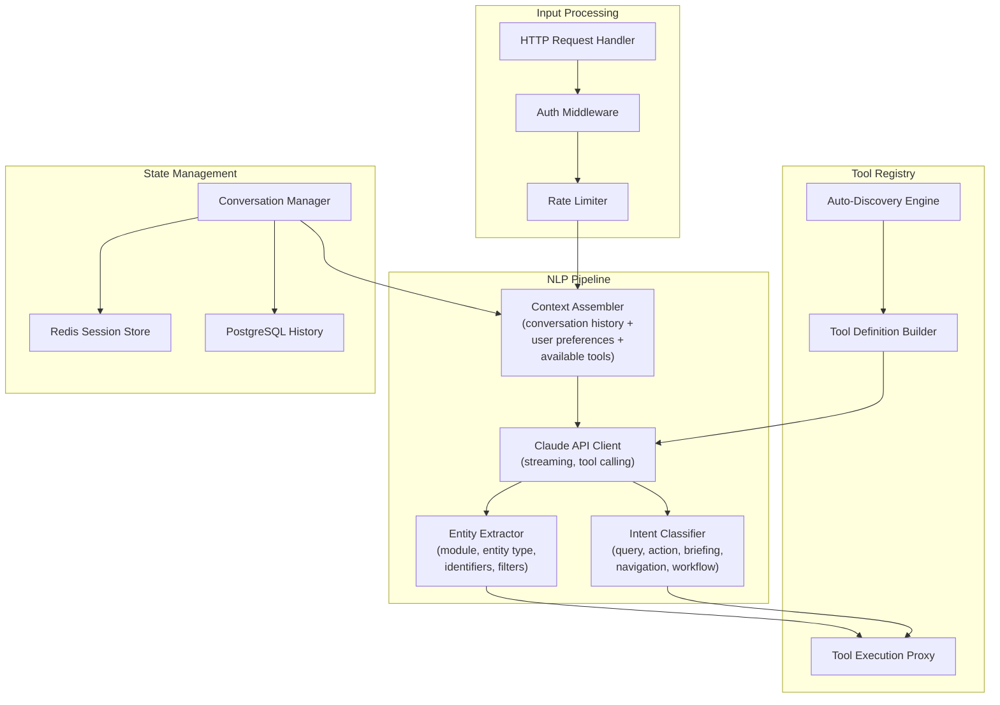
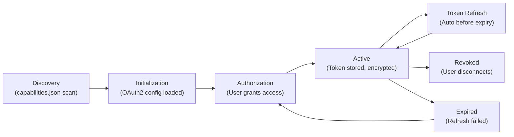
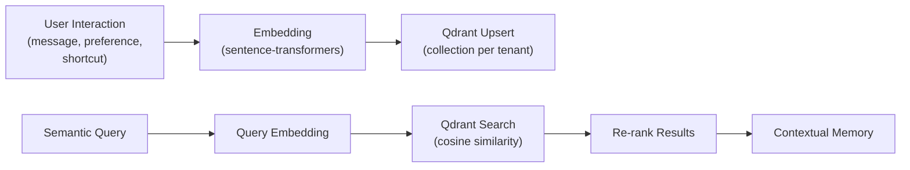
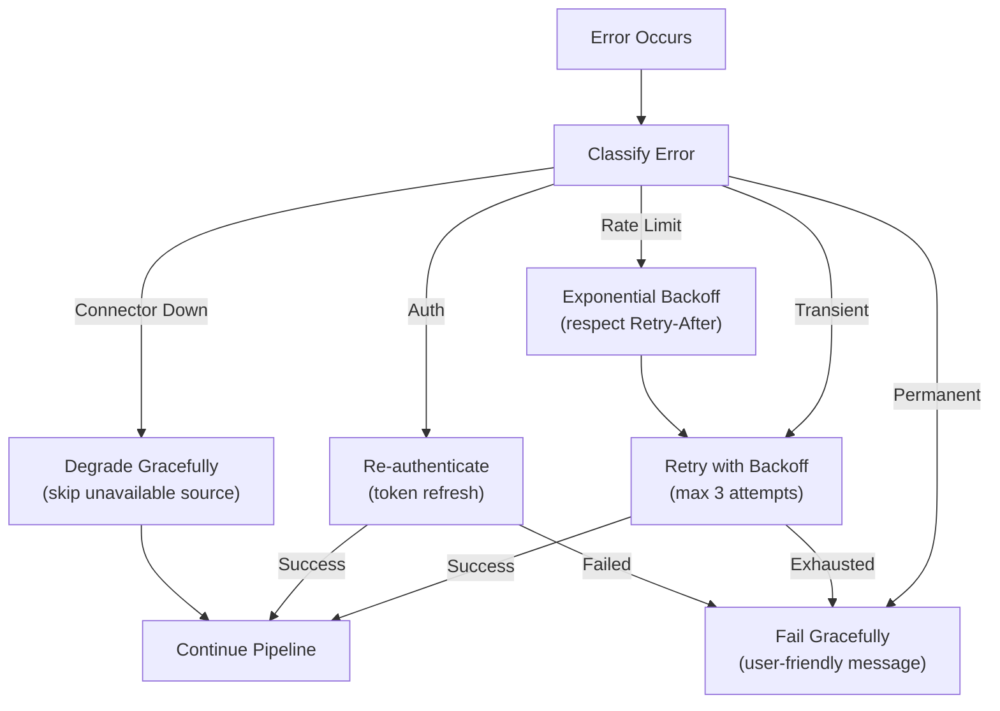

# ERP-Assistant Software Architecture

## 1. Architectural Style

ERP-Assistant employs a **polyglot microservices architecture** with an event-driven backbone. Go services handle orchestration, connection management, and business logic; Python services handle machine learning workloads (vector search, speech processing). All services communicate through a combination of synchronous HTTP/gRPC calls and asynchronous CloudEvents via Redpanda/Kafka.

### Architectural Principles

1. **Single Responsibility**: Each service owns exactly one domain (NLP, connections, actions, memory, briefings, voice)
2. **Polyglot by Design**: Language chosen per-domain constraint -- Go for performance-critical orchestration, Python for ML ecosystem
3. **AIDD-First**: Every action pipeline incorporates governance checks before execution
4. **Tenant Isolation**: All data paths enforce tenant context via `X-Tenant-ID` propagation
5. **Connector Auto-Discovery**: New ERP modules are automatically integrated via capabilities.json scanning
6. **Fail-Open for Reads, Fail-Closed for Writes**: Read operations degrade gracefully; write operations require explicit confirmation

## 2. Service Architecture



## 3. Domain Model

### Core Domain Entities



## 4. Request Processing Pipeline

### Natural Language Command Flow



### Write Action with Confirmation



## 5. assistant-core Internal Architecture



## 6. connector-hub Architecture

### OAuth2 Connection Lifecycle

```mermaid
statechart-v2
```



### Connector Interface

```go
type Connector interface {
    // Discovery
    Capabilities() CapabilityDoc
    HealthCheck(ctx context.Context) error

    // Authentication
    AuthorizationURL(state string) string
    ExchangeToken(ctx context.Context, code string) (*Token, error)
    RefreshToken(ctx context.Context, token *Token) (*Token, error)

    // Operations
    Execute(ctx context.Context, action Action) (*Result, error)
    Search(ctx context.Context, query SearchQuery) (*SearchResult, error)
}
```

## 7. memory-service Architecture

### Vector Pipeline



### Memory Types

| Type | Storage | TTL | Update Frequency |
|------|---------|-----|-----------------|
| Conversation history | Qdrant + PostgreSQL | 90 days | Every message |
| User preferences | Qdrant + PostgreSQL | Permanent | On change |
| Shortcuts | PostgreSQL | Permanent | On usage |
| Module context | Redis | 1 hour | On query |
| Embeddings | Qdrant | 90 days | On ingestion |

## 8. Error Handling Strategy



## 9. Performance Architecture

### Caching Strategy

| Layer | Cache | TTL | Invalidation |
|-------|-------|-----|-------------|
| API Gateway | Redis | 60s | On write event |
| Conversation context | Redis | 30 min | Session end |
| Module capabilities | Redis | 5 min | On module restart |
| OAuth tokens | Redis | Token expiry - 5min | On refresh |
| Briefing data | Redis | 1 hour | On regeneration |
| User preferences | Redis | 15 min | On preference change |

### Concurrency Model

- **assistant-core**: Go goroutine per request, bounded by semaphore (max 1000 concurrent)
- **connector-hub**: Connection pool per connector (max 50 per external service)
- **action-engine**: Serialized per-user for write operations, parallel for reads
- **memory-service**: Python asyncio with FastAPI, uvicorn workers (4x CPU cores)
- **voice-service**: WebSocket connections with asyncio, one goroutine per stream

## 10. Observability

### Metrics

| Metric | Type | Labels |
|--------|------|--------|
| `assistant_command_duration_seconds` | Histogram | intent, module, status |
| `assistant_action_total` | Counter | action_type, risk_level, outcome |
| `assistant_connector_health` | Gauge | connector, provider |
| `assistant_conversation_active` | Gauge | tenant_id |
| `assistant_briefing_generation_seconds` | Histogram | type, sections |
| `assistant_voice_transcription_seconds` | Histogram | language, confidence_bucket |

### Distributed Tracing

All services propagate OpenTelemetry trace context through HTTP headers. Trace spans cover:

1. Gateway request handling
2. NLP pipeline execution (Claude API call)
3. Entity resolution
4. Connector invocation
5. Action execution
6. Memory storage
7. Response formatting

```mermaid
gantt
    title Typical Command Trace (p50)
    dateFormat X
    axisFormat %Lms
    section Gateway
        Auth validation       :0, 5
        Route dispatch        :5, 7
    section assistant-core
        Context assembly      :7, 15
        Claude API call       :15, 180
        Entity resolution     :180, 200
    section connector-hub
        Token retrieval       :200, 205
        Module API call       :205, 250
    section action-engine
        Guardrail check       :250, 255
        Execute action        :255, 290
    section Response
        Format response       :290, 310
        Send to client        :310, 315
```


