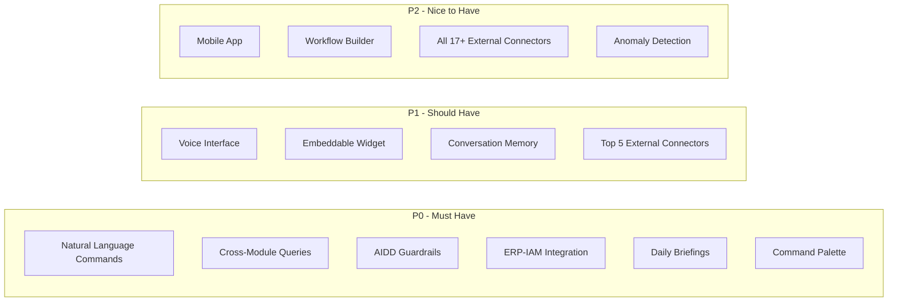

# ERP-Assistant Product Requirements Document (PRD)

## 1. Product Overview

### Vision

ERP-Assistant is the conversational AI layer of the OpenSASE ERP platform, enabling users to interact with every ERP module and external productivity tool through natural language, voice commands, and an intelligent command palette. It transforms complex multi-module enterprise operations into simple conversational interactions while maintaining enterprise-grade security and AI governance.

### Problem Statement

Enterprise users today navigate 10-15 different modules and tools daily, each with its own interface, search, and workflow. This fragmentation leads to:

- **Context switching**: Average of 30+ application switches per day per knowledge worker
- **Information silos**: Data across Finance, CRM, HCM, and external tools is not cross-referenced
- **Missed deadlines**: No unified view of pending approvals, upcoming deadlines, and action items
- **Repetitive tasks**: Manual execution of routine workflows that could be automated
- **No personalization**: Each module treats every user identically regardless of role or preference

### Target Users

| Persona | Description | Primary Use Cases |
|---------|------------|------------------|
| Executive | C-suite, VP level | Daily briefings, KPI queries, cross-module insights |
| Manager | Department heads | Pending approvals, team status, resource queries |
| Knowledge Worker | Analysts, coordinators | Cross-module searches, workflow automation, shortcuts |
| Administrator | IT, system admins | Connector configuration, guardrail management |
| Developer | Internal/external devs | SDK integration, custom tool building |

## 2. Competitive Analysis

### Feature Comparison Matrix

| Feature | ERP-Assistant | Microsoft Copilot | Google Assistant | Notion AI | Zapier |
|---------|:------------:|:-----------------:|:----------------:|:---------:|:------:|
| **Deep ERP Integration** | Native to all modules | Office 365 only | Google ecosystem | Notion only | API-level only |
| **Cross-Module Queries** | Yes (10+ modules) | Limited to M365 | Limited to Google | No | No |
| **Natural Language Actions** | Yes with AIDD guardrails | Yes (M365 scope) | Yes (Google scope) | Writing only | No (UI-based) |
| **Multi-Turn Conversation** | Yes (per-user, per-tenant) | Yes | Yes | Limited | No |
| **Tool Calling** | Dynamic per module | Predefined | Predefined | No | Predefined |
| **Daily AI Briefings** | Yes (all modules) | Partial (Viva) | No | No | No |
| **Voice Interface** | Yes (Whisper + TTS) | Yes (Cortana) | Yes (native) | No | No |
| **Command Palette** | Yes (Cmd+K) | No | No | Yes (limited) | No |
| **Embeddable Widget** | Yes | No | No | No | No |
| **External Tool Connectors** | 17+ (Google, MS, Slack, Jira...) | Microsoft ecosystem | Google ecosystem | Limited | 6000+ |
| **AIDD Governance** | Built-in guardrails | Limited | No | No | No |
| **Conversation Memory** | Vector-based (Qdrant) | Session only | Session only | Session only | No |
| **Personalized Shortcuts** | Learned from usage | No | Limited | No | Recipes |
| **Anomaly Detection** | AI-powered alerts | Partial | No | No | No |
| **Self-hosted Option** | Yes | No | No | No | No |
| **Multi-tenant** | Native | Per-org | Per-account | Per-workspace | Per-account |
| **Open SDK** | TS, Python, Go | Limited | Actions SDK | No | REST API |

### Competitive Advantages

1. **Native ERP depth**: Unlike Copilot (M365 only) or Google Assistant (Google only), ERP-Assistant connects to every OpenSASE module natively
2. **AIDD governance**: No competitor offers built-in AI guardrails with human-in-the-loop confirmation for sensitive operations
3. **True cross-module intelligence**: Can correlate Finance revenue with CRM pipeline, HCM headcount, and Commerce orders in a single query
4. **Self-hosted**: Unlike all competitors, ERP-Assistant can be deployed entirely on-premise
5. **Personalization depth**: Vector-based memory learns user preferences over time, unlike session-only competitors

### Competitive Gaps to Address

1. **Zapier connector breadth**: Zapier supports 6000+ integrations vs our 28+. Mitigated by Zapier connector acting as a bridge.
2. **Google/Microsoft native voice**: Their voice assistants have years of training data. Mitigated by using Whisper (best open-source STT).
3. **Notion AI writing quality**: Notion AI excels at document generation. Not our primary use case but briefing-service addresses similar needs.

## 3. Functional Requirements

### FR-01: Natural Language Command Processing

- **FR-01.1**: Accept natural language prompts via POST /v1/command with tenant context
- **FR-01.2**: Classify user intent into categories: query, action, briefing, navigation, workflow
- **FR-01.3**: Extract entities (module names, entity types, identifiers, date ranges, filters) from natural language
- **FR-01.4**: Route classified intents to the appropriate service (connector-hub for queries, action-engine for mutations, briefing-service for briefings)
- **FR-01.5**: Support multi-turn conversation with context carryover (e.g., "What about last quarter?" after a revenue query)
- **FR-01.6**: Generate human-readable responses using Claude API with relevant data context

### FR-02: Cross-Module Queries

- **FR-02.1**: Query any ERP module by natural language (e.g., "Show unpaid invoices over $10K")
- **FR-02.2**: Cross-reference data across modules (e.g., "Show deals linked to overdue invoices")
- **FR-02.3**: Support aggregate queries (e.g., "What's total revenue by region this quarter?")
- **FR-02.4**: Return structured data with appropriate formatting (tables, charts, lists)

### FR-03: Action Execution with AIDD Guardrails

- **FR-03.1**: Execute read operations autonomously without confirmation
- **FR-03.2**: Prompt for confirmation on sensitive write operations (e.g., approve PO, update salary)
- **FR-03.3**: Always require confirmation for delete operations with preview of affected data
- **FR-03.4**: Always require confirmation for bulk operations with affected count and preview
- **FR-03.5**: Log every action decision (approved, rejected, auto-executed) to audit trail
- **FR-03.6**: Support 24-hour rollback window for supervised actions

### FR-04: Connector Management

- **FR-04.1**: Auto-discover ERP modules by scanning capabilities.json files
- **FR-04.2**: Support OAuth2 flows (authorization code, PKCE, client credentials) for external tools
- **FR-04.3**: Store OAuth tokens encrypted with AES-256-GCM in PostgreSQL
- **FR-04.4**: Automatically refresh tokens before expiry
- **FR-04.5**: Provide connection health monitoring with alerts on failure
- **FR-04.6**: Support 17+ external productivity tool connectors

### FR-05: Daily/Weekly Briefings

- **FR-05.1**: Generate AI-powered daily briefings with KPI summaries from all connected modules
- **FR-05.2**: Include pending approvals count and priority items
- **FR-05.3**: Include today's calendar events from Google Calendar / Microsoft 365
- **FR-05.4**: Flag approaching deadlines across Projects, Commerce, and SCM
- **FR-05.5**: Detect and surface anomalies in financial and operational metrics
- **FR-05.6**: Support customizable briefing schedules and content preferences

### FR-06: Voice Interface

- **FR-06.1**: Accept speech input via Whisper STT with streaming transcription
- **FR-06.2**: Generate speech output via ElevenLabs or Coqui TTS
- **FR-06.3**: Support customizable wake word per tenant
- **FR-06.4**: Handle voice commands for common operations (queries, approvals, briefing playback)
- **FR-06.5**: Stream voice responses via WebSocket for low-latency interaction

### FR-07: Command Palette

- **FR-07.1**: Provide Cmd+K (Mac) / Ctrl+K (Windows) global shortcut
- **FR-07.2**: Support fuzzy search across all connected modules and tools
- **FR-07.3**: Display recently used commands and personalized shortcuts
- **FR-07.4**: Support keyboard navigation (arrow keys, Enter, Escape)
- **FR-07.5**: Show inline previews for search results

### FR-08: Conversation Memory

- **FR-08.1**: Store user interaction history in Qdrant vector store
- **FR-08.2**: Use semantic similarity to retrieve relevant past interactions for context enrichment
- **FR-08.3**: Learn user preferences from interaction patterns
- **FR-08.4**: Surface frequently used commands as personalized shortcuts
- **FR-08.5**: Support conversation history browsing and search in the UI

### FR-09: Embeddable Widget

- **FR-09.1**: Provide a React component that can be embedded in any web application
- **FR-09.2**: Support collapsed (icon) and expanded (chat) states
- **FR-09.3**: Authenticate via parent application's JWT token
- **FR-09.4**: Support theming to match host application design

### FR-10: Mobile Application

- **FR-10.1**: Provide a standalone Flutter application for iOS and Android
- **FR-10.2**: Support push notifications for briefings and pending approvals
- **FR-10.3**: Support voice input and output
- **FR-10.4**: Support offline conversation history viewing

### FR-11: Workflow Automation

- **FR-11.1**: Allow users to define multi-step workflows via natural language
- **FR-11.2**: Support conditional logic (if/then/else) in workflows
- **FR-11.3**: Support scheduled triggers (daily, weekly, on event)
- **FR-11.4**: Provide visual workflow builder in the web interface
- **FR-11.5**: Apply AIDD guardrails to each workflow step

### FR-12: SDK

- **FR-12.1**: TypeScript SDK with type-safe command interface
- **FR-12.2**: Python SDK with async support for data science workflows
- **FR-12.3**: Go SDK with context propagation for server-side integration
- **FR-12.4**: All SDKs support streaming responses

## 4. Non-Functional Requirements

### Performance

| Metric | Target | Rationale |
|--------|--------|-----------|
| Command response time (p50) | < 500ms | Conversational UX requires fast responses |
| Command response time (p99) | < 3s | Including Claude API latency |
| Voice STT latency | < 200ms | Real-time conversation feel |
| Voice TTS first byte | < 300ms | Streaming audio must start quickly |
| Briefing generation | < 30s | Acceptable for scheduled background task |
| Command palette search | < 100ms | Instant-feel search results |
| Concurrent users per tenant | 500+ | Enterprise scale |

### Availability

- **Uptime target**: 99.9% (8.76 hours downtime/year)
- **Graceful degradation**: If one connector fails, others remain operational
- **Circuit breaker**: Per-connector circuit breakers to prevent cascade failures

### Security

- JWT authentication via ERP-IAM for all endpoints
- AES-256-GCM encryption for stored OAuth tokens
- Row-level security in PostgreSQL for tenant isolation
- AIDD guardrails preventing cross-tenant data access
- All audit logs immutable and retained for 7 years
- SOC 2 Type II compliance aligned

### Scalability

- Horizontal scaling of all Go services via Kubernetes
- Python services scale via uvicorn worker count
- Qdrant sharding per tenant for vector isolation
- PostgreSQL read replicas for query-heavy workloads

## 5. Use Cases

### UC-01: Cross-Module Revenue Query
**Actor**: Executive | **Trigger**: Natural language question
> "What's our total revenue this quarter compared to last quarter, broken down by region?"
- assistant-core routes to ERP-Finance connector
- Returns formatted comparison table with percentage changes

### UC-02: Pending Approval Action
**Actor**: Manager | **Trigger**: Briefing notification
> "Approve all pending leave requests for my team under 3 days"
- action-engine classifies as bulk write (always confirm)
- Shows preview: "5 leave requests will be approved: [list]. Confirm?"
- On confirmation, executes against ERP-HCM

### UC-03: CRM Pipeline + Finance Correlation
**Actor**: VP Sales | **Trigger**: Natural language question
> "Show me deals closing this month that have overdue invoices"
- Queries ERP-CRM for pipeline deals closing this month
- Cross-references with ERP-Finance for overdue invoices
- Returns correlated list with deal values and outstanding amounts

### UC-04: Voice-Activated Daily Briefing
**Actor**: Executive | **Trigger**: Wake word + voice command
> "Hey Assistant, what's my briefing for today?"
- voice-service transcribes command via Whisper
- briefing-service generates morning briefing
- voice-service reads briefing via ElevenLabs TTS

### UC-05: Slack Message from ERP Context
**Actor**: Knowledge Worker | **Trigger**: Natural language command
> "Send a Slack message to #sales-team saying Q1 pipeline is at $4.2M"
- connector-hub authenticates via Slack OAuth2
- action-engine classifies as non-sensitive write (log + execute)
- Sends message via Slack API

### UC-06: Multi-Step Workflow Creation
**Actor**: Manager | **Trigger**: Natural language workflow definition
> "Every Monday at 9 AM, send me a summary of overdue invoices and pending approvals"
- assistant-core parses workflow definition
- Creates scheduled trigger (every Monday 9 AM)
- Links to ERP-Finance overdue invoices query + ERP-HCM pending approvals
- Delivers via user's preferred channel (chat, email, Slack)

### UC-07: Jira Ticket from ERP Bug Report
**Actor**: Knowledge Worker | **Trigger**: Natural language command
> "Create a Jira ticket in the Platform project: Login page returns 500 error for SSO users"
- connector-hub authenticates via Jira OAuth2
- action-engine classifies as write (confirm)
- Shows preview: "Create ticket in PLATFORM project with summary: 'Login page...' Confirm?"
- On confirmation, creates Jira issue via REST API

### UC-08: Google Calendar Meeting Scheduling
**Actor**: Manager | **Trigger**: Natural language command
> "Schedule a 30-minute meeting with the Finance team tomorrow at 2 PM"
- connector-hub authenticates via Google Calendar OAuth2
- Checks attendee availability
- action-engine classifies as write (confirm)
- Creates calendar event on confirmation

### UC-09: Employee Information Query
**Actor**: HR Manager | **Trigger**: Natural language question
> "How many employees joined in January and what's the attrition rate?"
- Routes to ERP-HCM connector
- Queries headcount and attrition data
- Returns formatted statistics with trend indicators

### UC-10: Invoice Creation via Voice
**Actor**: Accountant | **Trigger**: Voice command
> "Create an invoice for ABC Corp, $15,000, due in 30 days, for consulting services"
- voice-service transcribes via Whisper
- Entity extraction: customer=ABC Corp, amount=$15000, terms=Net30, description=consulting
- action-engine: write (confirm) -- shows preview before creation

### UC-11: Cross-Module Search
**Actor**: Knowledge Worker | **Trigger**: Command palette (Cmd+K)
> Search: "ABC Corp"
- Searches across CRM (contacts, deals), Finance (invoices, payments), Commerce (orders), and connected tools
- Returns unified search results grouped by module

### UC-12: Notion Page from ERP Data
**Actor**: Knowledge Worker | **Trigger**: Natural language command
> "Create a Notion page summarizing this month's sales metrics"
- Aggregates data from ERP-CRM and ERP-Finance
- connector-hub authenticates via Notion OAuth2
- Creates formatted Notion page with tables and metrics

### UC-13: Anomaly Alert Response
**Actor**: Executive | **Trigger**: Briefing anomaly alert
> Briefing shows: "Revenue dropped 25% day-over-day -- unusual for this period"
> User: "Show me what caused the revenue drop"
- Drills into ERP-Finance transaction data
- Identifies contributing factors (large refund, delayed payments, etc.)
- Suggests corrective actions

### UC-14: Project Deadline Tracking
**Actor**: Project Manager | **Trigger**: Natural language question
> "Which projects have milestones due this week and are they on track?"
- Routes to ERP-Projects connector
- Returns milestone list with status indicators (on-track, at-risk, overdue)

### UC-15: Microsoft Teams Status Update
**Actor**: Knowledge Worker | **Trigger**: Natural language command
> "Set my Teams status to 'In a meeting' until 3 PM"
- connector-hub authenticates via Microsoft Graph API
- action-engine: non-sensitive write (log + execute)
- Updates Teams presence status

### UC-16: Personalized Shortcut Learning
**Actor**: Any user | **Trigger**: Repeated usage pattern
- User asks "Show today's pipeline" every morning
- memory-service detects pattern after 5 occurrences
- Surfaces as shortcut in command palette: "Morning Pipeline Review"

### UC-17: File Upload to Cloud Storage
**Actor**: Knowledge Worker | **Trigger**: Natural language command
> "Upload the Q1 financial report to the Finance folder in Dropbox"
- connector-hub authenticates via Dropbox OAuth2
- action-engine: write (confirm)
- Uploads file to specified Dropbox folder

### UC-18: Bulk Invoice Status Update
**Actor**: Accountant | **Trigger**: Natural language command
> "Mark all invoices from January that are still pending as overdue"
- action-engine classifies as bulk operation (always confirm)
- Shows preview: "42 invoices will be marked as overdue. Preview: [first 5 shown]. Confirm?"
- Executes batch update against ERP-Finance on confirmation

### UC-19: Healthcare Appointment Query
**Actor**: Healthcare Admin | **Trigger**: Natural language question
> "How many patient appointments are scheduled for next week and how many have insurance verified?"
- Routes to ERP-Healthcare connector
- Returns appointment count with insurance verification status breakdown

### UC-20: Multi-Channel Notification
**Actor**: Manager | **Trigger**: Natural language command
> "Send a reminder to the sales team via Slack and email about the quarterly review meeting"
- Routes to both Slack connector and email connector
- Sends formatted messages to both channels
- Logs delivery status for each

### UC-21: Todoist Task from Meeting Action Item
**Actor**: Knowledge Worker | **Trigger**: Natural language command
> "Add a Todoist task: Follow up with vendor on pricing, due Friday, priority high"
- connector-hub authenticates via Todoist OAuth2
- Creates task with due date and priority

### UC-22: Conversation History Search
**Actor**: Any user | **Trigger**: UI interaction
> User browses past conversations and searches for "budget discussion from last week"
- memory-service performs semantic search over conversation history
- Returns relevant conversation threads with context

## 6. Success Metrics

| Metric | Target | Measurement |
|--------|--------|-------------|
| Daily Active Users | 60% of ERP users | Analytics |
| Commands per user per day | 15+ | Event tracking |
| Intent classification accuracy | > 95% | Evaluation dataset |
| Action confirmation rate | > 80% | Audit logs |
| Time saved per user per day | 30+ minutes | User surveys |
| NPS score | > 50 | Quarterly surveys |
| Briefing open rate | > 70% | Event tracking |
| Voice command success rate | > 90% | STT accuracy metrics |

## 7. Acceptance Criteria

