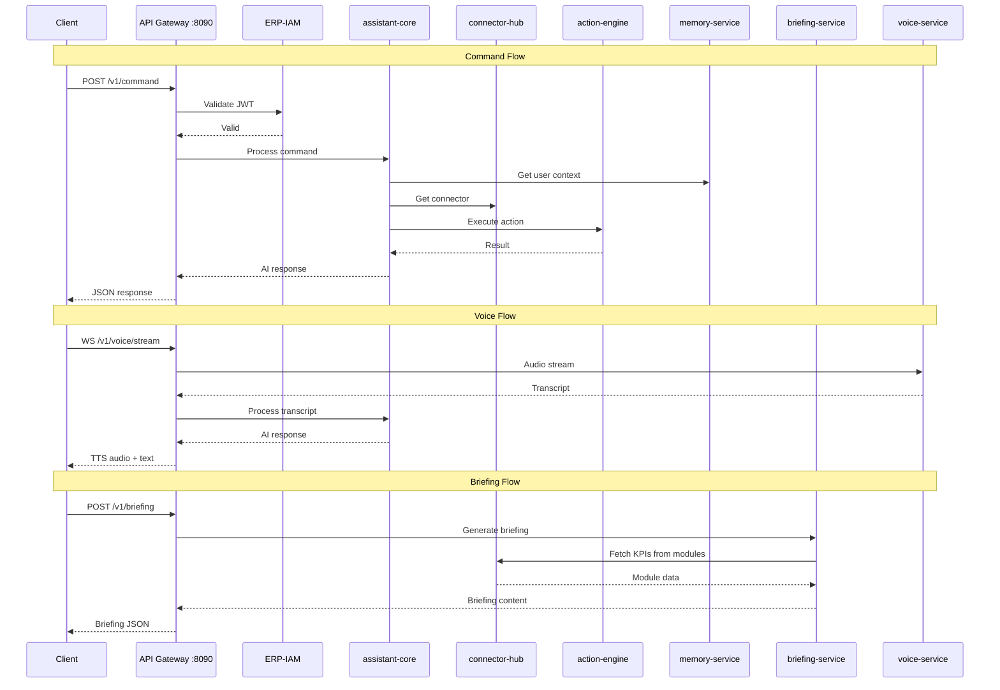

# ERP-Assistant API Reference

## 1. Overview

The ERP-Assistant API provides a RESTful interface for natural language command processing, briefing management, voice interaction, and connector configuration. All endpoints require JWT authentication from ERP-IAM and tenant context via the `X-Tenant-ID` header.

**Base URL**: `http://localhost:8094` (development) | `https://api.erp.example.com/assistant` (production)

### Authentication

All business endpoints require:
- `Authorization: Bearer <jwt_token>` -- JWT issued by ERP-IAM (minimum 20 characters)
- `X-Tenant-ID: <tenant_uuid>` -- Tenant identifier for data isolation

### Common Response Format

```json
{
  "status": "success|error|queued",
  "data": {},
  "meta": {
    "request_id": "uuid",
    "timestamp": "ISO-8601",
    "tenant_id": "uuid"
  }
}
```

### Error Codes

| HTTP Status | Error Code | Description |
|-------------|-----------|-------------|
| 400 | `missing_tenant_id` | X-Tenant-ID header not provided |
| 400 | `invalid_json` | Request body is not valid JSON |
| 401 | `missing_token` | Authorization header missing or invalid |
| 403 | `forbidden` | User lacks required permissions |
| 405 | `method_not_allowed` | HTTP method not supported for endpoint |
| 429 | `rate_limited` | Too many requests, retry after backoff |
| 500 | `internal_error` | Unexpected server error |

## 2. Health & Discovery Endpoints

### GET /healthz

Health check endpoint. Does not require authentication.

**Response** `200 OK`:
```json
{
  "status": "healthy",
  "module": "ERP-Assistant"
}
```

### GET /v1/capabilities

Returns the module's capability document for service discovery.

**Response** `200 OK`:
```json
{
  "module": "ERP-Assistant",
  "version": "1.0.0",
  "capabilities": [
    "natural_language_assistant",
    "cross_module_search",
    "smart_notifications",
    "workflow_automation",
    "daily_briefing",
    "voice_interface",
    "productivity_tool_integration",
    "secure_credential_vault",
    "context_memory",
    "action_execution",
    "preference_learning",
    "command_palette",
    "embeddable_widget"
  ],
  "integration_mode": "standalone_plus_suite",
  "aidd_governance": "enforced"
}
```

## 3. Command API

### POST /v1/command

Submit a natural language command for AI processing.

**Request Headers**:
```
Authorization: Bearer <jwt_token>
X-Tenant-ID: <tenant_uuid>
Content-Type: application/json
```

**Request Body**:
```json
{
  "prompt": "What's my revenue this quarter?",
  "tenant_id": "uuid",
  "conversation_id": "uuid (optional - for multi-turn)",
  "context": {
    "module_hint": "finance (optional)",
    "format_preference": "table|chart|text (optional)"
  }
}
```

**Response** `202 Accepted`:
```json
{
  "status": "queued",
  "message": "command accepted by Assistant orchestrator",
  "prompt": "What's my revenue this quarter?",
  "tenant": "uuid",
  "command_id": "uuid",
  "conversation_id": "uuid"
}
```

**Response** `200 OK` (synchronous mode):
```json
{
  "status": "completed",
  "response": {
    "message": "Your Q1 2026 revenue is $2.4M, up 12% from last quarter.",
    "data": {
      "current_quarter": 2400000,
      "previous_quarter": 2142857,
      "change_percent": 12.0,
      "breakdown_by_region": []
    },
    "actions_taken": [
      {
        "type": "read",
        "module": "ERP-Finance",
        "endpoint": "/v1/revenue",
        "risk_level": "low",
        "status": "auto_executed"
      }
    ],
    "suggestions": [
      "Show revenue by region",
      "Compare with Q1 last year",
      "Show revenue forecast"
    ]
  },
  "conversation_id": "uuid"
}
```

**Error Response** `400`:
```json
{
  "error": "missing X-Tenant-ID"
}
```

**Error Response** `401`:
```json
{
  "error": "missing/invalid bearer token"
}
```

### POST /v1/command/confirm

Confirm or reject a pending action.

**Request Body**:
```json
{
  "action_id": "uuid",
  "decision": "approve|reject",
  "reason": "optional reason text"
}
```

**Response** `200 OK`:
```json
{
  "status": "executed",
  "action_id": "uuid",
  "result": {
    "module": "ERP-Finance",
    "action": "approve_purchase_order",
    "entity_id": "PO-2024-0891",
    "outcome": "approved"
  }
}
```

### GET /v1/command/history

Retrieve command history for the authenticated user.

**Query Parameters**:
| Parameter | Type | Default | Description |
|-----------|------|---------|-------------|
| `page` | integer | 1 | Page number |
| `page_size` | integer | 20 | Results per page |
| `conversation_id` | uuid | - | Filter by conversation |
| `date_from` | ISO-8601 | - | Start date filter |
| `date_to` | ISO-8601 | - | End date filter |

**Response** `200 OK`:
```json
{
  "items": [
    {
      "id": "uuid",
      "conversation_id": "uuid",
      "prompt": "What's my revenue?",
      "response_summary": "Q1 revenue: $2.4M",
      "created_at": "2026-02-23T10:30:00Z",
      "actions_count": 1
    }
  ],
  "pagination": {
    "page": 1,
    "page_size": 20,
    "total": 150
  }
}
```

## 4. Briefing API

### GET /v1/briefing

List briefings for the authenticated user.

**Query Parameters**:
| Parameter | Type | Default | Description |
|-----------|------|---------|-------------|
| `type` | string | - | `daily` or `weekly` |
| `date_from` | date | - | Start date |
| `date_to` | date | - | End date |

**Response** `200 OK`:
```json
{
  "items": [],
  "event_topic": "erp.assistant.briefing.listed"
}
```

### POST /v1/briefing

Generate a new briefing.

**Request Body**:
```json
{
  "type": "daily",
  "date": "2026-02-23",
  "sections": ["kpi_summary", "pending_approvals", "calendar", "deadlines", "anomalies"],
  "modules": ["finance", "crm", "hcm"]
}
```

**Response** `201 Created`:
```json
{
  "item": {
    "id": "uuid",
    "type": "daily",
    "date": "2026-02-23",
    "sections": [
      {
        "type": "kpi_summary",
        "data": {
          "revenue": {"value": 2400000, "change": 0.12},
          "pipeline": {"value": 8500000, "change": 0.05},
          "headcount": {"value": 234, "change": 0.02}
        }
      },
      {
        "type": "pending_approvals",
        "data": {
          "total": 7,
          "items": [
            {"type": "purchase_order", "id": "PO-2024-0891", "amount": 45000},
            {"type": "leave_request", "id": "LR-2024-1234", "employee": "John Smith"}
          ]
        }
      }
    ],
    "generated_at": "2026-02-23T06:00:00Z"
  },
  "event_topic": "erp.assistant.briefing.created"
}
```

### GET /v1/briefing/{id}

Retrieve a specific briefing.

**Response** `200 OK`:
```json
{
  "id": "uuid",
  "event_topic": "erp.assistant.briefing.read"
}
```

### PUT /v1/briefing/{id}

Update a briefing (e.g., regenerate sections).

**Response** `200 OK`:
```json
{
  "id": "uuid",
  "item": {},
  "event_topic": "erp.assistant.briefing.updated"
}
```

### DELETE /v1/briefing/{id}

Delete a briefing.

**Response** `200 OK`:
```json
{
  "id": "uuid",
  "event_topic": "erp.assistant.briefing.deleted"
}
```

## 5. Voice API

### GET /v1/voice

List voice sessions.

**Response** `200 OK`:
```json
{
  "items": [],
  "event_topic": "erp.assistant.voice.listed"
}
```

### WebSocket /v1/voice/stream

Establish a streaming voice session.

**Protocol**: WebSocket with binary frames (audio) and text frames (control)

**Handshake Headers**:
```
Authorization: Bearer <jwt_token>
X-Tenant-ID: <tenant_uuid>
```

**Client -> Server** (binary): Raw audio PCM 16-bit 16kHz mono
**Client -> Server** (text): Control messages
```json
{"action": "start_listening"}
{"action": "stop_listening"}
{"action": "cancel"}
```

**Server -> Client** (text): Transcription and responses
```json
{"type": "transcript", "text": "What's my revenue?", "is_final": true, "confidence": 0.97}
{"type": "response", "text": "Your Q1 revenue is $2.4M", "audio_url": "/v1/voice/audio/uuid"}
{"type": "error", "message": "STT processing failed"}
```

**Server -> Client** (binary): TTS audio stream (PCM 16-bit 24kHz mono)

## 6. Connector API

### GET /v1/connectors

List all available connectors and their status.

**Response** `200 OK`:
```json
{
  "connectors": [
    {
      "id": "google_workspace",
      "name": "Google Workspace",
      "type": "external",
      "category": "productivity",
      "status": "connected",
      "connected_at": "2026-02-20T10:00:00Z",
      "capabilities": ["gmail", "calendar", "drive", "docs", "sheets"]
    },
    {
      "id": "erp_finance",
      "name": "ERP-Finance",
      "type": "internal",
      "category": "erp",
      "status": "active",
      "capabilities": ["invoices", "payments", "gl", "budgets"]
    }
  ]
}
```

### POST /v1/connectors/{id}/connect

Initiate OAuth2 connection flow for an external connector.

**Response** `200 OK`:
```json
{
  "authorization_url": "https://accounts.google.com/o/oauth2/v2/auth?...",
  "state": "random-state-token"
}
```

### POST /v1/connectors/{id}/callback

OAuth2 callback handler.

**Request Body**:
```json
{
  "code": "authorization_code",
  "state": "random-state-token"
}
```

**Response** `200 OK`:
```json
{
  "status": "connected",
  "connector_id": "google_workspace",
  "scopes": ["gmail.readonly", "calendar.events"]
}
```

### DELETE /v1/connectors/{id}/disconnect

Disconnect an external connector and revoke tokens.

**Response** `200 OK`:
```json
{
  "status": "disconnected",
  "connector_id": "google_workspace"
}
```

## 7. Memory API

### GET /v1/memory/preferences

Retrieve user preferences.

**Response** `200 OK`:
```json
{
  "preferences": {
    "default_format": "table",
    "briefing_time": "08:00",
    "briefing_modules": ["finance", "crm"],
    "voice_enabled": true,
    "tts_voice": "professional-female"
  }
}
```

### PUT /v1/memory/preferences

Update user preferences.

### GET /v1/memory/shortcuts

Retrieve personalized shortcuts.

**Response** `200 OK`:
```json
{
  "shortcuts": [
    {"label": "Morning Pipeline", "command": "Show today's CRM pipeline", "usage_count": 42},
    {"label": "Weekly Revenue", "command": "Revenue breakdown this week", "usage_count": 28}
  ]
}
```

### POST /v1/memory/search

Semantic search over past interactions.

**Request Body**:
```json
{
  "query": "budget discussion from last week",
  "limit": 10
}
```

**Response** `200 OK`:
```json
{
  "results": [
    {
      "conversation_id": "uuid",
      "message": "We discussed the Q2 budget allocation...",
      "similarity": 0.89,
      "created_at": "2026-02-16T14:30:00Z"
    }
  ]
}
```

## 8. Rate Limiting

| Endpoint Category | Rate Limit | Window |
|-------------------|-----------|--------|
| Commands | 60/minute | Per user |
| Briefings | 10/hour | Per user |
| Voice streams | 5 concurrent | Per user |
| Connector operations | 30/minute | Per user |
| Memory search | 30/minute | Per user |
| Health/capabilities | Unlimited | - |

## 9. API Flow Diagram


