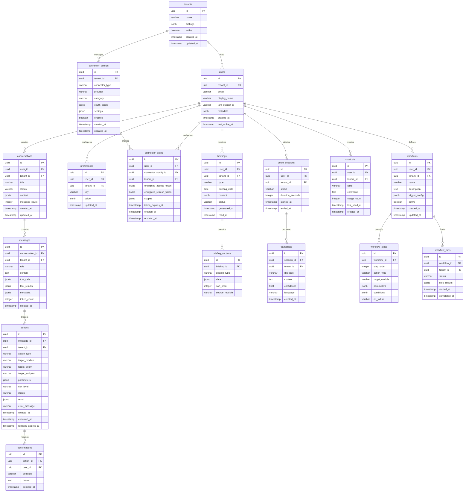
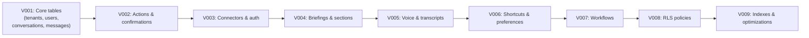

# ERP-Assistant Database Schema

## 1. Overview

ERP-Assistant uses a polyglot persistence strategy: PostgreSQL 16 for relational data, Redis 7 for caching and session state, Qdrant for vector embeddings, and Redpanda/Kafka for event streaming. All relational tables enforce tenant isolation through row-level security policies.

### Database Configuration

| Database | Host | Port | Purpose |
|----------|------|------|---------|
| PostgreSQL 16 | postgres | 5432 | Primary relational store |
| Redis 7 | redis | 6379 | Cache, sessions, rate limiting |
| Qdrant | qdrant | 6333 | Vector embeddings for memory |
| Redpanda | redpanda | 9092 | Event streaming |

## 2. PostgreSQL Schema

### Schema Diagram



## 3. DDL Statements

### Core Tables

```sql
-- Enable UUID extension
CREATE EXTENSION IF NOT EXISTS "uuid-ossp";
CREATE EXTENSION IF NOT EXISTS "pgcrypto";

-- Tenants
CREATE TABLE tenants (
    id          UUID PRIMARY KEY DEFAULT uuid_generate_v4(),
    name        VARCHAR(255) NOT NULL,
    settings    JSONB DEFAULT '{}',
    active      BOOLEAN DEFAULT TRUE,
    created_at  TIMESTAMPTZ DEFAULT NOW(),
    updated_at  TIMESTAMPTZ DEFAULT NOW()
);

-- Users
CREATE TABLE users (
    id              UUID PRIMARY KEY DEFAULT uuid_generate_v4(),
    tenant_id       UUID NOT NULL REFERENCES tenants(id),
    email           VARCHAR(320) NOT NULL,
    display_name    VARCHAR(255),
    iam_subject_id  VARCHAR(255) NOT NULL,
    metadata        JSONB DEFAULT '{}',
    created_at      TIMESTAMPTZ DEFAULT NOW(),
    last_active_at  TIMESTAMPTZ DEFAULT NOW(),
    UNIQUE(tenant_id, email),
    UNIQUE(tenant_id, iam_subject_id)
);

CREATE INDEX idx_users_tenant ON users(tenant_id);
CREATE INDEX idx_users_email ON users(tenant_id, email);

-- Conversations
CREATE TABLE conversations (
    id            UUID PRIMARY KEY DEFAULT uuid_generate_v4(),
    user_id       UUID NOT NULL REFERENCES users(id),
    tenant_id     UUID NOT NULL REFERENCES tenants(id),
    title         VARCHAR(500),
    status        VARCHAR(50) DEFAULT 'active',
    context       JSONB DEFAULT '{}',
    message_count INTEGER DEFAULT 0,
    created_at    TIMESTAMPTZ DEFAULT NOW(),
    updated_at    TIMESTAMPTZ DEFAULT NOW()
);

CREATE INDEX idx_conversations_user ON conversations(user_id, created_at DESC);
CREATE INDEX idx_conversations_tenant ON conversations(tenant_id);

-- Messages
CREATE TABLE messages (
    id                UUID PRIMARY KEY DEFAULT uuid_generate_v4(),
    conversation_id   UUID NOT NULL REFERENCES conversations(id) ON DELETE CASCADE,
    tenant_id         UUID NOT NULL REFERENCES tenants(id),
    role              VARCHAR(20) NOT NULL CHECK (role IN ('user', 'assistant', 'system', 'tool')),
    content           TEXT,
    tool_calls        JSONB,
    tool_results      JSONB,
    metadata          JSONB DEFAULT '{}',
    token_count       INTEGER,
    created_at        TIMESTAMPTZ DEFAULT NOW()
);

CREATE INDEX idx_messages_conversation ON messages(conversation_id, created_at);
CREATE INDEX idx_messages_tenant ON messages(tenant_id);

-- Actions
CREATE TABLE actions (
    id                    UUID PRIMARY KEY DEFAULT uuid_generate_v4(),
    message_id            UUID REFERENCES messages(id),
    tenant_id             UUID NOT NULL REFERENCES tenants(id),
    action_type           VARCHAR(50) NOT NULL CHECK (action_type IN ('read', 'write', 'delete', 'bulk')),
    target_module         VARCHAR(100) NOT NULL,
    target_entity         VARCHAR(100),
    target_endpoint       VARCHAR(500),
    parameters            JSONB DEFAULT '{}',
    risk_level            VARCHAR(20) NOT NULL CHECK (risk_level IN ('low', 'medium', 'high', 'critical')),
    status                VARCHAR(30) DEFAULT 'pending' CHECK (status IN ('pending', 'confirmed', 'rejected', 'executed', 'failed', 'rolled_back')),
    result                JSONB,
    error_message         TEXT,
    created_at            TIMESTAMPTZ DEFAULT NOW(),
    executed_at           TIMESTAMPTZ,
    rollback_expires_at   TIMESTAMPTZ
);

CREATE INDEX idx_actions_tenant ON actions(tenant_id);
CREATE INDEX idx_actions_status ON actions(tenant_id, status);
CREATE INDEX idx_actions_rollback ON actions(rollback_expires_at) WHERE status = 'executed';

-- Confirmations
CREATE TABLE confirmations (
    id          UUID PRIMARY KEY DEFAULT uuid_generate_v4(),
    action_id   UUID NOT NULL REFERENCES actions(id),
    user_id     UUID NOT NULL REFERENCES users(id),
    decision    VARCHAR(20) NOT NULL CHECK (decision IN ('approve', 'reject')),
    reason      TEXT,
    decided_at  TIMESTAMPTZ DEFAULT NOW()
);

CREATE INDEX idx_confirmations_action ON confirmations(action_id);
```

### Preferences & Connectors

```sql
-- Preferences
CREATE TABLE preferences (
    id          UUID PRIMARY KEY DEFAULT uuid_generate_v4(),
    user_id     UUID NOT NULL REFERENCES users(id),
    tenant_id   UUID NOT NULL REFERENCES tenants(id),
    key         VARCHAR(255) NOT NULL,
    value       JSONB NOT NULL,
    updated_at  TIMESTAMPTZ DEFAULT NOW(),
    UNIQUE(user_id, key)
);

CREATE INDEX idx_preferences_user ON preferences(user_id);

-- Connector Configurations
CREATE TABLE connector_configs (
    id              UUID PRIMARY KEY DEFAULT uuid_generate_v4(),
    tenant_id       UUID NOT NULL REFERENCES tenants(id),
    connector_type  VARCHAR(50) NOT NULL CHECK (connector_type IN ('internal', 'external')),
    provider        VARCHAR(100) NOT NULL,
    category        VARCHAR(50) NOT NULL CHECK (category IN ('erp', 'productivity', 'communication', 'storage')),
    oauth_config    JSONB,
    settings        JSONB DEFAULT '{}',
    enabled         BOOLEAN DEFAULT TRUE,
    created_at      TIMESTAMPTZ DEFAULT NOW(),
    updated_at      TIMESTAMPTZ DEFAULT NOW(),
    UNIQUE(tenant_id, provider)
);

-- Connector Authorizations (tokens encrypted with AES-256-GCM)
CREATE TABLE connector_auths (
    id                      UUID PRIMARY KEY DEFAULT uuid_generate_v4(),
    user_id                 UUID NOT NULL REFERENCES users(id),
    connector_config_id     UUID NOT NULL REFERENCES connector_configs(id),
    tenant_id               UUID NOT NULL REFERENCES tenants(id),
    encrypted_access_token  BYTEA NOT NULL,
    encrypted_refresh_token BYTEA,
    scopes                  JSONB DEFAULT '[]',
    token_expires_at        TIMESTAMPTZ,
    created_at              TIMESTAMPTZ DEFAULT NOW(),
    updated_at              TIMESTAMPTZ DEFAULT NOW(),
    UNIQUE(user_id, connector_config_id)
);

CREATE INDEX idx_connector_auths_user ON connector_auths(user_id);
CREATE INDEX idx_connector_auths_expiry ON connector_auths(token_expires_at);
```

### Briefings & Voice

```sql
-- Briefings
CREATE TABLE briefings (
    id            UUID PRIMARY KEY DEFAULT uuid_generate_v4(),
    user_id       UUID NOT NULL REFERENCES users(id),
    tenant_id     UUID NOT NULL REFERENCES tenants(id),
    type          VARCHAR(20) NOT NULL CHECK (type IN ('daily', 'weekly')),
    briefing_date DATE NOT NULL,
    content       JSONB,
    status        VARCHAR(20) DEFAULT 'generated',
    generated_at  TIMESTAMPTZ DEFAULT NOW(),
    read_at       TIMESTAMPTZ,
    UNIQUE(user_id, type, briefing_date)
);

CREATE INDEX idx_briefings_user_date ON briefings(user_id, briefing_date DESC);

-- Briefing Sections
CREATE TABLE briefing_sections (
    id            UUID PRIMARY KEY DEFAULT uuid_generate_v4(),
    briefing_id   UUID NOT NULL REFERENCES briefings(id) ON DELETE CASCADE,
    section_type  VARCHAR(50) NOT NULL,
    data          JSONB NOT NULL,
    sort_order    INTEGER NOT NULL,
    source_module VARCHAR(100)
);

-- Voice Sessions
CREATE TABLE voice_sessions (
    id                UUID PRIMARY KEY DEFAULT uuid_generate_v4(),
    user_id           UUID NOT NULL REFERENCES users(id),
    tenant_id         UUID NOT NULL REFERENCES tenants(id),
    status            VARCHAR(20) DEFAULT 'active',
    duration_seconds  INTEGER,
    started_at        TIMESTAMPTZ DEFAULT NOW(),
    ended_at          TIMESTAMPTZ
);

-- Transcripts
CREATE TABLE transcripts (
    id          UUID PRIMARY KEY DEFAULT uuid_generate_v4(),
    session_id  UUID NOT NULL REFERENCES voice_sessions(id) ON DELETE CASCADE,
    tenant_id   UUID NOT NULL REFERENCES tenants(id),
    direction   VARCHAR(10) NOT NULL CHECK (direction IN ('inbound', 'outbound')),
    content     TEXT NOT NULL,
    confidence  FLOAT,
    language    VARCHAR(10) DEFAULT 'en',
    created_at  TIMESTAMPTZ DEFAULT NOW()
);

-- Shortcuts
CREATE TABLE shortcuts (
    id            UUID PRIMARY KEY DEFAULT uuid_generate_v4(),
    user_id       UUID NOT NULL REFERENCES users(id),
    tenant_id     UUID NOT NULL REFERENCES tenants(id),
    label         VARCHAR(255) NOT NULL,
    command       TEXT NOT NULL,
    usage_count   INTEGER DEFAULT 0,
    last_used_at  TIMESTAMPTZ,
    created_at    TIMESTAMPTZ DEFAULT NOW()
);

CREATE INDEX idx_shortcuts_user ON shortcuts(user_id, usage_count DESC);
```

### Workflows

```sql
-- Workflows
CREATE TABLE workflows (
    id              UUID PRIMARY KEY DEFAULT uuid_generate_v4(),
    user_id         UUID NOT NULL REFERENCES users(id),
    tenant_id       UUID NOT NULL REFERENCES tenants(id),
    name            VARCHAR(255) NOT NULL,
    description     TEXT,
    trigger_config  JSONB NOT NULL,
    active          BOOLEAN DEFAULT TRUE,
    created_at      TIMESTAMPTZ DEFAULT NOW(),
    updated_at      TIMESTAMPTZ DEFAULT NOW()
);

-- Workflow Steps
CREATE TABLE workflow_steps (
    id            UUID PRIMARY KEY DEFAULT uuid_generate_v4(),
    workflow_id   UUID NOT NULL REFERENCES workflows(id) ON DELETE CASCADE,
    step_order    INTEGER NOT NULL,
    action_type   VARCHAR(50) NOT NULL,
    target_module VARCHAR(100) NOT NULL,
    parameters    JSONB DEFAULT '{}',
    conditions    JSONB,
    on_failure    VARCHAR(20) DEFAULT 'stop' CHECK (on_failure IN ('stop', 'skip', 'retry'))
);

-- Workflow Runs
CREATE TABLE workflow_runs (
    id            UUID PRIMARY KEY DEFAULT uuid_generate_v4(),
    workflow_id   UUID NOT NULL REFERENCES workflows(id),
    tenant_id     UUID NOT NULL REFERENCES tenants(id),
    status        VARCHAR(20) DEFAULT 'running',
    step_results  JSONB DEFAULT '[]',
    started_at    TIMESTAMPTZ DEFAULT NOW(),
    completed_at  TIMESTAMPTZ
);
```

### Row-Level Security

```sql
-- Enable RLS on all tenant-scoped tables
ALTER TABLE users ENABLE ROW LEVEL SECURITY;
ALTER TABLE conversations ENABLE ROW LEVEL SECURITY;
ALTER TABLE messages ENABLE ROW LEVEL SECURITY;
ALTER TABLE actions ENABLE ROW LEVEL SECURITY;
ALTER TABLE preferences ENABLE ROW LEVEL SECURITY;
ALTER TABLE connector_auths ENABLE ROW LEVEL SECURITY;
ALTER TABLE briefings ENABLE ROW LEVEL SECURITY;
ALTER TABLE voice_sessions ENABLE ROW LEVEL SECURITY;
ALTER TABLE shortcuts ENABLE ROW LEVEL SECURITY;
ALTER TABLE workflows ENABLE ROW LEVEL SECURITY;

-- Example RLS policy for conversations
CREATE POLICY tenant_isolation_conversations ON conversations
    USING (tenant_id = current_setting('app.current_tenant_id')::uuid);

-- Example RLS policy for messages
CREATE POLICY tenant_isolation_messages ON messages
    USING (tenant_id = current_setting('app.current_tenant_id')::uuid);
```

## 4. Redis Data Structures

| Key Pattern | Type | TTL | Purpose |
|-------------|------|-----|---------|
| `session:{user_id}` | Hash | 30 min | Active conversation context |
| `rate:{user_id}:{endpoint}` | String (counter) | 1 min | Rate limiting |
| `capabilities:{module}` | String (JSON) | 5 min | Cached module capabilities |
| `token:{user_id}:{connector}` | String (encrypted) | Token TTL | Cached OAuth tokens |
| `briefing:lock:{user_id}` | String | 60s | Briefing generation lock |

## 5. Qdrant Collections

| Collection | Dimension | Distance | Payload Fields |
|-----------|-----------|----------|---------------|
| `memory_{tenant_id}` | 384 | Cosine | user_id, type, content, created_at |
| `preferences_{tenant_id}` | 384 | Cosine | user_id, key, value |

## 6. Migration Strategy


