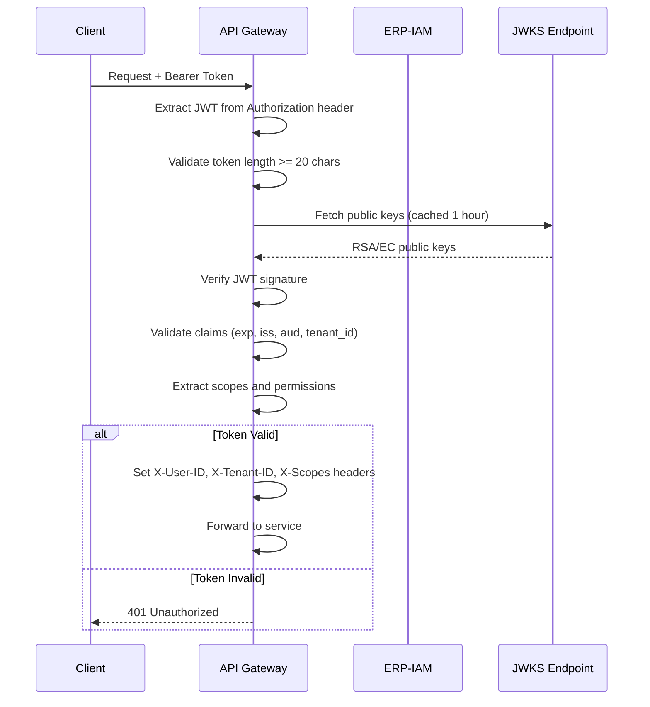
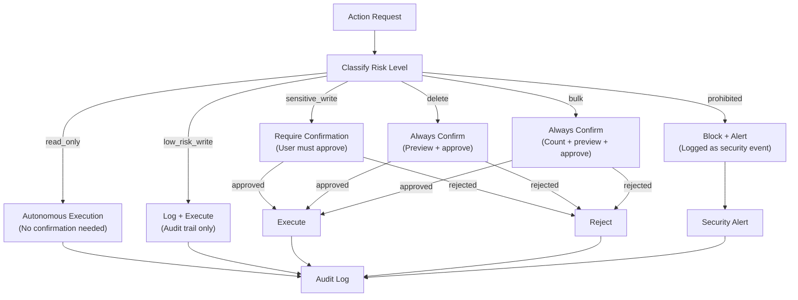
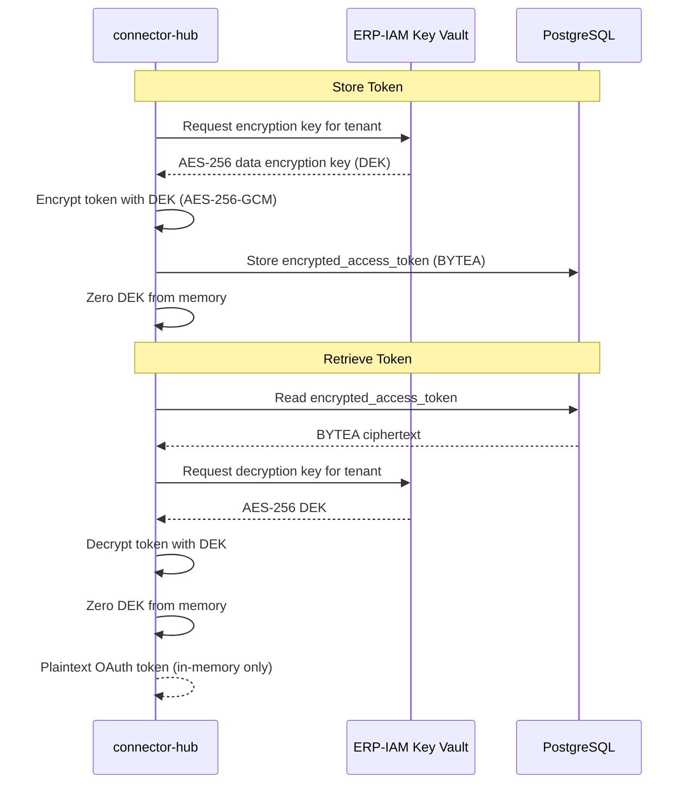
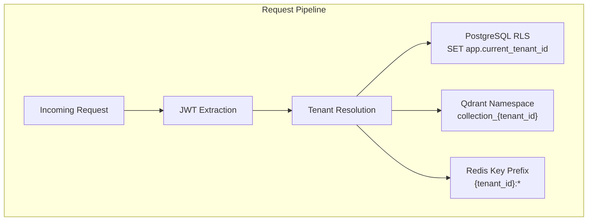
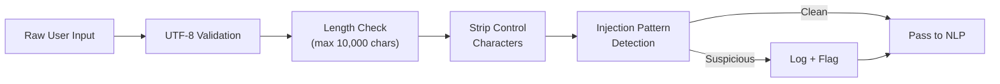
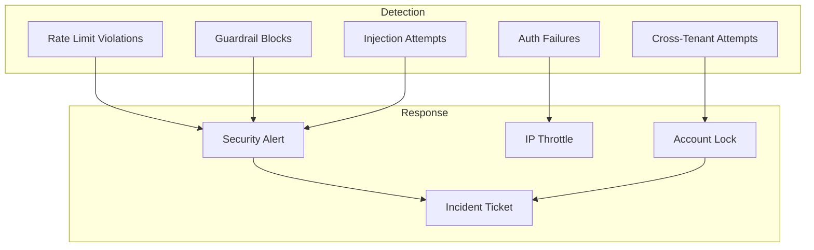

# ERP-Assistant Security Architecture

## 1. Security Overview

ERP-Assistant operates as a high-trust module within the OpenSASE ERP platform, requiring access to data across every other module and external third-party services. This elevated access model demands a defense-in-depth security architecture with multiple layers of protection: authentication via ERP-IAM, authorization via scoped JWT claims, encryption of stored credentials, tenant isolation via PostgreSQL RLS, and AI governance via AIDD guardrails.

### Threat Model

```mermaid
graph TB
    subgraph "External Threats"
        T1["Unauthorized API Access"]
        T2["Token Theft / Replay"]
        T3["Cross-Tenant Data Leakage"]
        T4["Prompt Injection"]
        T5["OAuth Token Exfiltration"]
        T6["Man-in-the-Middle"]
    end

    subgraph "Internal Threats"
        T7["Privilege Escalation via AI"]
        T8["Unintended Bulk Actions"]
        T9["Data Exfiltration via Connectors"]
        T10["Conversation Data Exposure"]
    end

    subgraph "Mitigations"
        M1["ERP-IAM JWT Validation"]
        M2["Token Rotation + Short TTL"]
        M3["Row-Level Security + Tenant Headers"]
        M4["Input Sanitization + Tool Whitelisting"]
        M5["AES-256-GCM Encryption at Rest"]
        M6["TLS 1.3 Everywhere"]
        M7["AIDD Guardrails + Confirmation Prompts"]
        M8["Bulk Operation Limits + Preview"]
        M9["Scope-Limited OAuth Grants"]
        M10["Per-User Encryption Keys"]
    end

    T1 --> M1
    T2 --> M2
    T3 --> M3
    T4 --> M4
    T5 --> M5
    T6 --> M6
    T7 --> M7
    T8 --> M8
    T9 --> M9
    T10 --> M10
```



## 2. Authentication

### JWT Token Validation

All business endpoints validate JWT tokens issued by ERP-IAM:



### Token Claims Structure

```json
{
  "sub": "user-uuid",
  "iss": "erp-iam",
  "aud": "erp-assistant",
  "tenant_id": "tenant-uuid",
  "email": "user@example.com",
  "scopes": [
    "assistant.command.read",
    "assistant.command.write",
    "assistant.briefing.read",
    "assistant.briefing.write",
    "assistant.connector.manage",
    "assistant.voice.use"
  ],
  "exp": 1708700000,
  "iat": 1708696400
}
```

### Permission Scopes

| Scope | Description | Required For |
|-------|------------|-------------|
| `assistant.command.read` | Execute read-only queries | /v1/command (read intents) |
| `assistant.command.write` | Execute write/delete actions | /v1/command (action intents) |
| `assistant.briefing.read` | View briefings | GET /v1/briefing |
| `assistant.briefing.write` | Generate/modify briefings | POST/PUT /v1/briefing |
| `assistant.connector.manage` | Connect/disconnect tools | /v1/connectors/* |
| `assistant.voice.use` | Use voice interface | /v1/voice/* |
| `assistant.memory.read` | View preferences/shortcuts | GET /v1/memory/* |
| `assistant.memory.write` | Modify preferences | PUT /v1/memory/* |
| `assistant.workflow.manage` | Create/manage workflows | /v1/workflows/* |
| `assistant.admin` | Admin operations | Connector config, guardrail management |

## 3. Authorization

### AIDD Guardrail Enforcement

The AIDD guardrails defined in `aidd.guardrails.yaml` are enforced by the action-engine at runtime:

```yaml
version: 1
module: ERP-Assistant
autonomous_actions:
  - read_only_queries
  - low_risk_notifications
supervised_actions:
  - data_mutations
  - workflow_automation
  - bulk_operations
prohibited_actions:
  - cross_tenant_data_access
  - irreversible_delete_without_backup
  - privilege_escalation
controls:
  require_human_in_the_loop_for_high_risk: true
  decision_logging: true
  rollback_window_hours: 24
```

### Action Authorization Flow



## 4. Data Encryption

### Encryption at Rest

| Data Type | Encryption Method | Key Management |
|-----------|------------------|----------------|
| OAuth access tokens | AES-256-GCM | ERP-IAM key vault |
| OAuth refresh tokens | AES-256-GCM | ERP-IAM key vault |
| API keys | AES-256-GCM | ERP-IAM key vault |
| Conversation content | PostgreSQL TDE (optional) | Database-level |
| Voice transcripts | AES-256-GCM | Per-tenant key |
| Vector embeddings | Qdrant at-rest encryption | Cluster-level |

### Token Encryption Flow



### Encryption in Transit

- All external communication uses TLS 1.3
- Internal service-to-service communication uses mTLS in production
- WebSocket connections for voice streaming use WSS (TLS)
- Redis connections use TLS in production (stunnel/native)

## 5. Tenant Isolation

### Multi-Tenant Security Model



### Isolation Guarantees

1. **PostgreSQL RLS**: Every table with tenant_id has row-level security policies that filter by `current_setting('app.current_tenant_id')`
2. **Qdrant Collections**: Each tenant gets a dedicated collection (`memory_{tenant_id}`) preventing cross-tenant vector search
3. **Redis Key Prefixing**: All Redis keys include tenant_id to prevent namespace collisions
4. **Connector Token Isolation**: OAuth tokens are stored per-user per-connector per-tenant
5. **Conversation Isolation**: Conversations and messages are strictly scoped to tenant_id

## 6. Prompt Injection Defense

Since ERP-Assistant processes natural language input and routes it to the Claude API, prompt injection is a critical threat vector.

### Defense Layers

| Layer | Defense | Description |
|-------|---------|-------------|
| Input | Sanitization | Strip control characters, validate UTF-8, length limits |
| Context | Separation | System prompts isolated from user input via Claude API roles |
| Tools | Whitelisting | Only pre-registered tools from capabilities.json can be called |
| Output | Validation | AI-generated actions are validated against schema before execution |
| Execution | Guardrails | AIDD guardrails prevent dangerous actions regardless of AI output |
| Monitoring | Anomaly detection | Flag unusual patterns (e.g., attempts to access other tenants) |

### Input Sanitization Pipeline



## 7. OAuth2 Security

### External Connector OAuth2 Practices

| Practice | Implementation |
|----------|---------------|
| PKCE | Required for all authorization code flows |
| State parameter | Cryptographically random, validated on callback |
| Scope minimization | Request minimum scopes needed per connector |
| Token rotation | Refresh tokens rotated on use (if provider supports) |
| Expiry monitoring | Proactive refresh 5 minutes before expiry |
| Revocation | Tokens revoked at provider on disconnect |
| Audit | All OAuth events logged (connect, refresh, revoke) |

## 8. Audit Logging

### Audit Event Schema

```json
{
  "event_id": "uuid",
  "timestamp": "ISO-8601",
  "tenant_id": "uuid",
  "user_id": "uuid",
  "event_type": "command.executed | action.confirmed | action.rejected | connector.connected | security.violation",
  "resource": {
    "module": "ERP-Finance",
    "entity": "invoice",
    "id": "INV-2024-001"
  },
  "action": {
    "type": "read | write | delete | bulk",
    "risk_level": "low | medium | high | critical",
    "status": "auto_executed | confirmed | rejected | blocked"
  },
  "request": {
    "ip": "10.0.0.1",
    "user_agent": "ERP-Assistant-Web/1.0",
    "prompt": "Show unpaid invoices"
  },
  "ai_decision": {
    "intent": "query",
    "confidence": 0.97,
    "tool_calls": ["finance.list_invoices"],
    "guardrail_applied": "none"
  }
}
```

### Audit Retention

| Event Category | Retention | Storage |
|---------------|-----------|---------|
| Security violations | 7 years | PostgreSQL + S3 archive |
| Action confirmations | 7 years | PostgreSQL + S3 archive |
| Command history | 2 years | PostgreSQL |
| Connector events | 3 years | PostgreSQL |
| Voice transcripts | 1 year | PostgreSQL + S3 |
| Debug/trace logs | 30 days | Redpanda |

## 9. Compliance Alignment

| Standard | Requirement | ERP-Assistant Implementation |
|----------|-------------|----------------------------|
| SOC 2 Type II | Access controls | JWT + scoped permissions |
| SOC 2 Type II | Encryption at rest | AES-256-GCM for tokens, TDE for database |
| SOC 2 Type II | Audit logging | Immutable audit trail with 7-year retention |
| GDPR | Data minimization | Conversation TTL, configurable retention |
| GDPR | Right to erasure | User data deletion API with cascade |
| GDPR | Data portability | Export API for user conversations and preferences |
| HIPAA | PHI protection | Tenant-level encryption, RLS, audit logging |
| HIPAA | Access controls | Role-based with minimum necessary access |

## 10. Security Monitoring


