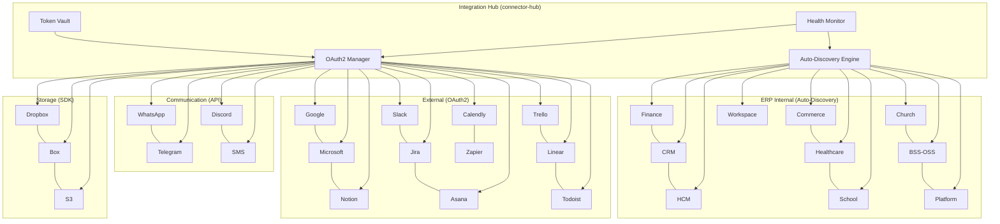
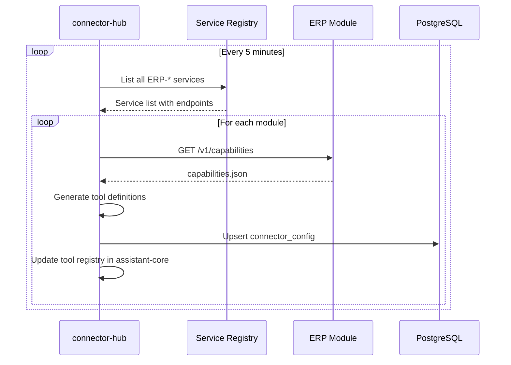
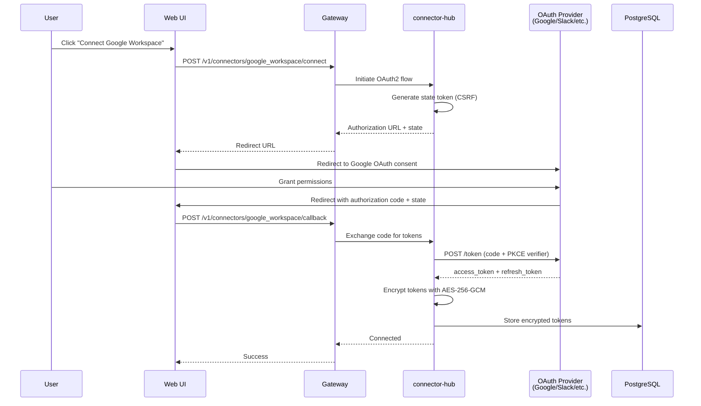

# ERP-Assistant Integration Guide

## 1. Overview

ERP-Assistant integrates with the entire OpenSASE ERP ecosystem and 17+ external productivity tools. This guide covers all integration patterns: ERP internal module auto-discovery, external OAuth2 connectors, SDK usage, event-driven communication, and embeddable widget integration.

### Integration Architecture



## 2. ERP Internal Module Integration

### Auto-Discovery via capabilities.json

ERP-Assistant auto-discovers all ERP modules by scanning for `capabilities.json` files. Each ERP module exposes a standard capability document at `GET /v1/capabilities`.

**Expected Format**:
```json
{
  "module": "ERP-Finance",
  "version": "1.0.0",
  "capabilities": [
    "invoices",
    "payments",
    "general_ledger",
    "budgets",
    "purchase_orders"
  ],
  "endpoints": {
    "base_url": "http://erp-finance:8080",
    "health": "/healthz",
    "api_prefix": "/v1"
  },
  "entities": [
    {
      "name": "invoice",
      "operations": ["list", "get", "create", "update", "delete"],
      "search_fields": ["number", "customer_name", "amount", "status"]
    }
  ]
}
```

### Auto-Discovery Flow



### Registering a New ERP Module

To make a new ERP module available to the assistant:

1. Ensure the module exposes `GET /v1/capabilities` returning the standard format
2. Register the module in the Docker network or Kubernetes service mesh
3. connector-hub will auto-discover it within 5 minutes
4. The assistant will immediately be able to query and act on the module's entities

### Internal Connector Implementations

Each internal connector is scaffolded at `/connectors/erp-internal/`:

| File | Module | Package |
|------|--------|---------|
| `finance.go` | ERP-Finance | `erpinternal` |
| `crm.go` | ERP-CRM | `erpinternal` |
| `hcm.go` | ERP-HCM | `erpinternal` |
| `commerce.go` | ERP-Commerce | `erpinternal` |
| `healthcare.go` | ERP-Healthcare | `erpinternal` |
| `school.go` | ERP-School-Management | `erpinternal` |
| `church.go` | ERP-Church-Management | `erpinternal` |
| `bss_oss.go` | ERP-BSS-OSS | `erpinternal` |
| `platform.go` | ERP-Platform | `erpinternal` |
| `workspace.go` | ERP-Workspace | `erpinternal` |

## 3. External Tool Integration

### OAuth2 Connection Flow



### Connector Configuration

Each external connector requires OAuth2 configuration stored per-tenant:

```json
{
  "provider": "google_workspace",
  "oauth_config": {
    "client_id": "from-google-cloud-console",
    "client_secret": "encrypted",
    "authorization_url": "https://accounts.google.com/o/oauth2/v2/auth",
    "token_url": "https://oauth2.googleapis.com/token",
    "scopes": [
      "https://www.googleapis.com/auth/gmail.readonly",
      "https://www.googleapis.com/auth/calendar.events",
      "https://www.googleapis.com/auth/drive.readonly"
    ],
    "redirect_uri": "https://app.erp.example.com/assistant/connectors/callback"
  }
}
```

### Supported External Connectors

#### Productivity Tools

| Provider | Auth Method | Scopes | Capabilities |
|----------|-----------|--------|-------------|
| Google Workspace | OAuth2 + PKCE | gmail.readonly, calendar.events, drive.readonly | Read emails, manage calendar, browse files |
| Microsoft 365 | OAuth2 + PKCE | Mail.Read, Calendars.ReadWrite, Files.Read | Read Outlook, manage calendar, browse OneDrive |
| Notion | OAuth2 | Read/Write content | Read/create pages, query databases |
| Slack | OAuth2 + Events | channels:read, chat:write | Read/send messages, manage channels |
| Jira | OAuth2 | read:jira-work, write:jira-work | Read/create issues, manage sprints |
| Asana | OAuth2 | default | Read/create tasks, manage projects |
| Trello | OAuth2 | read, write | Read/create cards, manage boards |
| Linear | OAuth2 | read, write | Read/create issues, manage projects |
| Todoist | OAuth2 | data:read_write | Read/create tasks, manage projects |
| Calendly | OAuth2 | default | Read events, manage scheduling |

#### Communication Channels

| Provider | Auth Method | Capabilities |
|----------|-----------|-------------|
| WhatsApp | WhatsApp Business API | Send messages, templates, media |
| Telegram | Bot Token | Send messages, inline queries |
| Discord | Bot Token + OAuth2 | Send messages, slash commands |
| SMS | Twilio API Key | Send messages, delivery status |

#### Storage Providers

| Provider | Auth Method | Capabilities |
|----------|-----------|-------------|
| Dropbox | OAuth2 | Upload/download files, list folders |
| Box | OAuth2 + JWT | Upload/download files, metadata |
| Amazon S3 | AWS IAM (Access Key) | Upload/download objects, presigned URLs |

## 4. SDK Integration

### TypeScript SDK

```typescript
import { AssistantClient, AssistantCommand } from '@erp/assistant-sdk';

const client = new AssistantClient({
  baseUrl: 'https://api.erp.example.com/assistant',
  apiKey: 'your-api-key',
  tenantId: 'tenant-uuid'
});

// Send a command
const command: AssistantCommand = {
  prompt: "What's my revenue this quarter?",
  tenantId: 'tenant-uuid'
};

const response = await client.command(command);
console.log(response.message);

// Stream a command
for await (const chunk of client.commandStream(command)) {
  process.stdout.write(chunk.text);
}

// Get briefing
const briefing = await client.getBriefing({ type: 'daily', date: '2026-02-23' });

// List connectors
const connectors = await client.listConnectors();
```

### Python SDK

```python
from erp_assistant_sdk import AssistantClient

client = AssistantClient(
    base_url="https://api.erp.example.com/assistant",
    api_key="your-api-key",
    tenant_id="tenant-uuid"
)

# Send a command
response = client.command("What's my revenue this quarter?")
print(response.message)

# Async streaming
async for chunk in client.command_stream("Show pipeline breakdown"):
    print(chunk.text, end="")

# Memory search
results = client.memory_search("budget discussion last week")
```

### Go SDK

```go
package main

import (
    "context"
    "fmt"
    sdk "erp/erp_assistant/sdk/go"
)

func main() {
    client := sdk.Client{
        BaseURL:  "https://api.erp.example.com/assistant",
        APIKey:   "your-api-key",
        TenantID: "tenant-uuid",
    }

    resp, err := client.Command(context.Background(), "Show unpaid invoices")
    if err != nil {
        panic(err)
    }
    fmt.Println(resp.Message)
}
```

## 5. Embeddable Widget Integration

### Installation

```html
<!-- Add to any web page -->
<script src="https://cdn.erp.example.com/assistant-widget/v1/widget.js"></script>
<script>
  ERPAssistant.init({
    apiUrl: 'https://api.erp.example.com/assistant',
    tenantId: 'tenant-uuid',
    token: 'jwt-token-from-parent-app',
    position: 'bottom-right',
    theme: {
      primaryColor: '#1a73e8',
      borderRadius: '12px'
    },
    collapsed: true  // Start as floating icon
  });
</script>
```

### React Component

```tsx
import { AssistantWidget } from '@erp/assistant-widget';

function App() {
  return (
    <AssistantWidget
      apiUrl="https://api.erp.example.com/assistant"
      tenantId="tenant-uuid"
      token={authToken}
      position="bottom-right"
      onAction={(action) => console.log('Action:', action)}
    />
  );
}
```

## 6. Event Integration

### Subscribing to Events

ERP-Assistant publishes CloudEvents to Redpanda/Kafka:

```json
{
  "specversion": "1.0",
  "type": "erp.assistant.command.executed",
  "source": "/erp-assistant/assistant-core",
  "id": "uuid",
  "time": "2026-02-23T10:30:00Z",
  "datacontenttype": "application/json",
  "data": {
    "tenant_id": "uuid",
    "user_id": "uuid",
    "prompt": "Show revenue",
    "intent": "query",
    "module": "ERP-Finance",
    "status": "completed"
  }
}
```

### Event Topics

| Topic | Payload | Trigger |
|-------|---------|---------|
| `erp.assistant.command.executed` | Command details | After command processing |
| `erp.assistant.action.confirmed` | Action + confirmation | After user confirms |
| `erp.assistant.action.rejected` | Action + rejection | After user rejects |
| `erp.assistant.briefing.created` | Briefing content | New briefing generated |
| `erp.assistant.connector.connected` | Connector details | OAuth flow completed |
| `erp.assistant.connector.disconnected` | Connector ID | Connector removed |

### Consuming Events

```go
// Subscribe to assistant events
consumer := kafka.NewConsumer(kafka.Config{
    Brokers: []string{"redpanda:9092"},
    GroupID: "my-service",
    Topics:  []string{"erp.assistant.command.executed"},
})

for msg := range consumer.Messages() {
    var event CloudEvent
    json.Unmarshal(msg.Value, &event)
    // Process event
}
```

## 7. Integration Patterns

```mermaid
flowchart TB
    subgraph "Pattern 1: Direct API"
        APP1["External App"] -->|"REST API"| GW1["Gateway"]
    end

    subgraph "Pattern 2: SDK"
        APP2["Application"] -->|"TypeScript/Python/Go SDK"| SDK2["SDK Client"]
        SDK2 -->|"REST API"| GW2["Gateway"]
    end

    subgraph "Pattern 3: Widget"
        WEB3["Web App"] -->|"Embed"| WGT3["Widget"]
        WGT3 -->|"REST API"| GW3["Gateway"]
    end

    subgraph "Pattern 4: Event-Driven"
        SVC4["External Service"] -->|"Subscribe"| KF4["Redpanda"]
        KF4 --> ASST4["assistant events"]
    end

    subgraph "Pattern 5: Webhook"
        ASST5["ERP-Assistant"] -->|"HTTP POST"| WH5["Webhook Endpoint"]
    end
```


