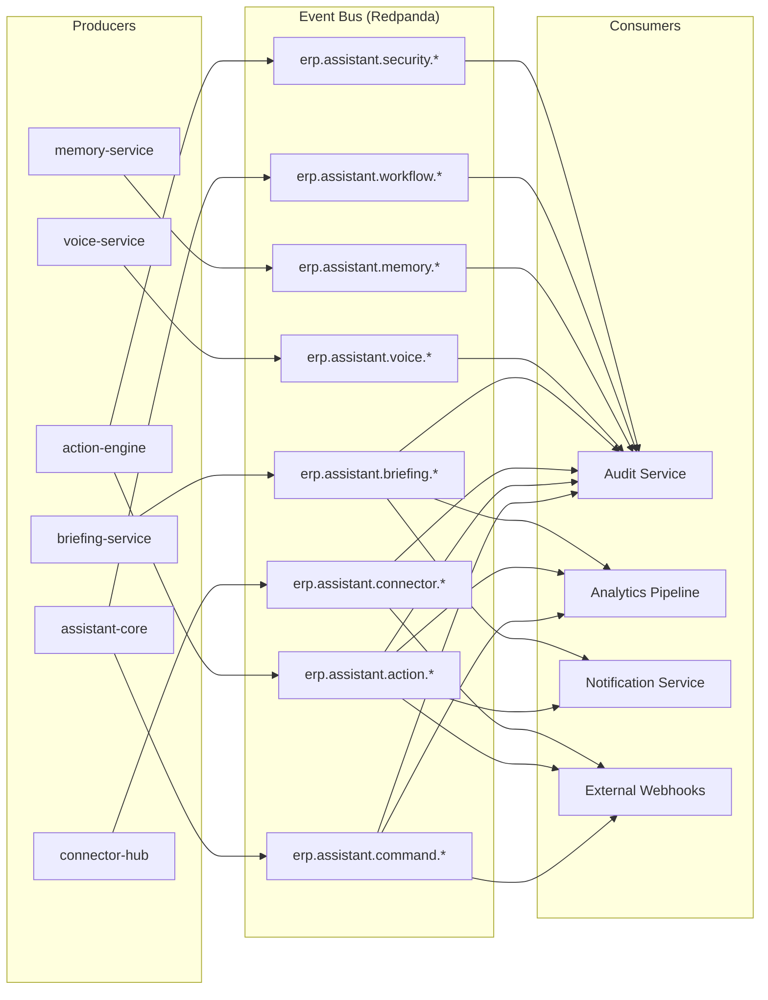
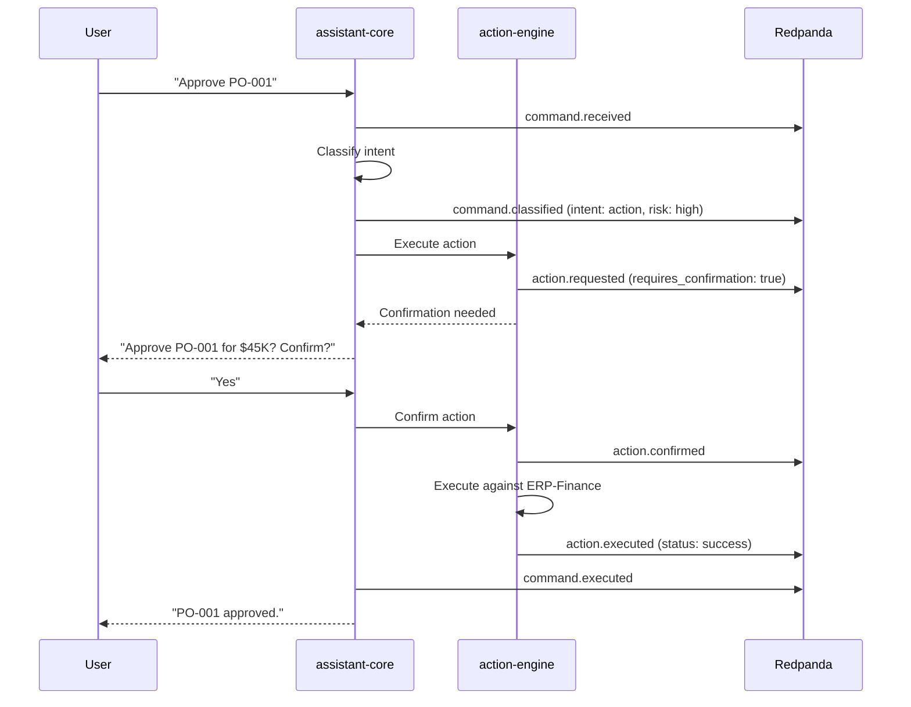

# ERP-Assistant Event Catalog

## 1. Overview

ERP-Assistant uses an event-driven architecture built on CloudEvents specification 1.0, published to Redpanda/Kafka. Events follow the naming convention `erp.assistant.<entity>.<action>` and are used for audit logging, cross-service communication, analytics, and external system integration.

### Event Architecture



## 2. CloudEvents Envelope

All events conform to the CloudEvents 1.0 specification:

```json
{
  "specversion": "1.0",
  "type": "erp.assistant.<entity>.<action>",
  "source": "/erp-assistant/<service-name>",
  "id": "550e8400-e29b-41d4-a716-446655440000",
  "time": "2026-02-23T10:30:00.000Z",
  "datacontenttype": "application/json",
  "subject": "<entity-id>",
  "tenantid": "tenant-uuid",
  "data": {
    // Event-specific payload
  }
}
```

## 3. Command Events

### erp.assistant.command.received

Published when a new command is received by the gateway.

| Field | Type | Description |
|-------|------|-------------|
| `command_id` | UUID | Unique command identifier |
| `tenant_id` | UUID | Tenant context |
| `user_id` | UUID | Authenticated user |
| `prompt` | string | Raw user prompt |
| `conversation_id` | UUID | Conversation context |
| `source_channel` | string | `web`, `widget`, `mobile`, `voice`, `sdk` |

### erp.assistant.command.classified

Published after intent classification.

| Field | Type | Description |
|-------|------|-------------|
| `command_id` | UUID | Command reference |
| `intent` | string | `query`, `action`, `briefing`, `navigation`, `workflow` |
| `confidence` | float | Classification confidence (0-1) |
| `entities` | object | Extracted entities (module, entity type, identifiers) |
| `risk_level` | string | `low`, `medium`, `high`, `critical` |

### erp.assistant.command.executed

Published after command processing completes.

| Field | Type | Description |
|-------|------|-------------|
| `command_id` | UUID | Command reference |
| `tenant_id` | UUID | Tenant context |
| `user_id` | UUID | User who executed |
| `prompt` | string | Original prompt |
| `intent` | string | Classified intent |
| `module` | string | Target module |
| `status` | string | `completed`, `failed`, `pending_confirmation` |
| `duration_ms` | integer | Total processing time |
| `actions_taken` | array | List of action summaries |
| `token_count` | integer | Claude API tokens used |

### erp.assistant.command.failed

Published when command processing fails.

| Field | Type | Description |
|-------|------|-------------|
| `command_id` | UUID | Command reference |
| `error_type` | string | `nlp_error`, `connector_error`, `auth_error`, `timeout` |
| `error_message` | string | Human-readable error |
| `retry_count` | integer | Number of retries attempted |

## 4. Action Events

### erp.assistant.action.requested

Published when an action is identified from a command.

| Field | Type | Description |
|-------|------|-------------|
| `action_id` | UUID | Action identifier |
| `action_type` | string | `read`, `write`, `delete`, `bulk` |
| `target_module` | string | Target ERP module or external tool |
| `target_entity` | string | Entity type (invoice, contact, etc.) |
| `risk_level` | string | AIDD risk classification |
| `requires_confirmation` | boolean | Whether user must confirm |

### erp.assistant.action.confirmed

Published when a user confirms a pending action.

| Field | Type | Description |
|-------|------|-------------|
| `action_id` | UUID | Action reference |
| `user_id` | UUID | User who confirmed |
| `decision` | string | `approve` |
| `reason` | string | Optional reason text |
| `time_to_decision_ms` | integer | Time from prompt to confirmation |

### erp.assistant.action.rejected

Published when a user rejects a pending action.

| Field | Type | Description |
|-------|------|-------------|
| `action_id` | UUID | Action reference |
| `user_id` | UUID | User who rejected |
| `decision` | string | `reject` |
| `reason` | string | Rejection reason |

### erp.assistant.action.executed

Published after an action is executed (auto or confirmed).

| Field | Type | Description |
|-------|------|-------------|
| `action_id` | UUID | Action reference |
| `action_type` | string | Action type |
| `target_module` | string | Module acted upon |
| `status` | string | `success`, `partial_success`, `failed` |
| `result_summary` | string | Human-readable result |
| `rollback_expires_at` | timestamp | Rollback window expiry |

### erp.assistant.action.rolled_back

Published when an action is rolled back.

| Field | Type | Description |
|-------|------|-------------|
| `action_id` | UUID | Original action |
| `rollback_reason` | string | Why the rollback occurred |
| `rollback_status` | string | `success`, `failed` |

## 5. Connector Events

### erp.assistant.connector.connected

| Field | Type | Description |
|-------|------|-------------|
| `connector_id` | string | Connector identifier |
| `provider` | string | Provider name |
| `category` | string | `erp`, `productivity`, `communication`, `storage` |
| `scopes` | array | Granted OAuth scopes |

### erp.assistant.connector.disconnected

| Field | Type | Description |
|-------|------|-------------|
| `connector_id` | string | Connector identifier |
| `reason` | string | `user_initiated`, `token_expired`, `revoked` |

### erp.assistant.connector.health_changed

| Field | Type | Description |
|-------|------|-------------|
| `connector_id` | string | Connector identifier |
| `previous_status` | string | `healthy`, `degraded`, `down` |
| `current_status` | string | New status |
| `error_message` | string | If status changed to degraded/down |

## 6. Briefing Events

### erp.assistant.briefing.created

| Field | Type | Description |
|-------|------|-------------|
| `briefing_id` | UUID | Briefing identifier |
| `type` | string | `daily`, `weekly` |
| `briefing_date` | date | Briefing date |
| `sections` | array | Section types included |
| `generation_time_ms` | integer | Time to generate |

### erp.assistant.briefing.read

| Field | Type | Description |
|-------|------|-------------|
| `briefing_id` | UUID | Briefing identifier |
| `read_channel` | string | `web`, `mobile`, `voice`, `email` |

### erp.assistant.briefing.updated / .deleted / .listed

Standard CRUD events with briefing identifiers and standard metadata.

## 7. Voice Events

### erp.assistant.voice.session_started

| Field | Type | Description |
|-------|------|-------------|
| `session_id` | UUID | Voice session identifier |
| `input_format` | string | Audio format (PCM16, OGG, etc.) |
| `language` | string | Detected/requested language |

### erp.assistant.voice.transcribed

| Field | Type | Description |
|-------|------|-------------|
| `session_id` | UUID | Session reference |
| `transcript` | string | Transcribed text |
| `confidence` | float | STT confidence |
| `duration_ms` | integer | Audio duration |
| `processing_ms` | integer | STT processing time |

### erp.assistant.voice.listed

Standard list event for voice session history.

## 8. Security Events

### erp.assistant.security.guardrail_blocked

| Field | Type | Description |
|-------|------|-------------|
| `action_id` | UUID | Blocked action |
| `guardrail` | string | Which guardrail triggered |
| `reason` | string | Why it was blocked |
| `severity` | string | `warning`, `critical` |

### erp.assistant.security.injection_detected

| Field | Type | Description |
|-------|------|-------------|
| `command_id` | UUID | Source command |
| `pattern` | string | Detected injection pattern |
| `input_snippet` | string | Sanitized snippet of input |

## 9. Event Flow Diagram



## 10. Topic Configuration

| Topic | Partitions | Retention | Replication |
|-------|-----------|-----------|-------------|
| `erp.assistant.command.*` | 12 | 30 days | 3 |
| `erp.assistant.action.*` | 12 | 7 years | 3 |
| `erp.assistant.connector.*` | 6 | 1 year | 3 |
| `erp.assistant.briefing.*` | 6 | 90 days | 3 |
| `erp.assistant.voice.*` | 6 | 90 days | 3 |
| `erp.assistant.security.*` | 6 | 7 years | 3 |
