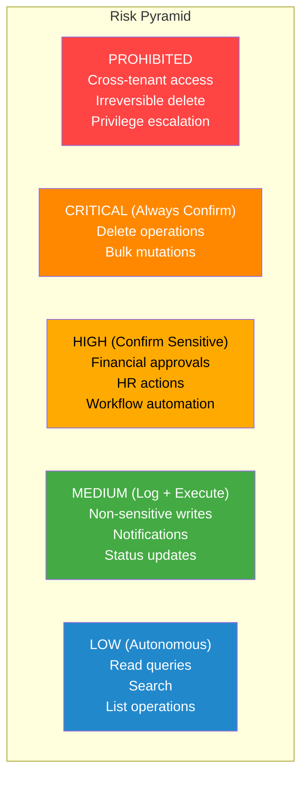
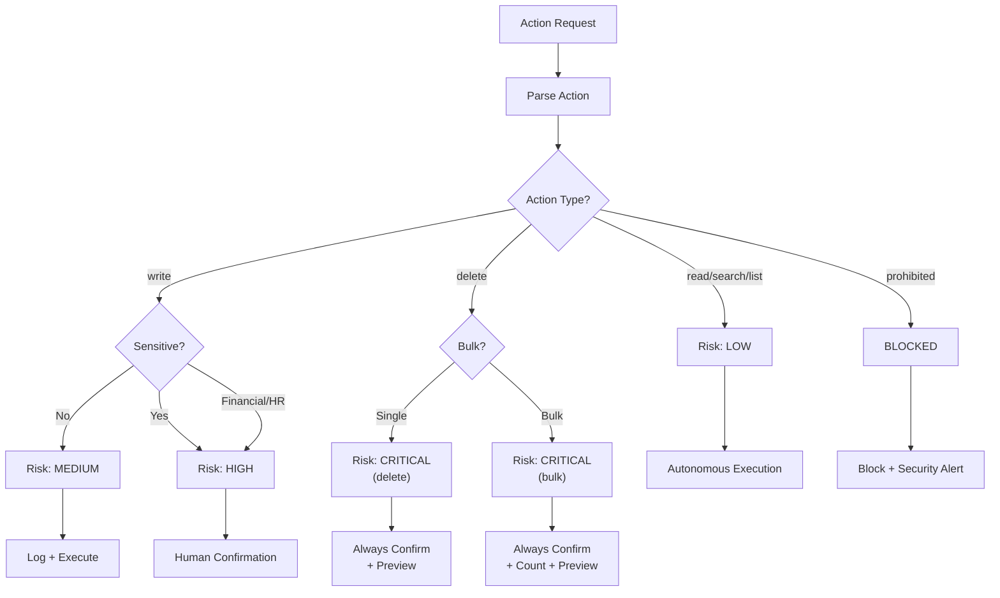
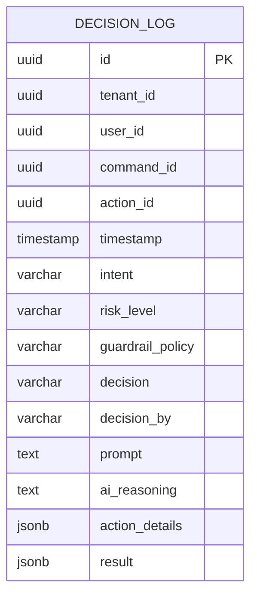
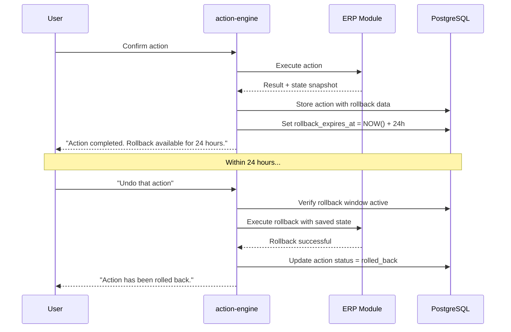
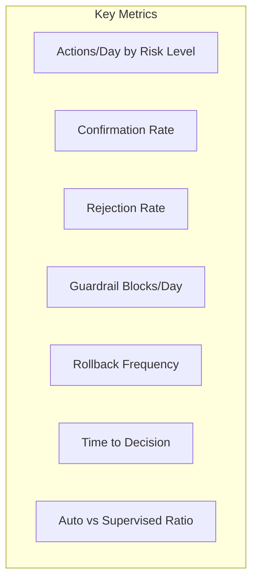

# ERP-Assistant AIDD Governance

## 1. Overview

AIDD (AI-Driven Development) governance is the core safety framework for ERP-Assistant. It ensures that AI-powered actions maintain human oversight for high-risk operations while allowing autonomous execution of safe, read-only queries. This document defines the guardrail policies, enforcement mechanisms, audit requirements, and escalation procedures.

### Governance Philosophy

ERP-Assistant follows the principle of **progressive trust**: the AI can autonomously handle low-risk operations, but as risk increases, so does the requirement for human involvement. This is codified in the `aidd.guardrails.yaml` configuration file.



## 2. Guardrail Configuration

The authoritative guardrail configuration is defined in `/erp/aidd.guardrails.yaml`:

```yaml
version: 1
module: ERP-Assistant
autonomous_actions:
  - read_only_queries
  - low_risk_notifications
supervised_actions:
  - data_mutations
  - workflow_automation
  - bulk_operations
prohibited_actions:
  - cross_tenant_data_access
  - irreversible_delete_without_backup
  - privilege_escalation
controls:
  require_human_in_the_loop_for_high_risk: true
  decision_logging: true
  rollback_window_hours: 24
```

## 3. Action Classification

### Classification Matrix

| Action Category | Examples | Risk Level | Policy |
|----------------|---------|------------|--------|
| Read query | "Show revenue", "List invoices" | Low | Autonomous |
| Search | "Find contact John Smith" | Low | Autonomous |
| List operation | "Show pending approvals" | Low | Autonomous |
| Status notification | "Send Slack status update" | Medium | Log + Execute |
| Non-sensitive write | "Add note to contact" | Medium | Log + Execute |
| Calendar event | "Schedule meeting" | Medium | Log + Execute |
| Financial approval | "Approve PO-001" | High | Confirm |
| HR action | "Approve leave request" | High | Confirm |
| Data mutation | "Update invoice amount" | High | Confirm |
| Workflow trigger | "Run weekly report automation" | High | Confirm |
| Delete single | "Delete draft invoice" | Critical | Always Confirm |
| Bulk write | "Mark all overdue" | Critical | Always Confirm + Preview |
| Bulk delete | "Delete all draft invoices" | Critical | Always Confirm + Count + Preview |
| Cross-tenant | "Show Tenant B's data" | Prohibited | Block + Alert |
| Privilege escalation | "Grant admin access" | Prohibited | Block + Alert |
| Irreversible delete | "Purge all records" | Prohibited | Block + Alert |

### Classification Flow



## 4. Confirmation Dialogs

### Standard Confirmation

For high-risk actions, the assistant generates a human-readable confirmation:

```json
{
  "type": "confirmation_required",
  "action": {
    "id": "uuid",
    "description": "Approve Purchase Order PO-2024-0891",
    "target_module": "ERP-Finance",
    "target_entity": "purchase_order",
    "details": {
      "po_number": "PO-2024-0891",
      "vendor": "Acme Corp",
      "amount": 45000,
      "currency": "USD"
    },
    "risk_level": "high",
    "reversible": true,
    "rollback_window": "24 hours"
  },
  "prompt": "I'll approve Purchase Order PO-2024-0891 for $45,000 from Acme Corp. This will authorize payment processing. Confirm?",
  "options": ["Approve", "Reject", "More Details"]
}
```

### Bulk Operation Preview

For bulk operations, a preview with count and sample is provided:

```json
{
  "type": "bulk_confirmation_required",
  "action": {
    "description": "Mark all overdue invoices as urgent",
    "affected_count": 42,
    "preview": [
      {"id": "INV-001", "customer": "ABC Corp", "amount": 15000, "days_overdue": 45},
      {"id": "INV-002", "customer": "XYZ Ltd", "amount": 8500, "days_overdue": 30},
      {"id": "INV-003", "customer": "Foo Inc", "amount": 22000, "days_overdue": 60}
    ],
    "preview_note": "Showing 3 of 42 affected records"
  },
  "prompt": "This will mark 42 invoices as urgent (total value: $1.2M). Here are the first 3. Confirm?",
  "options": ["Confirm All", "Review Full List", "Cancel"]
}
```

## 5. Decision Logging

Every AI decision is logged for audit purposes with the following schema:



### Decision Types

| Decision | Description | Logged By |
|----------|------------|-----------|
| `auto_executed` | Autonomous execution (low risk) | action-engine |
| `confirmation_requested` | Awaiting user approval | action-engine |
| `user_approved` | User confirmed action | action-engine |
| `user_rejected` | User declined action | action-engine |
| `guardrail_blocked` | Prohibited action blocked | action-engine |
| `rolled_back` | Action reversed within window | action-engine |
| `escalated` | Escalated to admin | action-engine |

## 6. Rollback Mechanism

### 24-Hour Rollback Window

All supervised actions (confirmed by user) have a 24-hour rollback window:



### Rollback Data Storage

```json
{
  "action_id": "uuid",
  "rollback_data": {
    "module": "ERP-Finance",
    "endpoint": "PUT /v1/purchase-orders/PO-001/status",
    "original_state": {"status": "pending"},
    "new_state": {"status": "approved"},
    "reverse_action": {
      "method": "PUT",
      "endpoint": "/v1/purchase-orders/PO-001/status",
      "body": {"status": "pending"}
    }
  },
  "rollback_expires_at": "2026-02-24T10:30:00Z"
}
```

## 7. Sensitivity Rules by Module

| Module | Sensitive Fields | Policy |
|--------|-----------------|--------|
| ERP-Finance | amount, approval_status, payment | Always confirm writes |
| ERP-HCM | salary, performance_review, termination | Always confirm writes |
| ERP-Healthcare | patient_data, prescription, diagnosis | Always confirm writes + HIPAA log |
| ERP-CRM | deal_value, discount, contract | Confirm if > threshold |
| ERP-Commerce | price, inventory_count, shipping | Confirm bulk changes |
| ERP-Projects | budget, milestone_date, assignment | Confirm budget changes |
| External Tools | All writes | Confirm on first use, learn preferences |

## 8. Governance Dashboard Metrics



| Metric | Formula | Target |
|--------|---------|--------|
| Confirmation rate | Confirmed / (Confirmed + Rejected) | > 80% |
| Guardrail block rate | Blocked / Total Actions | < 1% |
| Rollback rate | Rolled back / Executed | < 5% |
| Median time to decision | p50(confirmation_time) | < 30s |
| Auto/supervised ratio | Autonomous / Supervised | > 5:1 |
