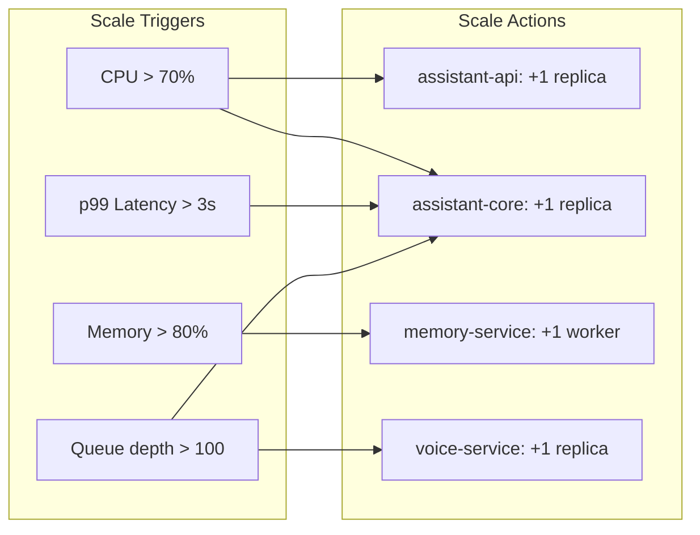
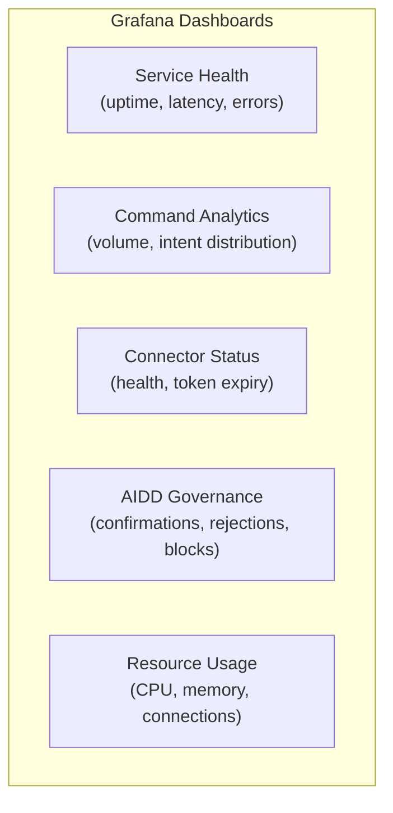

# ERP-Assistant Runbook

## 1. Service Overview

| Service | Port | Health Endpoint | Critical? |
|---------|------|----------------|-----------|
| assistant-api | 8094 (host) / 8090 (container) | GET /healthz | Yes |
| assistant-core | internal | internal health check | Yes |
| connector-hub | internal | internal health check | Yes |
| action-engine | internal | internal health check | Yes |
| memory-service | 8204 (host) / 8080 (container) | GET /healthz | No (degraded mode) |
| briefing-service | internal / 8080 | GET /healthz | No (degraded mode) |
| voice-service | 8208 (host) / 8080 (container) | GET /healthz | No (degraded mode) |
| PostgreSQL | 5432 | TCP connect | Yes |
| Redis | 6379 | PING/PONG | Yes |

## 2. Common Alerts and Response Procedures

### ALERT: assistant-api Unhealthy

**Severity**: Critical
**Symptom**: `/healthz` returns non-200 or times out

**Diagnosis**:
```bash
# Check container status
docker compose ps assistant-api

# Check logs
docker compose logs --tail=100 assistant-api

# Check if port is bound
curl -v http://localhost:8094/healthz
```

**Resolution**:
1. Check if the process crashed -- look for panic/fatal in logs
2. Check PostgreSQL connectivity -- the gateway depends on database availability
3. Restart the service: `docker compose restart assistant-api`
4. If persistent, check resource limits (memory, file descriptors)

### ALERT: Claude API Rate Limit

**Severity**: High
**Symptom**: Commands return 429 errors or slow responses

**Diagnosis**:
```bash
# Check error logs for rate limit messages
docker compose logs assistant-core | grep -i "rate"

# Check current request volume
curl http://localhost:8094/metrics | grep assistant_command_total
```

**Resolution**:
1. Verify current Claude API usage against plan limits
2. Enable request queuing with backoff in assistant-core
3. Consider upgrading Claude API tier
4. Implement per-tenant command rate limiting if single tenant is causing spike

### ALERT: Connector Health Check Failed

**Severity**: Medium
**Symptom**: External connector reports unhealthy status

**Diagnosis**:
```bash
# Check connector status
curl -H "Authorization: Bearer $TOKEN" -H "X-Tenant-ID: $TENANT" \
  http://localhost:8094/v1/connectors

# Check connector-hub logs
docker compose logs connector-hub | grep -i "error\|failed"
```

**Resolution**:
1. Check if the external service is experiencing an outage (check status pages)
2. Verify OAuth tokens are not expired -- trigger token refresh
3. Check network connectivity to external service
4. If OAuth tokens are revoked, user needs to re-authenticate

### ALERT: PostgreSQL Connection Pool Exhausted

**Severity**: Critical
**Symptom**: Services returning 500 errors, "too many connections" in logs

**Diagnosis**:
```bash
# Check active connections
docker compose exec postgres psql -U erp -d erp_assistant \
  -c "SELECT count(*) FROM pg_stat_activity;"

# Check which services have most connections
docker compose exec postgres psql -U erp -d erp_assistant \
  -c "SELECT application_name, count(*) FROM pg_stat_activity GROUP BY 1;"
```

**Resolution**:
1. Identify which service is leaking connections
2. Restart the leaking service
3. Increase `max_connections` in PostgreSQL if legitimate load
4. Implement connection pooling via PgBouncer if not already present

### ALERT: Memory Service High Latency

**Severity**: Low
**Symptom**: Slow command responses, memory context missing

**Diagnosis**:
```bash
# Check memory-service health
curl http://localhost:8204/healthz

# Check Qdrant connectivity
docker compose logs memory-service | grep -i "qdrant\|error"
```

**Resolution**:
1. memory-service operates in degraded mode -- commands still work without personalization
2. Check Qdrant cluster health and disk space
3. Restart memory-service if Qdrant connection is stale
4. Check if embedding model is loaded correctly

### ALERT: Voice Service Transcription Failures

**Severity**: Medium
**Symptom**: Voice commands not being transcribed, STT errors

**Diagnosis**:
```bash
# Check voice-service health
curl http://localhost:8208/healthz

# Check Whisper model loading
docker compose logs voice-service | grep -i "whisper\|model\|error"
```

**Resolution**:
1. Verify Whisper model is downloaded and accessible
2. Check GPU/CPU availability -- Whisper Large-v3 requires significant compute
3. Fall back to smaller Whisper model (medium) if resource constrained
4. Restart voice-service to reload model

## 3. Scaling Procedures

### Horizontal Scaling



### Kubernetes HPA Configuration

```yaml
apiVersion: autoscaling/v2
kind: HorizontalPodAutoscaler
metadata:
  name: assistant-api-hpa
spec:
  scaleTargetRef:
    apiVersion: apps/v1
    kind: Deployment
    name: assistant-api
  minReplicas: 2
  maxReplicas: 10
  metrics:
    - type: Resource
      resource:
        name: cpu
        target:
          type: Utilization
          averageUtilization: 70
    - type: Resource
      resource:
        name: memory
        target:
          type: Utilization
          averageUtilization: 80
```

## 4. Backup and Recovery

### Database Backup

```bash
# Manual backup
docker compose exec postgres pg_dump -U erp erp_assistant > backup_$(date +%Y%m%d).sql

# Restore from backup
docker compose exec -T postgres psql -U erp erp_assistant < backup_20260223.sql
```

### Redis Backup

```bash
# Trigger Redis snapshot
docker compose exec redis redis-cli BGSAVE

# Copy RDB file
docker cp $(docker compose ps -q redis):/data/dump.rdb ./redis_backup.rdb
```

### Recovery Time Objectives

| Component | RPO | RTO | Procedure |
|-----------|-----|-----|-----------|
| PostgreSQL | 1 min | 15 min | WAL replay from replica |
| Redis | 5 min | 5 min | Sentinel failover |
| Qdrant | 1 hour | 30 min | Snapshot restore |
| Services | N/A | 2 min | Kubernetes rollout |

## 5. Maintenance Procedures

### Rolling Restart

```bash
# Restart all services without downtime
docker compose up -d --no-deps --build assistant-api
docker compose up -d --no-deps --build assistant-core
docker compose up -d --no-deps --build connector-hub
docker compose up -d --no-deps --build action-engine
docker compose up -d --no-deps --build memory-service
docker compose up -d --no-deps --build briefing-service
docker compose up -d --no-deps --build voice-service
```

### Database Migration

```bash
# Apply pending migrations
migrate -path db/migrations -database "$DATABASE_URL" up

# Check current version
migrate -path db/migrations -database "$DATABASE_URL" version
```

### Log Rotation

| Service | Log Location | Rotation | Retention |
|---------|-------------|----------|-----------|
| All Go services | stdout | Docker log driver | 7 days |
| Python services | stdout | Docker log driver | 7 days |
| PostgreSQL | /var/log/postgresql | Weekly | 30 days |
| Redis | stdout | Docker log driver | 7 days |

## 6. Emergency Procedures

### Complete Service Outage

```bash
# 1. Check all service status
docker compose ps

# 2. Check docker daemon
systemctl status docker

# 3. Restart all services
docker compose down && docker compose up -d

# 4. Verify recovery
for port in 8094 8204 8208; do
  curl -s http://localhost:$port/healthz || echo "Port $port: FAILED"
done
```

### Data Breach Response

1. **Isolate**: Disable affected connector immediately via `DELETE /v1/connectors/{id}/disconnect`
2. **Revoke**: Rotate all OAuth tokens for affected tenant
3. **Audit**: Pull all audit logs for the affected time window
4. **Notify**: Escalate to security team with audit log evidence
5. **Remediate**: Patch vulnerability, rotate encryption keys if needed

## 7. Monitoring Dashboards


