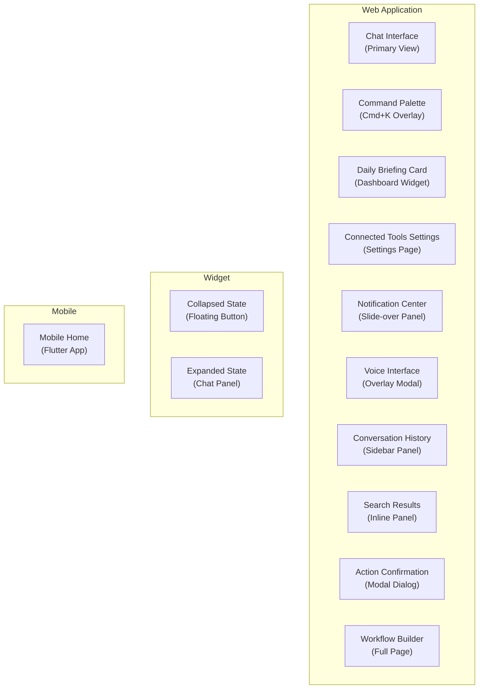

# ERP-Assistant Figma Design Prompts

## 1. Overview

This document provides detailed Figma design prompts for all UI surfaces of ERP-Assistant. Each prompt specifies layout, components, interactions, states, and design tokens. These prompts are intended for designers using Figma to create high-fidelity mockups and prototypes.

### Design System Foundation

- **Design System**: OpenSASE Design System (based on Tailwind CSS tokens)
- **Typography**: Inter (headings), JetBrains Mono (code/data)
- **Color Palette**: Primary Blue #1a73e8, Success Green #34a853, Warning Amber #fbbc04, Error Red #ea4335, Surface #ffffff, Background #f8f9fa
- **Spacing Scale**: 4px base unit (4, 8, 12, 16, 24, 32, 48, 64)
- **Border Radius**: sm=6px, md=8px, lg=12px, xl=16px, full=9999px
- **Shadow Tokens**: sm, md, lg, xl for elevation layers
- **Breakpoints**: sm=640px, md=768px, lg=1024px, xl=1280px, 2xl=1536px

### UI Architecture

---

## 2. Chat Interface

**Figma Prompt**:

> Design a full-screen chat interface for an enterprise AI assistant. The layout has three sections: a left sidebar (280px) showing conversation history with search, a center panel (flex-grow) with the chat thread, and an optional right panel (320px) for contextual details.
>
> **Left Sidebar**: Dark surface (#1e293b). Top section has the OpenSASE logo and "Assistant" label. Below: a search input with magnifying glass icon, followed by conversation list items. Each item shows: truncated title (1 line), timestamp (relative: "2h ago"), and a subtle module icon badge. Active conversation has a left accent border (Primary Blue) and lighter background. Bottom: "New Conversation" button with plus icon.
>
> **Center Chat Panel**: White background. Top bar with conversation title, a "..." menu (rename, delete, share), and a toggle for voice mode. Chat messages alternate between user (right-aligned, Blue background #e8f0fe, rounded-lg with tail) and assistant (left-aligned, white with border, rounded-lg with tail). Assistant messages can contain: plain text, markdown tables (zebra-striped), code blocks (dark bg with copy button), bullet lists, and inline action buttons ("Approve", "Reject", "More Details"). Show typing indicator (three animated dots) when AI is processing. Bottom: input area with textarea (auto-expand, max 6 lines), attachment button, voice button (microphone icon), and send button (arrow icon, Primary Blue when active, gray when empty). Below input: suggested quick actions as pill-shaped chips ("Show revenue", "Daily briefing", "Pending approvals").
>
> **Right Context Panel** (collapsible): Shows details for the last action or entity mentioned. E.g., if the assistant returned invoice data, show an invoice detail card. Header "Context" with close X button. Tabbed: "Details", "Actions", "History".
>
> **States to design**: Empty state (new conversation -- show greeting + 4 suggested prompts), Loading state (skeleton shimmer on last message), Error state (red banner at top with retry button), Offline state (gray banner "Reconnecting...").
>
> **Typography**: Message text 14px/1.6. Timestamps 12px text-gray-500. Sidebar titles 14px font-medium. Heading 18px font-semibold.
>
> **Dark mode variant**: Invert surfaces. Chat bg #0f172a. User message bg #1e3a5f. Assistant message bg #1e293b.

---

## 3. Command Palette (Cmd+K)

**Figma Prompt**:

> Design a command palette overlay inspired by Raycast/Linear, triggered by Cmd+K. The palette appears centered on screen with a backdrop blur overlay (bg-black/50).
>
> **Container**: 640px wide, max-height 480px, rounded-xl, shadow-2xl, white background. Slight fade-in and scale-up animation (95% -> 100%).
>
> **Search Input**: Top section. Large input (16px font, 48px height) with magnifying glass icon left, placeholder "Ask anything or search...", and "Esc" badge right. No border -- just bottom divider line.
>
> **Results Section**: Scrollable. Grouped by category with sticky group headers (12px uppercase text-gray-400 font-semibold, e.g., "RECENT", "ERP MODULES", "EXTERNAL TOOLS", "ACTIONS"). Each result item: 44px height, left icon (module/tool logo, 20x20), title text (14px font-medium), description text (14px text-gray-500, truncated), right shortcut badge if applicable. Hover: bg-gray-50. Active (keyboard selected): bg-blue-50 with left blue accent.
>
> **Categories to show**:
> - RECENT: Last 3 commands with clock icon
> - SUGGESTED: AI-suggested based on context (sparkle icon)
> - ERP MODULES: Finance, CRM, HCM, Commerce (with module-specific icons)
> - EXTERNAL TOOLS: Connected tools (Google, Slack, Jira logos)
> - ACTIONS: "Create invoice", "Approve pending", "Generate briefing" (lightning bolt icon)
>
> **Footer**: Subtle hint bar -- "Arrow keys to navigate / Enter to select / Tab to autocomplete". 12px text-gray-400.
>
> **States**: Empty (show recent + suggested), No results ("No results for [query]. Try asking in natural language."), Loading (spinner replacing search icon).
>
> **Transitions**: Results filter in real-time as user types. Smooth height transition on result count change.

---

## 4. Daily Briefing Card

**Figma Prompt**:

> Design a daily briefing card component for an ERP dashboard. The card is a standalone widget (400px wide or full-width responsive) that can be placed on any dashboard.
>
> **Header**: Gradient background (blue-600 to blue-800). White text. Left: calendar icon + "Monday, Feb 23". Right: "Good morning, Abiola" with user avatar (32x32 circle). Below header in smaller white text: "Here's your daily briefing".
>
> **Sections** (vertically stacked, 16px gap):
>
> 1. **KPI Summary**: Card with 3-4 metric tiles in a row. Each tile: metric label (12px text-gray-500), value (24px font-bold), change indicator (green up arrow +12% or red down arrow -5%). Metrics: "Revenue $2.4M", "Pipeline $8.5M", "Open Tickets 23", "Headcount 234".
>
> 2. **Pending Approvals**: Orange-left-border card. Icon: clock. "7 items awaiting your approval". Expandable list showing top 3: PO approval ($45K), Leave request (John, 3 days), Expense report ($2.1K). "View All" link.
>
> 3. **Calendar**: Blue-left-border card. Icon: calendar. Today's events: "10:00 - Sales Standup (Google Meet)", "14:00 - Budget Review (Teams)", "16:30 - 1:1 with Sarah". Source badges (Google/Microsoft icons).
>
> 4. **Deadlines**: Red-left-border card. Icon: alert triangle. "3 approaching deadlines". Items: "Project Alpha milestone (Tomorrow)", "Q1 report submission (3 days)", "Contract renewal - Acme (5 days)".
>
> 5. **Anomaly Alert** (conditional): Red background card with warning icon. "Revenue dropped 25% day-over-day -- unusual for this period." "Investigate" button.
>
> **Footer**: "Generated at 6:00 AM" in gray. "Refresh" and "Read aloud" buttons (the latter with speaker icon).
>
> **States**: Loading (skeleton shimmer per section), Error (single section failed -- show "Could not load [section]" with retry), Collapsed (show only header + first section with "Expand" button).

---

## 5. Connected Tools Settings

**Figma Prompt**:

> Design a settings page for managing connected tools (OAuth integrations). Full-width page within the app shell.
>
> **Page Header**: "Connected Tools" title (24px font-bold). Subtitle: "Manage your external service connections. The assistant can access these tools on your behalf." Right: search input for filtering tools.
>
> **Category Tabs**: Horizontal tabs -- "All", "ERP Modules (10)", "Productivity (11)", "Communication (4)", "Storage (3)". Active tab: blue underline.
>
> **Tool Grid**: 3 columns on desktop, 2 on tablet, 1 on mobile. Each tool card (rounded-lg, border, padding 24px):
> - **Top**: Tool logo (40x40), Tool name (16px font-semibold), Category badge pill
> - **Middle**: Brief description (14px text-gray-600). "Connected as: user@example.com" if connected.
> - **Status indicator**: Green dot + "Connected" or Gray dot + "Not connected"
> - **Permissions**: Comma-separated scope list (12px text-gray-500): "Gmail, Calendar, Drive"
> - **Bottom actions**: If connected: "Manage Permissions" link, "Disconnect" red text button. If not connected: "Connect" primary button.
> - **Last synced**: "Last synced 2 hours ago" in 12px gray.
>
> **Connected tool cards** have a subtle green-left-border. Disconnected cards are slightly muted (opacity 0.85).
>
> **Tool detail modal** (on "Manage Permissions" click): Shows full permission list with toggles. "Connected since: Feb 20, 2026". Activity log: last 5 actions performed via this connector. "Revoke Access" danger button at bottom.
>
> **States**: Loading grid (skeleton cards), Connection in progress (spinner on card), Connection failed (red border + error message + retry), OAuth popup blocked (yellow warning banner).

---

## 6. Notification Center

**Figma Prompt**:

> Design a notification center as a slide-over panel from the right edge. Triggered by bell icon in the top nav bar (with red badge count).
>
> **Panel**: 400px wide, full height, white background, shadow-xl on left edge. Slide-in animation from right.
>
> **Header**: "Notifications" title, filter dropdown ("All", "Actions", "Briefings", "Alerts", "System"), "Mark all read" text button, close X button.
>
> **Notification list**: Scrollable. Each notification card (padding 16px, bottom border):
> - **Unread indicator**: Blue dot (8px) on left
> - **Icon**: Action type icon (checkmark for approvals, alert for anomalies, calendar for briefings, plug for connectors)
> - **Title**: Bold 14px. E.g., "Purchase Order Requires Approval"
> - **Body**: 14px text-gray-600. "PO-2024-0891 for $45,000 from Acme Corp needs your approval."
> - **Actions**: Inline buttons if actionable ("Approve", "Reject", "View")
> - **Timestamp**: "5 min ago" in 12px text-gray-400
> - **Source badge**: Module icon (Finance, CRM, etc.)
>
> **Notification types to show**:
> - Pending approval (orange icon, with Approve/Reject buttons)
> - Briefing ready (blue icon, "View Briefing" button)
> - Anomaly alert (red icon, "Investigate" button)
> - Connector status (green/red icon, status text)
> - Workflow completed (purple icon, "View Results" link)
>
> **Empty state**: Illustration of bell with checkmark. "You're all caught up! No new notifications."
>
> **Footer**: "Notification Preferences" link to settings.

---

## 7. Voice Interface

**Figma Prompt**:

> Design a voice interface overlay that appears when the user activates voice mode (click microphone or wake word detected).
>
> **Overlay**: Centered modal, 480px wide, rounded-2xl, shadow-2xl. Backdrop blur (bg-black/60).
>
> **Idle state**: Large microphone icon (64px) in a circular button (96px diameter, blue gradient background). Below: "Click to speak or say 'Hey Assistant'". Animated subtle pulse ring around the button.
>
> **Listening state**: Microphone icon turns to animated sound wave visualization (5 bars, varying heights, blue gradient). Text: "Listening..." with animated dots. Real-time transcript appears below in 16px text as words are recognized (with cursor blink effect). Cancel button (X) in top-right.
>
> **Processing state**: Sound wave pauses. Circular spinner replaces microphone. Text: "Thinking..." with the finalized transcript shown above.
>
> **Responding state**: Speaker icon with sound wave animation. AI response text appears (typewriter effect, 16px). Audio playback progress bar below text. "Stop" button to interrupt.
>
> **History**: Below the main interaction area, a scrollable mini-transcript of the current voice session. User messages right-aligned (blue bg), assistant messages left-aligned.
>
> **Settings gear icon**: Opens voice preferences -- TTS voice selection (dropdown with preview play button), language, wake word toggle.
>
> **Keyboard shortcut hint**: "Space to start/stop" in subtle footer text.

---

## 8. Embeddable Widget

### Collapsed State

**Figma Prompt**:

> Design the collapsed state of an embeddable chat widget. This is a floating action button (FAB) positioned at bottom-right of any webpage (24px margin from edges).
>
> **Button**: 56px diameter circle, Primary Blue (#1a73e8) background, white chat bubble icon (24px). Shadow-lg. Hover: scale 1.05 with shadow-xl transition. Active: scale 0.95.
>
> **Badge**: If there are unread notifications, show a red circle badge (18px) at top-right of the button with white count text.
>
> **Tooltip**: On hover after 500ms, show tooltip above: "Ask your AI assistant" in dark tooltip style.
>
> **Greeting bubble** (optional, on first visit): A small speech bubble card appears above the FAB. "Hi! I'm your AI assistant. Ask me anything about your ERP." Close X button. Auto-dismiss after 5s.

### Expanded State

**Figma Prompt**:

> Design the expanded state of the embeddable widget. Appears when user clicks the collapsed FAB. Anchored to bottom-right.
>
> **Container**: 380px wide, 560px tall (max 80vh), rounded-xl top-left and top-right (bottom-right anchored), shadow-2xl, white background.
>
> **Header**: 56px height. Blue gradient background. Left: OpenSASE Assistant logo (24px) + "AI Assistant" text (white, 16px font-semibold). Right: minimize button (down-chevron), close button (X). Both white icons.
>
> **Chat area**: Scrollable, flex-grow. Same message bubble design as main chat interface but compact (12px font for timestamps, 14px for messages). Assistant messages can contain action buttons.
>
> **Input area**: Bottom-fixed. 48px textarea (single line by default, expand to max 3 lines). Left: attachment icon. Right: send arrow icon. Below input: 2-3 suggestion chips.
>
> **Animation**: Expand from bottom-right corner with scale + fade (150ms ease-out). Collapse: reverse animation back to FAB.
>
> **States**: Loading (centered spinner), Error (red banner at top), Minimized (show just header bar, 56px height, click to expand).

---

## 9. Mobile App Home (Flutter)

**Figma Prompt**:

> Design the home screen of the ERP-Assistant Flutter mobile app. iOS and Android native feel.
>
> **Status bar**: System status bar (time, battery, signal).
>
> **Top section**: User greeting. "Good morning, Abiola" (20px font-bold). Subtitle: "Monday, February 23, 2026" (14px text-gray-500). User avatar (40px circle) at right.
>
> **Daily Briefing Card**: Horizontal scrollable summary cards (snap scroll). Each card: 280px wide, rounded-xl, subtle gradient background. Cards: "Revenue $2.4M (+12%)", "Pending Approvals (7)", "Meetings Today (3)", "Deadlines This Week (3)". Tap any card to drill into detail.
>
> **Quick Actions Grid**: 2x2 grid of large touch-target buttons (80px x 80px). Icons: "Ask Question" (chat bubble), "Voice Command" (microphone), "View Briefing" (document), "Search" (magnifying glass). Label below each icon (12px).
>
> **Recent Conversations**: List of last 5 conversations. Each item: title (14px font-medium, 1 line), last message preview (12px text-gray-500, 1 line), timestamp (12px text-gray-400), module icon badge.
>
> **Bottom Navigation Bar**: 5 tabs: Home (house icon), Chat (chat bubble), Briefing (document), Tools (plug icon), Settings (gear). Active tab: blue icon + label. Inactive: gray icon only.
>
> **FAB**: Floating microphone button (56px) above the bottom nav bar, centered. Blue gradient. Tap to start voice interaction.

---

## 10. Conversation History

**Figma Prompt**:

> Design a conversation history view as the left sidebar panel in the main chat interface (280px width).
>
> **Header**: "Conversations" title (16px font-semibold). New conversation button (plus icon in circle).
>
> **Search**: Input with magnifying glass icon. "Search conversations..." placeholder. 14px.
>
> **Filter pills**: Horizontal scrollable. "All", "Today", "This Week", "This Month", "Starred". Active pill: blue bg, white text. Inactive: gray bg.
>
> **Conversation list**: Scrollable. Each item (padding 12px, 8px gap):
> - Title (14px font-medium, 1 line ellipsis). Auto-generated from first message or user-renamed.
> - Preview (12px text-gray-500, 1 line ellipsis). Last message snippet.
> - Timestamp (12px text-gray-400). Relative: "2h ago", "Yesterday", "Feb 20".
> - Module badges: Small colored dots or icons showing which modules were involved (Finance=green, CRM=blue, HCM=purple).
> - Hover: Show "..." menu (Rename, Star, Delete) and Star icon.
>
> **Active conversation**: bg-blue-50, left border 3px blue.
>
> **Empty state**: "No conversations yet. Start by typing a question below."
>
> **Grouped**: Optionally group by date: "Today", "Yesterday", "This Week", "Older".

---

## 11. Action Confirmation Dialog

**Figma Prompt**:

> Design a modal dialog for action confirmation. This is the critical AIDD guardrail UI.
>
> **Overlay**: Centered modal, 520px wide, rounded-xl, shadow-2xl. Backdrop bg-black/50.
>
> **Header**: Warning icon (amber for confirm, red for delete/bulk). Title: "Confirm Action" (18px font-bold). Close X button.
>
> **Body**:
> - **Action description**: "The assistant wants to perform the following action:" (14px text-gray-600).
> - **Action card**: Bordered card with:
>   - Action type badge: "WRITE" (amber), "DELETE" (red), "BULK" (purple)
>   - Description: "Approve Purchase Order PO-2024-0891" (16px font-semibold)
>   - Target: "ERP-Finance > Purchase Orders"
>   - Details table: Key-value pairs. "Vendor: Acme Corp", "Amount: $45,000", "Terms: Net 30".
>   - Risk badge: "High Risk" (amber bg), "Critical" (red bg)
>
> - **For bulk operations**: Additional section showing "42 items will be affected." Expandable preview table showing first 5 items with columns. "Show all" link.
>
> - **Rollback note**: Info icon + "This action can be rolled back within 24 hours." (12px text-blue-600).
>
> **Footer**: Two buttons. Left: "Cancel" (ghost/outline button). Right: "Confirm & Execute" (primary button, amber for writes, red for deletes). For extra safety on deletes: require typing "DELETE" to enable the confirm button.
>
> **States**: Loading (buttons disabled, spinner on confirm button), Success (green checkmark animation, auto-close after 2s), Error (red banner in body with retry option).

---

## 12. Search Results

**Figma Prompt**:

> Design a search results view that appears as an inline panel when the user performs a cross-module search (via command palette or chat).
>
> **Panel**: Replaces the right context panel (320px) or appears as a full center view.
>
> **Header**: "Search results for '[query]'" (16px font-semibold). Result count: "24 results across 5 modules". Filter chips: "All", "Finance", "CRM", "HCM", "External Tools".
>
> **Results grouped by module**:
> Each group has a module header (14px font-semibold, module icon + name + count).
>
> Each result card:
> - Module icon + Entity type badge (e.g., "Invoice", "Contact", "Deal")
> - Title (14px font-medium, linked). E.g., "INV-2024-001 - ABC Corp"
> - Snippet (12px text-gray-500). Highlighted matching terms in yellow.
> - Metadata pills: "Overdue" (red), "$15,000" (gray), "Created Feb 20" (gray)
> - Quick action icons: Eye (view), Link (copy link), Arrow (open in module)
>
> **Example groups**:
> - ERP-Finance (8): Invoices, payments matching query
> - ERP-CRM (6): Contacts, deals matching query
> - Google Workspace (5): Emails, documents matching query
> - Slack (3): Messages matching query
> - Jira (2): Issues matching query
>
> **Empty state**: "No results found for '[query]'. Try a different search term or ask the assistant in natural language."
>
> **Pagination**: "Load more" button at end of each group. Or infinite scroll.

---

## 13. Workflow Builder

**Figma Prompt**:

> Design a visual workflow builder page for creating automated multi-step workflows.
>
> **Page layout**: Full-width, no sidebar. Top toolbar + canvas.
>
> **Top toolbar**: Workflow name (editable inline, 18px font-semibold). Save button (primary). "Active" toggle switch. "Test Run" button (outline). "..." menu (duplicate, delete, export). Breadcrumb: "Workflows > Weekly Revenue Report".
>
> **Canvas** (center area, full remaining height, light gray dot-grid background):
>
> **Trigger node** (top of canvas): Rounded-lg card with clock icon. "When: Every Monday at 9:00 AM". Blue left border. Click to configure: dropdown for trigger type (Schedule, Event, Manual), schedule picker.
>
> **Step nodes** (connected by animated dashed lines with arrow):
> Each step: Card (240px wide), rounded-lg, white bg, shadow-sm. Contains:
> - Step number badge (circle, top-left)
> - Module icon + name (14px font-semibold): "ERP-Finance"
> - Action description (12px): "Get overdue invoices"
> - Condition indicator if applicable (diamond icon): "If count > 0"
> - Status indicator: Green checkmark (tested), gray circle (untested)
> - Edit/delete/duplicate icons on hover
>
> **Connector lines**: Smooth bezier curves between nodes. Arrow direction indicates flow. Branch splits for conditionals.
>
> **Conditional branch**: Diamond-shaped decision node. "If overdue > 10" with Yes/No paths diverging.
>
> **Final node**: "Deliver via" card. Icons for delivery method (Slack, Email, In-app). Multiple can be selected.
>
> **Right sidebar** (300px, shown when a step is selected): Step configuration form. Module selector dropdown, action type, parameter fields (auto-generated from module schema), condition builder, failure policy (Stop/Skip/Retry).
>
> **Add step button**: Dashed-border card between nodes. "+" icon. Click to add step from module picker.
>
> **Bottom panel** (collapsible): "Test Results" showing last test run output per step. Green/red status per step.
>
> **States**: Empty (one trigger node + "Add first step" prompt), Running (animated pulse on current step), Error (red border on failed step with error message).
