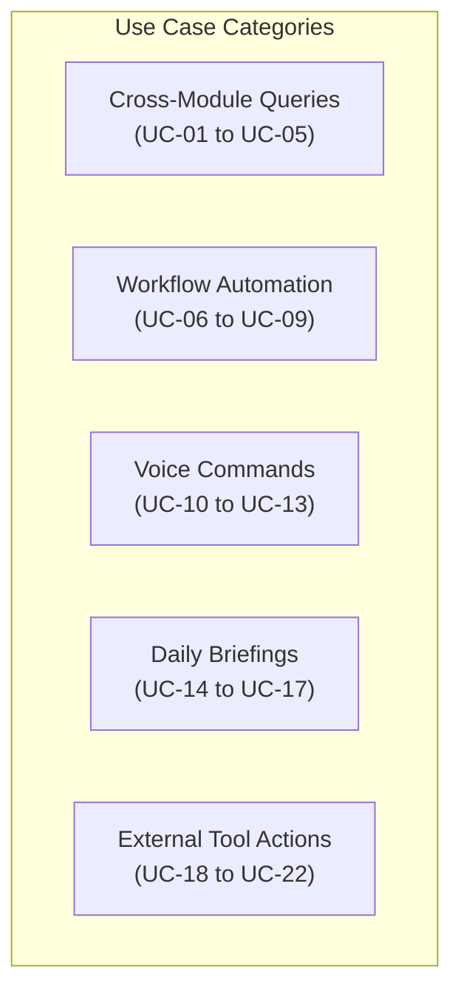
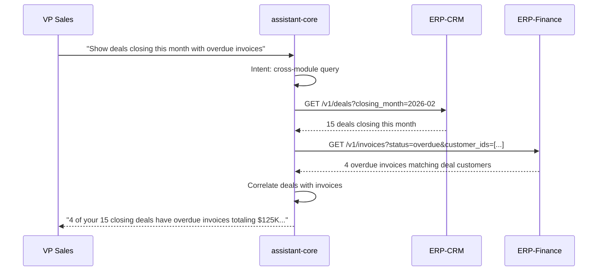
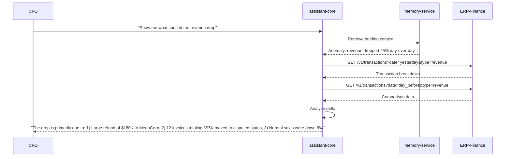
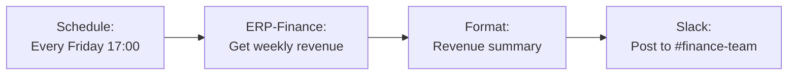
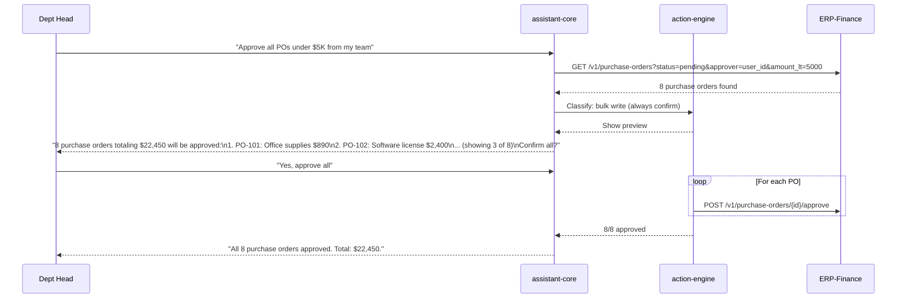
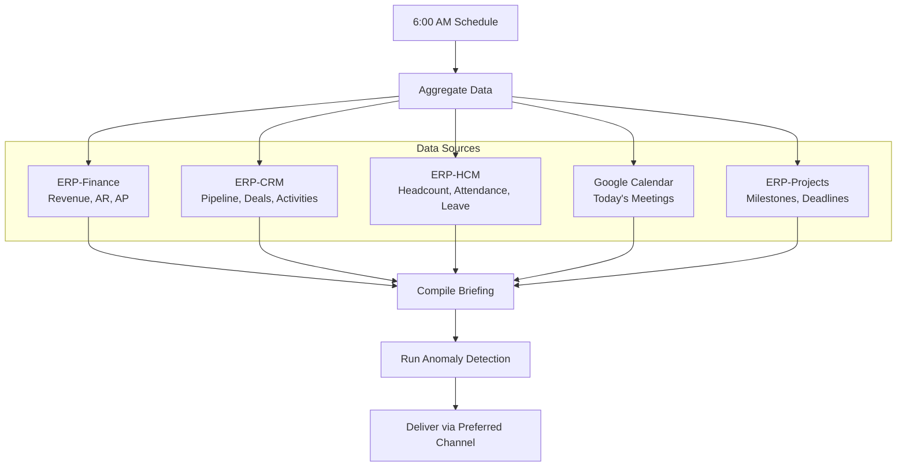

# ERP-Assistant Use Cases

## 1. Overview

This document catalogs 22 detailed use cases for ERP-Assistant, organized by category: cross-module queries, workflow automation, voice commands, daily briefings, and external tool actions. Each use case includes actor, preconditions, trigger, main flow, alternative flows, postconditions, and the AIDD guardrail classification.

---

## UC-01: Cross-Module Revenue and Pipeline Correlation

**Actor**: VP of Sales
**Preconditions**: ERP-Finance and ERP-CRM connectors active
**AIDD Classification**: Read (autonomous)

**Trigger**: "Show me deals closing this month that have overdue invoices"

**Main Flow**:

**Alternative Flows**:
- No overdue invoices found: "Good news -- none of your closing deals have overdue invoices."
- CRM connector unavailable: "I can't reach CRM right now. Here are overdue invoices from Finance: [list]"

**Postconditions**: Query logged to audit trail; interaction stored in memory-service for future context

---

## UC-02: Employee Headcount with Attrition Analysis

**Actor**: HR Director
**Preconditions**: ERP-HCM connector active
**AIDD Classification**: Read (autonomous)

**Trigger**: "How many employees joined in January and what's the current attrition rate?"

**Main Flow**:
1. assistant-core classifies intent as query targeting ERP-HCM
2. Extracts entities: metric=headcount, period=January 2026, metric=attrition_rate
3. Queries ERP-HCM for new hires in January and current attrition data
4. Formats response with counts and percentage with trend indicator

**Response Example**: "23 employees joined in January 2026. Current attrition rate is 8.2%, down from 9.1% in December. YoY trend is improving."

---

## UC-03: Healthcare Appointment and Insurance Verification

**Actor**: Healthcare Administrator
**Preconditions**: ERP-Healthcare connector active
**AIDD Classification**: Read (autonomous)

**Trigger**: "How many patient appointments are scheduled for next week and how many have insurance verified?"

**Main Flow**:
1. Route to ERP-Healthcare connector
2. Query appointment count for next week
3. Cross-reference with insurance verification status
4. Return breakdown with percentages

**Response Example**: "142 appointments scheduled for next week. 118 (83%) have verified insurance. 24 still need verification -- 8 are high-value procedures."

---

## UC-04: Commerce Order Fulfillment Status

**Actor**: Operations Manager
**Preconditions**: ERP-Commerce and ERP-SCM connectors active
**AIDD Classification**: Read (autonomous)

**Trigger**: "What's the fulfillment status for orders placed this week?"

**Main Flow**:
1. Query ERP-Commerce for this week's orders
2. Cross-reference with ERP-SCM for shipping/fulfillment data
3. Return summary with status breakdown

**Response Example**: "87 orders this week. 52 shipped (60%), 20 processing (23%), 15 pending inventory (17%). 3 orders flagged as delayed due to supplier backlog."

---

## UC-05: Financial Anomaly Investigation

**Actor**: CFO
**Preconditions**: Briefing anomaly triggered, ERP-Finance active
**AIDD Classification**: Read (autonomous)

**Trigger**: "Show me what caused the revenue drop flagged in my briefing"

**Main Flow**:

---

## UC-06: Automated Weekly Revenue Report Workflow

**Actor**: Finance Manager
**Preconditions**: ERP-Finance active, Slack connected
**AIDD Classification**: Workflow automation (supervised)

**Trigger**: "Every Friday at 5 PM, send a revenue summary to #finance-team on Slack"

**Main Flow**:
1. assistant-core parses workflow definition
2. Creates scheduled trigger: every Friday at 17:00
3. Defines steps: Query ERP-Finance revenue this week -> Format as summary -> Send to Slack #finance-team
4. Shows confirmation: "I'll create a workflow that sends weekly revenue to #finance-team every Friday at 5 PM. Confirm?"
5. On confirmation, saves workflow to PostgreSQL

**Workflow Definition**:

---

## UC-07: Automated Overdue Invoice Escalation

**Actor**: Accounts Receivable Manager
**Preconditions**: ERP-Finance active
**AIDD Classification**: Bulk write (always confirm)

**Trigger**: "Set up a daily check: if any invoice is overdue by more than 30 days, escalate it and notify the sales owner"

**Main Flow**:
1. Parse workflow with conditional logic
2. Create workflow: Daily at 8 AM -> Query overdue invoices > 30 days -> For each: update status to "Escalated" + notify sales owner
3. Show confirmation with expected impact
4. On confirmation, activate workflow

---

## UC-08: Cross-Module Task Assignment

**Actor**: Project Manager
**Preconditions**: ERP-Projects and ERP-HCM active
**AIDD Classification**: Write (confirm)

**Trigger**: "Assign the database migration task to whoever has the lowest workload on the backend team"

**Main Flow**:
1. Query ERP-Projects for current task assignments on backend team
2. Query ERP-HCM for backend team members
3. Calculate workload per team member
4. Identify lowest workload member
5. Show confirmation: "Sarah has the lowest workload (3 tasks). Assign 'Database Migration' to her? Confirm?"
6. On confirmation, create task assignment in ERP-Projects

---

## UC-09: Conditional Approval Chain

**Actor**: Department Head
**Preconditions**: ERP-Finance active
**AIDD Classification**: Write (confirm per action)

**Trigger**: "Approve all pending purchase orders under $5,000 from my team"

**Main Flow**:

---

## UC-10: Voice-Activated Morning Briefing

**Actor**: Executive
**Preconditions**: Voice service active, briefing-service configured
**AIDD Classification**: Read (autonomous)

**Trigger**: Wake word "Hey Assistant" + "What's my briefing for today?"

**Main Flow**:
1. voice-service detects wake word and begins recording
2. Whisper transcribes: "What's my briefing for today?"
3. Routes to assistant-core -> briefing-service
4. Generates daily briefing (KPIs, approvals, calendar, deadlines)
5. TTS reads briefing aloud via ElevenLabs

---

## UC-11: Voice Invoice Creation

**Actor**: Field Accountant (mobile)
**Preconditions**: Voice service active, ERP-Finance connected
**AIDD Classification**: Write (confirm)

**Trigger**: Voice: "Create an invoice for GreenTech Solutions, fifteen thousand dollars, due in 30 days, for cloud infrastructure consulting"

**Main Flow**:
1. Whisper transcribes voice input
2. Entity extraction: customer=GreenTech Solutions, amount=$15,000, terms=Net30, description=cloud infrastructure consulting
3. action-engine classifies as write (confirm)
4. TTS reads back: "I'll create an invoice for GreenTech Solutions for $15,000, due March 25, for cloud infrastructure consulting. Shall I proceed?"
5. User says "Yes" -> Whisper transcribes -> Execute

---

## UC-12: Voice Meeting Notes to Notion

**Actor**: Knowledge Worker
**Preconditions**: Voice active, Notion connected
**AIDD Classification**: Write (confirm)

**Trigger**: Voice: "Save meeting notes to Notion: We discussed the Q2 marketing budget, agreed on $500K allocation, and Sarah will prepare the campaign brief by Friday"

**Main Flow**:
1. Transcribe meeting notes
2. Format as structured Notion page
3. Confirm with user: "I'll create a Notion page titled 'Q2 Marketing Budget Meeting Notes' with the discussed items. Confirm?"
4. On confirmation, create via Notion OAuth2 API

---

## UC-13: Voice Cross-Module Quick Query

**Actor**: Manager (in transit)
**Preconditions**: Voice active, mobile app
**AIDD Classification**: Read (autonomous)

**Trigger**: Voice: "How many deals did we close this week?"

**Main Flow**:
1. Quick transcription
2. Route to ERP-CRM
3. TTS response: "You closed 7 deals this week worth a total of $340,000. The largest was the Acme Corp enterprise deal at $120,000."

---

## UC-14: Daily Briefing with KPI Dashboard

**Actor**: CEO
**Preconditions**: Finance, CRM, HCM connectors active
**AIDD Classification**: Read (autonomous)

**Trigger**: Scheduled daily at 6:00 AM or manual request

**Main Flow**:

---

## UC-15: Weekly Team Performance Briefing

**Actor**: Engineering Manager
**Preconditions**: ERP-HCM, Jira, Linear connected
**AIDD Classification**: Read (autonomous)

**Trigger**: "Generate a weekly team performance summary"

**Main Flow**:
1. Query Jira/Linear for completed tickets, sprint velocity
2. Query ERP-HCM for attendance, overtime hours
3. Aggregate and compare with previous week
4. Generate summary with highlights and concerns

---

## UC-16: Anomaly Alert and Investigation

**Actor**: Finance Director
**Preconditions**: Briefing anomaly detection active
**AIDD Classification**: Read (autonomous)

**Trigger**: Automated anomaly detection in briefing-service

**Main Flow**:
1. briefing-service detects statistical outlier (e.g., expense claims 3x normal)
2. Generates alert event
3. Notification pushed to user via notification center
4. User clicks "Investigate"
5. assistant-core drills into data source and surfaces root cause

---

## UC-17: Custom Briefing Configuration

**Actor**: VP Operations
**Preconditions**: Multiple modules active
**AIDD Classification**: Write (non-sensitive, log + execute)

**Trigger**: "Change my daily briefing to include supply chain metrics and remove healthcare data"

**Main Flow**:
1. Parse preference change request
2. Update user's briefing configuration in memory-service
3. Confirm: "Updated your briefing to include SCM metrics and exclude Healthcare. Changes take effect tomorrow."

---

## UC-18: Slack Message from ERP Context

**Actor**: Sales Manager
**Preconditions**: Slack connected, ERP-CRM active
**AIDD Classification**: Write (non-sensitive, log + execute)

**Trigger**: "Send a message to #sales-team on Slack: Q1 pipeline is at $4.2M, 15% above target"

**Main Flow**:
1. connector-hub authenticates via Slack OAuth2
2. action-engine classifies as non-sensitive write
3. Sends message via Slack API
4. Confirms: "Message sent to #sales-team."

---

## UC-19: Jira Ticket Creation from ERP Bug

**Actor**: QA Engineer
**Preconditions**: Jira connected
**AIDD Classification**: Write (confirm)

**Trigger**: "Create a Jira bug in the Platform project: Login page returns 500 for SSO users, priority high"

**Main Flow**:
1. Extract entities: project=Platform, type=Bug, summary="Login page returns 500 for SSO users", priority=High
2. Show confirmation with all fields
3. On confirmation, create issue via Jira REST API
4. Return: "Created PLATFORM-1234: 'Login page returns 500 for SSO users'. [Link]"

---

## UC-20: Google Calendar Meeting Scheduling

**Actor**: Account Manager
**Preconditions**: Google Calendar connected
**AIDD Classification**: Write (confirm)

**Trigger**: "Schedule a 1-hour meeting with the finance team tomorrow at 2 PM to discuss Q2 budget"

**Main Flow**:
1. Extract: duration=1h, attendees=finance team, date=tomorrow 2PM, subject=Q2 Budget Discussion
2. Query calendar for availability conflicts
3. Show confirmation: "Schedule '1h Q2 Budget Discussion' tomorrow at 2:00 PM with Finance team (5 people). No conflicts found. Confirm?"
4. Create Google Calendar event on confirmation

---

## UC-21: Todoist Task from Action Item

**Actor**: Knowledge Worker
**Preconditions**: Todoist connected
**AIDD Classification**: Write (confirm)

**Trigger**: "Add to Todoist: Follow up with vendor on pricing, due this Friday, priority high"

**Main Flow**:
1. Extract: title="Follow up with vendor on pricing", due=Friday, priority=high
2. Show confirmation with task details
3. Create task via Todoist API
4. Return: "Task created in Todoist: 'Follow up with vendor on pricing', due Feb 28."

---

## UC-22: Multi-Channel Notification Broadcast

**Actor**: Marketing Director
**Preconditions**: Slack + Email connectors active
**AIDD Classification**: Write (confirm, multiple targets)

**Trigger**: "Send a reminder to the marketing team via Slack and email about the campaign launch meeting tomorrow"

**Main Flow**:
1. Parse multi-channel request
2. Resolve marketing team members from ERP-HCM
3. Show confirmation: "Send reminder to 12 marketing team members via Slack (#marketing) and email. Confirm?"
4. On confirmation, send via both channels
5. Report delivery status: "Slack: delivered. Email: 12/12 sent."

---

## 2. Use Case Summary Matrix

| UC | Category | Risk | Confirmation | Modules Involved |
|----|----------|------|-------------|-----------------|
| UC-01 | Cross-Module Query | Low | No | CRM, Finance |
| UC-02 | Cross-Module Query | Low | No | HCM |
| UC-03 | Cross-Module Query | Low | No | Healthcare |
| UC-04 | Cross-Module Query | Low | No | Commerce, SCM |
| UC-05 | Cross-Module Query | Low | No | Finance |
| UC-06 | Workflow | High | Yes | Finance, Slack |
| UC-07 | Workflow | Critical | Yes | Finance |
| UC-08 | Workflow | High | Yes | Projects, HCM |
| UC-09 | Workflow | Critical | Yes | Finance |
| UC-10 | Voice | Low | No | Briefing |
| UC-11 | Voice | High | Yes | Finance |
| UC-12 | Voice | High | Yes | Notion |
| UC-13 | Voice | Low | No | CRM |
| UC-14 | Briefing | Low | No | Finance, CRM, HCM, Calendar |
| UC-15 | Briefing | Low | No | HCM, Jira, Linear |
| UC-16 | Briefing | Low | No | Finance |
| UC-17 | Briefing | Medium | No | Memory |
| UC-18 | External | Medium | No | CRM, Slack |
| UC-19 | External | High | Yes | Jira |
| UC-20 | External | High | Yes | Google Calendar |
| UC-21 | External | High | Yes | Todoist |
| UC-22 | External | High | Yes | Slack, Email, HCM |
