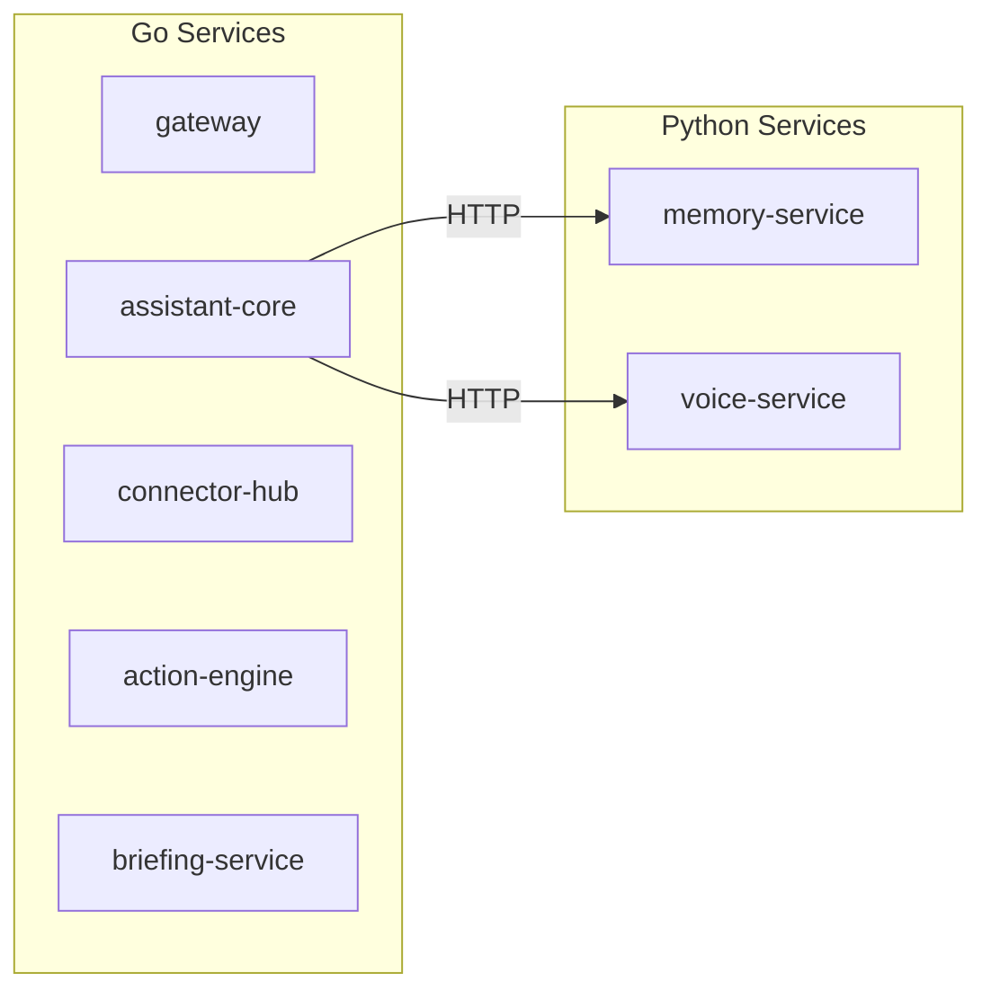

# ERP-Assistant Architecture Decision Records (ADR) Index

## Overview

This document indexes all Architecture Decision Records for the ERP-Assistant module. ADRs capture significant architectural decisions, their context, rationale, and consequences.

### ADR Status Legend

| Status | Meaning |
|--------|---------|
| Accepted | Decision implemented and in effect |
| Proposed | Decision under review |
| Deprecated | Superseded by newer decision |
| Rejected | Evaluated and not adopted |

---

## ADR-001: Language Choice -- Polyglot Architecture

**Status**: Accepted
**Date**: 2026-02-23
**Context**: ERP-Assistant requires both high-performance HTTP services and ML/AI workloads. A single language cannot optimally serve both needs.

**Decision**: Adopt a polyglot architecture:
- **Go 1.22** for orchestration services (assistant-core, connector-hub, action-engine, briefing-service, gateway)
- **Python 3.12** for ML services (memory-service with Qdrant, voice-service with Whisper/TTS)

**Rationale**:
- Go provides low-latency HTTP serving, simple deployment (single binary), strong concurrency primitives, and aligns with other ERP-Platform services
- Python provides access to the ML ecosystem (sentence-transformers, Whisper, FastAPI) essential for vector search and speech processing
- The boundary between Go and Python services is clean: Go handles orchestration and business logic; Python handles AI/ML inference

**Consequences**:
- Two CI pipelines (Go test + Python test)
- Two container images per language
- HTTP/gRPC communication between Go and Python services
- Team must maintain proficiency in both languages

---

## ADR-002: Database Selection -- Polyglot Persistence

**Status**: Accepted
**Date**: 2026-02-23
**Context**: ERP-Assistant has diverse data needs: relational (conversations, configurations), caching (session state), vector (semantic memory), event streaming (audit), and object storage (voice recordings).

**Decision**: Adopt polyglot persistence:
- **PostgreSQL 16**: Primary relational store for conversations, configurations, audit logs
- **Redis 7**: Cache layer for session state, rate limiting, token caching
- **Qdrant**: Vector database for semantic memory and preference embeddings
- **ClickHouse**: OLAP analytics for command and usage metrics
- **MinIO**: Object storage for voice recordings and file attachments

**Rationale**:
- PostgreSQL 16 offers JSONB for flexible conversation metadata, row-level security for tenant isolation, and proven reliability
- Redis 7 provides sub-millisecond cache access critical for conversation context retrieval
- Qdrant is purpose-built for vector similarity search, outperforming PostgreSQL pgvector for the scale of embeddings needed
- ClickHouse handles analytical queries over millions of command logs without impacting transactional workloads
- MinIO provides S3-compatible object storage for self-hosted deployments

**Consequences**:
- Multiple database dependencies to manage in deployment
- Data consistency across stores requires careful event-driven synchronization
- Backup and recovery procedures needed per database engine
- Connection pooling and health monitoring for each store

---

## ADR-003: NLP Engine -- Claude API Selection

**Status**: Accepted
**Date**: 2026-02-23
**Context**: ERP-Assistant requires a large language model for natural language understanding, intent classification, entity extraction, and tool calling.

**Decision**: Use Anthropic's Claude API as the primary NLP engine.

**Rationale**:
- Best-in-class tool calling accuracy for complex enterprise queries
- Multi-turn conversation support with large context windows
- Strong instruction following for guardrail compliance
- Structured output support for entity extraction
- Competitive pricing for enterprise workloads

**Alternatives Considered**:
| Option | Pros | Cons | Decision |
|--------|------|------|----------|
| Claude API | Best tool calling, large context | External dependency, cost | **Selected** |
| GPT-4 (OpenAI) | Good tool calling | Less reliable for structured output | Rejected |
| Self-hosted LLM | No external dependency | Lower accuracy, significant infra cost | Rejected |
| Gemini (Google) | Good reasoning | Less mature tool calling | Rejected |

**Consequences**:
- External API dependency requires fallback/retry strategy
- Claude API rate limits must be managed per-tenant
- Cost scales with usage; requires monitoring and budgeting
- Token usage optimization needed for cost efficiency

---

## ADR-004: AIDD Guardrail Architecture

**Status**: Accepted
**Date**: 2026-02-23
**Context**: As an AI-powered assistant with write access to financial, HR, and operational systems, unchecked AI actions pose significant risk.

**Decision**: Implement AIDD (AI-Driven Development) guardrails as a core architectural component, codified in `aidd.guardrails.yaml` and enforced by the action-engine.

**Rationale**:
- Progressive trust model: read=autonomous, write-sensitive=confirm, delete=always-confirm, prohibited=block
- All decisions logged for audit compliance
- 24-hour rollback window for supervised actions
- Prohibited actions hard-coded to prevent AI circumvention

**Consequences**:
- Slight latency increase for confirmed actions (user interaction required)
- Guardrail classification must be maintained as new modules are added
- Audit log storage requirements grow linearly with usage

---

## ADR-005: Connector Auto-Discovery

**Status**: Accepted
**Date**: 2026-02-23
**Context**: As the ERP platform grows, manually registering each new module with the assistant would create maintenance burden and deployment coupling.

**Decision**: Implement auto-discovery of ERP modules via capabilities.json scanning.

**Rationale**:
- connector-hub periodically scans for ERP-* services and reads their `/v1/capabilities` endpoint
- Tool definitions are dynamically generated from discovered capabilities
- New modules become available to the assistant without code changes

**Consequences**:
- All ERP modules must expose a standard capabilities.json format
- Discovery introduces a delay (up to 5 minutes) for new module availability
- Malformed capabilities.json could cause connector failures

---

## ADR-006: Voice Technology Stack

**Status**: Accepted
**Date**: 2026-02-23
**Context**: Voice interface requires speech-to-text (STT) and text-to-speech (TTS) capabilities.

**Decision**:
- **STT**: OpenAI Whisper Large-v3 (self-hosted)
- **TTS**: ElevenLabs (cloud) with Coqui TTS (self-hosted fallback)

**Rationale**:
- Whisper Large-v3 provides best open-source STT accuracy without cloud dependency
- ElevenLabs provides the most natural voice quality for enterprise use
- Coqui TTS serves as self-hosted fallback for airgapped deployments

**Consequences**:
- Whisper requires GPU for real-time transcription; CPU fallback is 3-5x slower
- ElevenLabs incurs per-character TTS cost
- Two TTS engines to maintain for cloud and self-hosted modes

---

## ADR-007: Frontend Technology -- Next.js 14

**Status**: Accepted
**Date**: 2026-02-23
**Context**: The web frontend needs server-side rendering for SEO (if applicable), streaming for real-time chat, and React compatibility for the widget.

**Decision**: Use Next.js 14 with App Router for the web application.

**Rationale**:
- App Router provides React Server Components for efficient rendering
- Built-in streaming support for real-time chat responses
- React 18.3 foundation shared with embeddable widget
- Strong TypeScript support and developer ecosystem

---

## ADR Summary

| ADR | Decision | Status |
|-----|----------|--------|
| 001 | Polyglot (Go + Python) | Accepted |
| 002 | PostgreSQL + Redis + Qdrant + ClickHouse + MinIO | Accepted |
| 003 | Claude API for NLP | Accepted |
| 004 | AIDD Guardrails in action-engine | Accepted |
| 005 | Auto-discovery via capabilities.json | Accepted |
| 006 | Whisper STT + ElevenLabs/Coqui TTS | Accepted |
| 007 | Next.js 14 + React 18 | Accepted |
