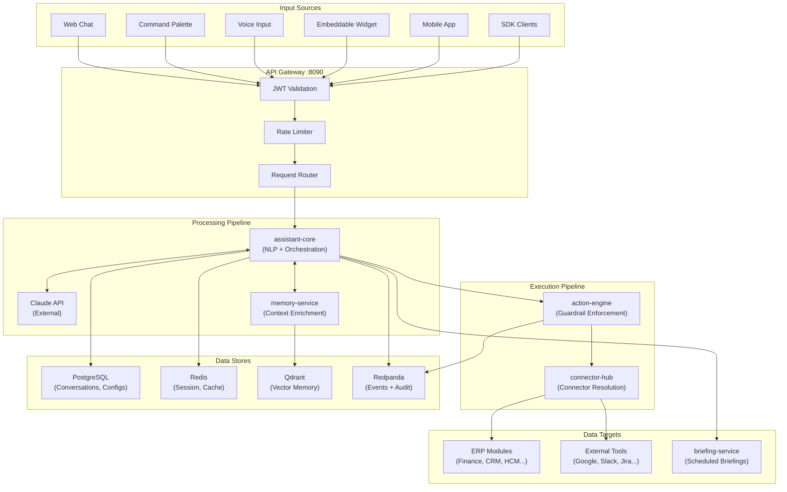
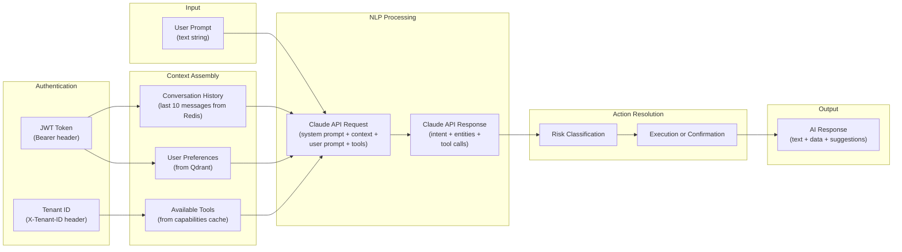
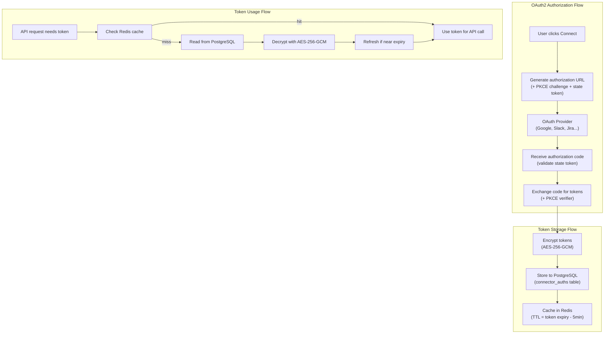
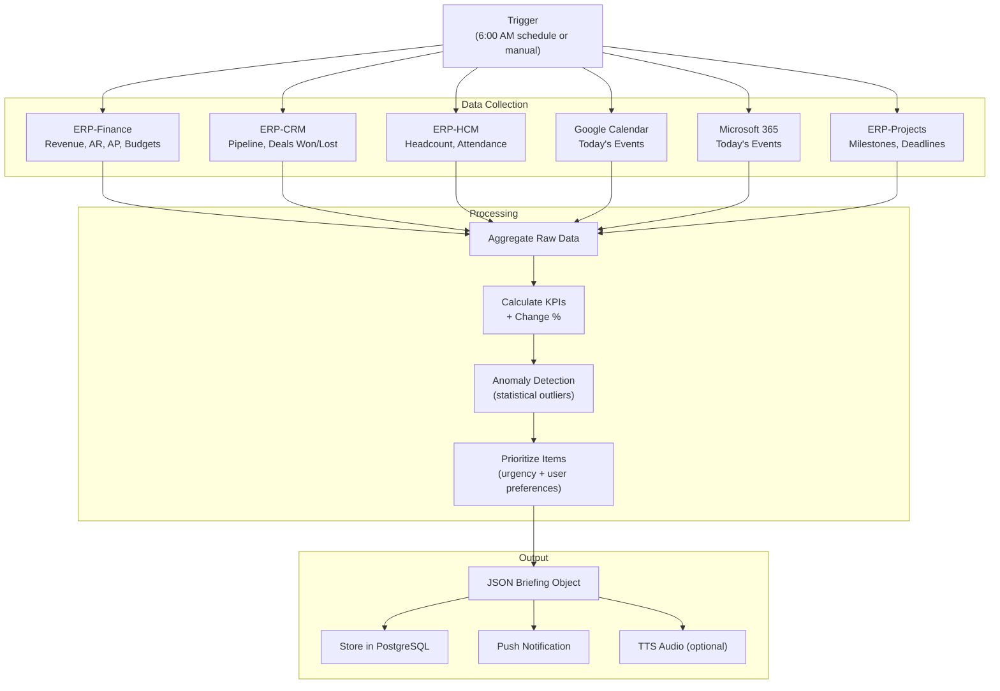
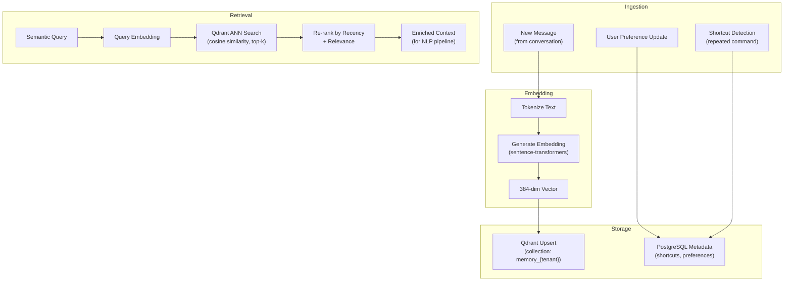
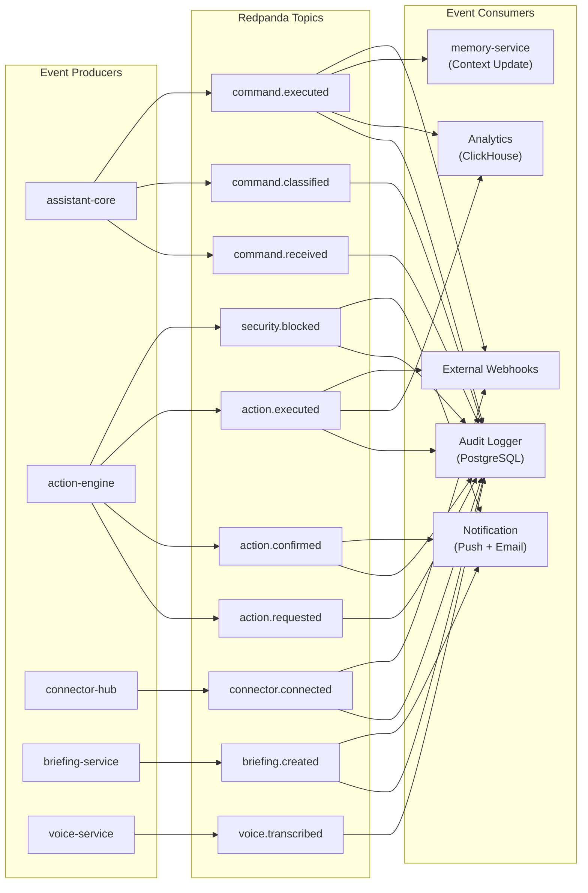
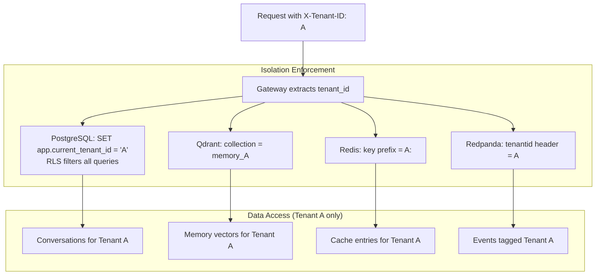

# ERP-Assistant Data Flow Diagrams

## 1. System-Level Data Flow

## 2. Natural Language Command Data Flow

## 3. OAuth2 Token Data Flow

## 4. Briefing Generation Data Flow

## 5. Voice Pipeline Data Flow

```mermaid
flowchart LR
    subgraph "Input Pipeline"
        MIC["Microphone<br/>(PCM 16-bit 16kHz)"]
        WS_IN["WebSocket Frame<br/>(binary audio)"]
        WAKE["Wake Word Detection"]
        WHISPER["Whisper Large-v3<br/>(STT)"]
        TRANSCRIPT["Transcript Text<br/>(+ confidence score)"]
    end

    subgraph "Processing"
        NLP["assistant-core<br/>(same as text commands)"]
    end

    subgraph "Output Pipeline"
        AI_TEXT["AI Response Text"]
        TTS["ElevenLabs / Coqui<br/>(TTS)"]
        AUDIO_OUT["Audio Stream<br/>(PCM 16-bit 24kHz)"]
        WS_OUT["WebSocket Frame<br/>(binary audio)"]
        SPEAKER["Speaker Output"]
    end

    MIC --> WS_IN --> WAKE --> WHISPER --> TRANSCRIPT
    TRANSCRIPT --> NLP --> AI_TEXT
    AI_TEXT --> TTS --> AUDIO_OUT --> WS_OUT --> SPEAKER
```

## 6. Memory Service Data Flow

## 7. Event Flow Across Services

## 8. Tenant Data Isolation Flow

