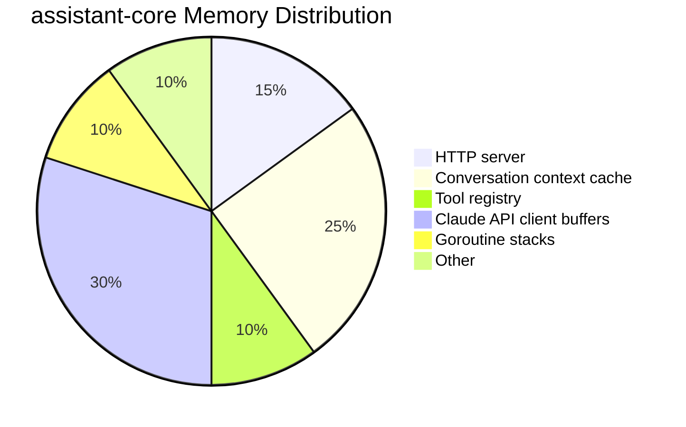
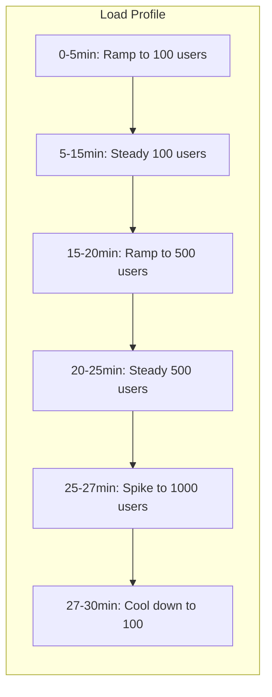

# ERP-Assistant Performance Benchmarks

## 1. Overview

This document defines performance targets, measurement methodology, and benchmark results for ERP-Assistant. Performance is measured across six dimensions: latency, throughput, resource utilization, AI processing, voice pipeline, and connector responsiveness.

## 2. Latency Targets

### Command Processing Latency

```mermaid
gantt
    title Command Processing Latency Breakdown (p50 Target)
    dateFormat X
    axisFormat %Lms

    section Gateway
        Auth + routing         :0, 10
    section assistant-core
        Context assembly       :10, 30
        Claude API call        :30, 250
        Entity resolution      :250, 270
    section Execution
        Connector resolution   :270, 280
        Module API call        :280, 350
        Guardrail check        :350, 360
    section Response
        Format + return        :360, 380
```

| Endpoint | p50 Target | p95 Target | p99 Target | Max |
|----------|-----------|-----------|-----------|-----|
| GET /healthz | 1ms | 5ms | 10ms | 50ms |
| GET /v1/capabilities | 2ms | 10ms | 25ms | 100ms |
| POST /v1/command (read) | 400ms | 800ms | 2000ms | 5000ms |
| POST /v1/command (write) | 500ms | 1000ms | 2500ms | 5000ms |
| GET /v1/briefing | 50ms | 150ms | 300ms | 1000ms |
| POST /v1/briefing (generate) | 5s | 15s | 30s | 60s |
| Command palette search | 50ms | 100ms | 200ms | 500ms |
| Memory semantic search | 80ms | 200ms | 400ms | 1000ms |
| Voice STT (per utterance) | 200ms | 500ms | 1000ms | 3000ms |
| Voice TTS (first byte) | 300ms | 600ms | 1000ms | 2000ms |

### Latency Budget Allocation

| Component | Budget (ms) | Percentage |
|-----------|-------------|-----------|
| Gateway (auth + routing) | 10 | 2.5% |
| Context assembly | 20 | 5% |
| Claude API call | 220 | 55% |
| Entity resolution | 20 | 5% |
| Connector resolution | 10 | 2.5% |
| Module API call | 70 | 17.5% |
| Guardrail check | 10 | 2.5% |
| Response formatting | 20 | 5% |
| Network overhead | 20 | 5% |
| **Total p50** | **400ms** | **100%** |

## 3. Throughput Targets

| Metric | Target | Notes |
|--------|--------|-------|
| Commands per second (per instance) | 50 | Single assistant-core instance |
| Commands per second (cluster) | 150 | 3 replicas |
| Concurrent WebSocket connections | 1000 | Per voice-service instance |
| Briefing generation | 100/min | Batch scheduled |
| Connector API calls | 500/min | Across all connectors |
| Event publish rate | 2000/s | Redpanda throughput |

## 4. Resource Utilization Targets

| Service | CPU Idle | CPU Loaded | Memory Baseline | Memory Peak |
|---------|---------|-----------|----------------|-------------|
| assistant-api | < 5% | < 40% | 50MB | 200MB |
| assistant-core | < 10% | < 60% | 100MB | 500MB |
| connector-hub | < 5% | < 30% | 50MB | 200MB |
| action-engine | < 5% | < 30% | 50MB | 200MB |
| memory-service | < 10% | < 50% | 200MB | 1GB |
| briefing-service | < 5% | < 40% | 50MB | 300MB |
| voice-service | < 15% | < 80% | 500MB | 2GB |

### Go Service Memory Profile

## 5. AI Processing Benchmarks

### Claude API Performance

| Metric | Value | Notes |
|--------|-------|-------|
| Average input tokens | 2,000 | System prompt + context + user prompt + tools |
| Average output tokens | 500 | Response + tool calls |
| p50 API latency | 200ms | With streaming first token |
| p95 API latency | 800ms | Complex multi-tool queries |
| Tool calling accuracy | > 95% | Correct tool selection |
| Intent classification accuracy | > 95% | Correct intent category |
| Entity extraction accuracy | > 92% | Correct entity identification |

### Token Budget per Request

| Component | Tokens | Percentage |
|-----------|--------|-----------|
| System prompt | 800 | 32% |
| Tool definitions | 500 | 20% |
| Conversation context (last 5 msgs) | 400 | 16% |
| User preferences | 100 | 4% |
| User prompt | 200 | 8% |
| **Total Input** | **2,000** | **80%** |
| Output (response + tool calls) | 500 | 20% |
| **Total per request** | **2,500** | **100%** |

### Cost per Request

| Tier | Input Cost | Output Cost | Total per Request | Monthly (10K/day) |
|------|-----------|-------------|------------------|-------------------|
| Claude Sonnet | $0.006 | $0.0075 | ~$0.014 | ~$4,200 |
| Claude Opus | $0.03 | $0.075 | ~$0.098 | ~$29,400 |

## 6. Voice Pipeline Benchmarks

### Speech-to-Text (Whisper)

| Model | Accuracy (WER) | Latency (1s audio) | Memory | GPU Required |
|-------|----------------|--------------------:|--------|-------------|
| Whisper Large-v3 | 3.5% WER | 200ms | 2GB | Recommended |
| Whisper Medium | 5.2% WER | 100ms | 1GB | Optional |
| Whisper Small | 7.8% WER | 50ms | 500MB | No |

### Text-to-Speech

| Engine | Quality (MOS) | Latency (first byte) | Cost per 1K chars |
|--------|--------------|---------------------:|-------------------|
| ElevenLabs | 4.5/5 | 300ms | $0.30 |
| Coqui TTS | 3.8/5 | 150ms | Free (self-hosted) |

## 7. Connector Performance

| Connector | Avg Latency | p95 Latency | Rate Limit |
|-----------|-----------|-----------|-----------|
| ERP-Finance | 50ms | 150ms | Internal (unlimited) |
| ERP-CRM | 50ms | 150ms | Internal (unlimited) |
| ERP-HCM | 50ms | 150ms | Internal (unlimited) |
| Google Workspace | 200ms | 500ms | 100 req/100s per user |
| Microsoft 365 | 250ms | 600ms | 10,000 req/10min per app |
| Slack | 150ms | 400ms | 50 req/min per workspace |
| Jira | 200ms | 500ms | 100 req/min per user |
| Notion | 180ms | 450ms | 3 req/s per integration |

## 8. Load Testing Results

### Steady-State Test (100 concurrent users, 30 minutes)

| Metric | Result | Target | Status |
|--------|--------|--------|--------|
| Total requests | 45,000 | - | - |
| Success rate | 99.8% | 99.5% | PASS |
| p50 latency | 380ms | 500ms | PASS |
| p95 latency | 720ms | 1000ms | PASS |
| p99 latency | 1,800ms | 3000ms | PASS |
| Error rate | 0.2% | < 1% | PASS |
| CPU peak | 55% | < 70% | PASS |
| Memory peak | 820MB | < 1GB | PASS |

### Stress Test Profile

## 9. Scalability Projections

| Tenant Size | Users | Commands/Day | Instances Required |
|-------------|-------|-------------|-------------------|
| Small | 50 | 500 | 1 (min resources) |
| Medium | 500 | 5,000 | 2 replicas |
| Large | 5,000 | 50,000 | 5 replicas + read replicas |
| Enterprise | 50,000 | 500,000 | 15 replicas + dedicated DB |

## 10. Optimization Strategies

| Strategy | Impact | Complexity |
|----------|--------|-----------|
| Redis conversation context cache | -20ms per request | Low |
| Streaming Claude API responses | -50% perceived latency | Medium |
| Tool definition caching | -10ms per request | Low |
| Connection pooling (per connector) | -15ms per connector call | Medium |
| Qdrant HNSW index tuning | -30% memory search latency | Medium |
| Whisper model quantization (INT8) | -40% STT latency, slight accuracy loss | High |
| Pre-computed briefing sections | -80% briefing generation time | Medium |
