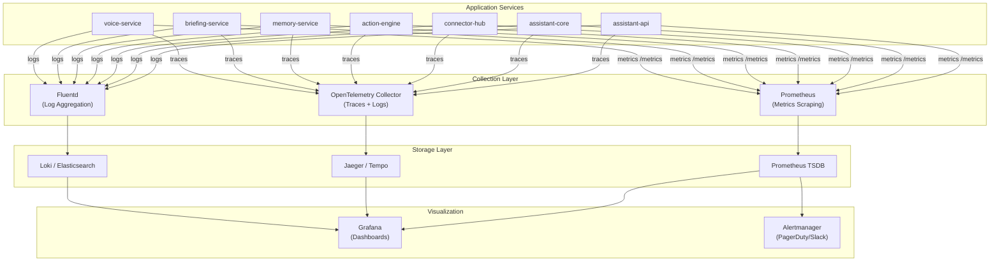
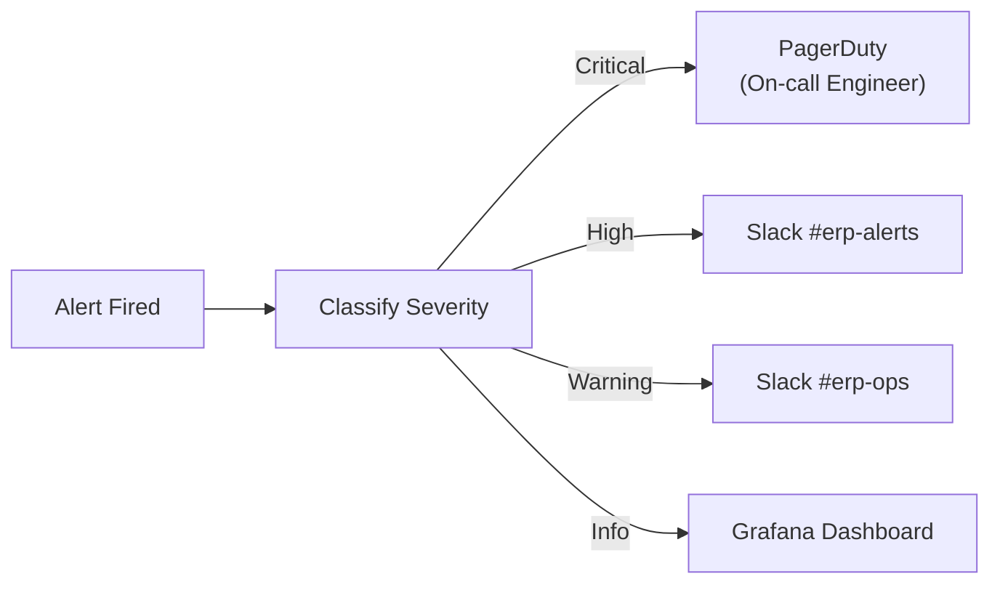

# ERP-Assistant Monitoring and Observability

## 1. Overview

ERP-Assistant implements a comprehensive observability stack across three pillars: metrics (Prometheus), logging (structured JSON), and tracing (OpenTelemetry/Jaeger). This is critical for an AI-powered system where debugging non-deterministic behavior requires deep visibility into the NLP pipeline, connector interactions, and AIDD guardrail decisions.

### Observability Architecture



## 2. Metrics

### Key Metrics

| Metric Name | Type | Labels | Description |
|-------------|------|--------|-------------|
| `assistant_http_requests_total` | Counter | method, path, status | Total HTTP requests |
| `assistant_http_request_duration_seconds` | Histogram | method, path | Request latency |
| `assistant_command_total` | Counter | intent, module, status | Commands processed |
| `assistant_command_duration_seconds` | Histogram | intent, module | Command processing time |
| `assistant_claude_api_requests_total` | Counter | status | Claude API calls |
| `assistant_claude_api_duration_seconds` | Histogram | - | Claude API latency |
| `assistant_claude_tokens_total` | Counter | direction (input/output) | Token usage |
| `assistant_action_total` | Counter | type, risk_level, outcome | Actions executed |
| `assistant_action_confirmation_duration_seconds` | Histogram | risk_level | Time from prompt to confirm |
| `assistant_guardrail_blocks_total` | Counter | guardrail, severity | Guardrail blocks |
| `assistant_connector_health` | Gauge | connector, provider | 1=healthy, 0=down |
| `assistant_connector_requests_total` | Counter | connector, status | Connector API calls |
| `assistant_connector_duration_seconds` | Histogram | connector | Connector latency |
| `assistant_conversations_active` | Gauge | tenant_id | Active conversations |
| `assistant_briefing_generation_seconds` | Histogram | type | Briefing generation time |
| `assistant_voice_stt_duration_seconds` | Histogram | model | STT processing time |
| `assistant_voice_stt_confidence` | Histogram | - | STT confidence scores |
| `assistant_voice_tts_first_byte_seconds` | Histogram | engine | TTS first byte latency |
| `assistant_memory_search_duration_seconds` | Histogram | - | Vector search latency |
| `assistant_websocket_connections` | Gauge | type | Active WebSocket connections |

### SLI/SLO Definitions

| SLI | SLO | Measurement Window |
|-----|-----|-------------------|
| Command success rate | 99.5% | 30 days |
| Command p50 latency | < 500ms | 30 days |
| Command p99 latency | < 3000ms | 30 days |
| API availability | 99.9% | 30 days |
| Voice STT accuracy | > 95% | 7 days |
| Connector uptime | 99% per connector | 30 days |

## 3. Logging

### Structured Log Format

All services emit structured JSON logs:

```json
{
  "timestamp": "2026-02-23T10:30:00.000Z",
  "level": "info",
  "service": "assistant-core",
  "trace_id": "abc123def456",
  "span_id": "789ghi",
  "tenant_id": "tenant-uuid",
  "user_id": "user-uuid",
  "message": "Command processed",
  "attributes": {
    "command_id": "uuid",
    "intent": "query",
    "module": "finance",
    "duration_ms": 380,
    "claude_tokens": 2500,
    "actions_taken": 1
  }
}
```

### Log Levels

| Level | Usage | Examples |
|-------|-------|---------|
| ERROR | System failures, unrecoverable errors | Database connection lost, Claude API 500 |
| WARN | Degraded operations, recoverable issues | Token refresh failed (will retry), rate limited |
| INFO | Business events, request summaries | Command processed, action confirmed, connector connected |
| DEBUG | Detailed processing, troubleshooting | NLP pipeline steps, entity extraction details |
| TRACE | Wire-level detail | Full Claude API request/response, raw SQL |

### Sensitive Data Handling

- User prompts: Logged at INFO level (configurable per-tenant to disable)
- AI responses: Logged at DEBUG level
- OAuth tokens: NEVER logged (replaced with `[REDACTED]`)
- Personal data: Masked in production (`user@e***.com`)
- AIDD decisions: Always logged at INFO (compliance requirement)

## 4. Distributed Tracing

### Trace Propagation

All services propagate W3C Trace Context headers:

```
traceparent: 00-<trace_id>-<span_id>-<flags>
tracestate: erp=tenant_id:<uuid>
```

### Trace Span Hierarchy

```mermaid
gantt
    title Command Processing Trace Spans
    dateFormat X
    axisFormat %Lms

    section gateway
        http.request /v1/command         :0, 400
        auth.validate_jwt                :0, 5
        rate_limit.check                 :5, 7

    section assistant-core
        command.process                  :7, 390
        context.assemble                 :7, 25
        memory.fetch_preferences         :25, 45
        claude.api_call                  :45, 265
        entity.resolve                   :265, 280

    section action-engine
        action.classify_risk             :280, 285
        action.check_guardrails          :285, 290
        action.execute                   :290, 370

    section connector-hub
        connector.resolve                :290, 295
        connector.api_call               :295, 365
        token.decrypt                    :290, 292

    section response
        response.format                  :370, 385
        response.send                    :385, 395
```



## 5. Alerting Rules

### Critical Alerts

| Alert | Condition | Severity | Action |
|-------|-----------|----------|--------|
| AssistantAPIDown | healthz fails for 1 min | Critical | Page on-call |
| DatabaseConnectionLost | PG connection errors > 5/min | Critical | Page on-call |
| ClaudeAPIErrors | 500 errors > 10/min | High | Notify Slack |
| GuardrailBypass | Prohibited action attempted | Critical | Page security |
| TokenVaultDecryptFail | Decryption errors > 0 | Critical | Page security |

### Warning Alerts

| Alert | Condition | Severity | Action |
|-------|-----------|----------|--------|
| HighCommandLatency | p95 > 2s for 5 min | Warning | Notify Slack |
| ConnectorUnhealthy | Health check failed 3x | Warning | Notify Slack |
| HighTokenUsage | Daily tokens > 80% budget | Warning | Notify Slack |
| MemoryServiceDegraded | Search latency > 1s for 5 min | Warning | Notify Slack |
| VoiceSTTAccuracyDrop | Avg confidence < 0.85 for 1h | Warning | Notify Slack |

### Alert Routing



## 6. Grafana Dashboard Specifications

### Dashboard 1: Service Health Overview

- Service uptime grid (green/red tiles)
- Request rate graph (per service)
- Error rate graph (per service)
- Active connection count
- Response time heatmap

### Dashboard 2: AI Command Analytics

- Commands per minute (timeseries)
- Intent distribution (pie chart)
- Module usage distribution (bar chart)
- Claude API latency (histogram)
- Token usage (counter, daily)
- Intent classification accuracy (gauge)

### Dashboard 3: AIDD Governance

- Actions by risk level (stacked bar)
- Confirmation rate (gauge)
- Rejection rate (gauge)
- Guardrail blocks (counter)
- Time to decision (histogram)
- Rollback events (counter)

### Dashboard 4: Connector Status

- Connector health matrix (table)
- OAuth token expiry countdown (table)
- Connector request rate (per provider)
- Connector error rate (per provider)
- Token refresh events (timeline)

### Dashboard 5: Voice Pipeline

- Voice sessions active (gauge)
- STT latency (histogram)
- STT confidence distribution (histogram)
- TTS first byte latency (histogram)
- Transcription word error rate (gauge)

## 7. Debugging Playbook

### Slow Command Response

1. Check trace in Jaeger: identify slowest span
2. If Claude API slow: check `assistant_claude_api_duration_seconds` -- may be API degradation
3. If connector slow: check specific connector latency metrics
4. If memory search slow: check Qdrant cluster health

### Missing Context in Responses

1. Check `memory.fetch_preferences` span -- did it timeout?
2. Verify Qdrant collection exists for tenant
3. Check embedding pipeline logs for ingestion failures
4. Verify Redis conversation cache is populated

### Incorrect Guardrail Classification

1. Pull audit log for the specific action_id
2. Check `ai_reasoning` field in decision log
3. Verify `aidd.guardrails.yaml` is loaded correctly
4. Check if action type mapping is correct for the module
