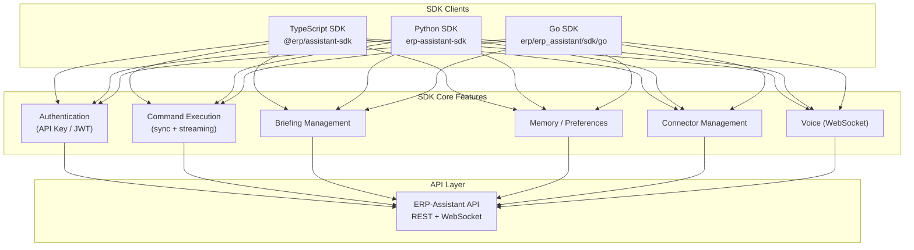
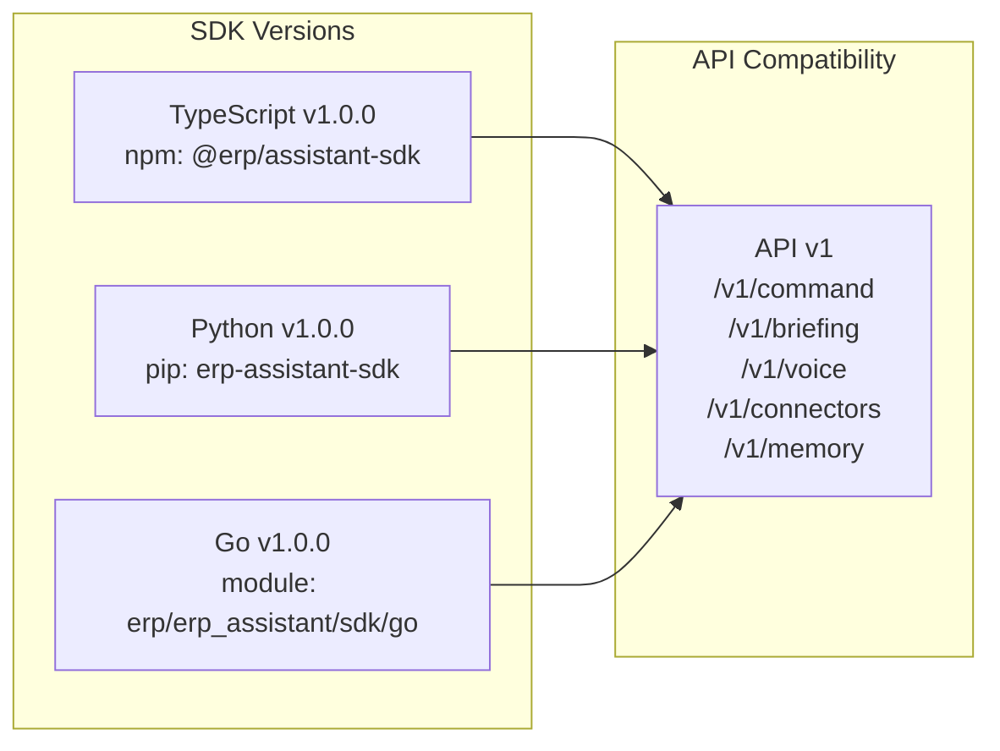

# ERP-Assistant SDK Documentation

## 1. Overview

ERP-Assistant provides official SDKs in three languages to enable programmatic integration: TypeScript (for web and Node.js applications), Python (for data science and automation), and Go (for server-side applications). All SDKs provide type-safe command execution, streaming responses, briefing management, memory operations, and connector management.

### SDK Architecture



## 2. TypeScript SDK

### Installation

```bash
npm install @erp/assistant-sdk
# or
yarn add @erp/assistant-sdk
```

### Core Types

```typescript
// From sdk/typescript/index.ts
export type AssistantCommand = {
  prompt: string;
  tenantId: string;
  conversationId?: string;
  context?: {
    moduleHint?: string;
    formatPreference?: 'table' | 'chart' | 'text';
  };
};

export interface AssistantResponse {
  status: 'completed' | 'pending_confirmation' | 'failed';
  message: string;
  data?: Record<string, unknown>;
  actionsTaken?: ActionSummary[];
  suggestions?: string[];
  conversationId: string;
}

export interface ActionSummary {
  type: 'read' | 'write' | 'delete' | 'bulk';
  module: string;
  endpoint: string;
  riskLevel: 'low' | 'medium' | 'high' | 'critical';
  status: 'auto_executed' | 'confirmed' | 'pending' | 'rejected';
}

export interface ConfirmationRequest {
  actionId: string;
  description: string;
  details: Record<string, unknown>;
  riskLevel: string;
  options: string[];
}

export interface Briefing {
  id: string;
  type: 'daily' | 'weekly';
  date: string;
  sections: BriefingSection[];
  generatedAt: string;
}

export interface BriefingSection {
  type: string;
  data: Record<string, unknown>;
  sourceModule: string;
}

export interface StreamChunk {
  text: string;
  done: boolean;
  toolCall?: { name: string; args: Record<string, unknown> };
}
```

### Client Usage

```typescript
import { AssistantClient, AssistantCommand } from '@erp/assistant-sdk';

// Initialize
const client = new AssistantClient({
  baseUrl: 'https://api.erp.example.com/assistant',
  apiKey: process.env.ERP_ASSISTANT_API_KEY!,
  tenantId: 'tenant-uuid',
  timeout: 30000,  // 30 seconds
});

// Execute a command (synchronous)
const command: AssistantCommand = {
  prompt: "What's my revenue this quarter?",
  tenantId: 'tenant-uuid',
};

const response = await client.command(command);
console.log(response.message);
// "Your Q1 2026 revenue is $2.4M, up 12% from last quarter."

// Execute a command (streaming)
const stream = client.commandStream(command);
for await (const chunk of stream) {
  process.stdout.write(chunk.text);
  if (chunk.done) break;
}

// Handle confirmation
client.onConfirmation((confirmation) => {
  console.log(`Action: ${confirmation.description}`);
  console.log(`Risk: ${confirmation.riskLevel}`);
  // Show to user, get decision
  return client.confirm(confirmation.actionId, 'approve');
});

// Briefings
const briefing = await client.getBriefing({ type: 'daily', date: '2026-02-23' });
const newBriefing = await client.generateBriefing({
  type: 'daily',
  sections: ['kpi_summary', 'pending_approvals'],
});

// Memory
const prefs = await client.getPreferences();
await client.updatePreferences({ default_format: 'table', briefing_time: '08:00' });
const shortcuts = await client.getShortcuts();
const searchResults = await client.searchMemory('budget discussion last week');

// Connectors
const connectors = await client.listConnectors();
const authUrl = await client.connectTool('google_workspace');
await client.disconnectTool('google_workspace');
```

## 3. Python SDK

### Installation

```bash
pip install erp-assistant-sdk
```

### Client Usage

```python
from erp_assistant_sdk import AssistantClient
import asyncio

# Initialize
client = AssistantClient(
    base_url="https://api.erp.example.com/assistant",
    api_key="your-api-key",
    tenant_id="tenant-uuid",
)

# Synchronous command
response = client.command("What's my revenue this quarter?")
print(response.message)

# Async command
async def main():
    response = await client.async_command("Show unpaid invoices")
    print(response.message)

    # Streaming
    async for chunk in client.command_stream("Show pipeline breakdown"):
        print(chunk.text, end="", flush=True)

asyncio.run(main())

# Briefings
briefing = client.get_briefing(type="daily", date="2026-02-23")
for section in briefing.sections:
    print(f"  {section.type}: {section.data}")

new_briefing = client.generate_briefing(
    type="daily",
    sections=["kpi_summary", "pending_approvals", "calendar"],
)

# Memory operations
prefs = client.get_preferences()
client.update_preferences({"default_format": "table"})
shortcuts = client.get_shortcuts()
results = client.search_memory("budget discussion last week")

# Connectors
connectors = client.list_connectors()
auth_url = client.connect_tool("google_workspace")
client.disconnect_tool("google_workspace")

# Confirm/reject actions
client.confirm_action(action_id="uuid", decision="approve")
client.confirm_action(action_id="uuid", decision="reject", reason="Not now")
```

### Data Science Integration

```python
import pandas as pd
from erp_assistant_sdk import AssistantClient

client = AssistantClient(base_url="...", api_key="...", tenant_id="...")

# Natural language to DataFrame
response = client.command("Show all invoices from January with amounts")
df = pd.DataFrame(response.data["items"])
print(df.describe())

# Use in Jupyter notebook
from IPython.display import display, Markdown

response = client.command("Summarize Q1 revenue trends")
display(Markdown(response.message))
```

## 4. Go SDK

### Installation

```bash
go get erp/erp_assistant/sdk/go
```

### Client Usage

```go
package main

import (
    "context"
    "fmt"
    "log"

    sdk "erp/erp_assistant/sdk/go"
)

func main() {
    // Initialize
    client := sdk.Client{
        BaseURL:  "https://api.erp.example.com/assistant",
        APIKey:   "your-api-key",
        TenantID: "tenant-uuid",
    }

    ctx := context.Background()

    // Execute command
    resp, err := client.Command(ctx, "What's my revenue this quarter?")
    if err != nil {
        log.Fatal(err)
    }
    fmt.Println(resp.Message)

    // Command with options
    resp, err = client.CommandWithOptions(ctx, sdk.CommandOptions{
        Prompt:         "Show unpaid invoices",
        ConversationID: "conv-uuid",
        ModuleHint:     "finance",
    })

    // Streaming
    stream, err := client.CommandStream(ctx, "Show pipeline")
    if err != nil {
        log.Fatal(err)
    }
    for chunk := range stream {
        fmt.Print(chunk.Text)
    }

    // Briefings
    briefing, err := client.GetBriefing(ctx, "daily", "2026-02-23")
    briefing, err = client.GenerateBriefing(ctx, sdk.BriefingRequest{
        Type:     "daily",
        Sections: []string{"kpi_summary", "pending_approvals"},
    })

    // Connectors
    connectors, err := client.ListConnectors(ctx)
    authURL, err := client.ConnectTool(ctx, "google_workspace")

    // Confirm action
    err = client.ConfirmAction(ctx, "action-uuid", "approve", "")
}
```

## 5. Error Handling

All SDKs use consistent error types:

| Error Code | HTTP Status | Description |
|-----------|-------------|-------------|
| `AuthenticationError` | 401 | Invalid or expired API key / JWT |
| `ForbiddenError` | 403 | Insufficient permissions |
| `TenantError` | 400 | Missing or invalid tenant ID |
| `RateLimitError` | 429 | Rate limit exceeded (includes retry-after) |
| `ValidationError` | 400 | Invalid request parameters |
| `ConnectorError` | 502 | External connector failure |
| `TimeoutError` | 504 | Request exceeded timeout |
| `ServerError` | 500 | Internal server error |

## 6. SDK Configuration

| Option | Default | Description |
|--------|---------|-------------|
| `baseUrl` | Required | API base URL |
| `apiKey` | Required | Authentication key |
| `tenantId` | Required | Tenant identifier |
| `timeout` | 30000ms | Request timeout |
| `retries` | 3 | Max retry attempts |
| `retryDelay` | 1000ms | Initial retry backoff |
| `streaming` | true | Enable streaming by default |

## 7. SDK Release Matrix


