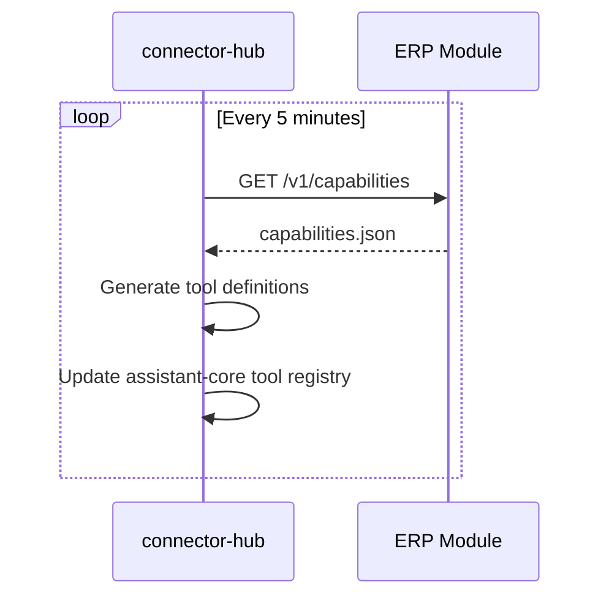
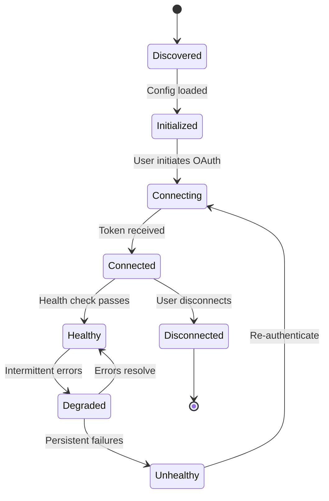

# ERP-Assistant Connector Catalog

## 1. Overview

ERP-Assistant connects to 28+ data sources through four connector categories: ERP Internal (auto-discovered), Productivity (OAuth2), Communication (API), and Storage (SDK). Each connector implements the standard `Connector` interface and is managed by the connector-hub service.

### Connector Ecosystem Map

```mermaid
graph TB
    subgraph "connector-hub"
        HUB["Connection Manager"]
    end

    subgraph "ERP Internal (10)"
        F["Finance"]
        C["CRM"]
        H["HCM"]
        CO["Commerce"]
        HC["Healthcare"]
        SM["School Mgmt"]
        CM["Church Mgmt"]
        BO["BSS-OSS"]
        PL["Platform"]
        WK["Workspace"]
    end

    subgraph "Productivity (11)"
        GW["Google Workspace"]
        MS["Microsoft 365"]
        NO["Notion"]
        SL["Slack"]
        JI["Jira"]
        AS["Asana"]
        TR["Trello"]
        LI["Linear"]
        TD["Todoist"]
        CL["Calendly"]
        ZP["Zapier"]
    end

    subgraph "Communication (4)"
        WA["WhatsApp"]
        TG["Telegram"]
        DC["Discord"]
        SMS["SMS"]
    end

    subgraph "Storage (3)"
        DB["Dropbox"]
        BX["Box"]
        S3["Amazon S3"]
    end

    HUB --> F & C & H & CO & HC & SM & CM & BO & PL & WK
    HUB --> GW & MS & NO & SL & JI & AS & TR & LI & TD & CL & ZP
    HUB --> WA & TG & DC & SMS
    HUB --> DB & BX & S3
```

## 2. ERP Internal Connectors

### Auto-Discovery Protocol

Internal connectors are auto-generated by scanning ERP modules for `capabilities.json`:

### ERP-Finance Connector

| Property | Value |
|----------|-------|
| **File** | `connectors/erp-internal/finance.go` |
| **Package** | `erpinternal` |
| **Type** | `FinanceConnector` |
| **Auth** | Internal JWT (service-to-service) |
| **Entities** | invoices, payments, general_ledger, budgets, purchase_orders, expense_reports, accounts_receivable, accounts_payable |
| **Operations** | list, get, create, update, delete, approve, reject |
| **Risk Mapping** | Read=low, Create/Update=high, Delete=critical, Approve=high, Bulk=critical |

### ERP-CRM Connector

| Property | Value |
|----------|-------|
| **File** | `connectors/erp-internal/crm.go` |
| **Package** | `erpinternal` |
| **Type** | `CrmConnector` (implied) |
| **Entities** | contacts, leads, deals, pipelines, activities, accounts, opportunities |
| **Operations** | list, get, create, update, delete, convert_lead, advance_stage |
| **Risk Mapping** | Read=low, Create=medium, Update=medium, Delete=critical, Advance=medium |

### ERP-HCM Connector

| Property | Value |
|----------|-------|
| **File** | `connectors/erp-internal/hcm.go` |
| **Entities** | employees, payroll, leave_requests, attendance, performance_reviews, recruitment |
| **Risk Mapping** | Read=low, Payroll write=critical, Leave approve=high, Performance=high |

### ERP-Commerce Connector

| Property | Value |
|----------|-------|
| **File** | `connectors/erp-internal/commerce.go` |
| **Entities** | orders, products, inventory, pricing, shipping, returns |
| **Risk Mapping** | Read=low, Pricing update=high, Inventory bulk=critical |

### ERP-Healthcare Connector

| Property | Value |
|----------|-------|
| **File** | `connectors/erp-internal/healthcare.go` |
| **Entities** | patients, appointments, records, prescriptions, billing |
| **Risk Mapping** | All writes=high (HIPAA), PHI access=logged |

### ERP-School-Management Connector

| Property | Value |
|----------|-------|
| **File** | `connectors/erp-internal/school.go` |
| **Entities** | students, courses, grades, enrollment, attendance, teachers |
| **Risk Mapping** | Read=low, Grade update=high, Enrollment=medium |

### ERP-Church-Management Connector

| Property | Value |
|----------|-------|
| **File** | `connectors/erp-internal/church.go` |
| **Entities** | members, donations, events, groups, attendance |
| **Risk Mapping** | Read=low, Donation record=medium, Member update=medium |

### ERP-BSS-OSS Connector

| Property | Value |
|----------|-------|
| **File** | `connectors/erp-internal/bss_oss.go` |
| **Entities** | subscriptions, service_orders, billing, provisioning, network_inventory |
| **Risk Mapping** | Read=low, Service activation=high, Billing=critical |

### ERP-Platform Connector

| Property | Value |
|----------|-------|
| **File** | `connectors/erp-internal/platform.go` |
| **Entities** | tenants, configurations, entitlements, feature_flags |
| **Risk Mapping** | Read=low, Config update=critical (affects all users) |

### ERP-Workspace Connector

| Property | Value |
|----------|-------|
| **File** | `connectors/erp-internal/workspace.go` |
| **Entities** | documents, folders, collaboration_spaces, templates |
| **Risk Mapping** | Read=low, Document create=medium, Delete=critical |

## 3. Productivity Connectors

### Google Workspace

| Property | Value |
|----------|-------|
| **File** | `connectors/productivity/google_workspace.go` |
| **Auth** | OAuth2 + PKCE |
| **Authorization URL** | `https://accounts.google.com/o/oauth2/v2/auth` |
| **Token URL** | `https://oauth2.googleapis.com/token` |
| **Scopes** | gmail.readonly, calendar.events, drive.readonly, docs.readonly, spreadsheets.readonly |
| **Capabilities** | Read emails, manage calendar events, browse Drive files, read Docs and Sheets |
| **Rate Limit** | 100 requests per 100 seconds per user |

### Microsoft 365

| Property | Value |
|----------|-------|
| **File** | `connectors/productivity/microsoft_365.go` |
| **Auth** | OAuth2 + PKCE (Microsoft Graph) |
| **Authorization URL** | `https://login.microsoftonline.com/{tenant}/oauth2/v2.0/authorize` |
| **Scopes** | Mail.Read, Calendars.ReadWrite, Files.Read, User.Read, Presence.ReadWrite |
| **Capabilities** | Read Outlook mail, manage calendar, browse OneDrive, read/write Teams presence |
| **Rate Limit** | 10,000 requests per 10 minutes per app |

### Notion

| Property | Value |
|----------|-------|
| **File** | `connectors/productivity/notion.go` |
| **Auth** | OAuth2 |
| **Scopes** | Read/write content |
| **Capabilities** | Read/create pages, query databases, manage blocks |
| **Rate Limit** | 3 requests per second |

### Slack

| Property | Value |
|----------|-------|
| **File** | `connectors/productivity/slack.go` |
| **Auth** | OAuth2 + Events API |
| **Scopes** | channels:read, chat:write, users:read, reactions:read |
| **Capabilities** | Read/send messages, manage channels, user presence |
| **Rate Limit** | Tier 2-4 (varies by method) |

### Jira

| Property | Value |
|----------|-------|
| **File** | `connectors/productivity/jira.go` |
| **Auth** | OAuth2 (Atlassian) |
| **Scopes** | read:jira-work, write:jira-work |
| **Capabilities** | Read/create issues, manage sprints, view boards |

### Asana

| Property | Value |
|----------|-------|
| **File** | `connectors/productivity/asana.go` |
| **Auth** | OAuth2 |
| **Capabilities** | Read/create tasks, manage projects, view portfolios |

### Trello

| Property | Value |
|----------|-------|
| **File** | `connectors/productivity/trello.go` |
| **Auth** | OAuth2 |
| **Capabilities** | Read/create cards, manage boards and lists |

### Linear

| Property | Value |
|----------|-------|
| **File** | `connectors/productivity/linear.go` |
| **Auth** | OAuth2 |
| **API** | GraphQL |
| **Capabilities** | Read/create issues, manage projects and cycles |

### Todoist

| Property | Value |
|----------|-------|
| **File** | `connectors/productivity/todoist.go` |
| **Auth** | OAuth2 |
| **Capabilities** | Read/create tasks, manage projects and labels |

### Calendly

| Property | Value |
|----------|-------|
| **File** | `connectors/productivity/calendly.go` |
| **Auth** | OAuth2 |
| **Capabilities** | Read events, manage scheduling links |

### Zapier

| Property | Value |
|----------|-------|
| **File** | `connectors/productivity/zapier.go` |
| **Auth** | OAuth2 / API Key |
| **Capabilities** | Trigger Zaps, bridge to 6000+ Zapier integrations |

## 4. Communication Connectors

### WhatsApp

| Property | Value |
|----------|-------|
| **File** | `connectors/communication/whatsapp.go` |
| **Auth** | WhatsApp Business API (permanent token) |
| **Capabilities** | Send messages, templates, media |

### Telegram

| Property | Value |
|----------|-------|
| **File** | `connectors/communication/telegram.go` |
| **Auth** | Bot Token |
| **Capabilities** | Send messages, inline queries, bot commands |

### Discord

| Property | Value |
|----------|-------|
| **File** | `connectors/communication/discord.go` |
| **Auth** | Bot Token + OAuth2 |
| **Capabilities** | Send messages, slash commands, channel management |

### SMS

| Property | Value |
|----------|-------|
| **File** | `connectors/communication/sms.go` |
| **Auth** | Twilio / MessageBird API Key |
| **Capabilities** | Send messages, delivery status |

## 5. Storage Connectors

### Dropbox

| Property | Value |
|----------|-------|
| **File** | `connectors/storage/dropbox.go` |
| **Auth** | OAuth2 |
| **Capabilities** | Upload/download files, list folders, sharing |

### Box

| Property | Value |
|----------|-------|
| **File** | `connectors/storage/box.go` |
| **Auth** | OAuth2 + JWT |
| **Capabilities** | Upload/download files, metadata, collaboration |

### Amazon S3

| Property | Value |
|----------|-------|
| **File** | `connectors/storage/s3.go` |
| **Auth** | AWS IAM (Access Key / Secret Key) |
| **Capabilities** | Upload/download objects, presigned URLs, bucket listing |

## 6. Connector Health Status

