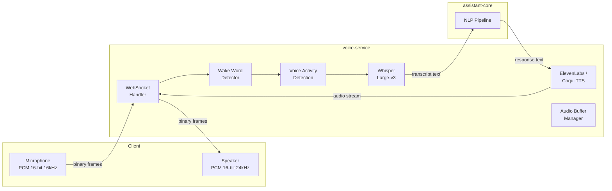
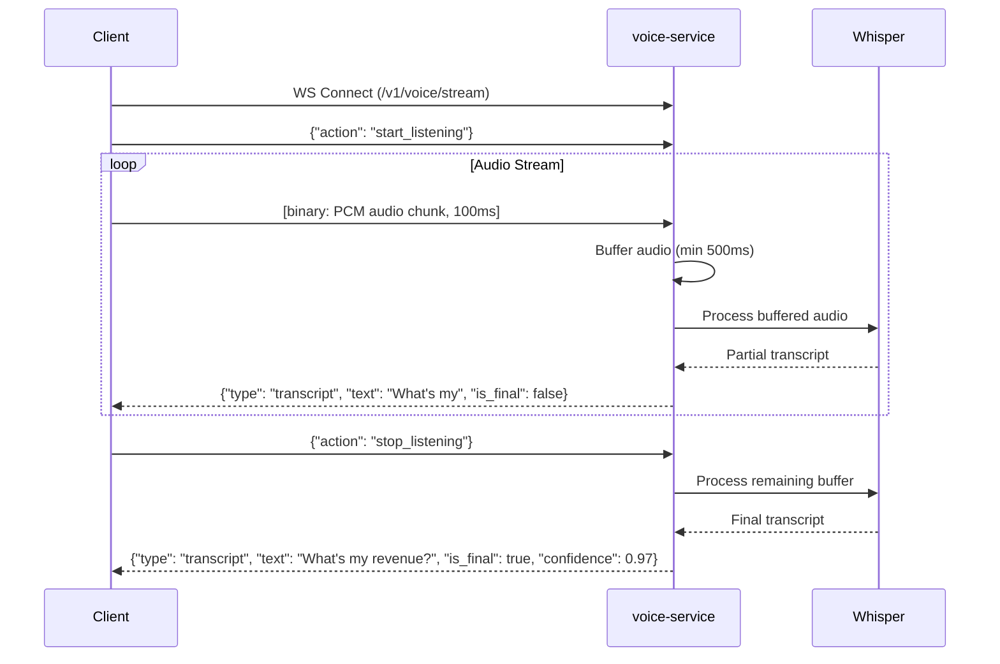
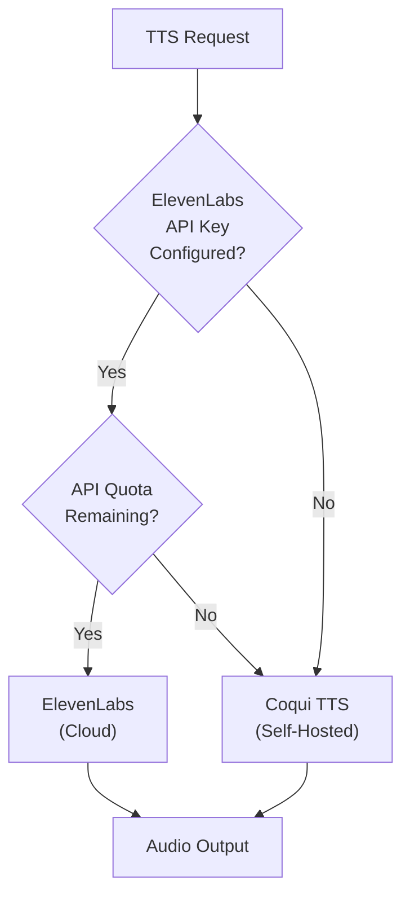
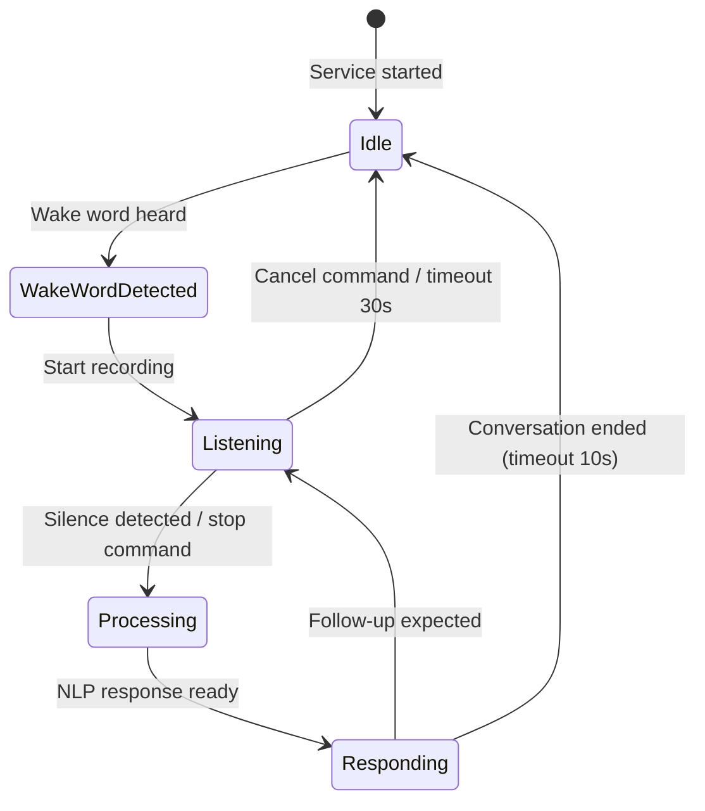
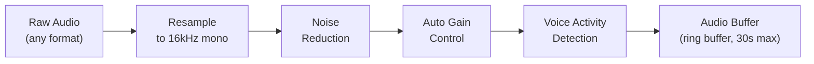
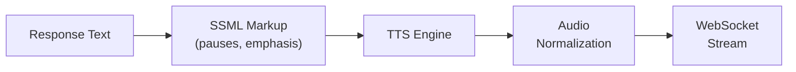

# ERP-Assistant Voice Service Specification

## 1. Overview

The voice-service provides speech-to-text (STT) and text-to-speech (TTS) capabilities for ERP-Assistant, enabling hands-free interaction with the ERP platform. Built on Python/FastAPI, it integrates OpenAI Whisper for transcription and ElevenLabs/Coqui for synthesis, communicating with clients via WebSocket for real-time streaming.

### Voice Pipeline Architecture



## 2. Current Implementation

The voice-service exposes a FastAPI application with health check and listing endpoints:

```python
# services/voice-service/main.py
from fastapi import FastAPI, Header, HTTPException

app = FastAPI(title="ERP-Assistant voice-service")

@app.get('/healthz')
def healthz():
    return {"status": "healthy", "module": "ERP-Assistant", "service": "voice-service"}

@app.get('/v1/voice')
def list_items(x_tenant_id: str | None = Header(default=None)):
    if not x_tenant_id:
        raise HTTPException(status_code=400, detail='missing X-Tenant-ID')
    return {"items": [], "event_topic": "erp.assistant.voice.listed"}
```

## 3. STT Specification (Whisper)

### Model Configuration

| Parameter | Value | Notes |
|-----------|-------|-------|
| Model | Whisper Large-v3 | Best accuracy, GPU recommended |
| Fallback model | Whisper Medium | CPU-friendly, slightly lower accuracy |
| Input format | PCM 16-bit, 16kHz, mono | Standard microphone format |
| Language | Auto-detect (155 languages) | Override via config |
| Beam size | 5 | Balance accuracy vs speed |
| Word timestamps | Enabled | For real-time streaming |
| VAD filter | Enabled | Skip silence, reduce processing |

### Streaming Transcription Protocol



### Accuracy Benchmarks

| Language | WER (Word Error Rate) | Notes |
|----------|----------------------|-------|
| English | 3.5% | Large-v3 on LibriSpeech |
| Spanish | 5.2% | Business domain |
| French | 4.8% | Business domain |
| German | 5.5% | Business domain |
| Chinese (Mandarin) | 6.1% | Business domain |

## 4. TTS Specification

### ElevenLabs (Cloud)

| Parameter | Value |
|-----------|-------|
| API | Streaming speech synthesis |
| Voices | Configurable per user preference |
| Output format | PCM 16-bit, 24kHz, mono |
| Latency (first byte) | ~300ms |
| Quality (MOS) | 4.5/5 |
| Cost | $0.30 per 1,000 characters |
| Streaming | Chunked transfer, sentence-level |

### Coqui TTS (Self-Hosted)

| Parameter | Value |
|-----------|-------|
| Model | XTTS v2 |
| Voices | Cloneable from sample audio |
| Output format | PCM 16-bit, 24kHz, mono |
| Latency (first byte) | ~150ms |
| Quality (MOS) | 3.8/5 |
| Cost | Free (self-hosted) |
| GPU | Optional (faster with CUDA) |

### TTS Selection Logic



## 5. Wake Word Detection

### Configuration

| Parameter | Value |
|-----------|-------|
| Default wake word | "Hey Assistant" |
| Customizable | Yes, per-tenant |
| Engine | Porcupine / openWakeWord |
| False positive rate | < 1 per hour |
| Detection latency | < 100ms |

### Wake Word Flow



## 6. Audio Processing Pipeline

### Input Processing



### Output Processing



## 7. WebSocket Protocol

### Client Messages

| Message | Type | Payload |
|---------|------|---------|
| Start listening | text | `{"action": "start_listening"}` |
| Stop listening | text | `{"action": "stop_listening"}` |
| Cancel | text | `{"action": "cancel"}` |
| Audio data | binary | PCM 16-bit 16kHz mono |
| Set language | text | `{"action": "set_language", "language": "en"}` |
| Set voice | text | `{"action": "set_voice", "voice": "professional-female"}` |

### Server Messages

| Message | Type | Payload |
|---------|------|---------|
| Transcript (partial) | text | `{"type": "transcript", "text": "...", "is_final": false}` |
| Transcript (final) | text | `{"type": "transcript", "text": "...", "is_final": true, "confidence": 0.97}` |
| AI response | text | `{"type": "response", "text": "...", "audio_url": "..."}` |
| Audio stream | binary | PCM 16-bit 24kHz mono |
| Error | text | `{"type": "error", "message": "..."}` |
| Status | text | `{"type": "status", "state": "listening|processing|responding|idle"}` |

## 8. Resource Requirements

| Component | CPU | Memory | GPU | Storage |
|-----------|-----|--------|-----|---------|
| Whisper Large-v3 | 4 cores | 2GB | Recommended | 3GB model |
| Whisper Medium | 2 cores | 1GB | Optional | 1.5GB model |
| ElevenLabs client | 0.5 cores | 100MB | No | - |
| Coqui XTTS v2 | 2 cores | 1GB | Recommended | 2GB model |
| FastAPI server | 1 core | 256MB | No | - |

## 9. Error Handling

| Error | Cause | Recovery |
|-------|-------|----------|
| STT timeout | No speech detected for 30s | Return to idle, notify client |
| STT low confidence | Noisy audio, accent | Request repeat, fallback to text |
| TTS API failure | ElevenLabs API error | Fallback to Coqui TTS |
| WebSocket disconnect | Network issue | Client auto-reconnect with exponential backoff |
| Model load failure | OOM or missing files | Start without voice, log error |
