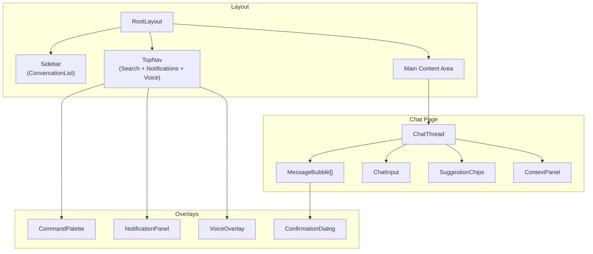
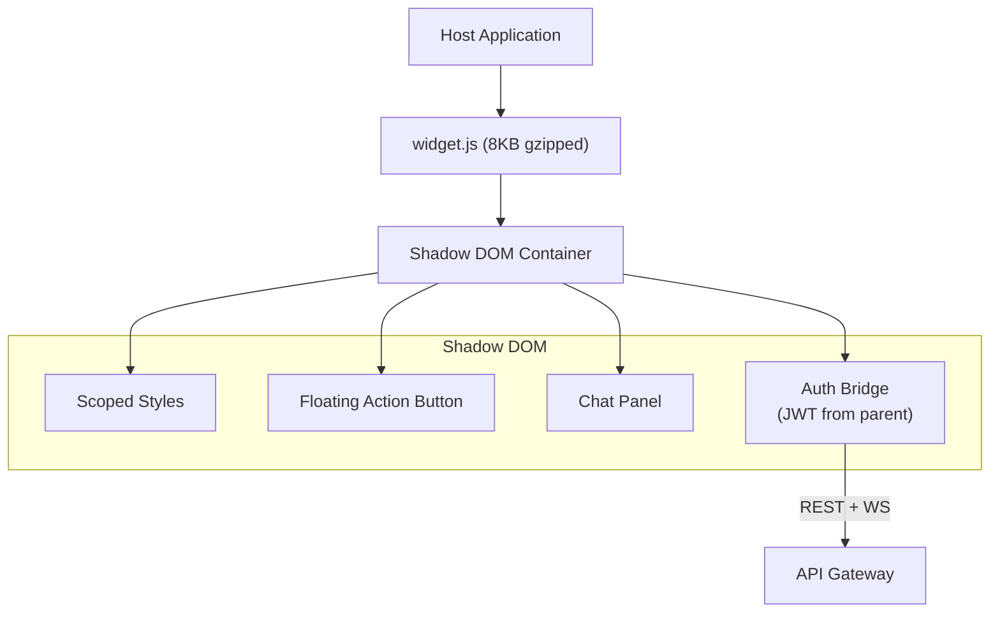
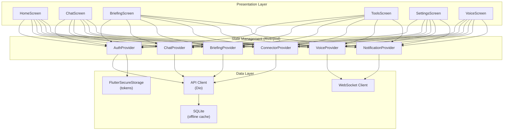

# ERP-Assistant Frontend Architecture

## 1. Overview

ERP-Assistant provides three frontend surfaces: a Next.js 14 web application (primary chat interface + command palette), an embeddable React widget for third-party integration, and a Flutter mobile application. All frontends communicate with the backend through the API Gateway at port 8094.

### Frontend Ecosystem

```mermaid
graph TB
    subgraph "Web Application"
        NEXT["Next.js 14<br/>App Router + RSC"]
        CHAT["Chat Interface"]
        CMD_K["Command Palette<br/>(Cmd+K)"]
        BRIEF_UI["Briefing Dashboard"]
        SETTINGS["Tool Settings"]
        NOTIF_UI["Notification Center"]
        VOICE_UI["Voice Overlay"]
        HISTORY_UI["Conversation History"]
        WORKFLOW_UI["Workflow Builder"]
    end

    subgraph "Embeddable Widget"
        WIDGET["React 18<br/>Shadow DOM"]
        W_COLLAPSED["Collapsed (FAB)"]
        W_EXPANDED["Expanded (Chat)"]
    end

    subgraph "Mobile App"
        FLUTTER["Flutter 3.x<br/>iOS + Android"]
        M_HOME["Home Screen"]
        M_CHAT["Chat Screen"]
        M_BRIEF["Briefing Screen"]
        M_VOICE["Voice Screen"]
    end

    subgraph "API Gateway"
        GW["REST + WebSocket<br/>:8094"]
    end

    NEXT --> CHAT & CMD_K & BRIEF_UI & SETTINGS & NOTIF_UI & VOICE_UI & HISTORY_UI & WORKFLOW_UI
    WIDGET --> W_COLLAPSED & W_EXPANDED
    FLUTTER --> M_HOME & M_CHAT & M_BRIEF & M_VOICE

    NEXT & WIDGET & FLUTTER --> GW
```



## 2. Next.js 14 Web Application

### Project Configuration

```json
{
  "name": "erp-assistant-web",
  "private": true,
  "version": "1.0.0",
  "scripts": {
    "dev": "next dev",
    "build": "next build",
    "start": "next start"
  },
  "dependencies": {
    "next": "14.2.13",
    "react": "18.3.1",
    "react-dom": "18.3.1"
  }
}
```

### App Router Structure

```
frontend/web/
  app/
    layout.tsx              # Root layout with sidebar + top nav
    page.tsx                # Home / new conversation
    chat/
      [conversationId]/
        page.tsx            # Chat thread view
    briefing/
      page.tsx              # Briefing dashboard
    settings/
      connectors/
        page.tsx            # Connected tools management
      preferences/
        page.tsx            # User preferences
    workflows/
      page.tsx              # Workflow list
      [workflowId]/
        page.tsx            # Workflow builder
  components/
    chat/
      ChatThread.tsx        # Message list + input
      MessageBubble.tsx     # Individual message
      ConfirmationDialog.tsx # Action confirmation modal
      SuggestionChips.tsx   # Quick action suggestions
    command-palette/
      CommandPalette.tsx    # Cmd+K overlay
      SearchResults.tsx     # Result groups
    briefing/
      BriefingCard.tsx      # Daily briefing card
      KPITile.tsx           # Metric tile
      AnomalyAlert.tsx      # Alert card
    notifications/
      NotificationPanel.tsx # Slide-over panel
      NotificationItem.tsx  # Individual notification
    voice/
      VoiceOverlay.tsx      # Voice interface modal
      Waveform.tsx          # Audio visualization
    sidebar/
      ConversationList.tsx  # History sidebar
    workflow/
      WorkflowCanvas.tsx    # Visual builder
      StepNode.tsx          # Workflow step card
  hooks/
    useAssistant.ts         # Command execution hook
    useVoice.ts             # Voice WebSocket hook
    useNotifications.ts     # Real-time notifications
    useCommandPalette.ts    # Cmd+K state management
  lib/
    api.ts                  # API client wrapper
    auth.ts                 # JWT management
    ws.ts                   # WebSocket client
```

### Key Component Architecture



### State Management

| State Domain | Solution | Scope |
|-------------|---------|-------|
| Server state | React Server Components + Server Actions | Per-request |
| Conversation context | React Context + useReducer | Per-conversation |
| Command palette | useCommandPalette hook (Zustand) | Global |
| Notifications | useNotifications hook (WebSocket) | Global |
| Voice state | useVoice hook (WebSocket) | Global |
| User preferences | SWR (stale-while-revalidate) | Global |
| Theme | CSS custom properties + Tailwind | Global |

### Streaming Response Rendering

```typescript
// Real-time streaming from Claude API
async function* streamCommand(prompt: string): AsyncGenerator<StreamChunk> {
  const response = await fetch('/v1/command/stream', {
    method: 'POST',
    headers: { 'Content-Type': 'application/json' },
    body: JSON.stringify({ prompt }),
  });

  const reader = response.body!.getReader();
  const decoder = new TextDecoder();

  while (true) {
    const { done, value } = await reader.read();
    if (done) break;

    const chunk = JSON.parse(decoder.decode(value));
    yield chunk;
  }
}

// Usage in component
function ChatThread() {
  const [messages, setMessages] = useState<Message[]>([]);
  const [streaming, setStreaming] = useState('');

  async function handleSend(prompt: string) {
    setMessages(prev => [...prev, { role: 'user', content: prompt }]);

    for await (const chunk of streamCommand(prompt)) {
      setStreaming(prev => prev + chunk.text);
      if (chunk.done) {
        setMessages(prev => [...prev, { role: 'assistant', content: streaming }]);
        setStreaming('');
      }
    }
  }
}
```

## 3. Embeddable Widget

### Architecture

The widget uses Shadow DOM for style isolation, ensuring it does not conflict with the host application's CSS:



### Configuration Options

```typescript
interface WidgetConfig {
  apiUrl: string;           // Required: API endpoint
  tenantId: string;         // Required: Tenant identifier
  token: string;            // Required: JWT from host app
  position: 'bottom-right' | 'bottom-left';  // Default: bottom-right
  collapsed: boolean;       // Default: true
  theme: {
    primaryColor: string;   // Default: #1a73e8
    borderRadius: string;   // Default: 12px
    fontFamily: string;     // Default: Inter
  };
  greeting?: string;        // Optional first-visit greeting
  onAction?: (action: any) => void;  // Callback for actions
  onReady?: () => void;     // Callback when widget loads
}
```

## 4. Flutter Mobile Application

### Architecture



### Mobile-Specific Features

| Feature | Implementation |
|---------|---------------|
| Push notifications | Firebase Cloud Messaging |
| Offline support | SQLite cache for recent conversations |
| Voice input | Platform native + WebSocket to voice-service |
| Biometric auth | FlutterSecureStorage + LocalAuth |
| Deep linking | GoRouter with URL scheme `erpassistant://` |

## 5. Accessibility

| Standard | Implementation |
|----------|---------------|
| WCAG 2.1 AA | Color contrast ratios, focus indicators |
| Screen readers | ARIA labels on all interactive elements |
| Keyboard navigation | Full keyboard support, skip links |
| Voice control | Native voice interface as primary feature |
| Reduced motion | `prefers-reduced-motion` media query respected |
| High contrast | Dark mode + high contrast theme option |

## 6. Performance Targets

| Metric | Web | Widget | Mobile |
|--------|-----|--------|--------|
| First Contentful Paint | < 1.2s | < 0.5s | < 2s |
| Largest Contentful Paint | < 2.5s | N/A | < 3s |
| Time to Interactive | < 3.5s | < 1s | < 3s |
| Bundle size (gzipped) | < 200KB | < 8KB | N/A (compiled) |
| Lighthouse score | > 90 | N/A | N/A |
