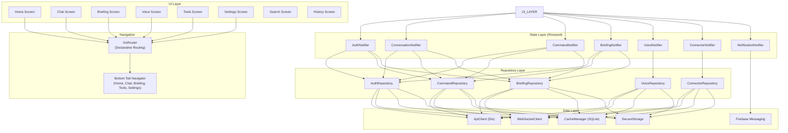
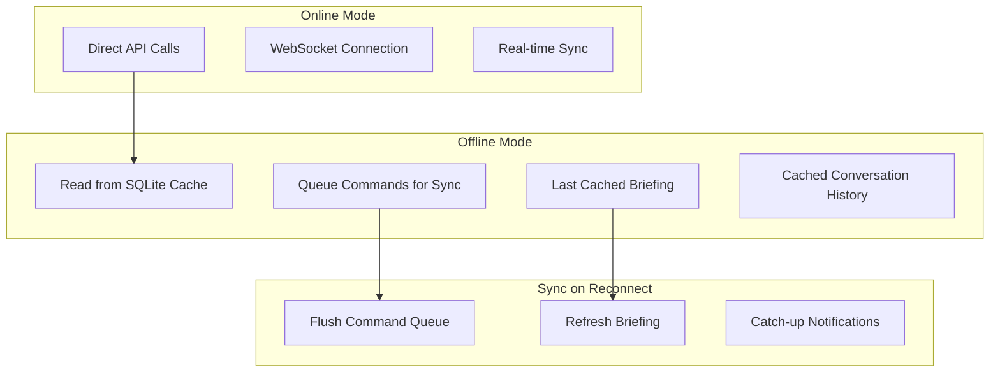
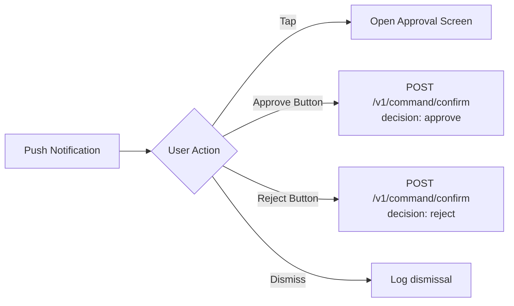

# ERP-Assistant Mobile App Specification

## 1. Overview

The ERP-Assistant mobile app is a standalone Flutter application for iOS and Android, providing on-the-go access to the AI assistant, daily briefings, voice commands, and quick actions. The mobile app prioritizes voice interaction and notification-driven workflows suitable for users away from their desks.

### Platform Targets

| Platform | Minimum Version | Target Version |
|----------|----------------|---------------|
| iOS | 15.0 | 17.0 |
| Android | API 26 (8.0 Oreo) | API 34 (14) |
| Flutter | 3.19+ | Latest stable |
| Dart | 3.3+ | Latest stable |

## 2. App Architecture



## 3. Screen Specifications

### Home Screen

**Layout**: Single scrollable view with pull-to-refresh.

**Sections**:
1. **Greeting Header**: User avatar, greeting ("Good morning, Abiola"), current date
2. **Briefing Summary**: Horizontal scroll of metric cards (revenue, approvals, meetings, deadlines). Tap to expand.
3. **Quick Actions**: 2x2 grid -- Ask Question, Voice Command, View Briefing, Search
4. **Recent Conversations**: Last 5 conversations with title, preview, timestamp
5. **Pending Actions**: Badge-counted cards for items requiring attention

### Chat Screen

**Layout**: Full-screen chat interface with input bar.

**Components**:
- Top app bar: Conversation title, overflow menu (rename, delete, share)
- Message list: ScrollView with user/assistant bubbles
- Input bar: TextField + attachment + voice + send buttons
- Suggestion chips below input

### Briefing Screen

**Layout**: Sectioned list view.

**Components**:
- Date picker (swipe left/right for previous days)
- KPI summary cards (horizontal scroll)
- Pending approvals (expandable list with approve/reject buttons)
- Calendar events (timeline view)
- Deadlines (sorted by urgency)
- Anomaly alerts (red cards)

### Voice Screen

**Layout**: Full-screen modal overlay.

**Components**:
- Large microphone button (center)
- Audio visualization (wave bars)
- Live transcript area
- Response text with audio playback
- Session history (mini transcript)

## 4. Offline Capabilities



| Feature | Offline Support |
|---------|----------------|
| View recent conversations | Yes (cached) |
| Send commands | Queued, executed on reconnect |
| View last briefing | Yes (cached) |
| Voice commands | No (requires API) |
| Connector actions | No (requires API) |
| Push notifications | Yes (FCM) |

## 5. Push Notifications

### Notification Categories

| Category | Priority | Channel |
|----------|----------|---------|
| Pending approval | High | Approvals |
| Briefing ready | Default | Briefings |
| Anomaly alert | High | Alerts |
| Connector status | Low | System |
| Workflow completed | Default | Workflows |

### Notification Payload

```json
{
  "notification": {
    "title": "Purchase Order Requires Approval",
    "body": "PO-2024-0891 for $45,000 from Acme Corp"
  },
  "data": {
    "type": "pending_approval",
    "action_id": "uuid",
    "module": "finance",
    "deep_link": "erpassistant://approval/uuid"
  }
}
```

### Actionable Notifications



## 6. Security

| Feature | Implementation |
|---------|---------------|
| Token storage | FlutterSecureStorage (Keychain/Keystore) |
| Biometric auth | local_auth package (Face ID, fingerprint) |
| Certificate pinning | dio_certificate_pinning |
| Jailbreak/root detection | flutter_jailbreak_detection |
| Screen capture protection | FLAG_SECURE (Android), UIScreen (iOS) |
| Session timeout | 30 minutes inactivity auto-lock |

## 7. Platform-Specific Features

| Feature | iOS | Android |
|---------|-----|---------|
| Widget (home screen) | WidgetKit briefing widget | App Widget briefing widget |
| Shortcuts | Siri Shortcuts integration | App Shortcuts |
| Haptics | UIImpactFeedbackGenerator | VibrationEffect |
| Notifications | APNs via FCM | FCM native |
| Background refresh | BGAppRefreshTask (briefings) | WorkManager |

## 8. Performance Targets

| Metric | Target |
|--------|--------|
| App launch (cold) | < 2s |
| App launch (warm) | < 0.5s |
| Screen transition | < 300ms |
| Voice response first byte | < 500ms |
| Memory usage (idle) | < 80MB |
| Memory usage (active) | < 200MB |
| Battery impact | < 3% per hour (active use) |
| APK size | < 30MB |
| IPA size | < 50MB |
