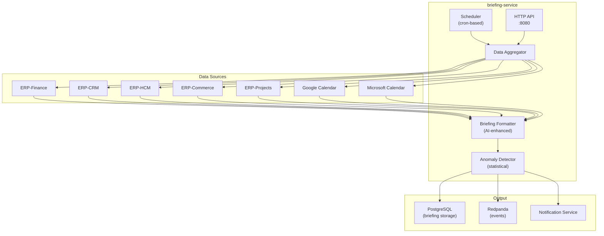
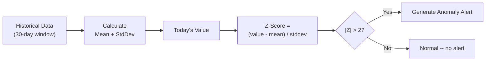
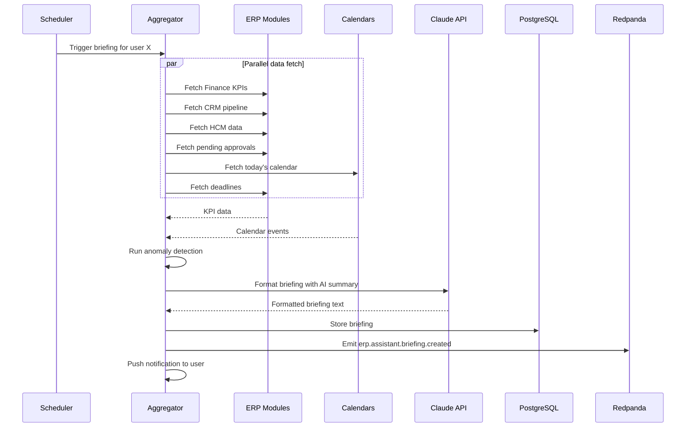

# ERP-Assistant Briefing Service Specification

## 1. Overview

The briefing-service generates AI-powered daily and weekly briefings by aggregating KPIs, pending approvals, calendar events, deadlines, and anomaly alerts from all connected ERP modules and external tools. Built in Go, it provides a full CRUD REST API and publishes CloudEvents for each briefing lifecycle event.

### Service Architecture



## 2. Current Implementation

The briefing-service provides a fully functional CRUD API:

```go
// Endpoints
GET  /healthz              // Health check
GET  /v1/briefing          // List briefings
POST /v1/briefing          // Create briefing
GET  /v1/briefing/{id}     // Get briefing
PUT  /v1/briefing/{id}     // Update briefing
DELETE /v1/briefing/{id}   // Delete briefing
```

All endpoints require `X-Tenant-ID` header and emit CloudEvents:
- `erp.assistant.briefing.listed`
- `erp.assistant.briefing.created`
- `erp.assistant.briefing.read`
- `erp.assistant.briefing.updated`
- `erp.assistant.briefing.deleted`

## 3. Briefing Sections

### KPI Summary

Aggregates key metrics from connected modules:

| KPI | Source Module | Calculation |
|-----|-------------|-------------|
| Revenue (MTD/QTD/YTD) | ERP-Finance | Sum of recognized revenue |
| Pipeline value | ERP-CRM | Sum of open deal values |
| Deals won (this period) | ERP-CRM | Count + value of closed-won |
| Headcount | ERP-HCM | Active employee count |
| Open tickets | ERP-CRM (Support) | Count of unresolved tickets |
| Order fulfillment rate | ERP-Commerce | Fulfilled / total orders % |
| Project completion rate | ERP-Projects | Completed / total milestones |

Each KPI includes:
- Current value
- Previous period value
- Percentage change
- Trend direction (up/down/flat)
- Sparkline data (7-day trend)

### Pending Approvals

| Approval Type | Source Module | Priority Logic |
|--------------|-------------|---------------|
| Purchase orders | ERP-Finance | Amount > threshold = high |
| Leave requests | ERP-HCM | Upcoming start date = high |
| Expense reports | ERP-Finance | Age > 5 days = high |
| Document approvals | ERP-Workspace | Mentioned in meetings = high |
| Pipeline stage advances | ERP-CRM | Deal value > threshold = high |

### Calendar Events

Aggregated from connected calendar providers:

```json
{
  "type": "calendar",
  "data": {
    "events": [
      {
        "title": "Sales Standup",
        "start": "10:00",
        "end": "10:30",
        "provider": "google_calendar",
        "meeting_link": "https://meet.google.com/...",
        "attendees": 5
      },
      {
        "title": "Budget Review",
        "start": "14:00",
        "end": "15:00",
        "provider": "microsoft_365",
        "meeting_link": "https://teams.microsoft.com/...",
        "attendees": 8
      }
    ],
    "total_meetings": 4,
    "total_hours": 3.5
  }
}
```

### Deadlines

| Source | Deadline Type | Alert Threshold |
|--------|-------------|----------------|
| ERP-Projects | Milestone due dates | 3 days before |
| ERP-Finance | Invoice due dates | 5 days before |
| ERP-Commerce | Shipping commitments | 1 day before |
| ERP-HCM | Contract renewals | 30 days before |
| External (Jira) | Sprint end dates | 2 days before |

### Anomaly Alerts

Statistical anomaly detection using Z-score analysis:



Anomaly detection is performed on:
- Daily revenue
- Order volume
- Expense claim amounts
- Support ticket volume
- Employee absence rate

## 4. Scheduling

### Default Schedule

| Briefing Type | Schedule | Delivery Time |
|--------------|---------|--------------|
| Daily | Monday-Friday | 6:00 AM (user timezone) |
| Weekly | Monday | 7:00 AM (user timezone) |

### Customizable Parameters

Users can configure via the memory-service preferences:

| Setting | Options | Default |
|---------|---------|---------|
| `briefing_time` | HH:MM | 06:00 |
| `briefing_days` | Array of weekdays | Mon-Fri |
| `briefing_sections` | Array of section types | All |
| `briefing_modules` | Array of module IDs | All connected |
| `delivery_channel` | in-app, email, slack, voice | in-app |

## 5. Briefing Generation Pipeline



## 6. Weekly Briefing Additions

Weekly briefings include everything from daily briefings plus:

| Section | Content |
|---------|---------|
| Week-over-week comparison | All KPIs compared with previous week |
| Top deals progressed | CRM deals that advanced stages |
| Revenue trend chart | 4-week rolling chart data |
| Team highlights | Notable achievements from HCM |
| Upcoming milestones | Next 2 weeks of project milestones |

## 7. Performance

| Metric | Target |
|--------|--------|
| Single briefing generation | < 30 seconds |
| Batch generation (100 users) | < 5 minutes |
| Data freshness | < 15 minutes old |
| Storage per briefing | ~5-10 KB (JSON) |
| Briefing retention | 90 days (configurable) |
