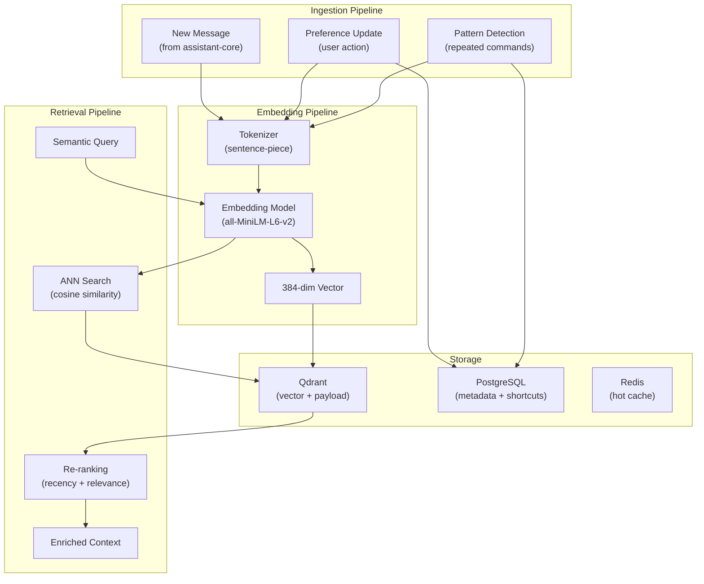
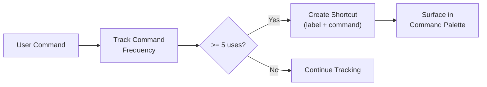
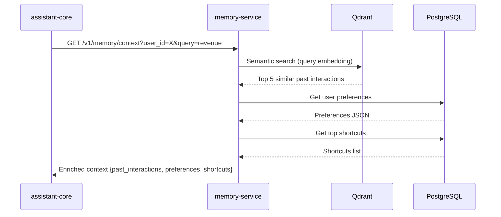
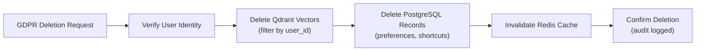

# ERP-Assistant Memory Service Specification

## 1. Overview

The memory-service provides long-term personalization and contextual memory for ERP-Assistant. Built on Python/FastAPI with Qdrant as the vector store, it stores user interaction history, learned preferences, and personalized shortcuts using semantic embeddings, enabling context-aware responses that improve with continued use.

### Memory Architecture



## 2. Current Implementation

```python
# services/memory-service/main.py
from fastapi import FastAPI

app = FastAPI(title="ERP-Assistant Memory Service")

@app.get("/healthz")
def healthz():
    return {"status": "healthy", "service": "memory-service"}
```

## 3. Memory Types

### Conversation Memory

Stores embeddings of past conversation messages for semantic retrieval.

| Field | Type | Description |
|-------|------|-------------|
| `id` | UUID | Unique message embedding ID |
| `tenant_id` | UUID | Tenant isolation key |
| `user_id` | UUID | User owner |
| `conversation_id` | UUID | Source conversation |
| `content` | string | Original message text |
| `role` | string | user / assistant |
| `embedding` | float[384] | Semantic embedding vector |
| `created_at` | timestamp | When the message was created |
| `module_context` | string[] | Modules referenced in this message |

**Retention**: 90 days (configurable per tenant)
**Collection**: `memory_{tenant_id}`

### User Preferences

Learned and explicitly set preferences.

| Preference Key | Type | Example | Learned/Explicit |
|---------------|------|---------|-----------------|
| `default_format` | string | "table" | Explicit |
| `briefing_time` | string | "08:00" | Explicit |
| `briefing_modules` | string[] | ["finance", "crm"] | Explicit |
| `preferred_voice` | string | "professional-female" | Explicit |
| `report_style` | string | "detailed" | Learned |
| `preferred_modules` | string[] | ["finance", "crm"] | Learned |
| `active_hours` | object | {"start": "09:00", "end": "18:00"} | Learned |
| `timezone` | string | "America/New_York" | Explicit |

### Personalized Shortcuts

Automatically detected from repeated command patterns:



| Field | Type | Description |
|-------|------|-------------|
| `label` | string | Auto-generated friendly name |
| `command` | string | Full command text |
| `usage_count` | integer | Times used |
| `last_used_at` | timestamp | Most recent usage |
| `auto_generated` | boolean | True if detected, false if user-created |

## 4. Embedding Pipeline

### Model Selection

| Model | Dimensions | Speed | Quality | Size |
|-------|-----------|-------|---------|------|
| all-MiniLM-L6-v2 | 384 | Fast | Good | 80MB |
| all-mpnet-base-v2 | 768 | Medium | Best | 420MB |
| BGE-small-en-v1.5 | 384 | Fast | Good | 130MB |

**Selected**: `all-MiniLM-L6-v2` (384 dimensions) for the balance of speed and quality. Upgrade path to `all-mpnet-base-v2` for improved accuracy.

### Embedding Generation

```python
from sentence_transformers import SentenceTransformer

model = SentenceTransformer('all-MiniLM-L6-v2')

def embed_text(text: str) -> list[float]:
    """Generate 384-dim embedding for text."""
    return model.encode(text, normalize_embeddings=True).tolist()

def embed_batch(texts: list[str]) -> list[list[float]]:
    """Batch embedding for efficiency."""
    return model.encode(texts, normalize_embeddings=True).tolist()
```

## 5. Qdrant Configuration

### Collection Schema

```python
from qdrant_client import QdrantClient
from qdrant_client.models import Distance, VectorParams, PayloadSchemaType

client = QdrantClient(url="http://qdrant:6333")

def create_tenant_collection(tenant_id: str):
    client.create_collection(
        collection_name=f"memory_{tenant_id}",
        vectors_config=VectorParams(
            size=384,
            distance=Distance.COSINE,
        ),
        on_disk_payload=True,
    )
    # Create payload indexes for filtering
    client.create_payload_index(
        collection_name=f"memory_{tenant_id}",
        field_name="user_id",
        field_schema=PayloadSchemaType.KEYWORD,
    )
    client.create_payload_index(
        collection_name=f"memory_{tenant_id}",
        field_name="created_at",
        field_schema=PayloadSchemaType.DATETIME,
    )
```

### Search Query

```python
def semantic_search(tenant_id: str, user_id: str, query: str, limit: int = 10):
    query_vector = embed_text(query)

    results = client.search(
        collection_name=f"memory_{tenant_id}",
        query_vector=query_vector,
        query_filter=Filter(
            must=[
                FieldCondition(key="user_id", match=MatchValue(value=user_id)),
            ]
        ),
        limit=limit,
        score_threshold=0.5,  # Minimum similarity
    )

    return [
        {
            "content": hit.payload["content"],
            "similarity": hit.score,
            "created_at": hit.payload["created_at"],
            "conversation_id": hit.payload["conversation_id"],
        }
        for hit in results
    ]
```

## 6. Context Enrichment Flow

When assistant-core processes a new command, it queries memory-service to enrich the context:



## 7. Pattern Detection Algorithm

```python
from collections import Counter
from datetime import datetime, timedelta

def detect_shortcuts(user_id: str, window_days: int = 30, threshold: int = 5):
    """Detect repeated command patterns and create shortcuts."""
    recent_commands = get_commands_since(
        user_id=user_id,
        since=datetime.utcnow() - timedelta(days=window_days)
    )

    # Normalize commands (lowercase, strip whitespace)
    normalized = [cmd.strip().lower() for cmd in recent_commands]

    # Count frequencies
    counter = Counter(normalized)

    shortcuts = []
    for command, count in counter.most_common():
        if count >= threshold:
            label = generate_shortcut_label(command)  # AI-generated friendly name
            shortcuts.append({
                "label": label,
                "command": command,
                "usage_count": count,
                "auto_generated": True,
            })

    return shortcuts
```

## 8. API Endpoints

| Endpoint | Method | Description |
|----------|--------|-------------|
| `/healthz` | GET | Health check |
| `/v1/memory/context` | GET | Fetch enriched context for a query |
| `/v1/memory/ingest` | POST | Ingest new interaction embedding |
| `/v1/memory/preferences` | GET | Get user preferences |
| `/v1/memory/preferences` | PUT | Update user preferences |
| `/v1/memory/shortcuts` | GET | Get personalized shortcuts |
| `/v1/memory/shortcuts` | POST | Create manual shortcut |
| `/v1/memory/search` | POST | Semantic search over history |
| `/v1/memory/forget` | DELETE | Delete user's memory data (GDPR) |

## 9. Privacy and Data Retention

| Data Type | Retention | Deletion Mechanism |
|-----------|-----------|-------------------|
| Conversation embeddings | 90 days | Qdrant TTL + batch cleanup |
| User preferences | Permanent (until deleted) | DELETE /v1/memory/forget |
| Shortcuts | Permanent (until deleted) | DELETE /v1/memory/forget |
| GDPR export | On request | GET /v1/memory/export |

### GDPR Compliance



## 10. Performance

| Operation | Target Latency | Notes |
|-----------|---------------|-------|
| Embedding generation | < 10ms | Batch preferred |
| Qdrant search (top 10) | < 50ms | With payload filtering |
| Context assembly | < 100ms | Embedding + search + preferences |
| Shortcut detection | < 500ms | Background job |
| Memory ingestion | < 20ms | Async, non-blocking |
