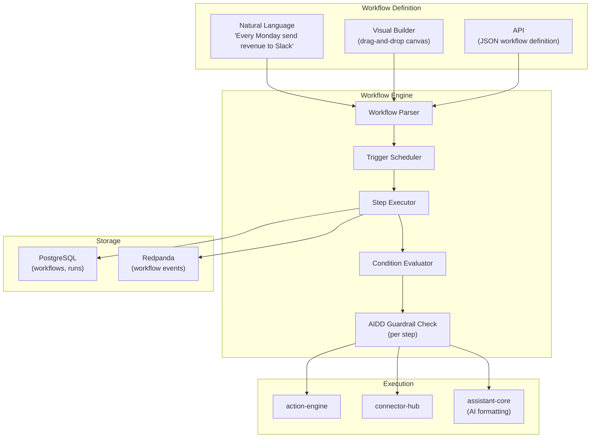
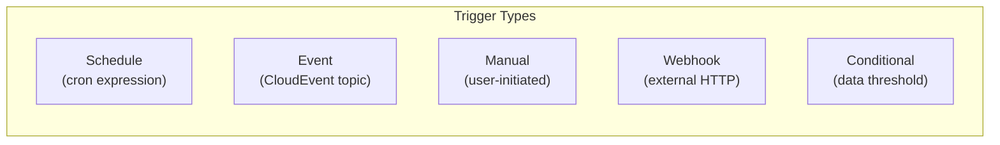
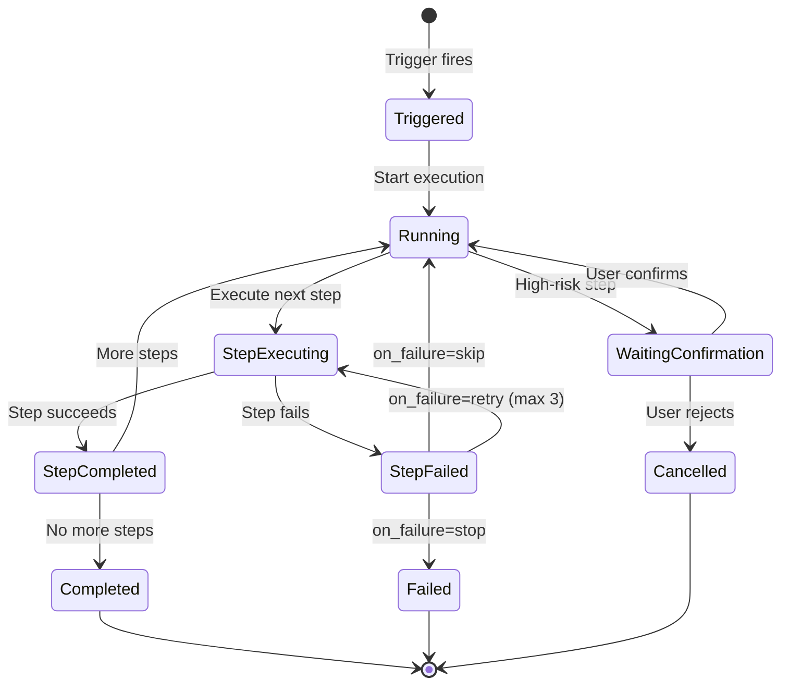
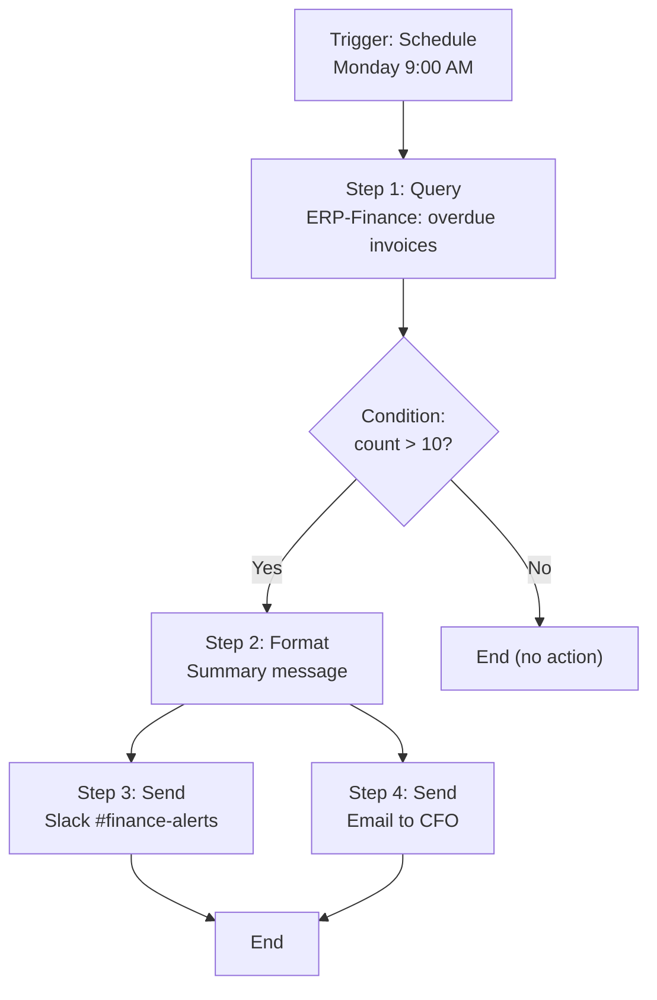

# ERP-Assistant Workflow Engine Specification

## 1. Overview

The workflow engine enables users to define multi-step automated workflows through natural language or the visual workflow builder. Workflows combine triggers, conditional logic, cross-module actions, and multi-channel delivery, all governed by AIDD guardrails. Each workflow step inherits the risk classification of its underlying action.

### Workflow Architecture



## 2. Workflow Model

### Workflow Definition

```json
{
  "id": "uuid",
  "name": "Weekly Revenue Report",
  "description": "Send weekly revenue summary to #finance-team on Slack",
  "owner_id": "user-uuid",
  "tenant_id": "tenant-uuid",
  "trigger": {
    "type": "schedule",
    "config": {
      "cron": "0 17 * * 5",
      "timezone": "America/New_York"
    }
  },
  "steps": [
    {
      "id": "step-1",
      "order": 1,
      "action_type": "query",
      "target_module": "ERP-Finance",
      "parameters": {
        "entity": "revenue",
        "period": "this_week",
        "breakdown": "by_region"
      },
      "output_variable": "revenue_data"
    },
    {
      "id": "step-2",
      "order": 2,
      "action_type": "query",
      "target_module": "ERP-CRM",
      "parameters": {
        "entity": "deals",
        "status": "closed_won",
        "period": "this_week"
      },
      "output_variable": "deals_data"
    },
    {
      "id": "step-3",
      "order": 3,
      "action_type": "condition",
      "condition": {
        "expression": "revenue_data.total > 0",
        "on_true": "step-4",
        "on_false": "step-5"
      }
    },
    {
      "id": "step-4",
      "order": 4,
      "action_type": "format",
      "template": "Weekly Revenue: ${revenue_data.total}\nDeals Closed: ${deals_data.count}\nTop Region: ${revenue_data.top_region}",
      "output_variable": "formatted_message"
    },
    {
      "id": "step-5",
      "order": 5,
      "action_type": "format",
      "template": "No revenue recorded this week. ${deals_data.count} deals closed.",
      "output_variable": "formatted_message"
    },
    {
      "id": "step-6",
      "order": 6,
      "action_type": "send",
      "target_module": "Slack",
      "parameters": {
        "channel": "#finance-team",
        "message": "${formatted_message}"
      }
    }
  ],
  "active": true,
  "created_at": "2026-02-23T10:00:00Z"
}
```

## 3. Trigger Types



| Trigger Type | Configuration | Example |
|-------------|---------------|---------|
| Schedule | Cron expression + timezone | `0 17 * * 5` (every Friday 5 PM) |
| Event | CloudEvent topic filter | `erp.finance.invoice.overdue` |
| Manual | User click / voice command | "Run my revenue report workflow" |
| Webhook | HTTP endpoint + secret | External system triggers workflow |
| Conditional | Data query + threshold | "When pipeline > $1M" |

## 4. Step Types

| Step Type | Description | AIDD Risk |
|-----------|------------|-----------|
| `query` | Read data from a module | Low (autonomous) |
| `condition` | Evaluate expression, branch flow | N/A (logic only) |
| `format` | Format data using template or AI | N/A (formatting only) |
| `send` | Send message (Slack, email, etc.) | Medium (log + execute) |
| `write` | Create/update entity in module | High (confirm on first run) |
| `delete` | Delete entity in module | Critical (always confirm) |
| `wait` | Pause for duration or condition | N/A |
| `loop` | Iterate over collection | Inherits child step risk |

## 5. Execution Engine

### Workflow Run Lifecycle



### Step Execution Flow

```mermaid
sequenceDiagram
    participant WE as Workflow Engine
    participant GUARD as AIDD Guardrails
    participant AE as action-engine
    participant CH as connector-hub
    participant MOD as Target Module

    WE->>WE: Load step definition
    WE->>WE: Resolve variable references
    WE->>GUARD: Check step risk level

    alt Low Risk (query)
        GUARD-->>WE: Autonomous
        WE->>AE: Execute
        AE->>CH: Resolve connector
        CH->>MOD: API call
        MOD-->>CH: Data
        CH-->>AE: Result
        AE-->>WE: Step result
    else High Risk (write)
        GUARD-->>WE: Confirm required
        alt First run of this workflow
            WE-->>WE: Request user confirmation
            Note over WE: User confirms once; subsequent runs auto-execute
        else Previously confirmed
            WE->>AE: Execute with saved approval
        end
    end
    WE->>WE: Store step result in variables
    WE->>WE: Advance to next step
```

## 6. Natural Language Workflow Creation

Users can define workflows through natural language, parsed by assistant-core:

**User**: "Every Monday at 9 AM, check for overdue invoices. If there are more than 10, send a summary to #finance-alerts on Slack and email the CFO."

**Parsed Workflow**:


## 7. Variable System

Workflow steps can reference outputs from previous steps using `${variable_name}` syntax:

| Variable Source | Access Pattern | Example |
|----------------|---------------|---------|
| Step output | `${step_variable.field}` | `${revenue_data.total}` |
| Trigger context | `${trigger.date}` | `${trigger.date}` |
| User context | `${user.name}` | `${user.name}` |
| Tenant context | `${tenant.name}` | `${tenant.name}` |
| Built-in | `${now}`, `${today}` | `${today}` |

## 8. Error Handling

### Failure Policies

| Policy | Behavior |
|--------|----------|
| `stop` | Halt workflow, mark as failed |
| `skip` | Skip failed step, continue to next |
| `retry` | Retry step (max 3, exponential backoff) |

### Error Notification

On workflow failure:
1. Log error with full step context
2. Emit `erp.assistant.workflow.failed` event
3. Send notification to workflow owner
4. Store failure details in `workflow_runs.step_results`

## 9. Workflow Management API

| Endpoint | Method | Description |
|----------|--------|-------------|
| `/v1/workflows` | GET | List user's workflows |
| `/v1/workflows` | POST | Create workflow |
| `/v1/workflows/{id}` | GET | Get workflow details |
| `/v1/workflows/{id}` | PUT | Update workflow |
| `/v1/workflows/{id}` | DELETE | Delete workflow |
| `/v1/workflows/{id}/activate` | POST | Enable workflow |
| `/v1/workflows/{id}/deactivate` | POST | Disable workflow |
| `/v1/workflows/{id}/run` | POST | Trigger manual run |
| `/v1/workflows/{id}/runs` | GET | List run history |
| `/v1/workflows/{id}/runs/{runId}` | GET | Get run details |

## 10. Workflow Limits

| Limit | Value | Rationale |
|-------|-------|-----------|
| Max workflows per user | 50 | Prevent resource abuse |
| Max steps per workflow | 20 | Complexity limit |
| Max concurrent runs | 5 per user | Resource protection |
| Min schedule interval | 5 minutes | Rate limiting |
| Max run duration | 10 minutes | Timeout protection |
| Variable payload max | 1 MB | Memory protection |
