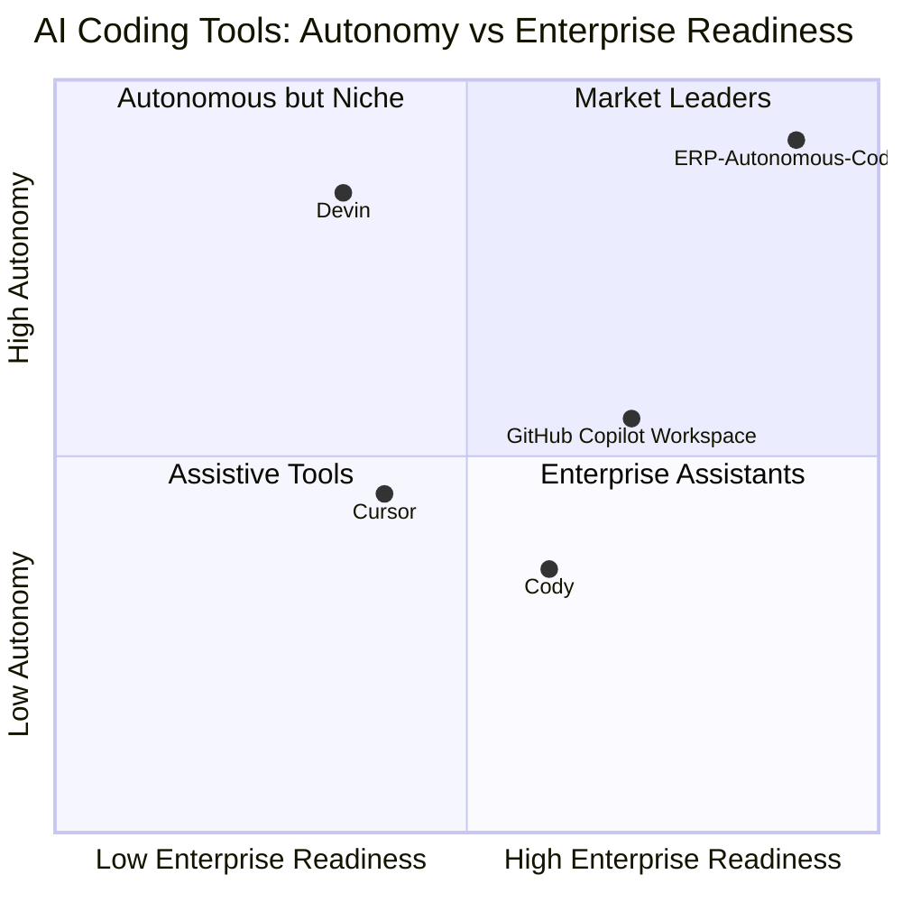

# ERP-Autonomous-Coding -- Product Requirements Document (PRD)

## Document Information

| Field | Value |
|-------|-------|
| Module | ERP-Autonomous-Coding |
| Version | 1.0.0 |
| Domain | AI-Driven Software Development |
| Last Updated | 2026-02-23 |
| Status | Draft |
| SKU | erp.autonomous_coding |
| Authors | Platform Architecture Team |

---

## 1. Executive Summary

ERP-Autonomous-Coding is an enterprise-grade autonomous AI coding platform integrated into the ERP product line. It provides a fully autonomous software development agent capable of generating code, writing tests, performing code reviews, fixing bugs, refactoring, generating documentation, and orchestrating CI/CD pipelines -- all within sandboxed, auditable execution environments and governed by AIDD (AI-Driven Development) human approval gates.

The platform operates as a **standalone_plus_suite** module: it can run independently for any software team or as part of the broader ERP ecosystem where it assists in developing and maintaining other ERP modules. Authentication is delegated to ERP-IAM via OIDC/JWT, and entitlements are managed through ERP-Platform.

### 1.1 Vision Statement

Eliminate the friction between intent and implementation by providing an autonomous coding agent that understands enterprise codebases, produces production-quality code, and integrates seamlessly with every major Git provider, IDE, and CI/CD pipeline -- all under strict human governance.

### 1.2 Problem Statement

Modern software teams face compounding pressures: growing codebase complexity, security vulnerability backlogs, insufficient test coverage, slow PR review cycles, and developer burnout. Existing AI coding assistants (GitHub Copilot, Cursor, Cody) provide suggestion-level assistance but lack true autonomy -- they cannot independently plan multi-file changes, execute and verify tests, iterate on failures, or manage the full PR lifecycle across diverse Git platforms.

---

## 2. Competitive Analysis

### 2.1 Competitive Landscape Matrix

| Capability | ERP-Autonomous-Coding | GitHub Copilot Workspace | Cursor | Devin (Cognition) | Cody (Sourcegraph) |
|---|---|---|---|---|---|
| **Autonomous multi-file editing** | Full -- plan, edit, test, verify loop | Partial -- workspace proposals | Editor-scoped | Full -- but cloud-only | Partial -- context-aware suggestions |
| **Iterative generate-test-fix cycle** | Native with sandbox validation | Manual verification required | Not autonomous | Supported but opaque | Not supported |
| **Git provider support** | GitHub, GitLab, Bitbucket, Azure DevOps | GitHub only | GitHub (limited) | GitHub (limited) | GitHub, GitLab |
| **IDE support** | JetBrains, VS Code, Vim/Neovim, Emacs | VS Code (web) | Cursor fork of VS Code | Web terminal only | VS Code, JetBrains |
| **Sandboxed execution** | Docker-based with resource limits | Cloud sandbox | None | Cloud VM | None |
| **SAST / Security scanning** | Integrated (Snyk, Trivy, TruffleHog) | None | None | Basic | Partial |
| **AIDD compliance** | Enforced human approval gates | None | None | None | None |
| **Task decomposition** | Built-in planner with dependency ordering | Basic plan generation | None | Internal planner | None |
| **CI/CD orchestration** | GitHub Actions, GitLab CI, Azure Pipelines, Bitbucket Pipelines | GitHub Actions only | None | Limited | None |
| **Enterprise multi-tenancy** | Native tenant isolation | Organization-scoped | Not applicable | Team-scoped | Organization-scoped |
| **On-premises deployment** | Full support (Docker/K8s) | Cloud only | Desktop app | Cloud only | Self-hosted option |
| **LSP integration** | Full (hover, go-to-def, refs, diagnostics) | None | Editor-native | None | Partial |
| **CLI tool** | Full (init/run/review/fix/test/deploy) | None | None | CLI available | CLI available |
| **Cost model** | Per-seat + usage (ERP Platform) | Per-seat ($19/mo) | Per-seat ($20/mo) | Per-seat ($500/mo) | Per-seat ($9/mo) |

### 2.2 Competitive Differentiation

**Key differentiators over each competitor:**

- **vs GitHub Copilot Workspace**: Multi-provider Git support (not GitHub-locked), full IDE coverage, AIDD governance, on-prem deployment, integrated security scanning.
- **vs Cursor**: True autonomous execution (not just editor suggestions), sandboxed verification, CI/CD orchestration, enterprise multi-tenancy.
- **vs Devin**: On-premises deployment, transparent reasoning traces, AIDD human approval gates, broader IDE integration, lower cost, ERP ecosystem integration.
- **vs Cody**: Full autonomy (not just context-aware completions), sandboxed execution, task decomposition, CI/CD pipeline orchestration, broader Git provider support.

---

## 3. Target Users and Personas

### 3.1 Primary Personas

| Persona | Role | Pain Points | Value Proposition |
|---------|------|-------------|-------------------|
| **Alex -- Senior Developer** | IC engineer on ERP team | Context-switching between repos, slow PR reviews, repetitive test writing | Autonomous PR creation, test generation, instant code reviews |
| **Maya -- Engineering Manager** | Leads a team of 8 | Velocity metrics, PR backlog, code quality variance | Task decomposition, automated quality gates, team dashboard |
| **Jordan -- DevOps Engineer** | Manages CI/CD pipelines | Flaky tests, deployment failures, config drift | Sandbox validation, CI/CD orchestration, automated fix loops |
| **Sam -- Security Engineer** | AppSec team lead | Vulnerability backlog, secret exposure, compliance gaps | Integrated SAST, secret detection, AIDD compliance |
| **Pat -- Platform Architect** | Designs ERP modules | Multi-repo coordination, cross-module impact | Task planner impact assessment, multi-file editing |

### 3.2 Secondary Personas

- **Open-Source Contributors** -- External contributors using the CLI to generate PRs for ERP modules
- **QA Engineers** -- Leveraging autonomous test generation for coverage gaps
- **Technical Writers** -- Using doc generation capabilities for API documentation

---

## 4. Functional Requirements

### 4.1 Agent Core (FR-AC)

| ID | Requirement | Priority | Acceptance Criteria |
|----|-------------|----------|---------------------|
| FR-AC-001 | Code generation from natural language prompt | P0 | Agent produces compilable, linted code matching prompt intent |
| FR-AC-002 | Multi-file code editing | P0 | Agent can create, modify, and delete files across repository |
| FR-AC-003 | Iterative generate-test-fix-verify loop | P0 | Agent iterates until tests pass or max iterations reached |
| FR-AC-004 | Code review with inline comments | P0 | Agent produces actionable review comments on PR diffs |
| FR-AC-005 | Test generation (unit, integration, e2e) | P0 | Generated tests achieve >= 80% branch coverage for target code |
| FR-AC-006 | Bug diagnosis and fix | P1 | Agent identifies root cause from stack trace and produces fix |
| FR-AC-007 | Code refactoring | P1 | Refactored code maintains behavioral equivalence (tests pass) |
| FR-AC-008 | Documentation generation | P1 | Generated docs include API references, usage examples, diagrams |
| FR-AC-009 | Claude API integration | P0 | Agent uses Claude API for all LLM-driven reasoning |
| FR-AC-010 | Reasoning trace capture | P0 | Every agent action logged with reasoning chain for auditability |

### 4.2 Sandbox Runtime (FR-SR)

| ID | Requirement | Priority | Acceptance Criteria |
|----|-------------|----------|---------------------|
| FR-SR-001 | Ephemeral Docker container provisioning | P0 | Container created in < 5s, destroyed after task completion |
| FR-SR-002 | CPU/memory/disk/network resource limits | P0 | Hard limits enforced; container killed on breach |
| FR-SR-003 | Pre-built language images | P0 | Go, Python, Node.js, Rust, Java, .NET images available |
| FR-SR-004 | Package manager support | P0 | pip, npm, go mod, cargo, maven, nuget available in sandbox |
| FR-SR-005 | Network isolation modes | P1 | Full isolation, allowlist-only, or open modes configurable |
| FR-SR-006 | Filesystem snapshot and diff | P1 | Capture before/after filesystem state for audit trail |
| FR-SR-007 | Concurrent sandbox pool | P1 | Pool of warm containers for < 1s startup time |

### 4.3 Git Bridge (FR-GB)

| ID | Requirement | Priority | Acceptance Criteria |
|----|-------------|----------|---------------------|
| FR-GB-001 | GitHub integration (App, webhooks, REST, GraphQL, Actions, PRs, Issues, Copilot bridge) | P0 | Full lifecycle: clone, branch, commit, push, create PR, respond to reviews, approve, merge |
| FR-GB-002 | GitLab integration (OAuth, REST, GraphQL, CI/CD, MRs) | P0 | Same lifecycle as GitHub including GitLab CI pipeline triggers |
| FR-GB-003 | Bitbucket integration (App, REST, Pipelines, PRs) | P1 | Same lifecycle including Bitbucket Pipelines |
| FR-GB-004 | Azure DevOps integration (OAuth, REST, Pipelines, PRs, Work Items) | P1 | Same lifecycle including Azure Pipelines and work item linking |
| FR-GB-005 | AIDD human approval gate | P0 | No merge without explicit human approval; configurable per repo |
| FR-GB-006 | Webhook event processing | P0 | Process push, PR, review, issue, and CI events in real-time |
| FR-GB-007 | Unified Git abstraction layer | P0 | Single interface across all four providers |

### 4.4 IDE Server (FR-IS)

| ID | Requirement | Priority | Acceptance Criteria |
|----|-------------|----------|---------------------|
| FR-IS-001 | LSP bridge: hover information | P0 | Type info and documentation on hover |
| FR-IS-002 | LSP bridge: go-to-definition | P0 | Navigate to symbol definition across files |
| FR-IS-003 | LSP bridge: find references | P0 | List all usages of a symbol |
| FR-IS-004 | LSP bridge: completions | P0 | Context-aware code completions |
| FR-IS-005 | LSP bridge: diagnostics | P0 | Real-time error and warning reporting |
| FR-IS-006 | LSP bridge: code actions | P1 | Quick fixes and refactoring suggestions |
| FR-IS-007 | LSP bridge: formatting | P1 | Code formatting via configured formatter |
| FR-IS-008 | WebSocket transport | P0 | Persistent bidirectional connection for IDE communication |

### 4.5 Review Engine (FR-RE)

| ID | Requirement | Priority | Acceptance Criteria |
|----|-------------|----------|---------------------|
| FR-RE-001 | SAST security scanning | P0 | Detect OWASP Top 10 vulnerabilities |
| FR-RE-002 | Style enforcement | P0 | Enforce project-specific linting rules |
| FR-RE-003 | Test coverage analysis | P0 | Report coverage delta for changed files |
| FR-RE-004 | Cyclomatic complexity scoring | P1 | Flag functions exceeding threshold |
| FR-RE-005 | Dependency vulnerability scanning (Snyk/Trivy) | P0 | Detect known CVEs in dependencies |
| FR-RE-006 | Secret detection (TruffleHog) | P0 | Block commits containing secrets/keys |
| FR-RE-007 | Performance anti-pattern detection | P1 | Flag N+1 queries, unbounded loops, etc. |
| FR-RE-008 | AIDD compliance validation | P0 | Verify all agent actions have human approval |

### 4.6 Task Planner (FR-TP)

| ID | Requirement | Priority | Acceptance Criteria |
|----|-------------|----------|---------------------|
| FR-TP-001 | Codebase analysis | P0 | Parse and understand project structure, dependencies, patterns |
| FR-TP-002 | Impact assessment | P0 | Identify files and modules affected by proposed change |
| FR-TP-003 | Implementation plan generation | P0 | Produce ordered list of steps with file-level granularity |
| FR-TP-004 | Dependency ordering | P0 | Topological sort of task dependencies |
| FR-TP-005 | Parallel execution scheduling | P1 | Identify independent tasks for concurrent execution |
| FR-TP-006 | Estimation (effort, risk) | P2 | Provide t-shirt size estimates and risk scores |

---

## 5. Non-Functional Requirements

### 5.1 Performance

| Metric | Target | Measurement |
|--------|--------|-------------|
| Code generation latency (simple file) | < 10s | P95 from prompt submission to first file written |
| Sandbox startup (warm pool) | < 1s | P95 container ready time |
| Sandbox startup (cold) | < 5s | P95 container ready time |
| PR review completion | < 60s | P95 for reviews of < 500 changed lines |
| IDE LSP response | < 200ms | P95 for hover, go-to-def, find-refs |
| WebSocket message delivery | < 50ms | P95 end-to-end |
| Task decomposition | < 30s | P95 for repositories < 100k LOC |

### 5.2 Scalability

- Support 10,000+ concurrent agent sessions per cluster
- Sandbox pool auto-scales 10 to 1,000 containers based on demand
- Horizontal scaling for all stateless services

### 5.3 Security

- All inter-service communication over mTLS
- Sandbox network isolation by default
- Secret scanning on all code before commit
- RBAC with tenant-scoped permissions via ERP-IAM
- Audit log for every agent action with reasoning trace
- SOC 2 Type II compliance alignment

### 5.4 Availability

- 99.9% uptime SLA for API and agent services
- 99.95% for Git webhook processing (no missed events)
- Multi-region deployment support

---

## 6. User Stories

| ID | Story | Priority |
|----|-------|----------|
| US-001 | As a developer, I want to describe a feature in natural language and have the agent implement it across multiple files so that I can focus on architecture decisions. | P0 |
| US-002 | As a developer, I want the agent to automatically write tests for my code so that I can maintain high coverage without manual effort. | P0 |
| US-003 | As a reviewer, I want the agent to perform an initial code review on PRs so that I can focus on design-level feedback. | P0 |
| US-004 | As a DevOps engineer, I want the agent to fix failing CI builds so that the pipeline stays green. | P1 |
| US-005 | As a manager, I want a dashboard showing agent activity, success rates, and team velocity impact so that I can measure ROI. | P1 |
| US-006 | As a security engineer, I want automated SAST and dependency scanning on every agent-generated PR so that security standards are maintained. | P0 |
| US-007 | As a developer, I want to use the agent from my JetBrains IDE so that I do not need to leave my workflow. | P0 |
| US-008 | As a developer, I want the agent to fix bugs from stack traces so that I can reduce debugging time. | P1 |

---

## 7. Release Plan

### 7.1 Phase 1 -- Foundation (Q1 2026)
- Agent Core with Claude API integration
- Sandbox Runtime with Docker isolation
- GitHub integration (Git Bridge)
- VS Code extension
- CLI tool (init, run, review)
- Review Engine (SAST, secret detection)

### 7.2 Phase 2 -- Expansion (Q2 2026)
- GitLab and Bitbucket integration
- JetBrains plugin suite
- Task Planner with dependency ordering
- Performance anti-pattern detection
- Next.js dashboard v1

### 7.3 Phase 3 -- Enterprise (Q3 2026)
- Azure DevOps integration
- Vim/Neovim and Emacs plugins
- Multi-region deployment
- Advanced AIDD governance workflows
- SOC 2 compliance certification

### 7.4 Phase 4 -- Intelligence (Q4 2026)
- Cross-repository reasoning
- Autonomous incident response
- Predictive code quality scoring
- Custom model fine-tuning support

---

## 8. Success Metrics

| KPI | Baseline | Target (6 months) |
|-----|----------|-------------------|
| PR cycle time | 48h | 12h |
| Test coverage (new code) | 65% | 90% |
| Security vulnerability backlog | 200+ | < 20 |
| Developer satisfaction (NPS) | 30 | 60 |
| Agent-generated PRs merged (first attempt) | N/A | > 70% |
| Mean time to fix CI failures | 4h | 30min |

---

## 9. Risks and Mitigations

| Risk | Probability | Impact | Mitigation |
|------|------------|--------|------------|
| LLM hallucination producing incorrect code | High | High | Sandbox verification, iterative test loop, human approval gate |
| Claude API rate limits affecting throughput | Medium | High | Request queuing, caching, fallback models |
| Docker sandbox escape vulnerability | Low | Critical | gVisor runtime, seccomp profiles, regular security audits |
| Developer resistance to AI-generated code | Medium | Medium | Transparent reasoning traces, gradual adoption, opt-in model |
| Git provider API changes breaking integrations | Medium | Medium | Abstraction layer, version-pinned API clients, integration tests |

---

## 10. Appendix: Glossary

| Term | Definition |
|------|------------|
| **AIDD** | AI-Driven Development -- governance framework requiring human approval for AI-generated changes |
| **Agent Session** | A single autonomous coding task execution from prompt to completion |
| **Sandbox** | Isolated Docker container for code execution and testing |
| **Reasoning Trace** | Logged chain of decisions and actions taken by the agent |
| **Git Bridge** | Unified abstraction layer across GitHub, GitLab, Bitbucket, Azure DevOps |
| **Review Engine** | Automated code quality, security, and compliance validation pipeline |
| **Task Planner** | Component that decomposes large tasks into ordered, parallelizable subtasks |
