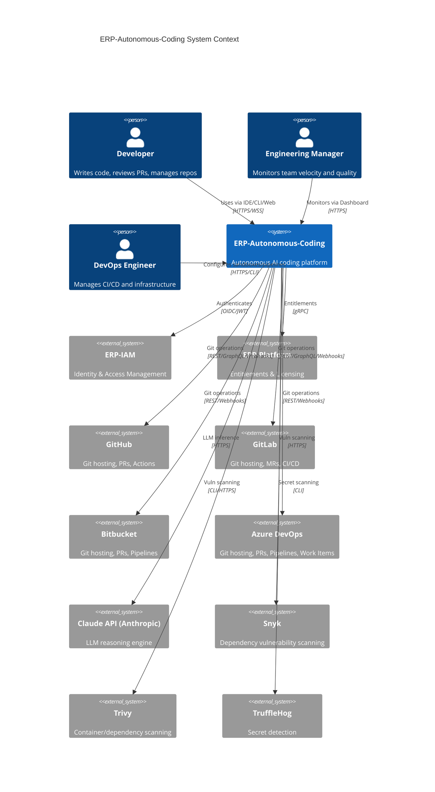
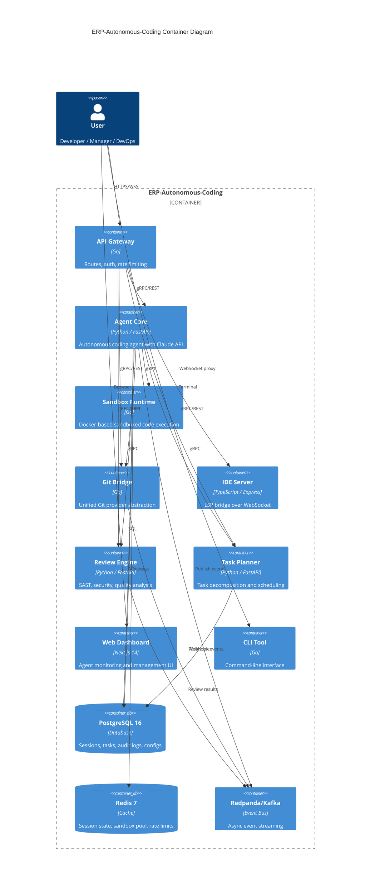
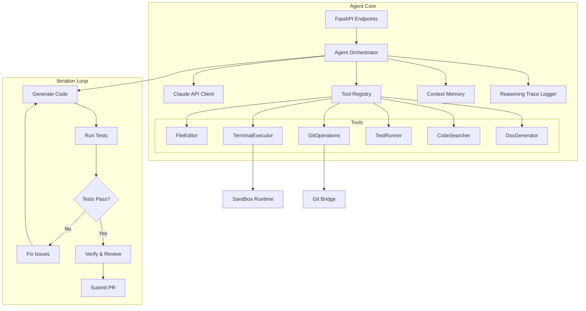
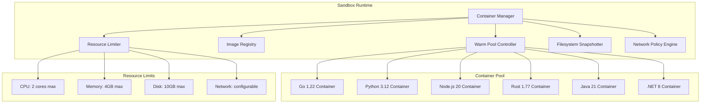
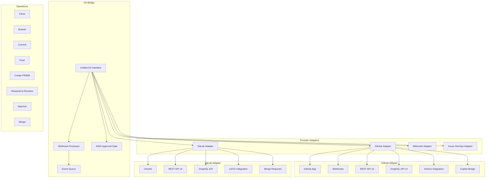
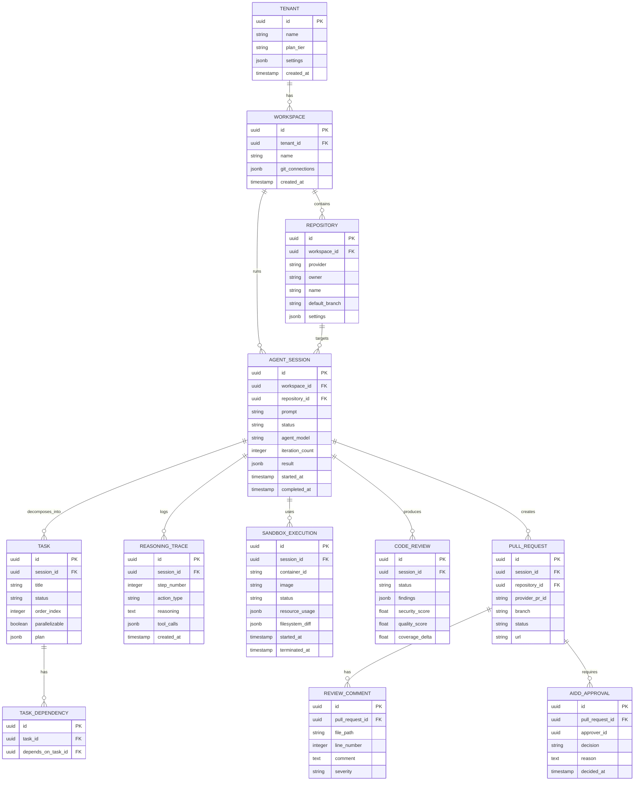
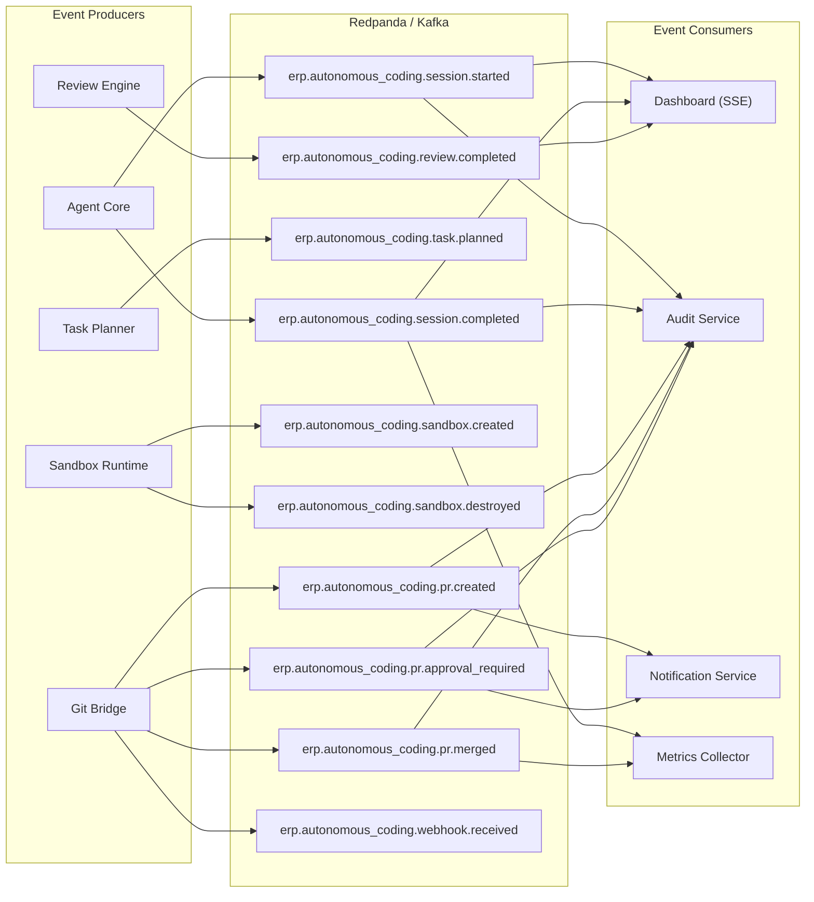
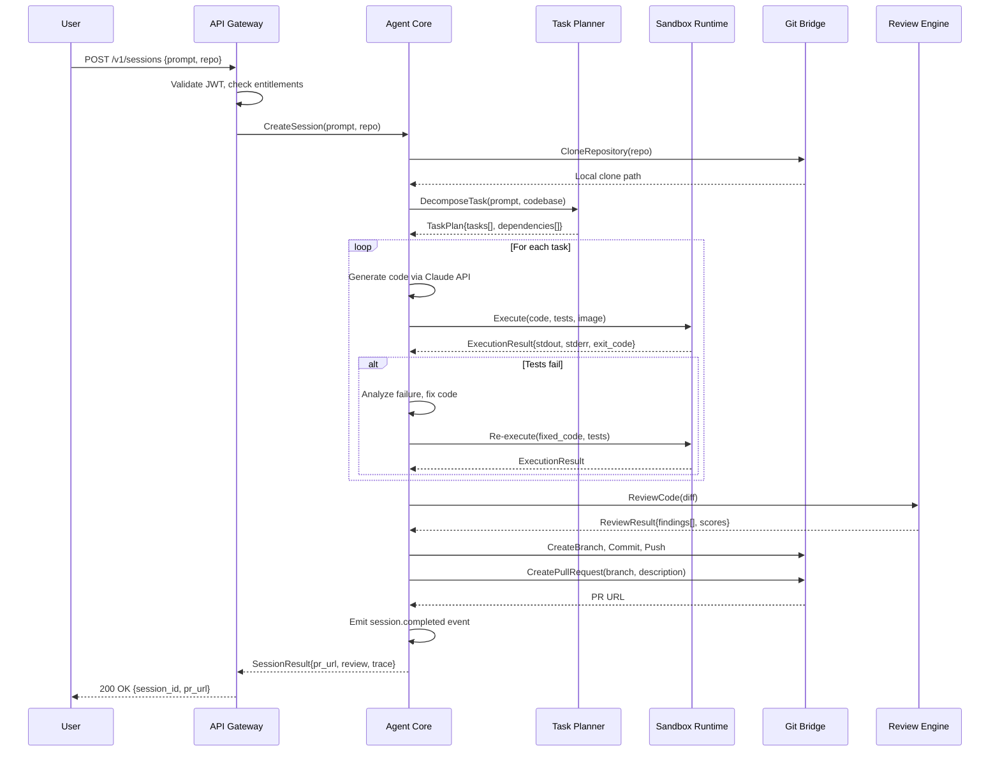
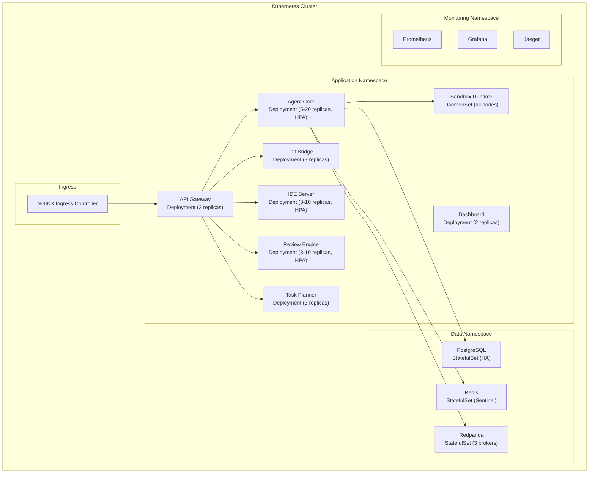

# ERP-Autonomous-Coding -- Technical Architecture Document

## Document Information

| Field | Value |
|-------|-------|
| Module | ERP-Autonomous-Coding |
| Version | 1.0.0 |
| Last Updated | 2026-02-23 |
| Status | Draft |
| Classification | Internal -- Engineering |

---

## 1. Architecture Overview

ERP-Autonomous-Coding follows a microservices architecture with six core backend services, four IDE plugin frontends, a CLI tool, and a Next.js web dashboard. The system operates in `standalone_plus_suite` mode, authenticating via ERP-IAM (OIDC/JWT) and resolving entitlements via ERP-Platform.

### 1.1 C4 Context Diagram

### 1.2 C4 Container Diagram

---

## 2. Service Architecture

### 2.1 Service Inventory

| Service | Language | Framework | Port | Responsibility |
|---------|----------|-----------|------|----------------|
| `autonomous-coding-api` | Go 1.22 | stdlib/chi | 8090 (ext: 8095) | API gateway, routing, auth middleware |
| `agent-core` | Python 3.12 | FastAPI | 8080 (ext: 8205) | Autonomous coding agent orchestration |
| `sandbox-runtime` | Go 1.22 | stdlib | Internal | Docker container lifecycle management |
| `git-bridge` | Go 1.22 | stdlib | Internal | Git provider abstraction layer |
| `ide-server` | TypeScript | Express | 8080 (ext: 8207) | LSP bridge, WebSocket server |
| `review-engine` | Python 3.12 | FastAPI | 8080 (ext: 8206) | Code quality and security analysis |
| `task-planner` | Python 3.12 | FastAPI | 8080 (ext: 8209) | Task decomposition and scheduling |

### 2.2 Agent Core Architecture

### 2.3 Sandbox Runtime Architecture

### 2.4 Git Bridge Architecture

---

## 3. Data Architecture

### 3.1 Database Schema (PostgreSQL)

### 3.2 Event-Driven Architecture

---

## 4. Inter-Service Communication

### 4.1 Communication Patterns

| Source | Target | Protocol | Pattern | Purpose |
|--------|--------|----------|---------|---------|
| API Gateway | Agent Core | gRPC | Request/Response | Session creation, status queries |
| Agent Core | Sandbox Runtime | gRPC | Request/Response | Container lifecycle, code execution |
| Agent Core | Git Bridge | gRPC | Request/Response | Clone, commit, push, PR operations |
| Agent Core | Review Engine | gRPC | Request/Response | Code review, SAST scanning |
| Agent Core | Task Planner | gRPC | Request/Response | Task decomposition |
| Git Bridge | Agent Core | Kafka | Event-driven | Webhook notifications (PR events, reviews) |
| IDE Server | Agent Core | WebSocket | Bidirectional stream | Real-time agent interaction |
| Dashboard | API Gateway | SSE | Server-push | Real-time session updates |
| All services | Kafka | Kafka | Pub/Sub | Event distribution |

### 4.2 Request Flow -- Autonomous Coding Session

---

## 5. Deployment Architecture

### 5.1 Docker Compose (Development)

The development environment uses Docker Compose with 8 services as defined in `docker-compose.yml`:

| Service | Build Context | Exposed Port |
|---------|--------------|--------------|
| autonomous-coding-api | `.` | 8095 |
| agent-core | `./services/agent-core` | 8205 |
| review-engine | `./services/review-engine` | 8206 |
| ide-server | `./services/ide-server` | 8207 |
| task-planner | `./services/task-planner` | 8209 |
| sandbox-runtime | `./services/sandbox-runtime` | Internal |
| git-bridge | `./services/git-bridge` | Internal |
| redis | `redis:7` (image) | Internal |

### 5.2 Kubernetes (Production)

---

## 6. Technology Stack Summary

| Layer | Technology | Version | Purpose |
|-------|-----------|---------|---------|
| API Gateway | Go | 1.22 | Routing, auth, rate limiting |
| Agent Core | Python, FastAPI | 3.12 | Autonomous agent orchestration |
| Sandbox | Go, Docker Engine | 1.22 / 25.x | Container lifecycle |
| Git Bridge | Go | 1.22 | Git provider abstraction |
| IDE Server | TypeScript, Express | ES2022 | LSP bridge |
| Review Engine | Python, FastAPI | 3.12 | Code analysis |
| Task Planner | Python, FastAPI | 3.12 | Task decomposition |
| Dashboard | Next.js | 14 | Web UI |
| CLI | Go | 1.22 | Command-line tool |
| Database | PostgreSQL | 16 | Primary data store |
| Cache | Redis | 7 | Session state, rate limits |
| Event Bus | Redpanda/Kafka | Latest | Event streaming |
| LLM | Claude API (Anthropic) | Latest | AI reasoning engine |
| SAST | Snyk, Trivy | Latest | Vulnerability scanning |
| Secrets | TruffleHog | Latest | Secret detection |
| Container Runtime | Docker / gVisor | 25.x | Sandboxed execution |
| Observability | Prometheus, Grafana, Jaeger | Latest | Metrics, dashboards, tracing |
