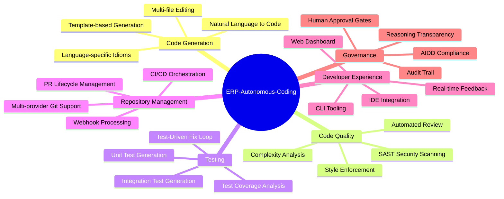
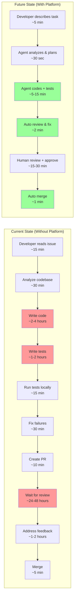
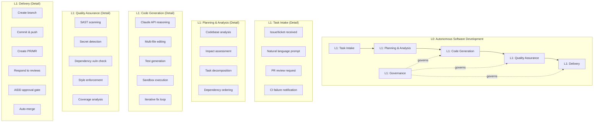
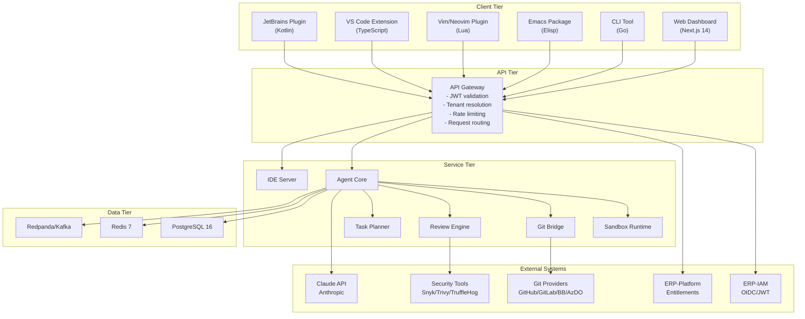
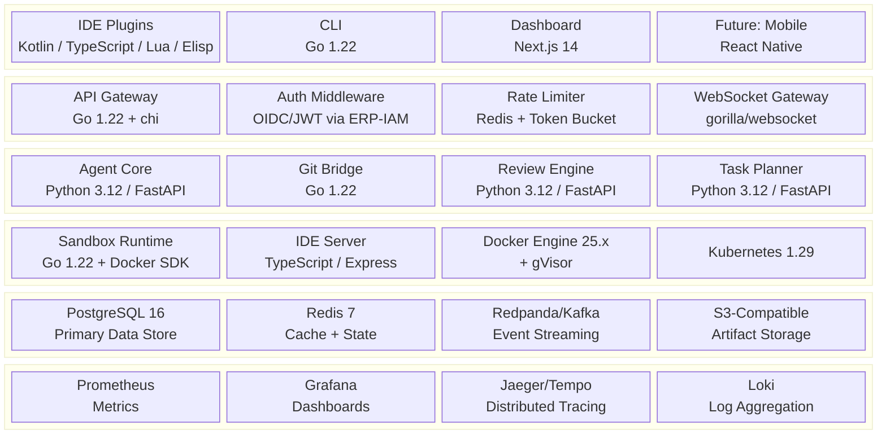
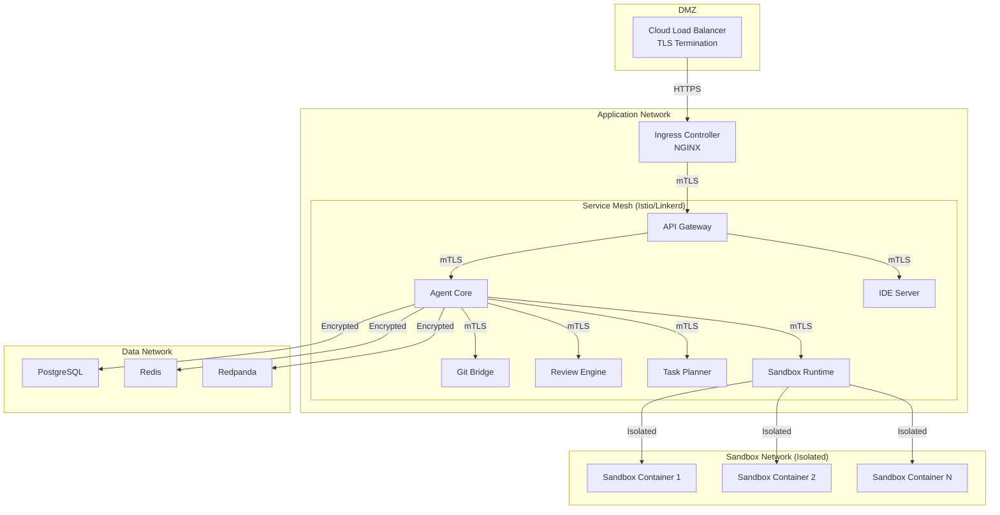
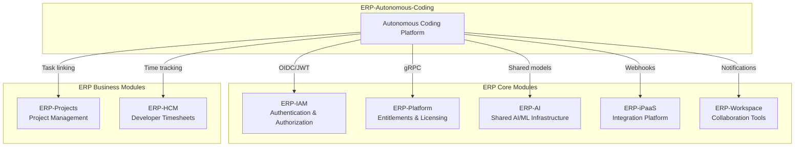
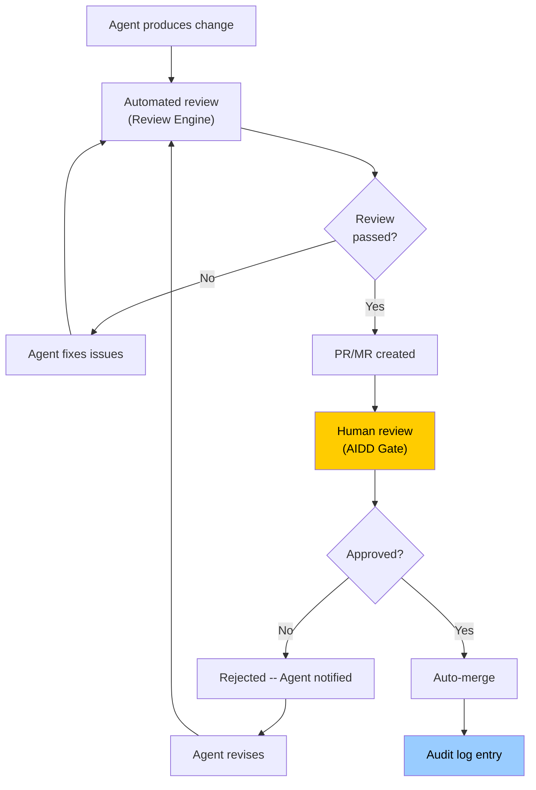

# ERP-Autonomous-Coding -- Enterprise Architecture Document

## Document Information

| Field | Value |
|-------|-------|
| Module | ERP-Autonomous-Coding |
| Version | 1.0.0 |
| Last Updated | 2026-02-23 |
| Status | Draft |
| Framework | TOGAF ADM / ArchiMate 3.1 |

---

## 1. Business Architecture

### 1.1 Business Capability Model

### 1.2 Value Stream Mapping

**Value stream improvement**: End-to-end cycle time reduces from **6-52 hours** to **25-50 minutes** (85-98% reduction).

### 1.3 Business Process Architecture

---

## 2. Application Architecture

### 2.1 Application Portfolio

| Application | Type | Technology | Integration Pattern | Data Classification |
|-------------|------|-----------|-------------------|-------------------|
| Agent Core | Backend Service | Python/FastAPI | Synchronous gRPC + Async Events | Confidential (source code) |
| Sandbox Runtime | Infrastructure Service | Go | Synchronous gRPC | Internal |
| Git Bridge | Integration Service | Go | Webhooks + REST/GraphQL | Confidential |
| IDE Server | Edge Service | TypeScript/Express | WebSocket | Internal |
| Review Engine | Backend Service | Python/FastAPI | Synchronous gRPC | Confidential |
| Task Planner | Backend Service | Python/FastAPI | Synchronous gRPC | Internal |
| Web Dashboard | Frontend | Next.js 14 | REST + SSE | Internal |
| CLI Tool | Client | Go | REST | Internal |
| JetBrains Plugin | Client Plugin | Kotlin | REST + WebSocket | Internal |
| VS Code Extension | Client Plugin | TypeScript | REST + WebSocket | Internal |
| Vim/Neovim Plugin | Client Plugin | Lua + VimScript | REST | Internal |
| Emacs Package | Client Plugin | Elisp | REST | Internal |

### 2.2 Integration Architecture

---

## 3. Technology Architecture

### 3.1 Technology Reference Model

### 3.2 Network Architecture

---

## 4. Information Architecture

### 4.1 Data Flow Classification

| Data Type | Classification | Storage | Encryption | Retention |
|-----------|---------------|---------|-----------|-----------|
| Source Code (cloned repos) | Confidential | Ephemeral (sandbox) | At-rest AES-256 | Session duration only |
| Agent Reasoning Traces | Internal | PostgreSQL | At-rest AES-256 | 90 days |
| PR/MR Metadata | Internal | PostgreSQL | At-rest AES-256 | Indefinite |
| Audit Logs | Restricted | PostgreSQL + S3 | At-rest AES-256 | 7 years |
| User Credentials/Tokens | Restricted | Vault/KMS | AES-256-GCM | Until rotation |
| Git Provider Webhooks | Internal | Kafka (transient) | TLS in-transit | 7 days |
| Sandbox Filesystem Snapshots | Confidential | S3 | At-rest AES-256 | 30 days |
| Review Findings | Internal | PostgreSQL | At-rest AES-256 | 1 year |

### 4.2 Data Sovereignty

The platform supports data residency requirements through multi-region deployment. All source code processing occurs within the configured region -- code never leaves the deployment boundary except for Claude API calls, which can be routed through Anthropic's regional endpoints or replaced with on-premises model deployments.

---

## 5. ERP Platform Integration

### 5.1 Module Integration Map

### 5.2 Integration Contracts

| Integration | Protocol | Direction | Events/Endpoints |
|-------------|----------|-----------|-----------------|
| ERP-IAM | OIDC/JWT | Outbound | Token validation, user info, RBAC |
| ERP-Platform | gRPC | Outbound | `CheckEntitlement`, `GetPlanLimits` |
| ERP-AI | gRPC | Bidirectional | Model inference, embedding, fine-tuning |
| ERP-iPaaS | Webhooks | Bidirectional | Workflow triggers, external notifications |
| ERP-Workspace | Events (Kafka) | Outbound | `session.completed`, `pr.created` notifications |
| ERP-Projects | REST | Bidirectional | Task/issue linking, status updates |
| ERP-HCM | Events (Kafka) | Outbound | Agent session duration for time tracking |

---

## 6. Governance and Compliance

### 6.1 AIDD Governance Framework

### 6.2 Compliance Mapping

| Standard | Requirement | Platform Capability |
|----------|------------|-------------------|
| SOC 2 Type II | Access control | JWT + RBAC via ERP-IAM |
| SOC 2 Type II | Audit logging | Reasoning traces + action logs |
| SOC 2 Type II | Change management | AIDD approval gates |
| GDPR | Data minimization | Ephemeral sandboxes, configurable retention |
| GDPR | Right to erasure | Tenant data purge capability |
| ISO 27001 | Information security | mTLS, encryption at rest, network isolation |
| OWASP | Secure coding | Integrated SAST scanning |
| PCI DSS | Secret management | TruffleHog detection + Vault integration |

---

## 7. Capacity Planning

### 7.1 Sizing Model

| Tier | Concurrent Sessions | Sandbox Pool | PostgreSQL | Redis | Kafka Partitions | Agent Core Replicas |
|------|--------------------|--------------|-----------:|------:|-----------------:|--------------------:|
| Small (< 50 devs) | 25 | 50 containers | 2 vCPU / 8GB | 2GB | 12 | 3 |
| Medium (50-200 devs) | 100 | 200 containers | 4 vCPU / 32GB | 8GB | 24 | 10 |
| Large (200-1000 devs) | 500 | 1,000 containers | 8 vCPU / 64GB | 32GB | 48 | 20 |
| Enterprise (1000+ devs) | 2,000+ | 5,000+ containers | 16 vCPU / 128GB | 64GB | 96 | 50+ |
