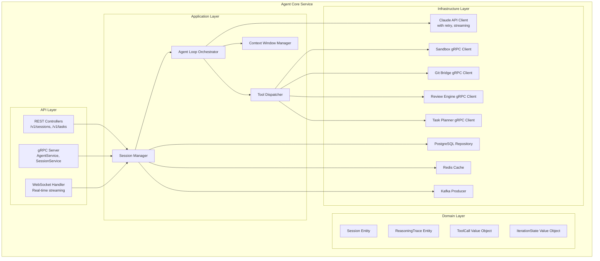
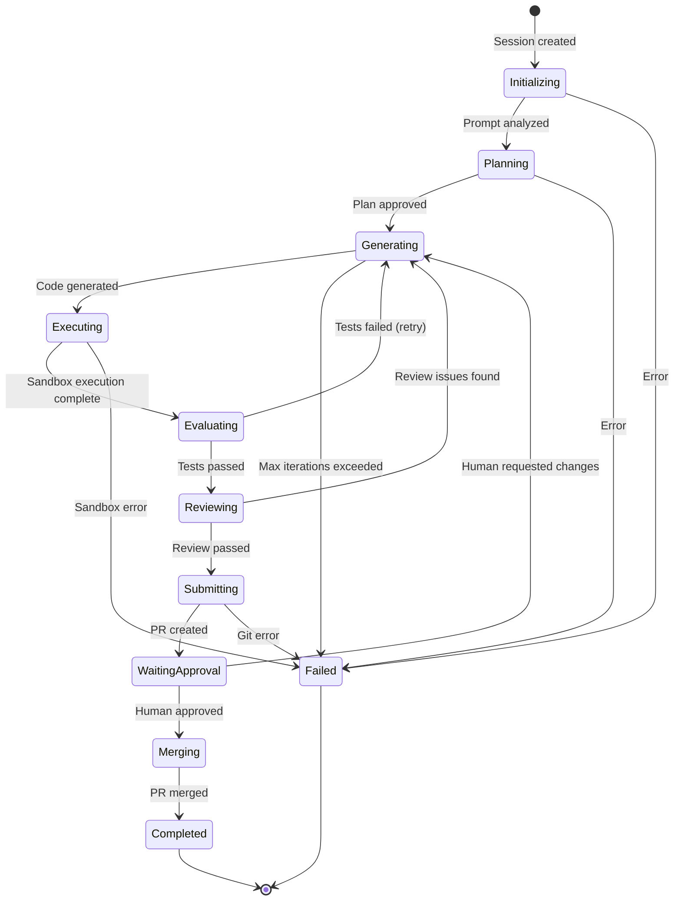
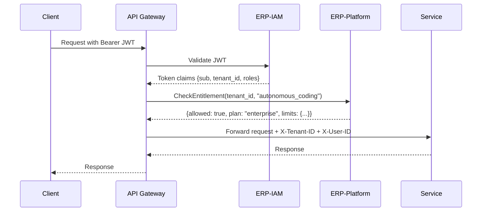
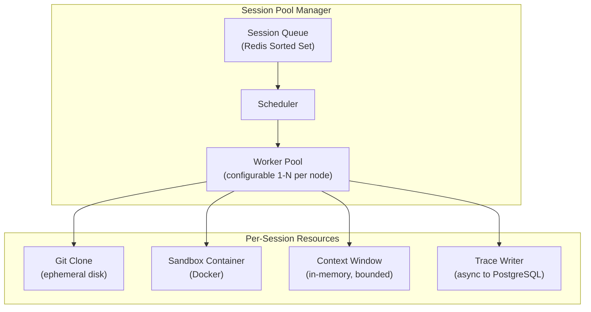
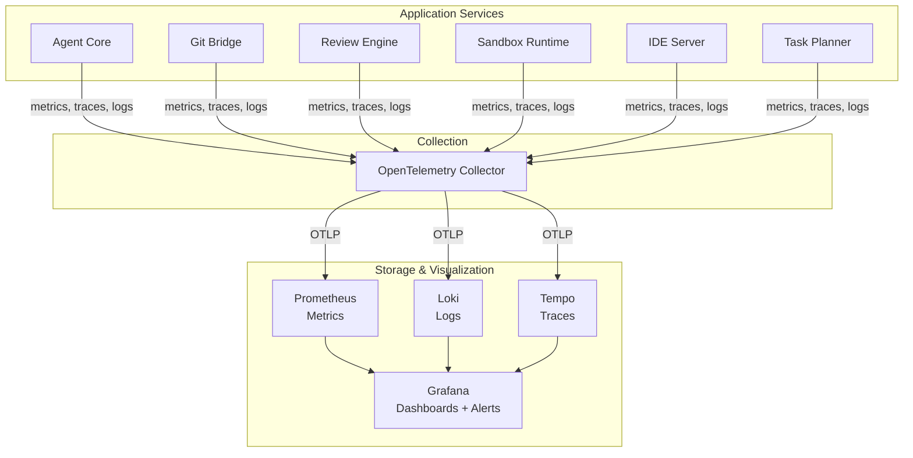

# ERP-Autonomous-Coding -- Software Architecture Document

## Document Information

| Field | Value |
|-------|-------|
| Module | ERP-Autonomous-Coding |
| Version | 1.0.0 |
| Last Updated | 2026-02-23 |
| Status | Draft |

---

## 1. Architecture Principles

| Principle | Rationale | Implication |
|-----------|-----------|-------------|
| Sandbox-first execution | All agent-generated code executes in isolated containers | No code runs on host; Docker/gVisor required |
| Human-in-the-loop | AIDD governance requires human approval before merge | Every PR has an approval gate; no auto-merge without consent |
| Provider-agnostic Git | No vendor lock-in to a single Git host | Abstraction layer with adapter pattern for each provider |
| Transparent reasoning | Every agent decision must be auditable | Reasoning traces persisted for all sessions |
| Polyglot by design | Best language for each service domain | Python for AI/ML, Go for infrastructure, TypeScript for IDE |
| Event-driven decoupling | Services communicate asynchronously where possible | Kafka/Redpanda for all cross-service notifications |

---

## 2. Domain-Driven Design

### 2.1 Bounded Contexts

```mermaid
flowchart TB
    subgraph "Agent Context"
        direction TB
        SESSION["Session Aggregate"]
        TRACE["Reasoning Trace"]
        TOOL["Tool Invocation"]
        ITER["Iteration Cycle"]
    end

    subgraph "Planning Context"
        TASKPLAN["Task Plan Aggregate"]
        ANALYSIS["Codebase Analysis"]
        IMPACT["Impact Assessment"]
        DEP["Dependency Graph"]
    end

    subgraph "Execution Context"
        SANDBOX2["Sandbox Aggregate"]
        CONTAINER["Container Lifecycle"]
        RESOURCE["Resource Enforcement"]
        SNAPSHOT["Filesystem Snapshot"]
    end

    subgraph "Repository Context"
        REPO["Repository Aggregate"]
        PROVIDER["Provider Adapter"]
        WEBHOOK2["Webhook Event"]
        PRLIFECYCLE["PR Lifecycle"]
    end

    subgraph "Quality Context"
        REVIEW2["Review Aggregate"]
        SAST2["Security Finding"]
        STYLE["Style Violation"]
        COVERAGE["Coverage Report"]
    end

    subgraph "Governance Context"
        APPROVAL["Approval Aggregate"]
        POLICY["Policy Rule"]
        AUDITENTRY["Audit Entry"]
    end

    SESSION -->|"requests planning"| TASKPLAN
    SESSION -->|"creates"| SANDBOX2
    SESSION -->|"operates on"| REPO
    SESSION -->|"triggers"| REVIEW2
    PRLIFECYCLE -->|"requires"| APPROVAL
```



### 2.2 Aggregate Boundaries

| Aggregate | Root Entity | Value Objects | Domain Events |
|-----------|-------------|---------------|---------------|
| Session | AgentSession | Prompt, Config, Result | SessionStarted, SessionCompleted, SessionFailed |
| TaskPlan | Plan | Task, Dependency, Estimate | TaskPlanned, TaskStarted, TaskCompleted |
| Sandbox | SandboxInstance | ResourceLimits, Image, NetworkPolicy | SandboxCreated, SandboxDestroyed, ExecutionCompleted |
| Repository | Repository | GitConnection, Branch, Credentials | RepoConnected, BranchCreated, CommitPushed |
| PullRequest | PullRequest | Diff, ReviewComment, CIStatus | PRCreated, PRReviewed, PRApproved, PRMerged |
| Review | CodeReview | Finding, Score, Recommendation | ReviewStarted, ReviewCompleted |
| Approval | AIDDApproval | Decision, Reason, Approver | ApprovalRequested, ApprovalGranted, ApprovalDenied |

---

## 3. Component Architecture

### 3.1 Agent Core -- Internal Components



### 3.2 Agent Loop State Machine



### 3.3 Tool Registry

The Agent Core maintains a registry of tools the AI agent can invoke during its reasoning loop:

| Tool | Category | Description | Sandbox Required |
|------|----------|-------------|-----------------|
| `file_read` | Filesystem | Read file contents | No (from clone) |
| `file_write` | Filesystem | Create or modify file | Yes |
| `file_delete` | Filesystem | Delete file | Yes |
| `file_search` | Filesystem | Search files by pattern/content | No |
| `terminal_exec` | Execution | Run shell command | Yes |
| `test_run` | Testing | Execute test suite | Yes |
| `git_status` | Git | Check repository status | No |
| `git_commit` | Git | Stage and commit changes | Yes |
| `git_push` | Git | Push to remote | No (via Git Bridge) |
| `git_create_pr` | Git | Create pull request | No (via Git Bridge) |
| `lsp_hover` | IDE | Get type information | No (via IDE Server) |
| `lsp_goto_def` | IDE | Navigate to definition | No (via IDE Server) |
| `lsp_find_refs` | IDE | Find all references | No (via IDE Server) |
| `web_search` | Research | Search documentation | No |
| `codebase_analyze` | Planning | Analyze project structure | No |

---

## 4. Design Patterns

### 4.1 Pattern Catalog

| Pattern | Where Applied | Rationale |
|---------|--------------|-----------|
| **Adapter** | Git Bridge provider adapters | Uniform interface across GitHub/GitLab/Bitbucket/AzDO |
| **Strategy** | Sandbox resource policies | Different resource limit profiles per tier |
| **Observer** | Event system (Kafka) | Decoupled service notifications |
| **Chain of Responsibility** | Review Engine pipeline | Sequential SAST -> Style -> Coverage -> Secret checks |
| **Command** | Tool invocations | Encapsulated, serializable, auditable agent actions |
| **State Machine** | Agent Loop | Well-defined transitions with failure handling |
| **Circuit Breaker** | Claude API client | Graceful degradation on API failures |
| **Sidecar** | Sandbox monitoring | Resource limit enforcement via container sidecar |
| **CQRS** | Session queries vs. commands | Separate read models for dashboard from write path |
| **Saga** | Multi-step PR lifecycle | Compensating actions on partial failure |

### 4.2 Review Engine Pipeline (Chain of Responsibility)

```mermaid
flowchart LR
    INPUT["Code Diff Input"] --> SAST3["SAST Scanner<br/>(Snyk)"]
    SAST3 --> SECRETS["Secret Detector<br/>(TruffleHog)"]
    SECRETS --> DEPS["Dependency Scanner<br/>(Trivy)"]
    DEPS --> STYLE2["Style Enforcer<br/>(Linters)"]
    STYLE2 --> COMPLEX["Complexity Analyzer"]
    COMPLEX --> COV["Coverage Analyzer"]
    COV --> PERF["Performance Checker"]
    PERF --> AIDD2["AIDD Compliance<br/>Validator"]
    AIDD2 --> OUTPUT["Review Result"]

    style SAST3 fill:#ff9999,color:#000
    style SECRETS fill:#ff9999,color:#000
    style DEPS fill:#ff9999,color:#000
    style AIDD2 fill:#ffcc00,color:#000
```



---

## 5. API Design

### 5.1 Core API Endpoints

```
# Health & Discovery
GET  /healthz
GET  /v1/capabilities

# Sessions
POST /v1/sessions                    # Create autonomous coding session
GET  /v1/sessions                    # List sessions (paginated)
GET  /v1/sessions/{id}               # Get session details
GET  /v1/sessions/{id}/trace         # Get reasoning trace
POST /v1/sessions/{id}/cancel        # Cancel running session
POST /v1/sessions/{id}/retry         # Retry failed session

# Tasks
GET  /v1/sessions/{id}/tasks         # Get task breakdown
GET  /v1/tasks/{id}                  # Get task details
POST /v1/tasks/run                   # Run standalone task

# Reviews
POST /v1/reviews                     # Trigger code review
GET  /v1/reviews/{id}                # Get review results
GET  /v1/reviews/{id}/findings       # Get review findings

# Repositories
POST /v1/repositories                # Connect repository
GET  /v1/repositories                # List connected repos
DEL  /v1/repositories/{id}           # Disconnect repository

# Git Operations
POST /v1/git/clone                   # Clone repository
POST /v1/git/branch                  # Create branch
POST /v1/git/commit                  # Commit changes
POST /v1/git/push                    # Push to remote
POST /v1/git/pr                      # Create pull request

# Sandboxes
GET  /v1/sandboxes                   # List active sandboxes
GET  /v1/sandboxes/{id}              # Get sandbox details
GET  /v1/sandboxes/{id}/logs         # Stream sandbox logs
DEL  /v1/sandboxes/{id}              # Terminate sandbox

# Webhooks
POST /v1/webhooks/github             # GitHub webhook receiver
POST /v1/webhooks/gitlab             # GitLab webhook receiver
POST /v1/webhooks/bitbucket          # Bitbucket webhook receiver
POST /v1/webhooks/azure-devops       # Azure DevOps webhook receiver

# Task Planner
POST /v1/planner/analyze             # Analyze codebase
POST /v1/planner/decompose           # Decompose task
GET  /v1/planner/{id}/plan           # Get execution plan

# IDE
WS   /v1/ide/connect                 # WebSocket for IDE communication
POST /v1/ide/hover                   # LSP hover
POST /v1/ide/definition              # LSP go-to-def
POST /v1/ide/references              # LSP find-refs
POST /v1/ide/completions             # LSP completions
POST /v1/ide/diagnostics             # LSP diagnostics
```

### 5.2 API Authentication Flow



---

## 6. Error Handling Strategy

### 6.1 Error Categories

| Category | HTTP Code | Retry | Alert | Example |
|----------|-----------|-------|-------|---------|
| Client Error | 4xx | No | No | Invalid prompt, missing tenant ID |
| Auth Error | 401/403 | No | On burst | Expired JWT, insufficient permissions |
| Rate Limited | 429 | Yes (backoff) | On sustained | Claude API rate limit, sandbox pool exhausted |
| Service Error | 500 | Yes (3x) | Yes | Database connection failure |
| Timeout | 504 | Yes (1x) | Yes | Sandbox execution timeout |
| Dependency Error | 502 | Yes (3x) | Yes | Git provider API unavailable |

### 6.2 Circuit Breaker Configuration

| Dependency | Failure Threshold | Recovery Time | Fallback |
|-----------|-------------------|---------------|----------|
| Claude API | 5 failures / 30s | 60s | Queue requests, return "agent unavailable" |
| GitHub API | 10 failures / 60s | 120s | Queue webhook events, retry later |
| Sandbox Runtime | 3 failures / 10s | 30s | Expand pool, retry on different host |
| PostgreSQL | 3 failures / 10s | 15s | Read from Redis cache |

---

## 7. Concurrency Model

### 7.1 Agent Session Concurrency



Each worker processes one session at a time. Sessions are queued by priority (P0 requests first, then FIFO). The worker pool scales horizontally across Agent Core replicas. Each session holds exactly one sandbox container, one git clone, and one context window in memory.

---

## 8. Observability Architecture


