# ERP-Autonomous-Coding -- Use Cases Document

## Document Information

| Field | Value |
|-------|-------|
| Module | ERP-Autonomous-Coding |
| Version | 1.0.0 |
| Last Updated | 2026-02-23 |
| Status | Draft |

---

## 1. Use Case Overview Map

```mermaid
flowchart TB
    subgraph "Actors"
        DEV["Developer"]
        MGR["Engineering Manager"]
        DEVOPS["DevOps Engineer"]
        SEC["Security Engineer"]
        QA["QA Engineer"]
        ARCH["Platform Architect"]
        OSS["OSS Contributor"]
    end

    subgraph "Core Use Cases"
        UC1["UC-01: Autonomous Code Generation"]
        UC2["UC-02: Automated PR Review"]
        UC3["UC-03: Bug Diagnosis & Fix"]
        UC4["UC-04: Test Generation"]
        UC5["UC-05: CI/CD Failure Resolution"]
        UC6["UC-06: Code Refactoring"]
        UC7["UC-07: Documentation Generation"]
        UC8["UC-08: Security Vulnerability Fix"]
        UC9["UC-09: IDE-Integrated Coding"]
        UC10["UC-10: CLI-Driven Task Execution"]
    end

    subgraph "Advanced Use Cases"
        UC11["UC-11: Large Task Decomposition"]
        UC12["UC-12: Multi-Repo Coordination"]
        UC13["UC-13: Cross-Module Impact Analysis"]
        UC14["UC-14: Issue Triage & Assignment"]
        UC15["UC-15: Performance Optimization"]
        UC16["UC-16: Dependency Upgrade"]
        UC17["UC-17: Secret Remediation"]
        UC18["UC-18: Compliance Audit Reporting"]
        UC19["UC-19: Onboarding New Developer"]
        UC20["UC-20: Agent Dashboard Monitoring"]
    end

    subgraph "Specialized Use Cases"
        UC21["UC-21: ERP Module Development"]
        UC22["UC-22: Custom Review Rules"]
        UC23["UC-23: Sandbox Configuration"]
        UC24["UC-24: Git Provider Connection"]
        UC25["UC-25: AIDD Approval Workflow"]
    end

    DEV --> UC1
    DEV --> UC3
    DEV --> UC4
    DEV --> UC6
    DEV --> UC9
    DEV --> UC10
    DEV --> UC19
    MGR --> UC11
    MGR --> UC20
    MGR --> UC18
    DEVOPS --> UC5
    DEVOPS --> UC16
    DEVOPS --> UC23
    DEVOPS --> UC24
    SEC --> UC2
    SEC --> UC8
    SEC --> UC17
    SEC --> UC22
    QA --> UC4
    QA --> UC15
    ARCH --> UC12
    ARCH --> UC13
    ARCH --> UC21
    OSS --> UC1
    OSS --> UC10
    DEV --> UC7
    MGR --> UC14
    DEVOPS --> UC25
```

---

## 2. Core Use Cases (UC-01 through UC-10)

### UC-01: Autonomous Code Generation

**Actor**: Developer
**Priority**: P0
**Preconditions**: Repository connected, user authenticated, entitlement active

**Description**: A developer describes a feature or change in natural language. The agent analyzes the codebase, generates an implementation plan, writes code across multiple files, creates tests, executes them in a sandbox, iterates on failures, runs a review, and submits a pull request.

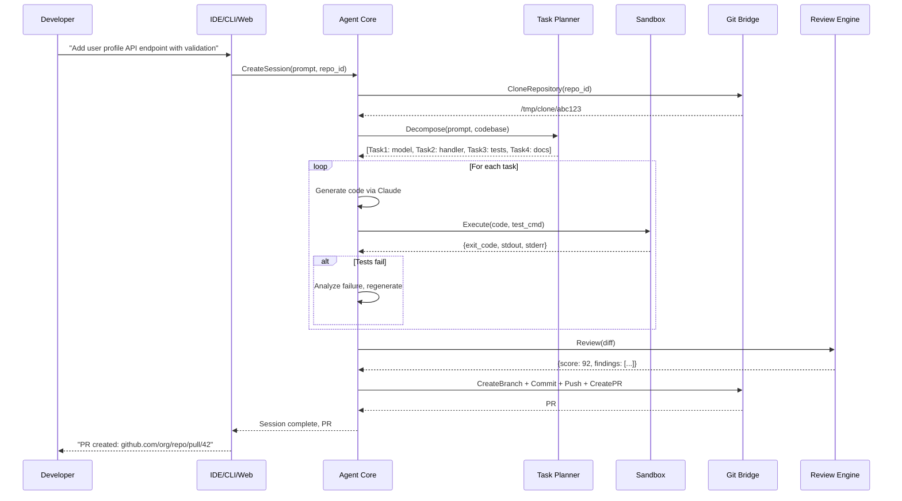

**Postconditions**: PR created with passing tests, review score > threshold, awaiting human AIDD approval.

**Acceptance Criteria**:
1. Agent produces compilable code matching intent
2. All generated tests pass in sandbox
3. Review score >= 80/100
4. PR has description, linked issue, and diff summary
5. Reasoning trace fully captured

---

### UC-02: Automated PR Review

**Actor**: Security Engineer, Developer
**Priority**: P0
**Preconditions**: PR exists in connected repository, webhook configured

**Description**: When a pull request is opened or updated, the review engine automatically performs a comprehensive code review including SAST security scanning, style enforcement, test coverage analysis, complexity scoring, dependency vulnerability checks, secret detection, and performance anti-pattern detection.

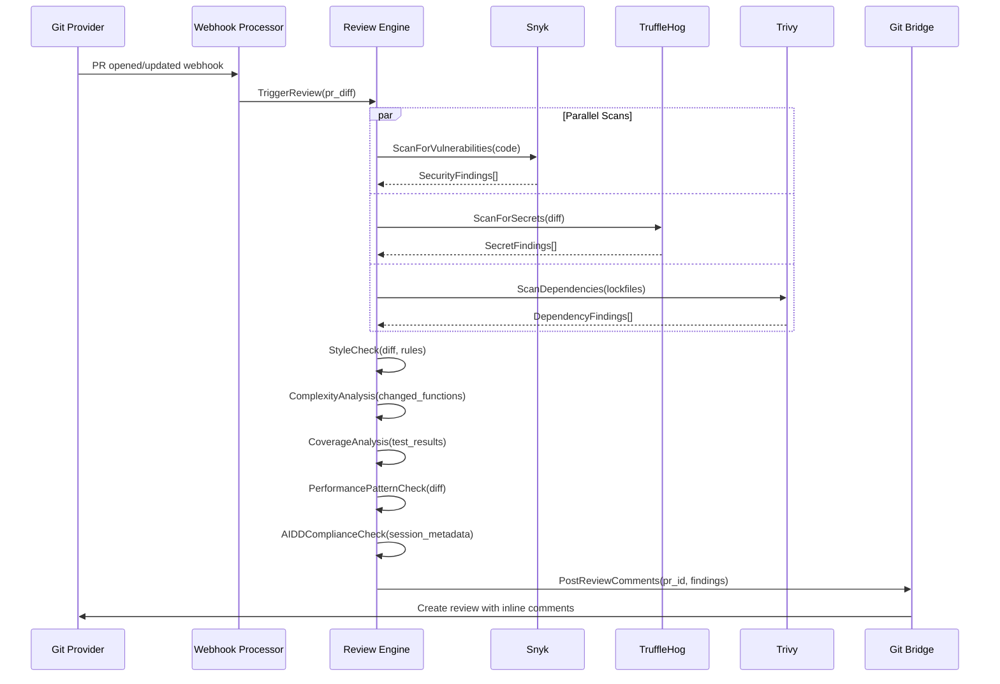

**Postconditions**: PR has review comments with actionable findings, overall score posted.

---

### UC-03: Bug Diagnosis & Fix

**Actor**: Developer
**Priority**: P1

**Description**: A developer provides a bug report or stack trace. The agent analyzes the error, locates the root cause in the codebase, generates a fix, writes a regression test, and submits a PR.

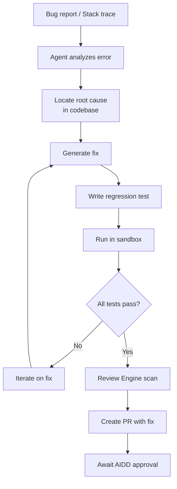

**Acceptance Criteria**:
1. Root cause correctly identified in > 80% of cases
2. Fix resolves the original error
3. Regression test prevents recurrence
4. No new test failures introduced

---

### UC-04: Test Generation

**Actor**: Developer, QA Engineer
**Priority**: P0

**Description**: The agent generates comprehensive tests for existing code including unit tests, integration tests, and edge case coverage. Tests are validated in the sandbox and submitted as a PR.

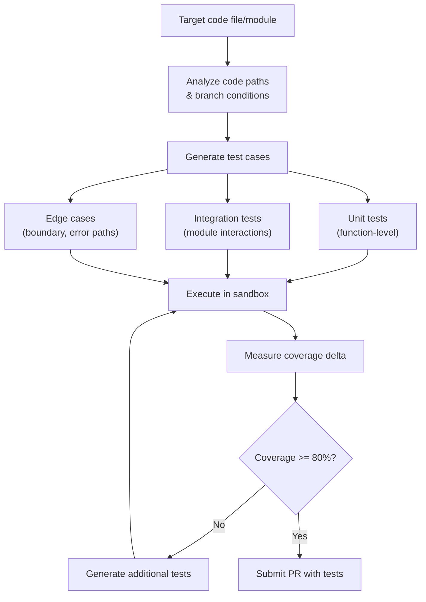

---

### UC-05: CI/CD Failure Resolution

**Actor**: DevOps Engineer
**Priority**: P1

**Description**: When a CI/CD pipeline fails, the agent receives the failure notification via webhook, analyzes build logs, identifies the failure cause, generates a fix, and submits a PR to resolve the pipeline.

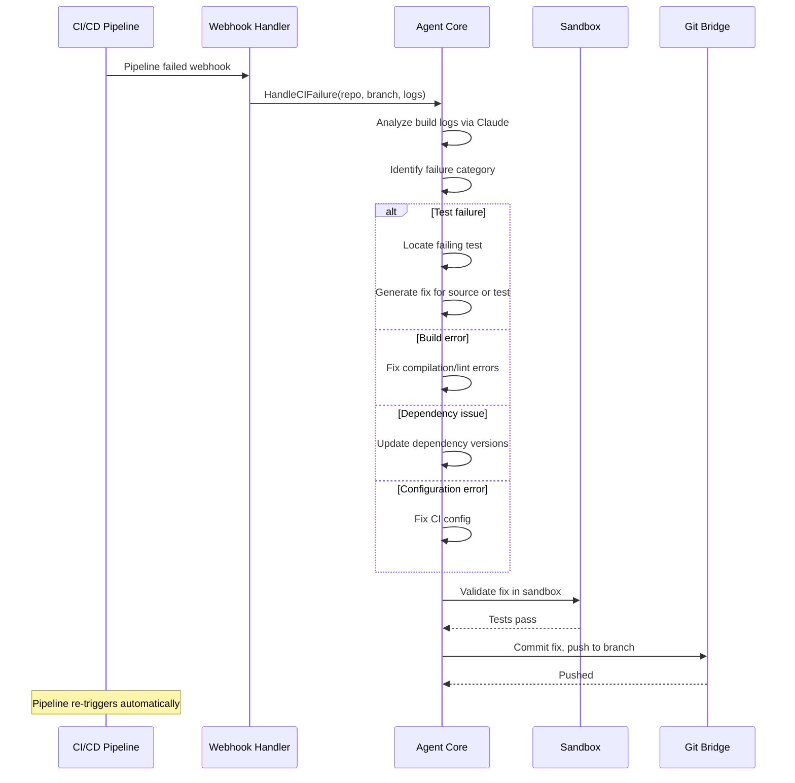

---

### UC-06: Code Refactoring

**Actor**: Developer
**Priority**: P1

**Description**: The agent refactors code to improve quality, readability, or performance while maintaining behavioral equivalence verified by existing tests.

**Acceptance Criteria**:
1. All existing tests pass after refactoring
2. No functional behavior changes
3. Measurable improvement in targeted metric (complexity, duplication, etc.)
4. Diff is reviewable and well-documented

---

### UC-07: Documentation Generation

**Actor**: Developer
**Priority**: P1

**Description**: The agent generates API documentation, code comments, README files, architecture diagrams, and usage examples from the codebase.

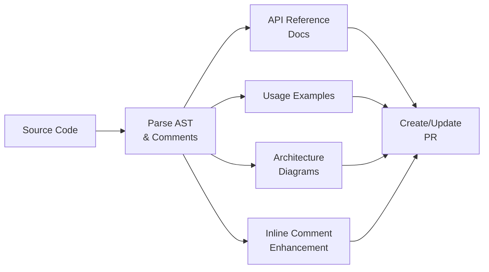

---

### UC-08: Security Vulnerability Fix

**Actor**: Security Engineer
**Priority**: P0

**Description**: The agent receives security findings from Snyk/Trivy/TruffleHog, generates fixes (dependency upgrades, code patches, secret rotation), validates fixes, and submits PRs with security-focused descriptions.

---

### UC-09: IDE-Integrated Coding

**Actor**: Developer
**Priority**: P0

**Description**: A developer interacts with the agent directly from their IDE (JetBrains, VS Code, Vim/Neovim, or Emacs) via the plugin sidebar. They can trigger code generation, reviews, tests, and fixes without leaving the editor.

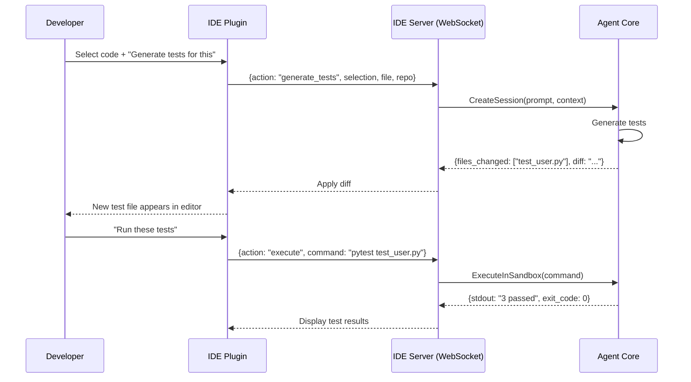

---

### UC-10: CLI-Driven Task Execution

**Actor**: Developer, OSS Contributor
**Priority**: P0

**Description**: Using the `erp-coding` CLI tool, developers execute agent tasks from the terminal, integrating with scripts, Makefiles, and CI pipelines.

```
# Initialize agent connection
$ erp-coding init --provider github --repo org/my-app

# Run autonomous coding task
$ erp-coding run "Add pagination to the /users endpoint"

# Review current branch
$ erp-coding review --branch feature/pagination

# Fix failing tests
$ erp-coding fix --from-ci

# Generate tests for a file
$ erp-coding test --file src/handlers/users.go

# Deploy (trigger CI/CD)
$ erp-coding deploy --env staging
```

---

## 3. Advanced Use Cases (UC-11 through UC-20)

### UC-11: Large Task Decomposition

**Actor**: Engineering Manager
**Priority**: P1

**Description**: For complex features spanning multiple files and modules, the task planner decomposes the work into ordered, parallelizable subtasks with dependency tracking.

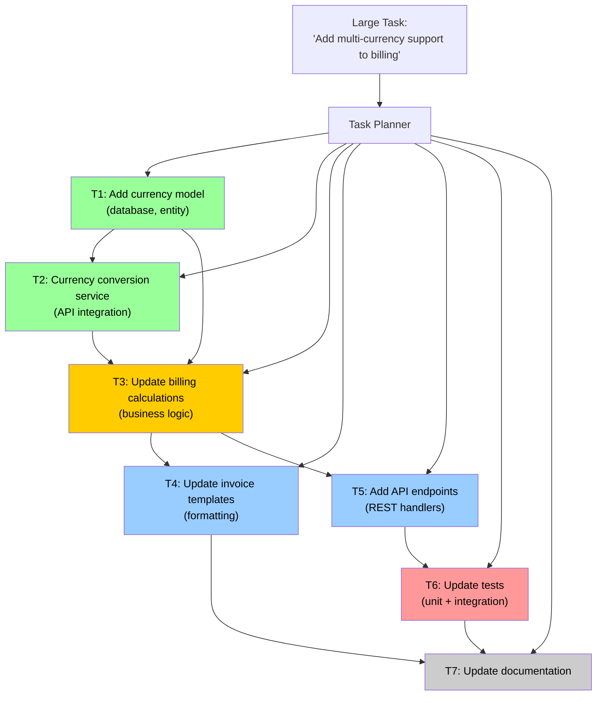

---

### UC-12: Multi-Repo Coordination

**Actor**: Platform Architect
**Priority**: P2

**Description**: The agent coordinates changes across multiple repositories (e.g., updating a shared library and all consuming services), creating linked PRs with cross-repo dependency awareness.

---

### UC-13: Cross-Module Impact Analysis

**Actor**: Platform Architect
**Priority**: P1

**Description**: Before making changes to shared ERP modules (ERP-IAM, ERP-Platform), the agent assesses impact on all dependent modules and generates a report with affected files, tests, and recommended migration steps.

---

### UC-14: Issue Triage & Assignment

**Actor**: Engineering Manager
**Priority**: P2

**Description**: The agent analyzes incoming issues, categorizes them (bug, feature, improvement), estimates complexity, suggests affected components, and optionally auto-assigns based on team expertise.

---

### UC-15: Performance Optimization

**Actor**: QA Engineer
**Priority**: P2

**Description**: The agent identifies performance bottlenecks (N+1 queries, unbounded loops, unnecessary allocations), generates optimized code, and validates improvement with benchmarks.

---

### UC-16: Dependency Upgrade

**Actor**: DevOps Engineer
**Priority**: P1

**Description**: The agent upgrades outdated or vulnerable dependencies, resolves breaking changes, updates code for API changes, and validates the upgrade through comprehensive testing.

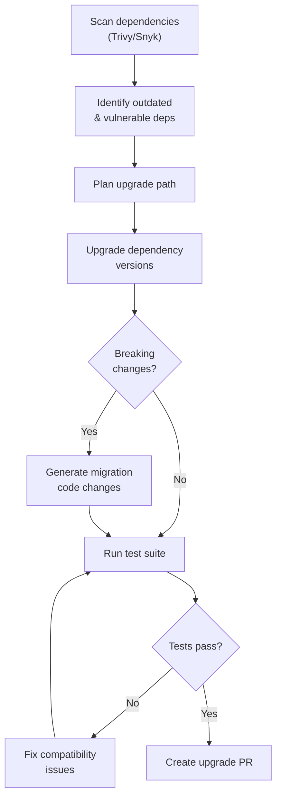

---

### UC-17: Secret Remediation

**Actor**: Security Engineer
**Priority**: P0

**Description**: When TruffleHog detects committed secrets, the agent immediately creates a PR to remove them, suggests rotation procedures, and adds pre-commit hooks to prevent recurrence.

---

### UC-18: Compliance Audit Reporting

**Actor**: Engineering Manager
**Priority**: P2

**Description**: The agent generates compliance reports showing all AIDD approvals, agent actions, human overrides, and audit trail entries for a given time period.

---

### UC-19: Onboarding New Developer

**Actor**: Developer (new)
**Priority**: P2

**Description**: The agent assists new developers by explaining codebase architecture, answering questions about code patterns, generating starter tasks, and providing contextual documentation.

---

### UC-20: Agent Dashboard Monitoring

**Actor**: Engineering Manager
**Priority**: P1

**Description**: Managers use the Next.js dashboard to monitor agent activity, success rates, cycle times, team velocity impact, and resource utilization.

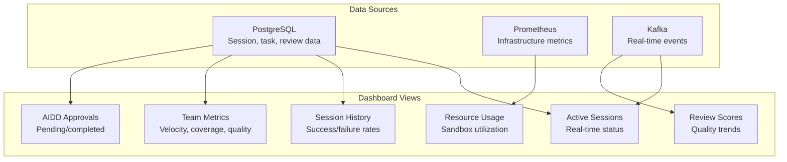

---

## 4. Specialized Use Cases (UC-21 through UC-25)

### UC-21: ERP Module Development

**Actor**: Platform Architect
**Priority**: P1

**Description**: The agent assists in developing and maintaining other ERP modules (Finance, CRM, HCM, etc.) with awareness of the ERP platform conventions, shared libraries, and integration patterns.

---

### UC-22: Custom Review Rules

**Actor**: Security Engineer
**Priority**: P2

**Description**: Teams configure custom review rules (organization-specific patterns, banned functions, required imports) that the review engine enforces on all agent-generated and human-written code.

---

### UC-23: Sandbox Configuration

**Actor**: DevOps Engineer
**Priority**: P1

**Description**: DevOps engineers configure sandbox resource limits, network policies, pre-installed packages, and custom base images for their organization's specific requirements.

---

### UC-24: Git Provider Connection

**Actor**: DevOps Engineer
**Priority**: P0

**Description**: Connect repositories from GitHub, GitLab, Bitbucket, or Azure DevOps with provider-specific authentication (GitHub App, OAuth, personal tokens) and webhook configuration.

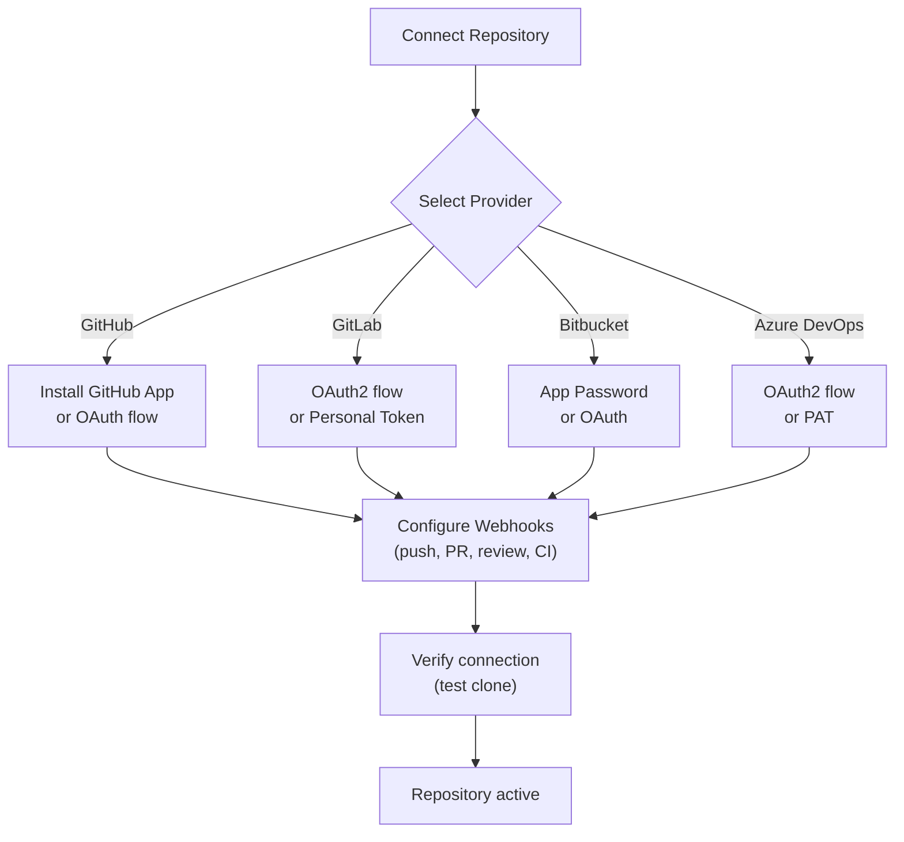

---

### UC-25: AIDD Approval Workflow

**Actor**: DevOps Engineer, Developer
**Priority**: P0

**Description**: The AIDD governance workflow ensures every agent-generated change receives human review and explicit approval before merge, with configurable policies per repository, branch, and team.

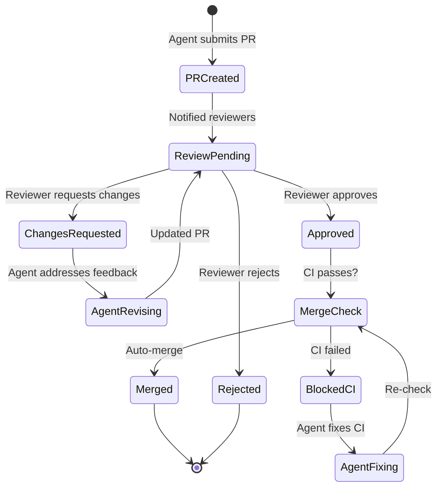

---

## 5. Use Case Traceability Matrix

| Use Case | Services Involved | Events Emitted | Data Entities |
|----------|-------------------|----------------|---------------|
| UC-01 | Agent Core, Task Planner, Sandbox, Git Bridge, Review Engine | session.started, task.planned, sandbox.created, review.completed, pr.created | Session, Task, Sandbox, PR |
| UC-02 | Review Engine, Git Bridge | webhook.received, review.completed | Review, Finding |
| UC-03 | Agent Core, Sandbox, Git Bridge | session.started, session.completed, pr.created | Session, PR |
| UC-04 | Agent Core, Sandbox, Review Engine | session.started, session.completed | Session, Sandbox |
| UC-05 | Agent Core, Sandbox, Git Bridge | webhook.received, session.started, pr.created | Session, PR |
| UC-06 | Agent Core, Sandbox, Review Engine, Git Bridge | session.started, review.completed, pr.created | Session, Review, PR |
| UC-07 | Agent Core, Git Bridge | session.started, pr.created | Session, PR |
| UC-08 | Review Engine, Agent Core, Git Bridge | review.completed, pr.created | Review, Finding, PR |
| UC-09 | IDE Server, Agent Core, Sandbox | session.started, session.completed | Session, Sandbox |
| UC-10 | CLI, Agent Core, Sandbox, Git Bridge | session.started, session.completed | Session |
| UC-11 | Task Planner, Agent Core | task.planned | Plan, Task |
| UC-12 | Agent Core, Git Bridge, Task Planner | session.started, pr.created (multi) | Session, PR |
| UC-13 | Task Planner | task.planned | Plan, Impact |
| UC-14 | Agent Core, Git Bridge | webhook.received | Issue |
| UC-15 | Agent Core, Sandbox | session.started, session.completed | Session |
| UC-16 | Agent Core, Sandbox, Review Engine, Git Bridge | session.started, pr.created | Session, PR |
| UC-17 | Review Engine, Agent Core, Git Bridge | review.completed, pr.created | Finding, PR |
| UC-18 | Agent Core | (query only) | AuditEntry, Approval |
| UC-19 | Agent Core | session.started | Session |
| UC-20 | Dashboard | (query only) | Session, Task, Review |
| UC-21 | All | All | All |
| UC-22 | Review Engine | review.completed | ReviewRule, Finding |
| UC-23 | Sandbox Runtime | sandbox.created | Sandbox, ResourceConfig |
| UC-24 | Git Bridge | repo.connected | Repository |
| UC-25 | Git Bridge, Agent Core | pr.approval_required, pr.merged | PR, Approval |
